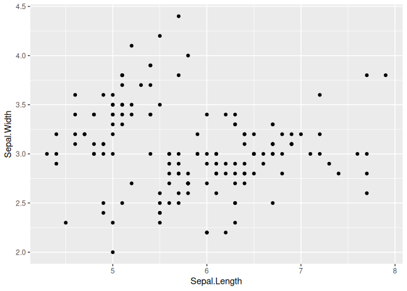
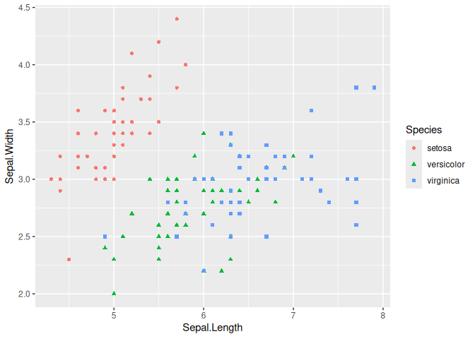
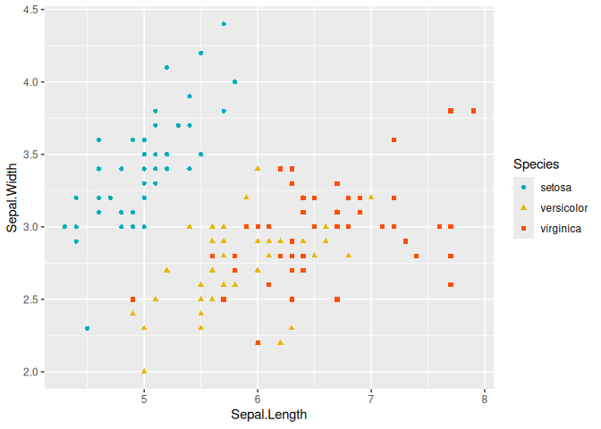
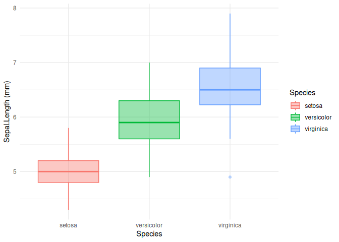

R for beginner
================
Vincent Manzanilla, INTERTRYP

## How to install R?

### Useful link

To install R, you can go to <https://cran.r-project.org/>, and download
the install file for your favorite operating system, click on the .exe,
.dmg, .pkg, .deb, respectively for Windows, MacOS and Linux-debian.

And click on follow… until to reach successful installation Then
download and install the IDE Rstudio
<https://posit.co/download/rstudio-desktop/>.

*Everything is free to download*

### First commands

**Where am I?**

To get the current working directory

``` r
getwd()
```

    ## [1] "/home/vincent/Documents/project/Metagenomics_2024/Metagenomics_2024/Day_1"

**To change my working directory from the console**

``` r
setwd("~/M")
```

In Rstudio, we can change the working directory by navigating in folder
in **File** panel and clicking on menu **More**

If you are using a Rproject, you don’t need to change your working
directory.

**How can I find documentation about function?**

The command `help()` is the 911

``` r
# exemple with function read.table
help("read.table")
#other exemple of 911
example("plot")
??plot()
```

## How to use a package?

### Installation

You can install new packages by clicking directly in Rstudio or by
command line (the best way for me)

``` r
install.packages("your_package") # for packages on CRAN mirror
```

For packages from Bioconductor (specifically for bioinformatic):

``` r
BiocManager::install("your_package")
```

or from github (using the package devtools)

``` r
devtools::install_github("your_package")
```

### Using functions from a package

To use functions from a specific package you can either load the entire
package:

``` r
library("your package1")
library("your package2")
library("your package3")
```

or call the function this way:

``` r
your_package::yourfunction()
```

**<span style="color: red;">On your R session using cloud IFB all the
necessary packages are installed</span>**

## Expression and affectation

### Expression

An expression is directly evaluated and the result is displayed on
terminal Example :

``` r
2 + 3
```

    ## [1] 5

``` r
sqrt(25)
```

    ## [1] 5

### Affectation in an object

An assignment is an expression stored in object or variable. In this
example expression, constant, array, matrix, data frame, list Example :

``` r
a <- 2 + 3
b <- "bird"
```

**<span style="color: red;"> What happens when you execute this
cell?</span>**

``` r
a
```

    ## [1] 5

``` r
b
```

    ## [1] "bird"

``` r
a <- 10
b <- "5"
```

``` r
somme <- a + b
```

**<span style="color: red;"> Why do we have an error ? I need to know
the type of the object</span>**

``` r
str(a)
```

    ##  num 10

``` r
str(b)
```

    ##  chr "5"

**<span style="color: red;"> What kind of information do we
get?</span>**

We can also perform mathematical operations on numerical objects.

``` r
log(a) # to obtain the logarithm of a
```

    ## [1] 2.302585

``` r
sqrt(a)# to obtain the square root of a
```

    ## [1] 3.162278

``` r
# we can compare it
log(a) > sqrt(a)
```

    ## [1] FALSE

### Type of objects

#### Vectors

Vectors are objects composed by values with the same type or (i.e,
numeric, characters…)

``` r
V1 <- c(2, 6, 9) # numeric vector
V2 <- c("monday", "Tuesday", "Wednesday") # character vector
V3 <- rep(6, 3) # repetition of the same value
V4 <- seq(1, 3, 0.1) # sequence of number
V5 <- 1:100
V5
```

    ##   [1]   1   2   3   4   5   6   7   8   9  10  11  12  13  14  15  16  17  18
    ##  [19]  19  20  21  22  23  24  25  26  27  28  29  30  31  32  33  34  35  36
    ##  [37]  37  38  39  40  41  42  43  44  45  46  47  48  49  50  51  52  53  54
    ##  [55]  55  56  57  58  59  60  61  62  63  64  65  66  67  68  69  70  71  72
    ##  [73]  73  74  75  76  77  78  79  80  81  82  83  84  85  86  87  88  89  90
    ##  [91]  91  92  93  94  95  96  97  98  99 100

To know the number of value inside a vector

``` r
length(V1)
```

    ## [1] 3

**What do you think about V4?**

Filter a vector according to criteria

``` r
# Example : with list of value (a vector)

x <- c(1, 3, 5, 3, 2, 1, 4, 6, 4, 7, 5, 4, 3)

# get element from 2 to 6

x[2:6]
```

    ## [1] 3 5 3 2 1

``` r
# get elements 3 et 5 from x.

x[c(3, 5)]
```

    ## [1] 5 2

``` r
# get value more than 20.

x[x > 5]
```

    ## [1] 6 7

``` r
# get value of  x where x is equal to 21.

x[x == 5]
```

    ## [1] 5 5

``` r
# return elements form x the the value different from 5

x[x != 5]
```

    ##  [1] 1 3 3 2 1 4 6 4 7 4 3

Filter a vector according to several criteria

``` r
# 3 lists : ages, sexes et poids

age <- c(20, 30, 40,
         15, 22, 24,
         36, 38)

sexe <- c("F", "M", "F",
          "M", "F", "M",
          "F", "M")

poids <- c(75, 76, 73,
           72, 64, 76,
           73, 72)

# get value from age greater than 20 and less than 30.

age[age > 20 & age < 30]
```

    ## [1] 22 24

``` r
# Recovering "poids" for those who are older than 25 and female

poids[age > 25 & sexe == "F"]
```

    ## [1] 73 73

``` r
#Retrieve age values below 20 or above 30.

age[age < 20 | age > 30]
```

    ## [1] 40 15 36 38

*Exo1*

Considering the vector `a` such as
`a <- c("lannister", "targaryen", "baratheon", "starck", "greyjoy")`

1.  What is the length of the vector?

2.  Try doing `a[1:3]`. What do you get?

3.  Create a new vector b containing only lannister and starck.

4.  Try doing `a[-1]`. What do you get?

5.  Sort by alphabetical order using `sort()`

*Exo2*

1.  Create a vector `a` containing all integers from 1 to 100.

2.  Add the values 200, 201, 202 to the vector `a`.

3.  Create a vector `b` containing all even integers from 2 to 100 using
    `seq()`

#### Data frames

Data frames are objects composed by vector where the value are of
different modes (i.e, numeric, characters…)

##### Data frame examples

Load a data frame

``` r
data(iris)
```

Visualise the data frame in a table

``` r
View(iris)
```

Display its internal structure

``` r
str(iris)
```

    ## 'data.frame':    150 obs. of  5 variables:
    ##  $ Sepal.Length: num  5.1 4.9 4.7 4.6 5 5.4 4.6 5 4.4 4.9 ...
    ##  $ Sepal.Width : num  3.5 3 3.2 3.1 3.6 3.9 3.4 3.4 2.9 3.1 ...
    ##  $ Petal.Length: num  1.4 1.4 1.3 1.5 1.4 1.7 1.4 1.5 1.4 1.5 ...
    ##  $ Petal.Width : num  0.2 0.2 0.2 0.2 0.2 0.4 0.3 0.2 0.2 0.1 ...
    ##  $ Species     : Factor w/ 3 levels "setosa","versicolor",..: 1 1 1 1 1 1 1 1 1 1 ...

**What can we notice?**

##### How to build your own data frame

``` r
date <- c("1_monday", "2_Tuesday", "3_Wednesday",
          "4_Thursday", "5_Friday", "6_Sturday",
          "7_Sunday")

is.character(date)
```

    ## [1] TRUE

``` r
# temperature in deg Celsius
temperature <- c(24, 27, 25,
               22, 30, 21,
               28)

is.numeric(temperature)
```

    ## [1] TRUE

``` r
# rain in mm
rain <- c(1, 0, 0,
          5, 2, 0,
          0)

is.numeric(rain)
```

    ## [1] TRUE

``` r
# make data.frame
df <- data.frame(date, temperature, rain)
str(df)
```

    ## 'data.frame':    7 obs. of  3 variables:
    ##  $ date       : chr  "1_monday" "2_Tuesday" "3_Wednesday" "4_Thursday" ...
    ##  $ temperature: num  24 27 25 22 30 21 28
    ##  $ rain       : num  1 0 0 5 2 0 0

``` r
#To select a column or vector
df$temperature
```

    ## [1] 24 27 25 22 30 21 28

``` r
df[, 2]
```

    ## [1] 24 27 25 22 30 21 28

``` r
# here we use list() instead of c()
# because there is multiple class in inside row

day <- list("8_monday", 29, 1)
new_def <- rbind(df, day)# add row to a data frame
new_def
```

    ##          date temperature rain
    ## 1    1_monday          24    1
    ## 2   2_Tuesday          27    0
    ## 3 3_Wednesday          25    0
    ## 4  4_Thursday          22    5
    ## 5    5_Friday          30    2
    ## 6   6_Sturday          21    0
    ## 7    7_Sunday          28    0
    ## 8    8_monday          29    1

## Functions

### Definition

Function are a compilation of command line with different instructions
inside one object to simplify code. A function is composed by
<span style="color: steelblue;">**arguments**</span> and
<span style="color: steelblue;">**options**</span>.

function(argument1, argument2, option1, … ,option10)

### Usual functions for data frame

``` r
head() # to know first line of your data frame
class()# return the class of the object. Ex : data.frame, matrix, list ....
str()# return the structure of the object. Ex : numeric, factor, character....
names()# to get or set the names of an object
sum() # for addition
min() # return the minimum of the vector
max() # return the minimum of the vector
row.names() # attribute names for lines of the data frame
colnames() # attribute names for column of the data frame
apply() # Returns a vector or array or list of values obtained by applying a function to margins of an array or matrix.
```

**Example function row.names, class and str**

``` r
df2 <- data.frame(x = c(TRUE, FALSE, NA, NA), y = c(12, 34, 56, 78))
df2
```

    ##       x  y
    ## 1  TRUE 12
    ## 2 FALSE 34
    ## 3    NA 56
    ## 4    NA 78

``` r
row.names(df2) <- paste("row", 1 : 4, sep = "_")
df2 # what do you see
```

    ##           x  y
    ## row_1  TRUE 12
    ## row_2 FALSE 34
    ## row_3    NA 56
    ## row_4    NA 78

``` r
class(df2)
```

    ## [1] "data.frame"

``` r
str(df2)
```

    ## 'data.frame':    4 obs. of  2 variables:
    ##  $ x: logi  TRUE FALSE NA NA
    ##  $ y: num  12 34 56 78

**Example function apply**

``` r
head(df)
```

    ##          date temperature rain
    ## 1    1_monday          24    1
    ## 2   2_Tuesday          27    0
    ## 3 3_Wednesday          25    0
    ## 4  4_Thursday          22    5
    ## 5    5_Friday          30    2
    ## 6   6_Sturday          21    0

``` r
class(df)
```

    ## [1] "data.frame"

``` r
str(df)
```

    ## 'data.frame':    7 obs. of  3 variables:
    ##  $ date       : chr  "1_monday" "2_Tuesday" "3_Wednesday" "4_Thursday" ...
    ##  $ temperature: num  24 27 25 22 30 21 28
    ##  $ rain       : num  1 0 0 5 2 0 0

``` r
# return mean for the numerical column of the data.frame. apply(data,margin,fun). 
# For margin parameter the value 1 return mean for each row, 
# for margin=2 return mean for each selected column.
apply(df[, 2:3], 2, mean)
```

    ## temperature        rain 
    ##   25.285714    1.142857

*Exo 3*

**From data set iris in package **datasets\*\* Load package datasets and
load data set iris using `data()`

1.  Give the class Sepal.Width and Species vectors (get the vector "$")
```{r}

```
2.  What is the minimum / maximum / average sepal length of these irises (vector with max() )?
3.  What are the values of the first 10 irises (?head)?
4.  Calculate standard deviation for every numeric vector (function : `sd()`)
5.  Calculate mean for every numeric vector (apply)
6.  Create a data frame with mean and sd as line and give a name for each line (rbind)
7.  An error of 0.5cm was made in the measurement of the length of the sepal of the 41st iris: add 0.5cm to this measurement 

### Use dplyr to select, filter a data frame

`dplyr` is part of the library set named `tidyverse` (contraction of
“tidy” and “universe”, it’s a tidy universe). `tidyverse` packages are
designed to work together and thus follow the same code logic and a
common grammar.

The pipe, `%>%`, is one of the useful elements of the tidyverse. It
allows to structure sequences of operations by minimizing the creation
of intermediate objects and by facilitating the addition of a step
anywhere in this sequence. Note that from R 4.1 you can use a new pipe,
`|>` without the need of loading any library.

The most commonly used tidyverse packages are loaded in your session:

- [`ggplot2`](https://github.com/rstudio/cheatsheets/blob/main/data-visualization.pdf)
- [`dplyr`](https://github.com/rstudio/cheatsheets/blob/main/data-transformation.pdf)
- [`tidyr`](https://github.com/rstudio/cheatsheets/blob/main/tidyr.pdf)
- [`readr`](https://raw.githubusercontent.com/rstudio/cheatsheets/main/data-import.pdf)
- [`tibble`](https://r4ds.had.co.nz/tibbles.html)
- [`stringr`](https://github.com/rstudio/cheatsheets/blob/main/strings.pdf)

``` r
tidyverse::tidyverse_packages()
```

    ##  [1] "broom"         "conflicted"    "cli"           "dbplyr"       
    ##  [5] "dplyr"         "dtplyr"        "forcats"       "ggplot2"      
    ##  [9] "googledrive"   "googlesheets4" "haven"         "hms"          
    ## [13] "httr"          "jsonlite"      "lubridate"     "magrittr"     
    ## [17] "modelr"        "pillar"        "purrr"         "ragg"         
    ## [21] "readr"         "readxl"        "reprex"        "rlang"        
    ## [25] "rstudioapi"    "rvest"         "stringr"       "tibble"       
    ## [29] "tidyr"         "xml2"          "tidyverse"

##### Filter and select variable in data frame

``` r
library(tidyverse)
```

    ## ── Attaching core tidyverse packages ──────────────────────── tidyverse 2.0.0 ──
    ## ✔ dplyr     1.1.4     ✔ readr     2.1.5
    ## ✔ forcats   1.0.0     ✔ stringr   1.5.1
    ## ✔ ggplot2   3.5.0     ✔ tibble    3.2.1
    ## ✔ lubridate 1.9.3     ✔ tidyr     1.3.1
    ## ✔ purrr     1.0.2     
    ## ── Conflicts ────────────────────────────────────────── tidyverse_conflicts() ──
    ## ✖ dplyr::filter() masks stats::filter()
    ## ✖ dplyr::lag()    masks stats::lag()
    ## ℹ Use the conflicted package (<http://conflicted.r-lib.org/>) to force all conflicts to become errors

``` r
data("iris")
#To select a variable with tidyverse
dplyr::select(iris, Species)
```

    ##        Species
    ## 1       setosa
    ## 2       setosa
    ## 3       setosa
    ## 4       setosa
    ## 5       setosa
    ## 6       setosa
    ## 7       setosa
    ## 8       setosa
    ## 9       setosa
    ## 10      setosa
    ## 11      setosa
    ## 12      setosa
    ## 13      setosa
    ## 14      setosa
    ## 15      setosa
    ## 16      setosa
    ## 17      setosa
    ## 18      setosa
    ## 19      setosa
    ## 20      setosa
    ## 21      setosa
    ## 22      setosa
    ## 23      setosa
    ## 24      setosa
    ## 25      setosa
    ## 26      setosa
    ## 27      setosa
    ## 28      setosa
    ## 29      setosa
    ## 30      setosa
    ## 31      setosa
    ## 32      setosa
    ## 33      setosa
    ## 34      setosa
    ## 35      setosa
    ## 36      setosa
    ## 37      setosa
    ## 38      setosa
    ## 39      setosa
    ## 40      setosa
    ## 41      setosa
    ## 42      setosa
    ## 43      setosa
    ## 44      setosa
    ## 45      setosa
    ## 46      setosa
    ## 47      setosa
    ## 48      setosa
    ## 49      setosa
    ## 50      setosa
    ## 51  versicolor
    ## 52  versicolor
    ## 53  versicolor
    ## 54  versicolor
    ## 55  versicolor
    ## 56  versicolor
    ## 57  versicolor
    ## 58  versicolor
    ## 59  versicolor
    ## 60  versicolor
    ## 61  versicolor
    ## 62  versicolor
    ## 63  versicolor
    ## 64  versicolor
    ## 65  versicolor
    ## 66  versicolor
    ## 67  versicolor
    ## 68  versicolor
    ## 69  versicolor
    ## 70  versicolor
    ## 71  versicolor
    ## 72  versicolor
    ## 73  versicolor
    ## 74  versicolor
    ## 75  versicolor
    ## 76  versicolor
    ## 77  versicolor
    ## 78  versicolor
    ## 79  versicolor
    ## 80  versicolor
    ## 81  versicolor
    ## 82  versicolor
    ## 83  versicolor
    ## 84  versicolor
    ## 85  versicolor
    ## 86  versicolor
    ## 87  versicolor
    ## 88  versicolor
    ## 89  versicolor
    ## 90  versicolor
    ## 91  versicolor
    ## 92  versicolor
    ## 93  versicolor
    ## 94  versicolor
    ## 95  versicolor
    ## 96  versicolor
    ## 97  versicolor
    ## 98  versicolor
    ## 99  versicolor
    ## 100 versicolor
    ## 101  virginica
    ## 102  virginica
    ## 103  virginica
    ## 104  virginica
    ## 105  virginica
    ## 106  virginica
    ## 107  virginica
    ## 108  virginica
    ## 109  virginica
    ## 110  virginica
    ## 111  virginica
    ## 112  virginica
    ## 113  virginica
    ## 114  virginica
    ## 115  virginica
    ## 116  virginica
    ## 117  virginica
    ## 118  virginica
    ## 119  virginica
    ## 120  virginica
    ## 121  virginica
    ## 122  virginica
    ## 123  virginica
    ## 124  virginica
    ## 125  virginica
    ## 126  virginica
    ## 127  virginica
    ## 128  virginica
    ## 129  virginica
    ## 130  virginica
    ## 131  virginica
    ## 132  virginica
    ## 133  virginica
    ## 134  virginica
    ## 135  virginica
    ## 136  virginica
    ## 137  virginica
    ## 138  virginica
    ## 139  virginica
    ## 140  virginica
    ## 141  virginica
    ## 142  virginica
    ## 143  virginica
    ## 144  virginica
    ## 145  virginica
    ## 146  virginica
    ## 147  virginica
    ## 148  virginica
    ## 149  virginica
    ## 150  virginica

``` r
#To select several variables with tidyverse
dplyr::select(iris,Species, Sepal.Length, Sepal.Width)
```

    ##        Species Sepal.Length Sepal.Width
    ## 1       setosa          5.1         3.5
    ## 2       setosa          4.9         3.0
    ## 3       setosa          4.7         3.2
    ## 4       setosa          4.6         3.1
    ## 5       setosa          5.0         3.6
    ## 6       setosa          5.4         3.9
    ## 7       setosa          4.6         3.4
    ## 8       setosa          5.0         3.4
    ## 9       setosa          4.4         2.9
    ## 10      setosa          4.9         3.1
    ## 11      setosa          5.4         3.7
    ## 12      setosa          4.8         3.4
    ## 13      setosa          4.8         3.0
    ## 14      setosa          4.3         3.0
    ## 15      setosa          5.8         4.0
    ## 16      setosa          5.7         4.4
    ## 17      setosa          5.4         3.9
    ## 18      setosa          5.1         3.5
    ## 19      setosa          5.7         3.8
    ## 20      setosa          5.1         3.8
    ## 21      setosa          5.4         3.4
    ## 22      setosa          5.1         3.7
    ## 23      setosa          4.6         3.6
    ## 24      setosa          5.1         3.3
    ## 25      setosa          4.8         3.4
    ## 26      setosa          5.0         3.0
    ## 27      setosa          5.0         3.4
    ## 28      setosa          5.2         3.5
    ## 29      setosa          5.2         3.4
    ## 30      setosa          4.7         3.2
    ## 31      setosa          4.8         3.1
    ## 32      setosa          5.4         3.4
    ## 33      setosa          5.2         4.1
    ## 34      setosa          5.5         4.2
    ## 35      setosa          4.9         3.1
    ## 36      setosa          5.0         3.2
    ## 37      setosa          5.5         3.5
    ## 38      setosa          4.9         3.6
    ## 39      setosa          4.4         3.0
    ## 40      setosa          5.1         3.4
    ## 41      setosa          5.0         3.5
    ## 42      setosa          4.5         2.3
    ## 43      setosa          4.4         3.2
    ## 44      setosa          5.0         3.5
    ## 45      setosa          5.1         3.8
    ## 46      setosa          4.8         3.0
    ## 47      setosa          5.1         3.8
    ## 48      setosa          4.6         3.2
    ## 49      setosa          5.3         3.7
    ## 50      setosa          5.0         3.3
    ## 51  versicolor          7.0         3.2
    ## 52  versicolor          6.4         3.2
    ## 53  versicolor          6.9         3.1
    ## 54  versicolor          5.5         2.3
    ## 55  versicolor          6.5         2.8
    ## 56  versicolor          5.7         2.8
    ## 57  versicolor          6.3         3.3
    ## 58  versicolor          4.9         2.4
    ## 59  versicolor          6.6         2.9
    ## 60  versicolor          5.2         2.7
    ## 61  versicolor          5.0         2.0
    ## 62  versicolor          5.9         3.0
    ## 63  versicolor          6.0         2.2
    ## 64  versicolor          6.1         2.9
    ## 65  versicolor          5.6         2.9
    ## 66  versicolor          6.7         3.1
    ## 67  versicolor          5.6         3.0
    ## 68  versicolor          5.8         2.7
    ## 69  versicolor          6.2         2.2
    ## 70  versicolor          5.6         2.5
    ## 71  versicolor          5.9         3.2
    ## 72  versicolor          6.1         2.8
    ## 73  versicolor          6.3         2.5
    ## 74  versicolor          6.1         2.8
    ## 75  versicolor          6.4         2.9
    ## 76  versicolor          6.6         3.0
    ## 77  versicolor          6.8         2.8
    ## 78  versicolor          6.7         3.0
    ## 79  versicolor          6.0         2.9
    ## 80  versicolor          5.7         2.6
    ## 81  versicolor          5.5         2.4
    ## 82  versicolor          5.5         2.4
    ## 83  versicolor          5.8         2.7
    ## 84  versicolor          6.0         2.7
    ## 85  versicolor          5.4         3.0
    ## 86  versicolor          6.0         3.4
    ## 87  versicolor          6.7         3.1
    ## 88  versicolor          6.3         2.3
    ## 89  versicolor          5.6         3.0
    ## 90  versicolor          5.5         2.5
    ## 91  versicolor          5.5         2.6
    ## 92  versicolor          6.1         3.0
    ## 93  versicolor          5.8         2.6
    ## 94  versicolor          5.0         2.3
    ## 95  versicolor          5.6         2.7
    ## 96  versicolor          5.7         3.0
    ## 97  versicolor          5.7         2.9
    ## 98  versicolor          6.2         2.9
    ## 99  versicolor          5.1         2.5
    ## 100 versicolor          5.7         2.8
    ## 101  virginica          6.3         3.3
    ## 102  virginica          5.8         2.7
    ## 103  virginica          7.1         3.0
    ## 104  virginica          6.3         2.9
    ## 105  virginica          6.5         3.0
    ## 106  virginica          7.6         3.0
    ## 107  virginica          4.9         2.5
    ## 108  virginica          7.3         2.9
    ## 109  virginica          6.7         2.5
    ## 110  virginica          7.2         3.6
    ## 111  virginica          6.5         3.2
    ## 112  virginica          6.4         2.7
    ## 113  virginica          6.8         3.0
    ## 114  virginica          5.7         2.5
    ## 115  virginica          5.8         2.8
    ## 116  virginica          6.4         3.2
    ## 117  virginica          6.5         3.0
    ## 118  virginica          7.7         3.8
    ## 119  virginica          7.7         2.6
    ## 120  virginica          6.0         2.2
    ## 121  virginica          6.9         3.2
    ## 122  virginica          5.6         2.8
    ## 123  virginica          7.7         2.8
    ## 124  virginica          6.3         2.7
    ## 125  virginica          6.7         3.3
    ## 126  virginica          7.2         3.2
    ## 127  virginica          6.2         2.8
    ## 128  virginica          6.1         3.0
    ## 129  virginica          6.4         2.8
    ## 130  virginica          7.2         3.0
    ## 131  virginica          7.4         2.8
    ## 132  virginica          7.9         3.8
    ## 133  virginica          6.4         2.8
    ## 134  virginica          6.3         2.8
    ## 135  virginica          6.1         2.6
    ## 136  virginica          7.7         3.0
    ## 137  virginica          6.3         3.4
    ## 138  virginica          6.4         3.1
    ## 139  virginica          6.0         3.0
    ## 140  virginica          6.9         3.1
    ## 141  virginica          6.7         3.1
    ## 142  virginica          6.9         3.1
    ## 143  virginica          5.8         2.7
    ## 144  virginica          6.8         3.2
    ## 145  virginica          6.7         3.3
    ## 146  virginica          6.7         3.0
    ## 147  virginica          6.3         2.5
    ## 148  virginica          6.5         3.0
    ## 149  virginica          6.2         3.4
    ## 150  virginica          5.9         3.0

``` r
# To select several lines inside data frame
dplyr::slice(iris, 22:30)
```

    ##   Sepal.Length Sepal.Width Petal.Length Petal.Width Species
    ## 1          5.1         3.7          1.5         0.4  setosa
    ## 2          4.6         3.6          1.0         0.2  setosa
    ## 3          5.1         3.3          1.7         0.5  setosa
    ## 4          4.8         3.4          1.9         0.2  setosa
    ## 5          5.0         3.0          1.6         0.2  setosa
    ## 6          5.0         3.4          1.6         0.4  setosa
    ## 7          5.2         3.5          1.5         0.2  setosa
    ## 8          5.2         3.4          1.4         0.2  setosa
    ## 9          4.7         3.2          1.6         0.2  setosa

``` r
# I can affect it to an object

subdata <- dplyr::slice(iris, 22:30)

#or choosing different lines
myline <- c(22, 38, 120) # I build a vector containing the line that I want
dplyr::slice(iris,myline)
```

    ##   Sepal.Length Sepal.Width Petal.Length Petal.Width   Species
    ## 1          5.1         3.7          1.5         0.4    setosa
    ## 2          4.9         3.6          1.4         0.1    setosa
    ## 3          6.0         2.2          5.0         1.5 virginica

##### Bonus : to pipe many function serval function together

The pipe <span style="color: steelblue;"> **\|\>** </span>, or
<span style="color: steelblue;">**%\>%**</span>, is one of the useful
elements of the tidyverse. It allows to structure sequences of
operations by minimizing the creation of intermediate objects and by
facilitating the addition of a step anywhere in this sequence.

The useful command to manage data frame : 1) select() to select vector
or variable from a data frame ; 2) filter() is used to subset a data
frame, retaining all rows that satisfy your conditions ; mutate() adds
new variables and preserves existing ones.

``` r
library(dplyr)

iris %>%
  filter(Sepal.Length > 6) %>% # filtered using size of Sepal Length
  filter(Species == "versicolor") # and the species
```

    ##    Sepal.Length Sepal.Width Petal.Length Petal.Width    Species
    ## 1           7.0         3.2          4.7         1.4 versicolor
    ## 2           6.4         3.2          4.5         1.5 versicolor
    ## 3           6.9         3.1          4.9         1.5 versicolor
    ## 4           6.5         2.8          4.6         1.5 versicolor
    ## 5           6.3         3.3          4.7         1.6 versicolor
    ## 6           6.6         2.9          4.6         1.3 versicolor
    ## 7           6.1         2.9          4.7         1.4 versicolor
    ## 8           6.7         3.1          4.4         1.4 versicolor
    ## 9           6.2         2.2          4.5         1.5 versicolor
    ## 10          6.1         2.8          4.0         1.3 versicolor
    ## 11          6.3         2.5          4.9         1.5 versicolor
    ## 12          6.1         2.8          4.7         1.2 versicolor
    ## 13          6.4         2.9          4.3         1.3 versicolor
    ## 14          6.6         3.0          4.4         1.4 versicolor
    ## 15          6.8         2.8          4.8         1.4 versicolor
    ## 16          6.7         3.0          5.0         1.7 versicolor
    ## 17          6.7         3.1          4.7         1.5 versicolor
    ## 18          6.3         2.3          4.4         1.3 versicolor
    ## 19          6.1         3.0          4.6         1.4 versicolor
    ## 20          6.2         2.9          4.3         1.3 versicolor

``` r
iris %>%
  select(Sepal.Length, Species) %>%
  mutate(Sepal.Length2 = Sepal.Length * 2) %>%
  mutate(Sepal.Length2_squared = Sepal.Length2 * Sepal.Length2)
```

    ##     Sepal.Length    Species Sepal.Length2 Sepal.Length2_squared
    ## 1            5.1     setosa          10.2                104.04
    ## 2            4.9     setosa           9.8                 96.04
    ## 3            4.7     setosa           9.4                 88.36
    ## 4            4.6     setosa           9.2                 84.64
    ## 5            5.0     setosa          10.0                100.00
    ## 6            5.4     setosa          10.8                116.64
    ## 7            4.6     setosa           9.2                 84.64
    ## 8            5.0     setosa          10.0                100.00
    ## 9            4.4     setosa           8.8                 77.44
    ## 10           4.9     setosa           9.8                 96.04
    ## 11           5.4     setosa          10.8                116.64
    ## 12           4.8     setosa           9.6                 92.16
    ## 13           4.8     setosa           9.6                 92.16
    ## 14           4.3     setosa           8.6                 73.96
    ## 15           5.8     setosa          11.6                134.56
    ## 16           5.7     setosa          11.4                129.96
    ## 17           5.4     setosa          10.8                116.64
    ## 18           5.1     setosa          10.2                104.04
    ## 19           5.7     setosa          11.4                129.96
    ## 20           5.1     setosa          10.2                104.04
    ## 21           5.4     setosa          10.8                116.64
    ## 22           5.1     setosa          10.2                104.04
    ## 23           4.6     setosa           9.2                 84.64
    ## 24           5.1     setosa          10.2                104.04
    ## 25           4.8     setosa           9.6                 92.16
    ## 26           5.0     setosa          10.0                100.00
    ## 27           5.0     setosa          10.0                100.00
    ## 28           5.2     setosa          10.4                108.16
    ## 29           5.2     setosa          10.4                108.16
    ## 30           4.7     setosa           9.4                 88.36
    ## 31           4.8     setosa           9.6                 92.16
    ## 32           5.4     setosa          10.8                116.64
    ## 33           5.2     setosa          10.4                108.16
    ## 34           5.5     setosa          11.0                121.00
    ## 35           4.9     setosa           9.8                 96.04
    ## 36           5.0     setosa          10.0                100.00
    ## 37           5.5     setosa          11.0                121.00
    ## 38           4.9     setosa           9.8                 96.04
    ## 39           4.4     setosa           8.8                 77.44
    ## 40           5.1     setosa          10.2                104.04
    ## 41           5.0     setosa          10.0                100.00
    ## 42           4.5     setosa           9.0                 81.00
    ## 43           4.4     setosa           8.8                 77.44
    ## 44           5.0     setosa          10.0                100.00
    ## 45           5.1     setosa          10.2                104.04
    ## 46           4.8     setosa           9.6                 92.16
    ## 47           5.1     setosa          10.2                104.04
    ## 48           4.6     setosa           9.2                 84.64
    ## 49           5.3     setosa          10.6                112.36
    ## 50           5.0     setosa          10.0                100.00
    ## 51           7.0 versicolor          14.0                196.00
    ## 52           6.4 versicolor          12.8                163.84
    ## 53           6.9 versicolor          13.8                190.44
    ## 54           5.5 versicolor          11.0                121.00
    ## 55           6.5 versicolor          13.0                169.00
    ## 56           5.7 versicolor          11.4                129.96
    ## 57           6.3 versicolor          12.6                158.76
    ## 58           4.9 versicolor           9.8                 96.04
    ## 59           6.6 versicolor          13.2                174.24
    ## 60           5.2 versicolor          10.4                108.16
    ## 61           5.0 versicolor          10.0                100.00
    ## 62           5.9 versicolor          11.8                139.24
    ## 63           6.0 versicolor          12.0                144.00
    ## 64           6.1 versicolor          12.2                148.84
    ## 65           5.6 versicolor          11.2                125.44
    ## 66           6.7 versicolor          13.4                179.56
    ## 67           5.6 versicolor          11.2                125.44
    ## 68           5.8 versicolor          11.6                134.56
    ## 69           6.2 versicolor          12.4                153.76
    ## 70           5.6 versicolor          11.2                125.44
    ## 71           5.9 versicolor          11.8                139.24
    ## 72           6.1 versicolor          12.2                148.84
    ## 73           6.3 versicolor          12.6                158.76
    ## 74           6.1 versicolor          12.2                148.84
    ## 75           6.4 versicolor          12.8                163.84
    ## 76           6.6 versicolor          13.2                174.24
    ## 77           6.8 versicolor          13.6                184.96
    ## 78           6.7 versicolor          13.4                179.56
    ## 79           6.0 versicolor          12.0                144.00
    ## 80           5.7 versicolor          11.4                129.96
    ## 81           5.5 versicolor          11.0                121.00
    ## 82           5.5 versicolor          11.0                121.00
    ## 83           5.8 versicolor          11.6                134.56
    ## 84           6.0 versicolor          12.0                144.00
    ## 85           5.4 versicolor          10.8                116.64
    ## 86           6.0 versicolor          12.0                144.00
    ## 87           6.7 versicolor          13.4                179.56
    ## 88           6.3 versicolor          12.6                158.76
    ## 89           5.6 versicolor          11.2                125.44
    ## 90           5.5 versicolor          11.0                121.00
    ## 91           5.5 versicolor          11.0                121.00
    ## 92           6.1 versicolor          12.2                148.84
    ## 93           5.8 versicolor          11.6                134.56
    ## 94           5.0 versicolor          10.0                100.00
    ## 95           5.6 versicolor          11.2                125.44
    ## 96           5.7 versicolor          11.4                129.96
    ## 97           5.7 versicolor          11.4                129.96
    ## 98           6.2 versicolor          12.4                153.76
    ## 99           5.1 versicolor          10.2                104.04
    ## 100          5.7 versicolor          11.4                129.96
    ## 101          6.3  virginica          12.6                158.76
    ## 102          5.8  virginica          11.6                134.56
    ## 103          7.1  virginica          14.2                201.64
    ## 104          6.3  virginica          12.6                158.76
    ## 105          6.5  virginica          13.0                169.00
    ## 106          7.6  virginica          15.2                231.04
    ## 107          4.9  virginica           9.8                 96.04
    ## 108          7.3  virginica          14.6                213.16
    ## 109          6.7  virginica          13.4                179.56
    ## 110          7.2  virginica          14.4                207.36
    ## 111          6.5  virginica          13.0                169.00
    ## 112          6.4  virginica          12.8                163.84
    ## 113          6.8  virginica          13.6                184.96
    ## 114          5.7  virginica          11.4                129.96
    ## 115          5.8  virginica          11.6                134.56
    ## 116          6.4  virginica          12.8                163.84
    ## 117          6.5  virginica          13.0                169.00
    ## 118          7.7  virginica          15.4                237.16
    ## 119          7.7  virginica          15.4                237.16
    ## 120          6.0  virginica          12.0                144.00
    ## 121          6.9  virginica          13.8                190.44
    ## 122          5.6  virginica          11.2                125.44
    ## 123          7.7  virginica          15.4                237.16
    ## 124          6.3  virginica          12.6                158.76
    ## 125          6.7  virginica          13.4                179.56
    ## 126          7.2  virginica          14.4                207.36
    ## 127          6.2  virginica          12.4                153.76
    ## 128          6.1  virginica          12.2                148.84
    ## 129          6.4  virginica          12.8                163.84
    ## 130          7.2  virginica          14.4                207.36
    ## 131          7.4  virginica          14.8                219.04
    ## 132          7.9  virginica          15.8                249.64
    ## 133          6.4  virginica          12.8                163.84
    ## 134          6.3  virginica          12.6                158.76
    ## 135          6.1  virginica          12.2                148.84
    ## 136          7.7  virginica          15.4                237.16
    ## 137          6.3  virginica          12.6                158.76
    ## 138          6.4  virginica          12.8                163.84
    ## 139          6.0  virginica          12.0                144.00
    ## 140          6.9  virginica          13.8                190.44
    ## 141          6.7  virginica          13.4                179.56
    ## 142          6.9  virginica          13.8                190.44
    ## 143          5.8  virginica          11.6                134.56
    ## 144          6.8  virginica          13.6                184.96
    ## 145          6.7  virginica          13.4                179.56
    ## 146          6.7  virginica          13.4                179.56
    ## 147          6.3  virginica          12.6                158.76
    ## 148          6.5  virginica          13.0                169.00
    ## 149          6.2  virginica          12.4                153.76
    ## 150          5.9  virginica          11.8                139.24

``` r
iris %>%
  select(Sepal.Length, Species) %>%
  mutate(Sepal.Length = Sepal.Length / mean(Sepal.Length, na.rm = TRUE))
```

    ##     Sepal.Length    Species
    ## 1      0.8727895     setosa
    ## 2      0.8385625     setosa
    ## 3      0.8043354     setosa
    ## 4      0.7872219     setosa
    ## 5      0.8556760     setosa
    ## 6      0.9241301     setosa
    ## 7      0.7872219     setosa
    ## 8      0.8556760     setosa
    ## 9      0.7529949     setosa
    ## 10     0.8385625     setosa
    ## 11     0.9241301     setosa
    ## 12     0.8214489     setosa
    ## 13     0.8214489     setosa
    ## 14     0.7358813     setosa
    ## 15     0.9925841     setosa
    ## 16     0.9754706     setosa
    ## 17     0.9241301     setosa
    ## 18     0.8727895     setosa
    ## 19     0.9754706     setosa
    ## 20     0.8727895     setosa
    ## 21     0.9241301     setosa
    ## 22     0.8727895     setosa
    ## 23     0.7872219     setosa
    ## 24     0.8727895     setosa
    ## 25     0.8214489     setosa
    ## 26     0.8556760     setosa
    ## 27     0.8556760     setosa
    ## 28     0.8899030     setosa
    ## 29     0.8899030     setosa
    ## 30     0.8043354     setosa
    ## 31     0.8214489     setosa
    ## 32     0.9241301     setosa
    ## 33     0.8899030     setosa
    ## 34     0.9412436     setosa
    ## 35     0.8385625     setosa
    ## 36     0.8556760     setosa
    ## 37     0.9412436     setosa
    ## 38     0.8385625     setosa
    ## 39     0.7529949     setosa
    ## 40     0.8727895     setosa
    ## 41     0.8556760     setosa
    ## 42     0.7701084     setosa
    ## 43     0.7529949     setosa
    ## 44     0.8556760     setosa
    ## 45     0.8727895     setosa
    ## 46     0.8214489     setosa
    ## 47     0.8727895     setosa
    ## 48     0.7872219     setosa
    ## 49     0.9070165     setosa
    ## 50     0.8556760     setosa
    ## 51     1.1979464 versicolor
    ## 52     1.0952653 versicolor
    ## 53     1.1808329 versicolor
    ## 54     0.9412436 versicolor
    ## 55     1.1123788 versicolor
    ## 56     0.9754706 versicolor
    ## 57     1.0781517 versicolor
    ## 58     0.8385625 versicolor
    ## 59     1.1294923 versicolor
    ## 60     0.8899030 versicolor
    ## 61     0.8556760 versicolor
    ## 62     1.0096977 versicolor
    ## 63     1.0268112 versicolor
    ## 64     1.0439247 versicolor
    ## 65     0.9583571 versicolor
    ## 66     1.1466058 versicolor
    ## 67     0.9583571 versicolor
    ## 68     0.9925841 versicolor
    ## 69     1.0610382 versicolor
    ## 70     0.9583571 versicolor
    ## 71     1.0096977 versicolor
    ## 72     1.0439247 versicolor
    ## 73     1.0781517 versicolor
    ## 74     1.0439247 versicolor
    ## 75     1.0952653 versicolor
    ## 76     1.1294923 versicolor
    ## 77     1.1637193 versicolor
    ## 78     1.1466058 versicolor
    ## 79     1.0268112 versicolor
    ## 80     0.9754706 versicolor
    ## 81     0.9412436 versicolor
    ## 82     0.9412436 versicolor
    ## 83     0.9925841 versicolor
    ## 84     1.0268112 versicolor
    ## 85     0.9241301 versicolor
    ## 86     1.0268112 versicolor
    ## 87     1.1466058 versicolor
    ## 88     1.0781517 versicolor
    ## 89     0.9583571 versicolor
    ## 90     0.9412436 versicolor
    ## 91     0.9412436 versicolor
    ## 92     1.0439247 versicolor
    ## 93     0.9925841 versicolor
    ## 94     0.8556760 versicolor
    ## 95     0.9583571 versicolor
    ## 96     0.9754706 versicolor
    ## 97     0.9754706 versicolor
    ## 98     1.0610382 versicolor
    ## 99     0.8727895 versicolor
    ## 100    0.9754706 versicolor
    ## 101    1.0781517  virginica
    ## 102    0.9925841  virginica
    ## 103    1.2150599  virginica
    ## 104    1.0781517  virginica
    ## 105    1.1123788  virginica
    ## 106    1.3006275  virginica
    ## 107    0.8385625  virginica
    ## 108    1.2492869  virginica
    ## 109    1.1466058  virginica
    ## 110    1.2321734  virginica
    ## 111    1.1123788  virginica
    ## 112    1.0952653  virginica
    ## 113    1.1637193  virginica
    ## 114    0.9754706  virginica
    ## 115    0.9925841  virginica
    ## 116    1.0952653  virginica
    ## 117    1.1123788  virginica
    ## 118    1.3177410  virginica
    ## 119    1.3177410  virginica
    ## 120    1.0268112  virginica
    ## 121    1.1808329  virginica
    ## 122    0.9583571  virginica
    ## 123    1.3177410  virginica
    ## 124    1.0781517  virginica
    ## 125    1.1466058  virginica
    ## 126    1.2321734  virginica
    ## 127    1.0610382  virginica
    ## 128    1.0439247  virginica
    ## 129    1.0952653  virginica
    ## 130    1.2321734  virginica
    ## 131    1.2664005  virginica
    ## 132    1.3519681  virginica
    ## 133    1.0952653  virginica
    ## 134    1.0781517  virginica
    ## 135    1.0439247  virginica
    ## 136    1.3177410  virginica
    ## 137    1.0781517  virginica
    ## 138    1.0952653  virginica
    ## 139    1.0268112  virginica
    ## 140    1.1808329  virginica
    ## 141    1.1466058  virginica
    ## 142    1.1808329  virginica
    ## 143    0.9925841  virginica
    ## 144    1.1637193  virginica
    ## 145    1.1466058  virginica
    ## 146    1.1466058  virginica
    ## 147    1.0781517  virginica
    ## 148    1.1123788  virginica
    ## 149    1.0610382  virginica
    ## 150    1.0096977  virginica

``` r
#Sepal.Length_norm is calculated using the mean of the Sepal.Length for all data set.

iris %>%
  select(Sepal.Length, Species) %>%
  group_by(Species) %>%
  mutate(Sepal.Length_norm = Sepal.Length / mean(Sepal.Length, na.rm = TRUE))
```

    ## # A tibble: 150 × 3
    ## # Groups:   Species [3]
    ##    Sepal.Length Species Sepal.Length_norm
    ##           <dbl> <fct>               <dbl>
    ##  1          5.1 setosa              1.02 
    ##  2          4.9 setosa              0.979
    ##  3          4.7 setosa              0.939
    ##  4          4.6 setosa              0.919
    ##  5          5   setosa              0.999
    ##  6          5.4 setosa              1.08 
    ##  7          4.6 setosa              0.919
    ##  8          5   setosa              0.999
    ##  9          4.4 setosa              0.879
    ## 10          4.9 setosa              0.979
    ## # ℹ 140 more rows

``` r
# In this last example Sepal.Length_norm is calculated using the mean of the Sepal.Length for each species using group_by()
```

**<span style="color: red;"> These commands are non-persistent, no
changes are made on the original iris data frame.</span>**
**<span style="color: red;">If you want to store it, you must assign
your changes to a object</span>**

``` r
iris_modif <- iris %>%
  select(Sepal.Length, Species) %>%
  group_by(Species) %>%
  mutate(Sepal.Length_norm = Sepal.Length / mean(Sepal.Length, na.rm = TRUE))
```

#### How to import external data frame issue from .txt or .csv

To import data set, the function `read.table()` or `read.csv()` are
commonly used.

`read.table(file, header = FALSE, sep = "", dec = ".", ...)`

The main parameter are :

- **file** : add the pathway and the name of the file
- **header** : a logical value (TRUE or FALSE) indicating whether the
  file contains the names of the variables as its first line.
- **sep** : the field separator character. Values on each line of the
  file are separated by this character. If sep = “” (the default for
  read.table) the separator is ‘white space’, that is one or more
  spaces, tabs, newlines or carriage returns.
- **dec** : the character used in the file for decimal points.

``` r
ds <- read.table(file="../DATA/example_read.txt", sep = ";", header = TRUE)
```

<span style="color: steelblue;">Why I use the parameter `header=TRUE`
?</span>

#### To export data set as .txt to read in excel

The function is similar to `read.table()`

`write.table(x, file = "", sep = " ",na = "NA", dec = ".", ... )`

- **x** : this is your data.frame
- **file** : give a name for your file
- **sep** : cf read.table
- **dec** : cf read.table
- **na** : give a symbole for missing data, by convention is NA

``` r
write.table(ds, "ds.txt", sep = "\t", dec = ".")
```

To keep our working directory tidy, we now delete `ds.txt`

``` r
file.remove("ds.txt")
```

    ## [1] TRUE

Exo 4

1.  In the dataset Iris select Sepal Width, Sepal length and Species,to
    create a new data frame name “subset_iris”
2.  Save this new data frame as text file

## How to represent your data

**ggplot2** is a powerfull packages to make a very smart graph “ready to
use” for publication. **gg** means grammar and graph, a concept which
describe a graph using grammar. This package belong to tidyverse
according to `dplyr`. According to the ggplot2 concept, a graph can be
divided into different basic parts:**Plot = data + Aesthetics +
Geometry**

- *data* : data frame
- *aesthetics* : allows to indicate the x and y variables. It can also
  be used to control the color, size and shape of the points, etc…
- *geometry* : corresponds to the type of graph (histogram, box plot,
  line plot, …..)

``` r
library(ggplot2)
# scatter plot 
ggplot(data = iris, aes(Sepal.Length, Sepal.Width)) + #  what I want to represent 
  geom_point() # how I represent it
```

<!-- -->

``` r
# We can calorize and give a shape by month
# scatter plot
ggplot(data = iris, aes(Sepal.Length, Sepal.Width)) +
  geom_point(aes(color = Species, shape = Species)) # shape is the same thing with classical plot on R
```

<!-- -->

``` r
# You can change manually color with la fonction scale_color_manual()
ggplot(data = iris, aes(Sepal.Length, Sepal.Width)) +
  geom_point(aes(color = Species, shape = Species)) +
  scale_color_manual(values = c("#00AFBB", "#E7B800", "#FC4E07"))
```

<!-- -->

``` r
#Boxplot
ggplot(data = iris, aes(Species, Sepal.Length)) + #  what I want to represent 
  geom_boxplot(aes(color = Species, fill = Species), alpha=0.4) + # how I represent it. Here I changed geometry using boxplot.
  labs(x ="Species", y = "Sepal.Length (mm)") +
  theme_minimal()
```

<!-- -->

**Save your plot**

Using the function `pdf()`

Firstly you have to store plot inside and object

``` r
#Boxplot
g1 <- ggplot(data = iris, aes(Species, Sepal.Length)) + #  what I want to represent 
  geom_boxplot(aes(color = Species, fill = Species), alpha = 0.4) +# how I represent it. Here I changed geometry using boxplot.
  labs(x = "Species", y = "Sepal.Length (mm)") +
  theme_minimal()
```

``` r
pdf("pictures/yourfile.pdf")
g1
dev.off()
```

    ## png 
    ##   2

or `ggplot2::ggsave()`

``` r
ggsave("pictures/yourfile2.png", g1)
```

    ## Saving 7 x 5 in image
