Processing data and stats
================
Vincent Manzanilla, INTERTRYP

# Day 2

| Time    | Activity           | Slides | Hands-on                                                                                              |
|---------|--------------------|--------|-------------------------------------------------------------------------------------------------------|
| Morning | Read Base analysis |        | [Link here](https://github.com/vincentmanz/Metagenomics_2024/blob/main/Day_2/Day2_READBASED_stats.md) |

# Metagenomic read based profiles

In this tutorial we will explore and analyse the results of kraken2 read
profiling data using the re-estimatd abundances of bracken. These
exercises are meant to show how to conceptually approach your data
analysis but there are many more and different ways to explore your
data. The most important thing to keep in mind is that you have to
understand your own data and analyses. One way to achieve this is to
perform visual explorations that help you to judge whether the data are
appropriate for your question.

Now let’s start the fun!

In R studio.

Load libraries:

**Data Manipulation and Wrangling**

``` r
# dplyr: A grammar of data manipulation, providing a consistent set of verbs to solve common data manipulation challenges
library(dplyr)
```

    ## 
    ## Attaching package: 'dplyr'

    ## The following objects are masked from 'package:stats':
    ## 
    ##     filter, lag

    ## The following objects are masked from 'package:base':
    ## 
    ##     intersect, setdiff, setequal, union

``` r
# tibble: Provides a modern reimagining of data frames, making them more user-friendly
library(tibble)

# tidyverse: A collection of R packages designed for data science, all sharing an underlying design philosophy, grammar, and data structures
library(tidyverse)
```

    ## ── Attaching core tidyverse packages ──────────────────────── tidyverse 2.0.0 ──
    ## ✔ forcats   1.0.0     ✔ readr     2.1.5
    ## ✔ ggplot2   3.5.0     ✔ stringr   1.5.1
    ## ✔ lubridate 1.9.3     ✔ tidyr     1.3.1
    ## ✔ purrr     1.0.2

    ## ── Conflicts ────────────────────────────────────────── tidyverse_conflicts() ──
    ## ✖ dplyr::filter() masks stats::filter()
    ## ✖ dplyr::lag()    masks stats::lag()
    ## ℹ Use the conflicted package (<http://conflicted.r-lib.org/>) to force all conflicts to become errors

**Microbiome Analysis**

``` r
# microbiome: Provides tools for microbiome data analysis and visualization
library(microbiome)
```

    ## Loading required package: phyloseq

    ## 
    ## microbiome R package (microbiome.github.com)
    ##     
    ## 
    ## 
    ##  Copyright (C) 2011-2022 Leo Lahti, 
    ##     Sudarshan Shetty et al. <microbiome.github.io>

    ## 
    ## Attaching package: 'microbiome'

    ## The following object is masked from 'package:ggplot2':
    ## 
    ##     alpha

    ## The following object is masked from 'package:base':
    ## 
    ##     transform

``` r
# microbiomeutilities: Extends functionalities of the microbiome package with additional utilities
library(microbiomeutilities)
```

    ## Warning: replacing previous import 'ggplot2::alpha' by 'microbiome::alpha' when
    ## loading 'microbiomeutilities'

    ## 
    ## Attaching package: 'microbiomeutilities'

    ## The following object is masked from 'package:microbiome':
    ## 
    ##     add_refseq

``` r
# vegan: Functions for ecological analysis, including ordination methods, diversity analysis and other functions for community ecologists
library(vegan)
```

    ## Loading required package: permute

    ## Loading required package: lattice

    ## This is vegan 2.6-4

    ## 
    ## Attaching package: 'vegan'

    ## The following object is masked from 'package:microbiome':
    ## 
    ##     diversity

``` r
# compositions: Provides methods for analyzing compositional data, which is common in fields such as microbiome research
library(compositions)
```

    ## Welcome to compositions, a package for compositional data analysis.
    ## Find an intro with "? compositions"

    ## 
    ## Attaching package: 'compositions'

    ## The following objects are masked from 'package:stats':
    ## 
    ##     anova, cor, cov, dist, var

    ## The following object is masked from 'package:graphics':
    ## 
    ##     segments

    ## The following objects are masked from 'package:base':
    ## 
    ##     %*%, norm, scale, scale.default

``` r
# mia: Microbiome Analysis, provides functionalities for microbiome data analysis and visualization
library(mia)
```

    ## Loading required package: SummarizedExperiment

    ## Loading required package: MatrixGenerics

    ## Loading required package: matrixStats

    ## 
    ## Attaching package: 'matrixStats'

    ## The following object is masked from 'package:dplyr':
    ## 
    ##     count

    ## 
    ## Attaching package: 'MatrixGenerics'

    ## The following objects are masked from 'package:matrixStats':
    ## 
    ##     colAlls, colAnyNAs, colAnys, colAvgsPerRowSet, colCollapse,
    ##     colCounts, colCummaxs, colCummins, colCumprods, colCumsums,
    ##     colDiffs, colIQRDiffs, colIQRs, colLogSumExps, colMadDiffs,
    ##     colMads, colMaxs, colMeans2, colMedians, colMins, colOrderStats,
    ##     colProds, colQuantiles, colRanges, colRanks, colSdDiffs, colSds,
    ##     colSums2, colTabulates, colVarDiffs, colVars, colWeightedMads,
    ##     colWeightedMeans, colWeightedMedians, colWeightedSds,
    ##     colWeightedVars, rowAlls, rowAnyNAs, rowAnys, rowAvgsPerColSet,
    ##     rowCollapse, rowCounts, rowCummaxs, rowCummins, rowCumprods,
    ##     rowCumsums, rowDiffs, rowIQRDiffs, rowIQRs, rowLogSumExps,
    ##     rowMadDiffs, rowMads, rowMaxs, rowMeans2, rowMedians, rowMins,
    ##     rowOrderStats, rowProds, rowQuantiles, rowRanges, rowRanks,
    ##     rowSdDiffs, rowSds, rowSums2, rowTabulates, rowVarDiffs, rowVars,
    ##     rowWeightedMads, rowWeightedMeans, rowWeightedMedians,
    ##     rowWeightedSds, rowWeightedVars

    ## Loading required package: GenomicRanges

    ## Loading required package: stats4

    ## Loading required package: BiocGenerics

    ## 
    ## Attaching package: 'BiocGenerics'

    ## The following objects are masked from 'package:compositions':
    ## 
    ##     normalize, var

    ## The following objects are masked from 'package:lubridate':
    ## 
    ##     intersect, setdiff, union

    ## The following objects are masked from 'package:dplyr':
    ## 
    ##     combine, intersect, setdiff, union

    ## The following objects are masked from 'package:stats':
    ## 
    ##     IQR, mad, sd, var, xtabs

    ## The following objects are masked from 'package:base':
    ## 
    ##     anyDuplicated, aperm, append, as.data.frame, basename, cbind,
    ##     colnames, dirname, do.call, duplicated, eval, evalq, Filter, Find,
    ##     get, grep, grepl, intersect, is.unsorted, lapply, Map, mapply,
    ##     match, mget, order, paste, pmax, pmax.int, pmin, pmin.int,
    ##     Position, rank, rbind, Reduce, rownames, sapply, setdiff, sort,
    ##     table, tapply, union, unique, unsplit, which.max, which.min

    ## Loading required package: S4Vectors

    ## 
    ## Attaching package: 'S4Vectors'

    ## The following objects are masked from 'package:lubridate':
    ## 
    ##     second, second<-

    ## The following object is masked from 'package:tidyr':
    ## 
    ##     expand

    ## The following objects are masked from 'package:dplyr':
    ## 
    ##     first, rename

    ## The following object is masked from 'package:utils':
    ## 
    ##     findMatches

    ## The following objects are masked from 'package:base':
    ## 
    ##     expand.grid, I, unname

    ## Loading required package: IRanges

    ## 
    ## Attaching package: 'IRanges'

    ## The following object is masked from 'package:microbiome':
    ## 
    ##     coverage

    ## The following object is masked from 'package:phyloseq':
    ## 
    ##     distance

    ## The following object is masked from 'package:lubridate':
    ## 
    ##     %within%

    ## The following object is masked from 'package:purrr':
    ## 
    ##     reduce

    ## The following objects are masked from 'package:dplyr':
    ## 
    ##     collapse, desc, slice

    ## Loading required package: GenomeInfoDb

    ## Loading required package: Biobase

    ## Welcome to Bioconductor
    ## 
    ##     Vignettes contain introductory material; view with
    ##     'browseVignettes()'. To cite Bioconductor, see
    ##     'citation("Biobase")', and for packages 'citation("pkgname")'.

    ## 
    ## Attaching package: 'Biobase'

    ## The following object is masked from 'package:MatrixGenerics':
    ## 
    ##     rowMedians

    ## The following objects are masked from 'package:matrixStats':
    ## 
    ##     anyMissing, rowMedians

    ## The following object is masked from 'package:phyloseq':
    ## 
    ##     sampleNames

    ## Loading required package: SingleCellExperiment

    ## Loading required package: TreeSummarizedExperiment

    ## Loading required package: Biostrings

    ## Loading required package: XVector

    ## 
    ## Attaching package: 'XVector'

    ## The following object is masked from 'package:purrr':
    ## 
    ##     compact

    ## 
    ## Attaching package: 'Biostrings'

    ## The following object is masked from 'package:base':
    ## 
    ##     strsplit

    ## Loading required package: MultiAssayExperiment

    ## 
    ## Attaching package: 'mia'

    ## The following objects are masked from 'package:dplyr':
    ## 
    ##     full_join, inner_join, left_join, right_join

``` r
# miaViz: Visualization utilities for microbiome analysis, part of the mia package ecosystem
library(miaViz)
```

    ## Loading required package: ggraph

``` r
# phyloseq: Microbiome Analysis, provides functionalities for microbiome data analysis and visualization
library(phyloseq)
```

**Data Visualization**

``` r
# ggplot2: A system for creating elegant and versatile data visualizations based on the grammar of graphics
library(ggplot2)

# hrbrthemes: Contains additional themes, theme components, and utilities for ggplot2
library(hrbrthemes)

# pheatmap: Pretty heatmaps, provides more control over the heatmap visualization
library(pheatmap)

# RColorBrewer: Provides color palettes for visualizing data, particularly useful in ggplot2 visualizations
library(RColorBrewer)

# ggrepel: Extends ggplot2 by adding better text label placement to avoid overlaps
library(ggrepel)

# patchwork: Makes it easier to combine multiple ggplot2 plots into one overall plot layout
library(patchwork)
```

## 1. load the data

First we need to load our data. Usually the biggest bottleneck between
raw data and analyses is to get the data in the right shape for your
purpose. Often this requires a little bit of data mingling. On this
road - google is your best friend to master the R universe :)

Let’s first load the relative abundance table of the bracken results.

For this part we are using the
[phyloseq](https://joey711.github.io/phyloseq/) package. The phyloseq
package is a tool to import, store, analyze, and graphically display
complex phylogenetic sequencing data that has already been clustered
into Operational Taxonomic Units (OTUs), especially when there is
associated sample data, phylogenetic tree, and/or taxonomic assignment
of the OTUs.

First st your working directory:

``` r
setwd("~/Documents/project/Metagenomics_2024/Metagenomics_2024/Day_2/")
```

And load your two files:

``` r
merged_metagenomes <- phyloseq::import_biom("../DATA//merge_species.biom") 
meta <- read.csv(file = "../DATA/tryp_metadata.csv", sep = ",")
```

#### phyloseq-ize Data

Any data already in an R session can be annoated/coerced to be
recognized by phyloseq’s functions and methods. This is important,
because there are lots of ways you might receive data related to a
microbiome project, and not all of these will come from a popular server
or workflow that is already supported by a phyloseq import function.

<figure>

<figcaption aria-hidden="true">phyloseq</figcaption>
</figure>

- **otu_table** - Works on any numeric matrix. You must also specify if
  the species are rows or columns
- **tax_table** - Works on any character matrix. The rownames must match
  the OTU names (taxa_names) of the otu_table if you plan to combine it
  with a phyloseq-object.
- **sample_data** - Works on any data.frame. The rownames must match the
  sample names in the otu_table if you plan to combine them as a
  phyloseq-object

Let’s look at the phlyseq object.

``` r
merged_metagenomes
```

    ## phyloseq-class experiment-level object
    ## otu_table()   OTU Table:         [ 2251 taxa and 30 samples ]
    ## tax_table()   Taxonomy Table:    [ 2251 taxa by 7 taxonomic ranks ]

Summarize the data.

``` r
# Summarize the phyloseq object 'merged_metagenomes'
#microbiome::summarize_phyloseq(merged_metagenomes)

# Display the first few rows of the OTU (Operational Taxonomic Unit) table
head(otu_table(merged_metagenomes))
```

    ## OTU Table:          [6 taxa and 30 samples]
    ##                      taxa are rows
    ##         SRR15276518.kraken_report_bracken_species
    ## 1351                                       225235
    ## 2920934                                      3837
    ## 1352                                          522
    ## 417368                                         32
    ## 118060                                         25
    ## 167972                                         22
    ##         SRR15276519.kraken_report_bracken_species
    ## 1351                                       910112
    ## 2920934                                     16203
    ## 1352                                          399
    ## 417368                                        125
    ## 118060                                        101
    ## 167972                                         98
    ##         SRR15276520.kraken_report_bracken_species
    ## 1351                                       475076
    ## 2920934                                      9116
    ## 1352                                          795
    ## 417368                                         63
    ## 118060                                         62
    ## 167972                                         56
    ##         SRR15276521.kraken_report_bracken_species
    ## 1351                                         4024
    ## 2920934                                        67
    ## 1352                                          816
    ## 417368                                          0
    ## 118060                                          0
    ## 167972                                          0
    ##         SRR15276522.kraken_report_bracken_species
    ## 1351                                      2205946
    ## 2920934                                     40456
    ## 1352                                          822
    ## 417368                                        287
    ## 118060                                        318
    ## 167972                                        293
    ##         SRR15276523.kraken_report_bracken_species
    ## 1351                                      1860911
    ## 2920934                                     30836
    ## 1352                                          575
    ## 417368                                        229
    ## 118060                                        246
    ## 167972                                        203
    ##         SRR15276524.kraken_report_bracken_species
    ## 1351                                       793332
    ## 2920934                                     14336
    ## 1352                                          418
    ## 417368                                         98
    ## 118060                                         85
    ## 167972                                         85
    ##         SRR15276525.kraken_report_bracken_species
    ## 1351                                       207171
    ## 2920934                                      3854
    ## 1352                                          826
    ## 417368                                         29
    ## 118060                                         23
    ## 167972                                         21
    ##         SRR15276526.kraken_report_bracken_species
    ## 1351                                        81067
    ## 2920934                                      1571
    ## 1352                                          731
    ## 417368                                          0
    ## 118060                                          0
    ## 167972                                          0
    ##         SRR15276527.kraken_report_bracken_species
    ## 1351                                         7105
    ## 2920934                                       111
    ## 1352                                            0
    ## 417368                                          0
    ## 118060                                          0
    ## 167972                                          0
    ##         SRR15276528.kraken_report_bracken_species
    ## 1351                                        66193
    ## 2920934                                      1216
    ## 1352                                          784
    ## 417368                                          0
    ## 118060                                          0
    ## 167972                                          0
    ##         SRR15276529.kraken_report_bracken_species
    ## 1351                                      2364001
    ## 2920934                                     41302
    ## 1352                                         1471
    ## 417368                                        346
    ## 118060                                        324
    ## 167972                                        333
    ##         SRR15276530.kraken_report_bracken_species
    ## 1351                                      1314916
    ## 2920934                                     24422
    ## 1352                                          993
    ## 417368                                        175
    ## 118060                                        157
    ## 167972                                        203
    ##         SRR15276531.kraken_report_bracken_species
    ## 1351                                      1010148
    ## 2920934                                     18448
    ## 1352                                          341
    ## 417368                                        133
    ## 118060                                        118
    ## 167972                                        144
    ##         SRR15276532.kraken_report_bracken_species
    ## 1351                                      2343002
    ## 2920934                                     40276
    ## 1352                                          679
    ## 417368                                        295
    ## 118060                                        334
    ## 167972                                        330
    ##         SRR15276533.kraken_report_bracken_species
    ## 1351                                       718800
    ## 2920934                                     12881
    ## 1352                                          585
    ## 417368                                         89
    ## 118060                                        125
    ## 167972                                         87
    ##         SRR15276534.kraken_report_bracken_species
    ## 1351                                       902748
    ## 2920934                                     16141
    ## 1352                                          963
    ## 417368                                        132
    ## 118060                                        132
    ## 167972                                        100
    ##         SRR15276535.kraken_report_bracken_species
    ## 1351                                      3662690
    ## 2920934                                     67130
    ## 1352                                         1743
    ## 417368                                        481
    ## 118060                                        477
    ## 167972                                        431
    ##         SRR15276536.kraken_report_bracken_species
    ## 1351                                      3425155
    ## 2920934                                     62794
    ## 1352                                         2033
    ## 417368                                        451
    ## 118060                                        519
    ## 167972                                        444
    ##         SRR15276537.kraken_report_bracken_species
    ## 1351                                      1666832
    ## 2920934                                     30963
    ## 1352                                          987
    ## 417368                                        215
    ## 118060                                        223
    ## 167972                                        262
    ##         SRR15276538.kraken_report_bracken_species
    ## 1351                                      3626804
    ## 2920934                                     66022
    ## 1352                                         1534
    ## 417368                                        544
    ## 118060                                        516
    ## 167972                                        455
    ##         SRR15276539.kraken_report_bracken_species
    ## 1351                                         2086
    ## 2920934                                         0
    ## 1352                                          938
    ## 417368                                          0
    ## 118060                                          0
    ## 167972                                          0
    ##         SRR15276540.kraken_report_bracken_species
    ## 1351                                       255083
    ## 2920934                                      4507
    ## 1352                                          445
    ## 417368                                         46
    ## 118060                                         33
    ## 167972                                         31
    ##         SRR15276541.kraken_report_bracken_species
    ## 1351                                      1139637
    ## 2920934                                     20546
    ## 1352                                          434
    ## 417368                                        136
    ## 118060                                        164
    ## 167972                                        125
    ##         SRR15276542.kraken_report_bracken_species
    ## 1351                                      1036494
    ## 2920934                                     19109
    ## 1352                                          600
    ## 417368                                        176
    ## 118060                                        117
    ## 167972                                        165
    ##         SRR15276543.kraken_report_bracken_species
    ## 1351                                      1838154
    ## 2920934                                     34128
    ## 1352                                         1056
    ## 417368                                        220
    ## 118060                                        255
    ## 167972                                        219
    ##         SRR15276544.kraken_report_bracken_species
    ## 1351                                      1641627
    ## 2920934                                     29517
    ## 1352                                         1194
    ## 417368                                        191
    ## 118060                                        203
    ## 167972                                        204
    ##         SRR15276545.kraken_report_bracken_species
    ## 1351                                      2230928
    ## 2920934                                     39380
    ## 1352                                         1195
    ## 417368                                        281
    ## 118060                                        328
    ## 167972                                        281
    ##         SRR15276546.kraken_report_bracken_species
    ## 1351                                       363473
    ## 2920934                                      6730
    ## 1352                                          406
    ## 417368                                         50
    ## 118060                                         39
    ## 167972                                         49
    ##         SRR15276547.kraken_report_bracken_species
    ## 1351                                      1198563
    ## 2920934                                     21856
    ## 1352                                          603
    ## 417368                                        138
    ## 118060                                        159
    ## 167972                                        119

``` r
# Display the first few rows of the taxonomy table
head(tax_table(merged_metagenomes))
```

    ## Taxonomy Table:     [6 taxa by 7 taxonomic ranks]:
    ##         Rank1         Rank2          Rank3        Rank4               
    ## 1351    "k__Bacteria" "p__Bacillota" "c__Bacilli" "o__Lactobacillales"
    ## 2920934 "k__Bacteria" "p__Bacillota" "c__Bacilli" "o__Lactobacillales"
    ## 1352    "k__Bacteria" "p__Bacillota" "c__Bacilli" "o__Lactobacillales"
    ## 417368  "k__Bacteria" "p__Bacillota" "c__Bacilli" "o__Lactobacillales"
    ## 118060  "k__Bacteria" "p__Bacillota" "c__Bacilli" "o__Lactobacillales"
    ## 167972  "k__Bacteria" "p__Bacillota" "c__Bacilli" "o__Lactobacillales"
    ##         Rank5                Rank6             Rank7                           
    ## 1351    "f__Enterococcaceae" "g__Enterococcus" "s__faecalis"                   
    ## 2920934 "f__Enterococcaceae" "g__Enterococcus" "s__sp. LX10"                   
    ## 1352    "f__Enterococcaceae" "g__Enterococcus" "s__faecium"                    
    ## 417368  "f__Enterococcaceae" "g__Enterococcus" "s__thailandicus"               
    ## 118060  "f__Enterococcaceae" "g__Enterococcus" "s__rotai"                      
    ## 167972  "f__Enterococcaceae" "g__Enterococcus" "s__uncultured Enterococcus sp."

``` r
# Display the first few rows of the sample data associated with 'merged_metagenomes'
#head(sample_data(merged_metagenomes))

# Get the sample variables of the phyloseq object 'merged_metagenomes'
#sample_variables(merged_metagenomes)
```

We need to add the metadata to the phyloseq object.

## 2. format the data

``` r
# Sort the 'meta' data frame by the 'SRA.identifier' column
meta <- meta %>% arrange(row_number(SRA.identifier))

# Associate the sorted metadata to the phyloseq object as sample data
merged_metagenomes@sam_data <- sample_data(meta)

# Extract the sample names from the 'meta' data frame
column_name <- meta %>% pull(Sample)

# Associate the extracted sample names to the phyloseq object
sample_names(merged_metagenomes) <- column_name

# Remove the unnecessary 'k_' prefix in the taxonomy data
merged_metagenomes@tax_table@.Data <- substring(merged_metagenomes@tax_table@.Data, 4)

# Rename the columns of the taxonomy table to represent taxonomic ranks
colnames(merged_metagenomes@tax_table@.Data) <- c("Kingdom", "Phylum", "Class", "Order", "Family", "Genus", "Species")
```

## 3. Basic stats

Before we start anything, let’s just check out or data a little bit
(sanity check). Never go blind into your analyses.

``` r
head(psmelt(merged_metagenomes))
```

    ## Warning in psmelt(merged_metagenomes): The sample variables: 
    ## Sample
    ##  have been renamed to: 
    ## sample_Sample
    ## to avoid conflicts with special phyloseq plot attribute names.

    ##        OTU   Sample Abundance sample_Sample SRA.identifier       Type Time
    ## 5029  1351 T3rangAM   3662690      T3rangAM    SRR15276535 T._rangeli   T3
    ## 5039  1351 T3cruzAM   3626804      T3cruzAM    SRR15276538   T._cruzi   T3
    ## 5016  1351 T3rangPM   3425155      T3rangPM    SRR15276536 T._rangeli   T3
    ## 18354 2035 T0rangAM   2602231      T0rangAM    SRR15276527 T._rangeli   T0
    ## 5036  1351 T7rangAM   2364001      T7rangAM    SRR15276529 T._rangeli   T7
    ## 5021  1351 T7cruzAM   2343002      T7cruzAM    SRR15276532   T._cruzi   T7
    ##       Number.of.days Gut     Reads  Kingdom         Phylum         Class
    ## 5029               3  AM 21.104708 Bacteria      Bacillota       Bacilli
    ## 5039               3  AM 11.656514 Bacteria      Bacillota       Bacilli
    ## 5016               3  PM  8.744824 Bacteria      Bacillota       Bacilli
    ## 18354              0  AM 35.555314 Bacteria Actinomycetota Actinomycetes
    ## 5036               7  AM 12.138032 Bacteria      Bacillota       Bacilli
    ## 5021               7  AM 13.686443 Bacteria      Bacillota       Bacilli
    ##                 Order            Family          Genus        Species
    ## 5029  Lactobacillales   Enterococcaceae   Enterococcus       faecalis
    ## 5039  Lactobacillales   Enterococcaceae   Enterococcus       faecalis
    ## 5016  Lactobacillales   Enterococcaceae   Enterococcus       faecalis
    ## 18354   Micrococcales Microbacteriaceae Curtobacterium flaccumfaciens
    ## 5036  Lactobacillales   Enterococcaceae   Enterococcus       faecalis
    ## 5021  Lactobacillales   Enterococcaceae   Enterococcus       faecalis

</details>

**Q: How many species and samples are detected in our dataset?**

<details>
<summary>
HINT
</summary>

> ntaxa(merged_metagenomes), nsamples.

</details>

**Q: Look at the taxonomy is ther some problem with the taxonomy?**

<details>
<summary>
HINT
</summary>

> We have contaminant in the data. Which one?
> (head(psmelt(merged_metagenomes)))

</details>

**Q: what are the taxa with the more abundant reads?**

<details>
<summary>
HINT
</summary>

> head(otu_table(merged_metagenomes))

</details>

Etraction of the sample’s names.

``` r
sample_names(merged_metagenomes)
```

    ##  [1] "T1rangPM" "T1rangAM" "T0ContPM" "T0ContAM" "T1cruzPM" "T1cruzAM"
    ##  [7] "T1ContAM" "T1ContPM" "T0rangPM" "T0rangAM" "T0cruzPM" "T7rangAM"
    ## [13] "T7rangPM" "T7cruzPM" "T7cruzAM" "T7ContPM" "T7ContAM" "T3rangAM"
    ## [19] "T3rangPM" "T3cruzPM" "T3cruzAM" "T0cruzAM" "T3ContPM" "T3ContAM"
    ## [25] "T2rangPM" "T2rangAM" "T2cruzPM" "T2cruzAM" "T2ContPM" "T2ContAM"

### Aggregation

Microbial species can be called at multiple taxonomic resolutions. We
can easily agglomerate the data based on taxonomic ranks. Here, we
agglomerate the data at Family level.

``` r
# Aggregate rare taxa at the family level for the phyloseq object 'merged_metagenomes'
merged_metagenomes_family <- aggregate_rare(merged_metagenomes, level = "Genus", detection = 0/100, prevalence = 0/100)

# Display the dimensionality of the abundances of 'merged_metagenomes_family'
dim(abundances(merged_metagenomes_family))
```

    ## [1] 788  30

**Q: How many sample and tax do we have now?**

<details>
<summary>
HINT
</summary>

> There are XX taxa and 30 samples, meaning that there are 29 different
> Phylum level taxonomic groups. Looking at the rowData after
> agglomeration shows all Enterococcaceae are combined together, and all
> lower rank information is lost.

``` r
head(tax_table(merged_metagenomes_family))
```

    ## Taxonomy Table:     [6 taxa by 2 taxonomic ranks]:
    ##                        Genus                    unique                  
    ## Abyssalbus             "Abyssalbus"             "Abyssalbus"            
    ## Achromobacter          "Achromobacter"          "Achromobacter"         
    ## Acidipropionibacterium "Acidipropionibacterium" "Acidipropionibacterium"
    ## Acidothermus           "Acidothermus"           "Acidothermus"          
    ## Acidovorax             "Acidovorax"             "Acidovorax"            
    ## Acinetobacter          "Acinetobacter"          "Acinetobacter"

</details>

## 4. QC and Pre-process data

Now that we know a little bit about our data we can start the
pre-processing.

### Library size / read count

Let us check for distribution of number of sequences retained from the
Kraken/Bracken approach.

``` r
plot_read_distribution(merged_metagenomes, "Type", plot.type = "density")
```

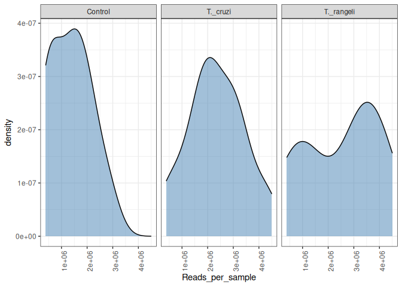<!-- -->


*You can try to plot with diffrent metadata.*

Plotting the read count per sample

``` r
df <- psmelt(merged_metagenomes)  %>%  group_by(Sample, Time) %>%  
  summarise(sum_reads = sum(Abundance)) %>% arrange(sum_reads) 
```

    ## Warning in psmelt(merged_metagenomes): The sample variables: 
    ## Sample
    ##  have been renamed to: 
    ## sample_Sample
    ## to avoid conflicts with special phyloseq plot attribute names.

    ## `summarise()` has grouped output by 'Sample'. You can override using the
    ## `.groups` argument.

``` r
ggplot(df) +
  geom_bar(aes(reorder(Sample, -sum_reads), sum_reads, fill=Time),
           col="red", alpha = .2, stat="identity") 
```

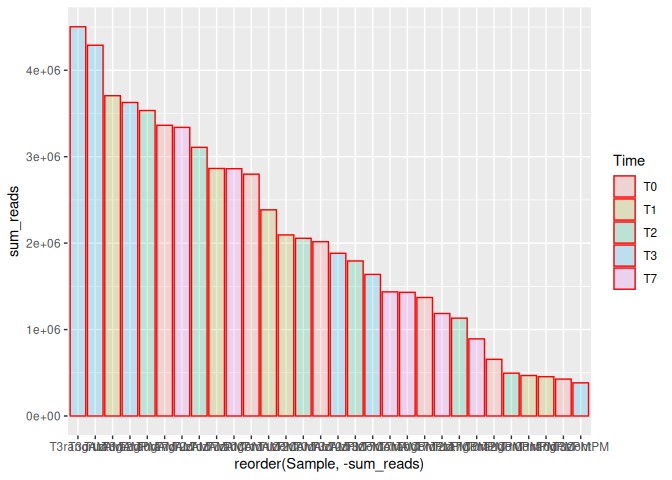<!-- -->

<figure>

<figcaption aria-hidden="true">density</figcaption>
</figure>

### Prevalence - Detection

Prevalence quantifies the frequency of samples where certain microbes
were detected (above a given detection threshold). The prevalence can be
given as sample size (N) or percentage (unit interval).

The population prevalence (frequency) at a 1% relative abundance
threshold (detection = 1/100 and count = false), can look like this.

``` r
prevalence(merged_metagenomes, detection=1/100, sort=TRUE, count=FALSE)
```

    ##      85471       5855       3218       3369     210225       3469      86752 
    ## 1.00000000 1.00000000 1.00000000 1.00000000 1.00000000 1.00000000 1.00000000 
    ##      54955      60698      29710       4686      42345      51953       4641 
    ## 1.00000000 1.00000000 1.00000000 1.00000000 1.00000000 1.00000000 1.00000000 
    ##      94328       4615      38727       4558       4577       4530       4533 
    ## 1.00000000 1.00000000 1.00000000 1.00000000 1.00000000 1.00000000 1.00000000 
    ##       4522      89674       4513      37682       4572      85692       4565 
    ## 1.00000000 1.00000000 1.00000000 1.00000000 1.00000000 1.00000000 1.00000000 
    ##     397392      29722     161934       3562     182163      55363     165200 
    ## 1.00000000 1.00000000 1.00000000 1.00000000 1.00000000 1.00000000 1.00000000 
    ##     253017       4039       4265       4236      72917       4232      13443 
    ## 1.00000000 1.00000000 1.00000000 1.00000000 1.00000000 1.00000000 1.00000000 
    ##       4182       4146      49212     226208     180675      35885      49451 
    ## 1.00000000 1.00000000 1.00000000 1.00000000 1.00000000 1.00000000 1.00000000 
    ##     112863     112874       4072      45834     172797       4081      28526 
    ## 1.00000000 1.00000000 1.00000000 1.00000000 1.00000000 1.00000000 1.00000000 
    ##      96939      29760      22663      71139     178133      29780       2711 
    ## 1.00000000 1.00000000 1.00000000 1.00000000 1.00000000 1.00000000 1.00000000 
    ##       3702      90675       3726       3712       3708       3641      29729 
    ## 1.00000000 1.00000000 1.00000000 1.00000000 1.00000000 1.00000000 1.00000000 
    ##      29730       3635     458696       3663     102211       3656       3659 
    ## 1.00000000 1.00000000 1.00000000 1.00000000 1.00000000 1.00000000 1.00000000 
    ##       3694       3986       3988       3983       3981     326968       3483 
    ## 1.00000000 1.00000000 1.00000000 1.00000000 1.00000000 1.00000000 1.00000000 
    ##      74649      57918      57926       3752       3760     102107      13451 
    ## 1.00000000 1.00000000 1.00000000 1.00000000 1.00000000 1.00000000 1.00000000 
    ##      32201    2249226      51240      97700      38942       3871       3818 
    ## 1.00000000 1.00000000 1.00000000 1.00000000 1.00000000 1.00000000 1.00000000 
    ##     217475      34305       3827       3880      57577       3911       3888 
    ## 1.00000000 1.00000000 1.00000000 1.00000000 1.00000000 1.00000000 1.00000000 
    ##       3821       3885       3847       3914     157791       3917       9606 
    ## 1.00000000 1.00000000 1.00000000 1.00000000 1.00000000 1.00000000 1.00000000 
    ##        210     488447     152682        358        955    2954004    2732594 
    ## 1.00000000 1.00000000 1.00000000 1.00000000 1.00000000 1.00000000 1.00000000 
    ##     246273        670    1905730      65700        562        573    2871826 
    ## 1.00000000 1.00000000 1.00000000 1.00000000 1.00000000 1.00000000 1.00000000 
    ##      43767      37919      38312     300028    2567884    2742603       2035 
    ## 1.00000000 1.00000000 1.00000000 1.00000000 1.00000000 1.00000000 1.00000000 
    ##       1502       1351        339       1282      49369      76775     663364 
    ## 1.00000000 1.00000000 0.96666667 0.96666667 0.96666667 0.96666667 0.96666667 
    ##    2954061     215173    2954046     931100        638      63612      55213 
    ## 0.96666667 0.96666667 0.96666667 0.96666667 0.96666667 0.96666667 0.96666667 
    ##    2778550      28901       1747    2420509      37326    3064529     223392 
    ## 0.96666667 0.96666667 0.96666667 0.96666667 0.96666667 0.96666667 0.96666667 
    ##      38310       1828     679318    2962047    1805827    2507582       1396 
    ## 0.96666667 0.96666667 0.96666667 0.96666667 0.96666667 0.96666667 0.96666667 
    ##      33028       1352    2920934       5141      80884     130453      42374 
    ## 0.96666667 0.96666667 0.96666667 0.93333333 0.93333333 0.93333333 0.93333333 
    ##    1812115    2953989     180957        549    2935861    1286180     758802 
    ## 0.93333333 0.93333333 0.93333333 0.93333333 0.93333333 0.93333333 0.93333333 
    ##    2984338     135487       1824       1829      33008    1564114     238834 
    ## 0.93333333 0.93333333 0.93333333 0.93333333 0.93333333 0.93333333 0.93333333 
    ##       1639      44689     204042    1076550    2725560       5722       5860 
    ## 0.93333333 0.90000000 0.90000000 0.90000000 0.90000000 0.90000000 0.90000000 
    ##    2953971    2954019    1486991      66269    2597660       1727      57704 
    ## 0.90000000 0.90000000 0.90000000 0.90000000 0.90000000 0.90000000 0.90000000 
    ##       2061     249058       2055      84595    2597659    2665643     337191 
    ## 0.90000000 0.90000000 0.90000000 0.90000000 0.90000000 0.90000000 0.90000000 
    ##    2742602    2811424      28047      53462      39692     455432      37330 
    ## 0.90000000 0.90000000 0.90000000 0.90000000 0.90000000 0.90000000 0.90000000 
    ##      37329       1823     228602    1047172     132919    2811421      99653 
    ## 0.90000000 0.90000000 0.90000000 0.90000000 0.90000000 0.90000000 0.90000000 
    ##    1302308    2722825       1280       4538     164546      69223    1109412 
    ## 0.90000000 0.90000000 0.90000000 0.86666667 0.86666667 0.86666667 0.86666667 
    ##    1507808    1619313     158822     158836        548      37734     206008 
    ## 0.86666667 0.86666667 0.86666667 0.86666667 0.86666667 0.86666667 0.86666667 
    ##      15368       3711       3848    3075927    2745196    2751189     499555 
    ## 0.86666667 0.86666667 0.86666667 0.86666667 0.86666667 0.86666667 0.86666667 
    ##    2760083     875808      39694       1772    2213200    2749991    2806442 
    ## 0.86666667 0.86666667 0.86666667 0.86666667 0.86666667 0.86666667 0.86666667 
    ##    2789739    1653478       1708      28447    2929795     138074     204038 
    ## 0.86666667 0.86666667 0.86666667 0.86666667 0.83333333 0.83333333 0.83333333 
    ##    2259638    1201031    2490851    1812935     103816       3750    1845000 
    ## 0.83333333 0.83333333 0.83333333 0.83333333 0.83333333 0.83333333 0.83333333 
    ##    1415574    3079339    2831662    2758710      36809    3058426      53443 
    ## 0.83333333 0.83333333 0.83333333 0.83333333 0.83333333 0.83333333 0.83333333 
    ##     167972     118060     417368    3034230      33889     216929        582 
    ## 0.83333333 0.83333333 0.83333333 0.80000000 0.80000000 0.80000000 0.80000000 
    ##      69221        550      71452       1793    2663121     208348      98403 
    ## 0.80000000 0.80000000 0.80000000 0.80000000 0.80000000 0.80000000 0.80000000 
    ##    2954037    1357545     860235      36822      39689      37332     480035 
    ## 0.80000000 0.80000000 0.80000000 0.80000000 0.80000000 0.80000000 0.80000000 
    ##      37927      44008     160453     561061     311231    2675378    2968084 
    ## 0.80000000 0.80000000 0.80000000 0.76666667 0.76666667 0.76666667 0.76666667 
    ##       1804     212765       3055      56459        633        615    2722756 
    ## 0.76666667 0.76666667 0.76666667 0.76666667 0.76666667 0.76666667 0.76666667 
    ##    2681984    2891570        545      69218     208962     304207     715473 
    ## 0.76666667 0.76666667 0.76666667 0.76666667 0.76666667 0.76666667 0.76666667 
    ##     322509     722731    1448929    2954021    2202249    1653480     524884 
    ## 0.76666667 0.76666667 0.76666667 0.76666667 0.76666667 0.76666667 0.76666667 
    ##     639313    1552759    2867005     370526    2499145       1276    2728827 
    ## 0.76666667 0.76666667 0.76666667 0.76666667 0.76666667 0.76666667 0.73333333 
    ##      75294       2054     209247    1930532     332186     568768      55212 
    ## 0.73333333 0.73333333 0.73333333 0.73333333 0.73333333 0.73333333 0.73333333 
    ##    1505757     539813     712270    2055889       5858    2953972    1586287 
    ## 0.73333333 0.73333333 0.73333333 0.73333333 0.73333333 0.73333333 0.73333333 
    ##      38305     120959      39687    3056937    2382165    2749906        556 
    ## 0.73333333 0.73333333 0.73333333 0.73333333 0.73333333 0.73333333 0.70000000 
    ##    2060066     530584     715471     139208      36808     886343      85968 
    ## 0.70000000 0.70000000 0.70000000 0.70000000 0.70000000 0.70000000 0.70000000 
    ##       1766     130454    2774015      29471      59814     244366      44009 
    ## 0.70000000 0.70000000 0.70000000 0.70000000 0.70000000 0.70000000 0.70000000 
    ##     419479    2932773    2698900     560555     134601     590745       3755 
    ## 0.70000000 0.70000000 0.70000000 0.70000000 0.70000000 0.70000000 0.70000000 
    ##      29552    2419772    2126321    1510570    2545798    2954050      55208 
    ## 0.70000000 0.70000000 0.66666667 0.66666667 0.66666667 0.66666667 0.66666667 
    ##    1219491      40989    2917725     571913    2932244     322009     459858 
    ## 0.66666667 0.66666667 0.66666667 0.66666667 0.66666667 0.66666667 0.66666667 
    ##     482462    2987751     293050    2885078      82985      82996       1640 
    ## 0.66666667 0.66666667 0.66666667 0.66666667 0.66666667 0.66666667 0.66666667 
    ##    2981138       1836    1069220    2603292       2033      11786    1080349 
    ## 0.66666667 0.66666667 0.66666667 0.66666667 0.66666667 0.66666667 0.66666667 
    ##      34073    2953986     167957    2014541     715475    1936029     152142 
    ## 0.66666667 0.66666667 0.66666667 0.66666667 0.66666667 0.66666667 0.66666667 
    ##    2813727    1778540     204039      67824        565      37331    3075825 
    ## 0.66666667 0.63333333 0.63333333 0.63333333 0.63333333 0.63333333 0.63333333 
    ##    1133546       1274     372663    2973977    2683590    2419774    2995145 
    ## 0.63333333 0.63333333 0.63333333 0.63333333 0.63333333 0.63333333 0.63333333 
    ##    1069221       1784     185642    2099693       1797    1249101       1800 
    ## 0.63333333 0.63333333 0.63333333 0.63333333 0.63333333 0.63333333 0.63333333 
    ##    2761578      85693    1286181       1833    1513468          9     338565 
    ## 0.63333333 0.63333333 0.63333333 0.63333333 0.63333333 0.63333333 0.63333333 
    ##      38290    2662397      36821       1774       1764     319706     632773 
    ## 0.63333333 0.63333333 0.63333333 0.63333333 0.63333333 0.63333333 0.63333333 
    ##      67780        569    2779359     946333    2219696      92490     414996 
    ## 0.60000000 0.60000000 0.60000000 0.60000000 0.60000000 0.60000000 0.60000000 
    ##     168695     546871    2714938    2486272    2792008     240495    3043734 
    ## 0.60000000 0.60000000 0.60000000 0.60000000 0.60000000 0.60000000 0.60000000 
    ##       1710     370764     273677     191493    1136941    3064287     220927 
    ## 0.60000000 0.60000000 0.60000000 0.60000000 0.60000000 0.60000000 0.60000000 
    ##    2675524    1547487     258505      56689     319707     204891        584 
    ## 0.60000000 0.60000000 0.60000000 0.60000000 0.60000000 0.60000000 0.60000000 
    ##        553      83655    1463165      38302      39691    2908837    2954056 
    ## 0.60000000 0.60000000 0.60000000 0.60000000 0.60000000 0.60000000 0.60000000 
    ##      86660    2781735    2607753    3075432    1570939    1849032    1935379 
    ## 0.60000000 0.60000000 0.60000000 0.60000000 0.60000000 0.60000000 0.60000000 
    ##      29388    3076559    2485124    1134687    1911586    2872648        571 
    ## 0.60000000 0.56666667 0.56666667 0.56666667 0.56666667 0.56666667 0.56666667 
    ##    2840468    2953982    2488639    2762325      53461      56438    2582905 
    ## 0.56666667 0.56666667 0.56666667 0.56666667 0.56666667 0.56666667 0.56666667 
    ##     211114    2865832    2896848      83291      43674    2575923    3073064 
    ## 0.56666667 0.56666667 0.56666667 0.56666667 0.56666667 0.56666667 0.56666667 
    ##     412690    2592652    3035531     546160     225326     394964    1118379 
    ## 0.56666667 0.56666667 0.56666667 0.56666667 0.56666667 0.56666667 0.56666667 
    ##    2872309     169765     292462    1431246       1799    3064286       1830 
    ## 0.56666667 0.56666667 0.56666667 0.56666667 0.56666667 0.56666667 0.56666667 
    ##     929813     174587      83656      99182       5825       4896    2954052 
    ## 0.56666667 0.56666667 0.56666667 0.56666667 0.56666667 0.56666667 0.56666667 
    ##      46507     293387      29484    2986763      40576    1239307      29486 
    ## 0.56666667 0.56666667 0.53333333 0.53333333 0.53333333 0.53333333 0.53333333 
    ##        554    2703885    1891644     477641    1090615    1076124      53359 
    ## 0.53333333 0.53333333 0.53333333 0.53333333 0.53333333 0.53333333 0.53333333 
    ##     196914    2672569    2663859    2968086       2041    1736691    2592334 
    ## 0.53333333 0.53333333 0.53333333 0.53333333 0.53333333 0.53333333 0.53333333 
    ##    1470176    1045776      40988       2074    1690815       1960    2900152 
    ## 0.53333333 0.53333333 0.53333333 0.53333333 0.53333333 0.53333333 0.53333333 
    ##    3030830    2934161     358099    2968083    2904790    1162966    1671680 
    ## 0.53333333 0.53333333 0.53333333 0.53333333 0.53333333 0.53333333 0.53333333 
    ##    2509455    3049072       1724    1121358    3027808     212767     126673 
    ## 0.53333333 0.53333333 0.53333333 0.53333333 0.53333333 0.53333333 0.53333333 
    ##       1801       1792       1795    3023370     334542       4555     240139 
    ## 0.53333333 0.53333333 0.53333333 0.53333333 0.53333333 0.53333333 0.53333333 
    ##       1607      11819    2067958      82977      29483      78398    1615494 
    ## 0.53333333 0.53333333 0.50000000 0.50000000 0.50000000 0.50000000 0.50000000 
    ##        546        631    1172565    3057057      67825    1862145         69 
    ## 0.50000000 0.50000000 0.50000000 0.50000000 0.50000000 0.50000000 0.50000000 
    ##        636    2742128     182640    2714937     449461    3095076    2898796 
    ## 0.50000000 0.50000000 0.50000000 0.50000000 0.50000000 0.50000000 0.50000000 
    ##     632569      31958    2653857     715472    1436133       1967    1355015 
    ## 0.50000000 0.50000000 0.50000000 0.50000000 0.50000000 0.50000000 0.50000000 
    ##    2880933      68192    1930058    1179673    2816956      76862    2173174 
    ## 0.50000000 0.50000000 0.50000000 0.50000000 0.50000000 0.50000000 0.50000000 
    ##    2419771    1268041    2781978    2596916    2708338    2609257    2734618 
    ## 0.50000000 0.50000000 0.50000000 0.50000000 0.50000000 0.50000000 0.50000000 
    ##    1906274    2175666     286802    2915130    1737425     404941     590652 
    ## 0.50000000 0.50000000 0.50000000 0.50000000 0.50000000 0.50000000 0.50000000 
    ##    2903536     444597      39688     146017    2755382     121627     151416 
    ## 0.50000000 0.50000000 0.50000000 0.50000000 0.50000000 0.50000000 0.50000000 
    ##    1334193    2796470      39122     280473       1493    1324864     208223 
    ## 0.50000000 0.50000000 0.50000000 0.50000000 0.50000000 0.46666667 0.46666667 
    ##        630    2743089     392734     123899      82633    2735433    2494374 
    ## 0.46666667 0.46666667 0.46666667 0.46666667 0.46666667 0.46666667 0.46666667 
    ##    1327635    1842539    1447062    2722752     461393    1851395     163604 
    ## 0.46666667 0.46666667 0.46666667 0.46666667 0.46666667 0.46666667 0.46666667 
    ##      53437    2219224      46165       1993    3016090       1744     630515 
    ## 0.46666667 0.46666667 0.46666667 0.46666667 0.46666667 0.46666667 0.46666667 
    ##    1736306     627624    2931390     103733    1804986     208439    2778070 
    ## 0.46666667 0.46666667 0.46666667 0.46666667 0.46666667 0.46666667 0.46666667 
    ##      45398       1888      66425    3051092    2717324    1077946      67267 
    ## 0.46666667 0.46666667 0.46666667 0.46666667 0.46666667 0.46666667 0.46666667 
    ##    1783515    2942449    2695266     477697    2867410      84757    2675754 
    ## 0.46666667 0.46666667 0.46666667 0.46666667 0.46666667 0.46666667 0.46666667 
    ##     767452     904039    2758442    2591145    1798223    2509458      36805 
    ## 0.46666667 0.46666667 0.46666667 0.46666667 0.46666667 0.46666667 0.46666667 
    ##     139021      47312     173559    2059875    2982699    2857060       1802 
    ## 0.46666667 0.46666667 0.46666667 0.46666667 0.46666667 0.46666667 0.46666667 
    ##      36813       1794      46351      27350      85698    1173586     470934 
    ## 0.46666667 0.46666667 0.46666667 0.46666667 0.46666667 0.46666667 0.46666667 
    ##     446860    3068634       1496      28141    2697027    1005665    2954013 
    ## 0.46666667 0.46666667 0.46666667 0.43333333 0.43333333 0.43333333 0.43333333 
    ##      54736     184914    1746199    1826607    2657486    1670830    2707299 
    ## 0.43333333 0.43333333 0.43333333 0.43333333 0.43333333 0.43333333 0.43333333 
    ##      78448    3059028    3041175     546874    2662028    2589074    1804624 
    ## 0.43333333 0.43333333 0.43333333 0.43333333 0.43333333 0.43333333 0.43333333 
    ##    2840457     196162     340345      60894    2736640    2865833    2705012 
    ## 0.43333333 0.43333333 0.43333333 0.43333333 0.43333333 0.43333333 0.43333333 
    ##    2126346    2797636    2184053    3081768    2203204    3057122    3062449 
    ## 0.43333333 0.43333333 0.43333333 0.43333333 0.43333333 0.43333333 0.43333333 
    ##    2833628    2714931    1658671    2770551    1136497     273384    2909672 
    ## 0.43333333 0.43333333 0.43333333 0.43333333 0.43333333 0.43333333 0.43333333 
    ##    2853258    2964609    2894187     399736    2994664      69367     683047 
    ## 0.43333333 0.43333333 0.43333333 0.43333333 0.43333333 0.43333333 0.43333333 
    ##    1714373       1725    1783348      43765      65058    1701090    1004901 
    ## 0.43333333 0.43333333 0.43333333 0.43333333 0.43333333 0.43333333 0.43333333 
    ##    1578165       1775     470076    2099695      98668    3064284     179637 
    ## 0.43333333 0.43333333 0.43333333 0.43333333 0.43333333 0.43333333 0.43333333 
    ##       4556       5207      40559      78579        303       1491    1535768 
    ## 0.43333333 0.43333333 0.43333333 0.43333333 0.43333333 0.43333333 0.43333333 
    ##       5691    2953975    2875706      29485      33060    3062598    2339259 
    ## 0.43333333 0.43333333 0.43333333 0.40000000 0.40000000 0.40000000 0.40000000 
    ##      55211        552    1639133     881260    2806443         56     404589 
    ## 0.40000000 0.40000000 0.40000000 0.40000000 0.40000000 0.40000000 0.40000000 
    ##     356302    1310165        192    1850238     627192     223967     722472 
    ## 0.40000000 0.40000000 0.40000000 0.40000000 0.40000000 0.40000000 0.40000000 
    ##    2866626       1859    2983233    2933797    1960083    2057798     946334 
    ## 0.40000000 0.40000000 0.40000000 0.40000000 0.40000000 0.40000000 0.40000000 
    ##     356851    3016092    2996826    2802641     333966     944492    2914159 
    ## 0.40000000 0.40000000 0.40000000 0.40000000 0.40000000 0.40000000 0.40000000 
    ##    1896961       1890     193462     132473    2931983    3031131    1488356 
    ## 0.40000000 0.40000000 0.40000000 0.40000000 0.40000000 0.40000000 0.40000000 
    ##    2819238    1690220    3028808    2483799    2589797    1906273      37931 
    ## 0.40000000 0.40000000 0.40000000 0.40000000 0.40000000 0.40000000 0.40000000 
    ##    2782567    2020486    2819978     162426    1526412    2070337     156978 
    ## 0.40000000 0.40000000 0.40000000 0.40000000 0.40000000 0.40000000 0.40000000 
    ##      43771     598660    2878678       1788      29314       1781     141349 
    ## 0.40000000 0.40000000 0.40000000 0.40000000 0.40000000 0.40000000 0.40000000 
    ##    2675523     318424     117567       5861    1220207    2565914    2710756 
    ## 0.40000000 0.40000000 0.40000000 0.40000000 0.40000000 0.40000000 0.40000000 
    ##      54571    2816454     148814    3077940      93378     351671    1639108 
    ## 0.40000000 0.40000000 0.40000000 0.36666667 0.36666667 0.36666667 0.36666667 
    ##        622    1089444        703     138072    2108399       2047       1354 
    ## 0.36666667 0.36666667 0.36666667 0.36666667 0.36666667 0.36666667 0.36666667 
    ##    2815358    2546350    2571747      55518     528244    2867020    1077935 
    ## 0.36666667 0.36666667 0.36666667 0.36666667 0.36666667 0.36666667 0.36666667 
    ##    1874061    1437009     515361    2739063    2849779      53522    1909395 
    ## 0.36666667 0.36666667 0.36666667 0.36666667 0.36666667 0.36666667 0.36666667 
    ##     227318    3016086       1867      47853    3002436    3081204    2908642 
    ## 0.36666667 0.36666667 0.36666667 0.36666667 0.36666667 0.36666667 0.36666667 
    ##    2079793    2685869     642780    2760089    3044187    2917724    2951806 
    ## 0.36666667 0.36666667 0.36666667 0.36666667 0.36666667 0.36666667 0.36666667 
    ##      40990       1969     348043      33900    1226757     114686    3081765 
    ## 0.36666667 0.36666667 0.36666667 0.36666667 0.36666667 0.36666667 0.36666667 
    ##    3075199    2835531    2716227      60920    2571029    2594265     629680 
    ## 0.36666667 0.36666667 0.36666667 0.36666667 0.36666667 0.36666667 0.36666667 
    ##    3039385    2968085     674079    1913979     589382    1389020    1072463 
    ## 0.36666667 0.36666667 0.36666667 0.36666667 0.36666667 0.36666667 0.36666667 
    ##    2614638      57043    2614639     904291    2995140    1793722     134034 
    ## 0.36666667 0.36666667 0.36666667 0.36666667 0.36666667 0.36666667 0.36666667 
    ##      43770    1223514    1408191     169292     108486      89053    3064288 
    ## 0.36666667 0.36666667 0.36666667 0.36666667 0.36666667 0.36666667 0.36666667 
    ##    2875777       1778    1682113    2857059    2736649      11757       5665 
    ## 0.36666667 0.36666667 0.36666667 0.36666667 0.36666667 0.36666667 0.36666667 
    ##     208452        511      72557        588     225148    2494702     299767 
    ## 0.36666667 0.36666667 0.36666667 0.36666667 0.36666667 0.33333333 0.33333333 
    ##    2579935      85404     564369     158850     935293    2042057     470931 
    ## 0.33333333 0.33333333 0.33333333 0.33333333 0.33333333 0.33333333 0.33333333 
    ##    3073902    1158459      54291    2961597    2871694    1593482      94132 
    ## 0.33333333 0.33333333 0.33333333 0.33333333 0.33333333 0.33333333 0.33333333 
    ##     364317     207745    1250539     158500    2744518    2780091    1664560 
    ## 0.33333333 0.33333333 0.33333333 0.33333333 0.33333333 0.33333333 0.33333333 
    ##      56448    1231049    2917691       1393     147206    2811108    1907575 
    ## 0.33333333 0.33333333 0.33333333 0.33333333 0.33333333 0.33333333 0.33333333 
    ##    1798224    1528104    2811111    1003110      75385    2969247    2895565 
    ## 0.33333333 0.33333333 0.33333333 0.33333333 0.33333333 0.33333333 0.33333333 
    ##    2665642    2861750      68246    1848900    2981135    3028711    2742137 
    ## 0.33333333 0.33333333 0.33333333 0.33333333 0.33333333 0.33333333 0.33333333 
    ##    3030210    3075198    2897773      43669    2904523    1535208    2777556 
    ## 0.33333333 0.33333333 0.33333333 0.33333333 0.33333333 0.33333333 0.33333333 
    ##    2963406    2932245    2875948    2925844    2489212    2483401    2175674 
    ## 0.33333333 0.33333333 0.33333333 0.33333333 0.33333333 0.33333333 0.33333333 
    ##     203263    2763010     699041     161895    3017361     110505     339268 
    ## 0.33333333 0.33333333 0.33333333 0.33333333 0.33333333 0.33333333 0.33333333 
    ##    2683591    1723645      35128      29176     145971       5507      71667 
    ## 0.33333333 0.33333333 0.33333333 0.33333333 0.33333333 0.33333333 0.33333333 
    ##    2051906    1855352     137545        648    2949614    2071621     367190 
    ## 0.33333333 0.33333333 0.30000000 0.30000000 0.30000000 0.30000000 0.30000000 
    ##     885040    2890317    2724468     263765    1891675    2650975     927083 
    ## 0.30000000 0.30000000 0.30000000 0.30000000 0.30000000 0.30000000 0.30000000 
    ##    2005884      34070        521    1842533     412963      57975     179879 
    ## 0.30000000 0.30000000 0.30000000 0.30000000 0.30000000 0.30000000 0.30000000 
    ##    2768162     436663    1736675    2898149    2806210    1033854    1897729 
    ## 0.30000000 0.30000000 0.30000000 0.30000000 0.30000000 0.30000000 0.30000000 
    ##    2854257     402384    1608957    2983212     111015     338584     399497 
    ## 0.30000000 0.30000000 0.30000000 0.30000000 0.30000000 0.30000000 0.30000000 
    ##    2662261    3081651      29405     433659     110319    3036374    1911175 
    ## 0.30000000 0.30000000 0.30000000 0.30000000 0.30000000 0.30000000 0.30000000 
    ##    2919322    2768066      47759     659352     862751    2056258    2692234 
    ## 0.30000000 0.30000000 0.30000000 0.30000000 0.30000000 0.30000000 0.30000000 
    ##     444103    2585135    2509459    2697565    2851598    3018929    2828862 
    ## 0.30000000 0.30000000 0.30000000 0.30000000 0.30000000 0.30000000 0.30000000 
    ##    1494608    2704467    2079792    2813744    2873270    1858653    2781962 
    ## 0.30000000 0.30000000 0.30000000 0.30000000 0.30000000 0.30000000 0.30000000 
    ##     104336    2782167    3050384    2175650    2175620     441500    1719132 
    ## 0.30000000 0.30000000 0.30000000 0.30000000 0.30000000 0.30000000 0.30000000 
    ##       1767    2991728    2487344      36814      39695    1534349       1771 
    ## 0.30000000 0.30000000 0.30000000 0.30000000 0.30000000 0.30000000 0.30000000 
    ##    3002901       5679       5664      94643       5811       5827      27288 
    ## 0.30000000 0.30000000 0.30000000 0.30000000 0.30000000 0.30000000 0.30000000 
    ##      69781    2587410     195108        305    2005703    2894081    2931382 
    ## 0.30000000 0.30000000 0.30000000 0.30000000 0.30000000 0.30000000 0.26666667 
    ##      85402     497725     300181    2608981    2936799     472693      61646 
    ## 0.26666667 0.26666667 0.26666667 0.26666667 0.26666667 0.26666667 0.26666667 
    ##      93465    2819098      55209    2742673      41202      39956        585 
    ## 0.26666667 0.26666667 0.26666667 0.26666667 0.26666667 0.26666667 0.26666667 
    ##    2528022    1617967        873    1503055    2896849    2954012    1940610 
    ## 0.26666667 0.26666667 0.26666667 0.26666667 0.26666667 0.26666667 0.26666667 
    ##    2917991      44255    2976822    1481914     332249     304895     544580 
    ## 0.26666667 0.26666667 0.26666667 0.26666667 0.26666667 0.26666667 0.26666667 
    ##      93944       2020    2161816    2662361    2268449       1814    2018025 
    ## 0.26666667 0.26666667 0.26666667 0.26666667 0.26666667 0.26666667 0.26666667 
    ##    3075627      28894      68214    1169025       1911     155177    2203210 
    ## 0.26666667 0.26666667 0.26666667 0.26666667 0.26666667 0.26666667 0.26666667 
    ##    2979468    2721246    1903186    2283195    1933880      37921     684552 
    ## 0.26666667 0.26666667 0.26666667 0.26666667 0.26666667 0.26666667 0.26666667 
    ##    1897061     283878     462710      82380    2962064    2080740    1230998 
    ## 0.26666667 0.26666667 0.26666667 0.26666667 0.26666667 0.26666667 0.26666667 
    ##    1795032    2855503    1389713       1810     388459    2795031    2594007 
    ## 0.26666667 0.26666667 0.26666667 0.26666667 0.26666667 0.26666667 0.26666667 
    ##      11788       5850      42858    2721244     754477        731    1117707 
    ## 0.26666667 0.26666667 0.26666667 0.26666667 0.26666667 0.23333333 0.23333333 
    ##     351679      34038      28151    1082704    1851514      47917    2448483 
    ## 0.23333333 0.23333333 0.23333333 0.23333333 0.23333333 0.23333333 0.23333333 
    ##     187304    2172103    1263550     379893    1439319    2066049    2742676 
    ## 0.23333333 0.23333333 0.23333333 0.23333333 0.23333333 0.23333333 0.23333333 
    ##    2886046     208224      29543     289370    2951804    2527980      41899 
    ## 0.23333333 0.23333333 0.23333333 0.23333333 0.23333333 0.23333333 0.23333333 
    ##       1085    2587163    2867236    1549858        426    2807101    2984843 
    ## 0.23333333 0.23333333 0.23333333 0.23333333 0.23333333 0.23333333 0.23333333 
    ##     925818     114616    2182432    2480810     859143     496014    2716812 
    ## 0.23333333 0.23333333 0.23333333 0.23333333 0.23333333 0.23333333 0.23333333 
    ##    2744574    3061629     512349    2836373    3009077    1483604    2719023 
    ## 0.23333333 0.23333333 0.23333333 0.23333333 0.23333333 0.23333333 0.23333333 
    ##    2995223    2742131       1889      67385     202862    2293571    2746961 
    ## 0.23333333 0.23333333 0.23333333 0.23333333 0.23333333 0.23333333 0.23333333 
    ##    1882757    3033811    2508882      53358       1275    2600159       1711 
    ## 0.23333333 0.23333333 0.23333333 0.23333333 0.23333333 0.23333333 0.23333333 
    ##    2498704    2708079    2492438    1727214       5661       5875      41875 
    ## 0.23333333 0.23333333 0.23333333 0.23333333 0.23333333 0.23333333 0.23333333 
    ##     181124    1069201    1653831    2862509     379064       1404    2014534 
    ## 0.23333333 0.23333333 0.23333333 0.23333333 0.23333333 0.23333333 0.23333333 
    ##    2007306      36746     265668    2027290    2204145     470932    3098669 
    ## 0.23333333 0.20000000 0.20000000 0.20000000 0.20000000 0.20000000 0.20000000 
    ##     182337    1646340    2498113     172042       1260       2355      39645 
    ## 0.20000000 0.20000000 0.20000000 0.20000000 0.20000000 0.20000000 0.20000000 
    ##      82983     126385      61647    2153354    3027472    1891787        654 
    ## 0.20000000 0.20000000 0.20000000 0.20000000 0.20000000 0.20000000 0.20000000 
    ##     158849    1612552    2912188    1850093      28152    1604004     712471 
    ## 0.20000000 0.20000000 0.20000000 0.20000000 0.20000000 0.20000000 0.20000000 
    ##    1851544    1416806    1871086    3079304    2338327      13690    2954030 
    ## 0.20000000 0.20000000 0.20000000 0.20000000 0.20000000 0.20000000 0.20000000 
    ##    2917727    2060726    1605891     154288    2653852    2949664    1805478 
    ## 0.20000000 0.20000000 0.20000000 0.20000000 0.20000000 0.20000000 0.20000000 
    ##       1683    2851567    1323731       2006    2591108     113562     649831 
    ## 0.20000000 0.20000000 0.20000000 0.20000000 0.20000000 0.20000000 0.20000000 
    ##    1914461       2045    2712223    2518370       1852      68200    2508722 
    ## 0.20000000 0.20000000 0.20000000 0.20000000 0.20000000 0.20000000 0.20000000 
    ##      47763    1333528    1736046    2801030    2078691    2135430    3069708 
    ## 0.20000000 0.20000000 0.20000000 0.20000000 0.20000000 0.20000000 0.20000000 
    ##    2567881     388357    2879617    2991715    1138587    2654191    2782168 
    ## 0.20000000 0.20000000 0.20000000 0.20000000 0.20000000 0.20000000 0.20000000 
    ##    2841594     441501     187491     370524    1534348    1990687       5821 
    ## 0.20000000 0.20000000 0.20000000 0.20000000 0.20000000 0.20000000 0.20000000 
    ##    1608628      40324    3047874       1428      60519    2893572     255519 
    ## 0.20000000 0.20000000 0.20000000 0.20000000 0.20000000 0.16666667 0.16666667 
    ##     640030     225992        750    2183582     453783     183795    3021011 
    ## 0.16666667 0.16666667 0.16666667 0.16666667 0.16666667 0.16666667 0.16666667 
    ##     158841    2218628    2816248      58169     568766      35703    1259973 
    ## 0.16666667 0.16666667 0.16666667 0.16666667 0.16666667 0.16666667 0.16666667 
    ##        566    3080537    1979527      74313    2109558    2527989    2714946 
    ## 0.16666667 0.16666667 0.16666667 0.16666667 0.16666667 0.16666667 0.16666667 
    ##    3029761       1505    1729720     502352    2962672    1364945    1763534 
    ## 0.16666667 0.16666667 0.16666667 0.16666667 0.16666667 0.16666667 0.16666667 
    ##    2290923    1134435    1034889     169427    1385591      74033     267128 
    ## 0.16666667 0.16666667 0.16666667 0.16666667 0.16666667 0.16666667 0.16666667 
    ##      33050    2570229     314722    2290922     321332    3061989     189426 
    ## 0.16666667 0.16666667 0.16666667 0.16666667 0.16666667 0.16666667 0.16666667 
    ##    2997333      35760     404386      47875    3015167       1749    2596828 
    ## 0.16666667 0.16666667 0.16666667 0.16666667 0.16666667 0.16666667 0.16666667 
    ##     419476    2884264      33914      33910    3052846      29303     665007 
    ## 0.16666667 0.16666667 0.16666667 0.16666667 0.16666667 0.16666667 0.16666667 
    ##     285450    2726118    2878388       1912    2750011    1851167    2866715 
    ## 0.16666667 0.16666667 0.16666667 0.16666667 0.16666667 0.16666667 0.16666667 
    ##    2136401    2171623    2762331    2973976    2830998     545619    2003551 
    ## 0.16666667 0.16666667 0.16666667 0.16666667 0.16666667 0.16666667 0.16666667 
    ##     501023    2859226    2070347    2220095    2861288     453304    2851649 
    ## 0.16666667 0.16666667 0.16666667 0.16666667 0.16666667 0.16666667 0.16666667 
    ##     344163    2909587    2851646    3025663    2175645      53374    2719119 
    ## 0.16666667 0.16666667 0.16666667 0.16666667 0.16666667 0.16666667 0.16666667 
    ##     349751     701042    2857058      11809      11808       5660     280036 
    ## 0.16666667 0.16666667 0.16666667 0.16666667 0.16666667 0.16666667 0.16666667 
    ##      36914     746128    2231603    2060973       5518     101028      36050 
    ## 0.16666667 0.16666667 0.16666667 0.16666667 0.16666667 0.16666667 0.16666667 
    ##     165179    1573823    2705473    2986837       1219     492670      34071 
    ## 0.16666667 0.16666667 0.16666667 0.16666667 0.16666667 0.16666667 0.13333333 
    ##     261302        399        714        645        317    2487887     230089 
    ## 0.13333333 0.13333333 0.13333333 0.13333333 0.13333333 0.13333333 0.13333333 
    ##     104623     940614     564064    1850250     172043    1538553      29489 
    ## 0.13333333 0.13333333 0.13333333 0.13333333 0.13333333 0.13333333 0.13333333 
    ##    1632866     197222    2785918      60478      43263     158627     553611 
    ## 0.13333333 0.13333333 0.13333333 0.13333333 0.13333333 0.13333333 0.13333333 
    ##     379097      76258      40577    1805933     263819        614    1177216 
    ## 0.13333333 0.13333333 0.13333333 0.13333333 0.13333333 0.13333333 0.13333333 
    ##    1163710     551989      67826    2870346     171284    2495582      53346 
    ## 0.13333333 0.13333333 0.13333333 0.13333333 0.13333333 0.13333333 0.13333333 
    ##        618      38313    2364647    1038928    3031124    2708084      11864 
    ## 0.13333333 0.13333333 0.13333333 0.13333333 0.13333333 0.13333333 0.13333333 
    ##    2052056    3077585      38284    2734247      62320    2961595     453230 
    ## 0.13333333 0.13333333 0.13333333 0.13333333 0.13333333 0.13333333 0.13333333 
    ##     863372     105560        285    2949090      93221    2878153     195913 
    ## 0.13333333 0.13333333 0.13333333 0.13333333 0.13333333 0.13333333 0.13333333 
    ##     561184    2856823    2565555    2903960    2937787    1482074    2712222 
    ## 0.13333333 0.13333333 0.13333333 0.13333333 0.13333333 0.13333333 0.13333333 
    ##     340268    2782659    3080014       1053    2666185      29495    2661553 
    ## 0.13333333 0.13333333 0.13333333 0.13333333 0.13333333 0.13333333 0.13333333 
    ##        316     319939    2512235    2911537    1839801    2080419    2814275 
    ## 0.13333333 0.13333333 0.13333333 0.13333333 0.13333333 0.13333333 0.13333333 
    ##    2918914    2789776    1282737    3036302     103621       2001     122358 
    ## 0.13333333 0.13333333 0.13333333 0.13333333 0.13333333 0.13333333 0.13333333 
    ##       1866     709883       1748    1332264    2760310    2663857     450734 
    ## 0.13333333 0.13333333 0.13333333 0.13333333 0.13333333 0.13333333 0.13333333 
    ##      43357       2066       1914      38300     285578       1893      66892 
    ## 0.13333333 0.13333333 0.13333333 0.13333333 0.13333333 0.13333333 0.13333333 
    ##     710705    2897774    2942909    2999062    2979324     156980    1619308 
    ## 0.13333333 0.13333333 0.13333333 0.13333333 0.13333333 0.13333333 0.13333333 
    ##    2079791    2585717    3028316    2909588    2766784     152794    3049801 
    ## 0.13333333 0.13333333 0.13333333 0.13333333 0.13333333 0.13333333 0.13333333 
    ##    1050174      84096     512402      43348       1780       1773     191292 
    ## 0.13333333 0.13333333 0.13333333 0.13333333 0.13333333 0.13333333 0.13333333 
    ##      58839       5270     181762     460519       5476       4911    1071379 
    ## 0.13333333 0.13333333 0.13333333 0.13333333 0.13333333 0.13333333 0.13333333 
    ##       5454      37727     318829     148305     280754    2034170        201 
    ## 0.13333333 0.13333333 0.13333333 0.13333333 0.13333333 0.13333333 0.13333333 
    ##     362787    2829569      28903    3064705      33959      47760    2502784 
    ## 0.13333333 0.13333333 0.13333333 0.13333333 0.13333333 0.13333333 0.10000000 
    ##    3047478    2527775    2508289    1443036    3030492      28108     212667 
    ## 0.10000000 0.10000000 0.10000000 0.10000000 0.10000000 0.10000000 0.10000000 
    ##    1646377      82995      42906      53336      61648    1573676    2478464 
    ## 0.10000000 0.10000000 0.10000000 0.10000000 0.10000000 0.10000000 0.10000000 
    ##    2071710      43080    2500547        505    1543721    1748242    2822844 
    ## 0.10000000 0.10000000 0.10000000 0.10000000 0.10000000 0.10000000 0.10000000 
    ##    2867264      75612    3048630    2961531     435912    3041619      51288 
    ## 0.10000000 0.10000000 0.10000000 0.10000000 0.10000000 0.10000000 0.10000000 
    ##    3104013    2879113       1563    1499687    1473112    2932183      38304 
    ## 0.10000000 0.10000000 0.10000000 0.10000000 0.10000000 0.10000000 0.10000000 
    ##    2599293    2496865    3051176     191495       1791      53345    2487065 
    ## 0.10000000 0.10000000 0.10000000 0.10000000 0.10000000 0.10000000 0.10000000 
    ##    1751286    2498451    2906062       1405    3050292    1453760     869886 
    ## 0.10000000 0.10000000 0.10000000 0.10000000 0.10000000 0.10000000 0.10000000 
    ##    1658616    2558931     188475      92645     321984     871742    2771430 
    ## 0.10000000 0.10000000 0.10000000 0.10000000 0.10000000 0.10000000 0.10000000 
    ##     397260    2732593    2928472    2986949    1868589     430679    2493675 
    ## 0.10000000 0.10000000 0.10000000 0.10000000 0.10000000 0.10000000 0.10000000 
    ##    2744521    2745511    2883205     323415    1806508      42256    2843215 
    ## 0.10000000 0.10000000 0.10000000 0.10000000 0.10000000 0.10000000 0.10000000 
    ##    2884263     706438    2820884    3040509    1420889    3028804    2675222 
    ## 0.10000000 0.10000000 0.10000000 0.10000000 0.10000000 0.10000000 0.10000000 
    ##       1750    1542737     445576    2768068     249586    2653200    1642299 
    ## 0.10000000 0.10000000 0.10000000 0.10000000 0.10000000 0.10000000 0.10000000 
    ##     188770    1812480    2861279    2729175    2759943    1072256    1032851 
    ## 0.10000000 0.10000000 0.10000000 0.10000000 0.10000000 0.10000000 0.10000000 
    ##     161899      38289      83262      44010      53376    1679096     113608 
    ## 0.10000000 0.10000000 0.10000000 0.10000000 0.10000000 0.10000000 0.10000000 
    ##    1578925     239745    1628156    2956784      80867        446    2478954 
    ## 0.10000000 0.10000000 0.10000000 0.10000000 0.10000000 0.10000000 0.10000000 
    ##      29347       1296      29389      97478       1598    2763006    1159327 
    ## 0.10000000 0.10000000 0.10000000 0.10000000 0.10000000 0.10000000 0.10000000 
    ##    2798577      37923    1380432      81412    2527971    2585119    1288494 
    ## 0.06666667 0.06666667 0.06666667 0.06666667 0.06666667 0.06666667 0.06666667 
    ##    3024400      13689    3026161     111769        738    1816219     351672 
    ## 0.06666667 0.06666667 0.06666667 0.06666667 0.06666667 0.06666667 0.06666667 
    ##    1878942     665914     592316    2873269     535744    2479367    2562449 
    ## 0.06666667 0.06666667 0.06666667 0.06666667 0.06666667 0.06666667 0.06666667 
    ##    2742624     108080    1199245    1394889    2546359        907      39491 
    ## 0.06666667 0.06666667 0.06666667 0.06666667 0.06666667 0.06666667 0.06666667 
    ##       1584     584609    2601894        747        728        666    2607663 
    ## 0.06666667 0.06666667 0.06666667 0.06666667 0.06666667 0.06666667 0.06666667 
    ##    2878098        563     283686       1590    1805431      41997    3050288 
    ## 0.06666667 0.06666667 0.06666667 0.06666667 0.06666667 0.06666667 0.06666667 
    ##     354090    1391654    1930273    1555112    2488810    2528023    3093660 
    ## 0.06666667 0.06666667 0.06666667 0.06666667 0.06666667 0.06666667 0.06666667 
    ##     131568     455344      36818      67304     279828    1804990       1575 
    ## 0.06666667 0.06666667 0.06666667 0.06666667 0.06666667 0.06666667 0.06666667 
    ##    2609255    3049070    2099694    1789226    2029849        668     665913 
    ## 0.06666667 0.06666667 0.06666667 0.06666667 0.06666667 0.06666667 0.06666667 
    ##    1977088       1290      51669       2358       1270      34021    3073271 
    ## 0.06666667 0.06666667 0.06666667 0.06666667 0.06666667 0.06666667 0.06666667 
    ##       5833     324057    2518605    2954016       2850     456999       4924 
    ## 0.06666667 0.06666667 0.06666667 0.06666667 0.06666667 0.06666667 0.06666667 
    ##      27291    1159556    1390395       1076    1967501      36745    2872158 
    ## 0.06666667 0.06666667 0.06666667 0.06666667 0.06666667 0.06666667 0.06666667 
    ##    2866382    1710540    3032584    3033389      29520    2527974    2900738 
    ## 0.06666667 0.06666667 0.06666667 0.06666667 0.06666667 0.06666667 0.06666667 
    ##    2583823    1906741      34029    2878150      87883    2602015    2970906 
    ## 0.06666667 0.06666667 0.06666667 0.06666667 0.06666667 0.06666667 0.06666667 
    ##       1063    2804617    2202828        343    2726185     298654    2722820 
    ## 0.06666667 0.06666667 0.06666667 0.06666667 0.06666667 0.06666667 0.06666667 
    ##       1659     356852    3061627    2760308     200618    2849501    2991545 
    ## 0.06666667 0.06666667 0.06666667 0.06666667 0.06666667 0.06666667 0.06666667 
    ##      42684      68249       1950    1904616     553510    1964449    2781734 
    ## 0.06666667 0.06666667 0.06666667 0.06666667 0.06666667 0.06666667 0.06666667 
    ##    2759167    2714941    2986919    2985506    1401995    2929802     156977 
    ## 0.06666667 0.06666667 0.06666667 0.06666667 0.06666667 0.06666667 0.06666667 
    ##     582680      44750    1520670       1789     398694      45157       5854 
    ## 0.06666667 0.06666667 0.06666667 0.06666667 0.06666667 0.06666667 0.06666667 
    ##     279322      37769       4952       5007      13502      27289       4932 
    ## 0.06666667 0.06666667 0.06666667 0.06666667 0.06666667 0.06666667 0.06666667 
    ##       5499    1047171      56646      52584     229155    2528009     249402 
    ## 0.06666667 0.06666667 0.06666667 0.06666667 0.06666667 0.06666667 0.06666667 
    ##    2808900    3092665        470      56454    1922217    3040204      29466 
    ## 0.06666667 0.06666667 0.06666667 0.06666667 0.06666667 0.06666667 0.06666667 
    ##    2999116       1490    2020716       1307       1624       1601      47770 
    ## 0.06666667 0.06666667 0.06666667 0.06666667 0.06666667 0.06666667 0.06666667 
    ##       1604      73044    2026255    2041036    2954009    2267275      40214 
    ## 0.06666667 0.06666667 0.03333333 0.03333333 0.03333333 0.03333333 0.03333333 
    ##    2827233        729     119219       5478        856    2747268    2570561 
    ## 0.03333333 0.03333333 0.03333333 0.03333333 0.03333333 0.03333333 0.03333333 
    ##     637971       1547    2980027     712357    3018314     680248      45656 
    ## 0.03333333 0.03333333 0.03333333 0.03333333 0.03333333 0.03333333 0.03333333 
    ##      28127        821        818     329854      46506     371601        820 
    ## 0.03333333 0.03333333 0.03333333 0.03333333 0.03333333 0.03333333 0.03333333 
    ##      36863     376175      80869      34018    2843330    1484109      33996 
    ## 0.03333333 0.03333333 0.03333333 0.03333333 0.03333333 0.03333333 0.03333333 
    ##    2781901    2771361     504468     204525    1225128     257708    2768161 
    ## 0.03333333 0.03333333 0.03333333 0.03333333 0.03333333 0.03333333 0.03333333 
    ##    1750527     207340    2018065    2897332     450378    2890321    2949093 
    ## 0.03333333 0.03333333 0.03333333 0.03333333 0.03333333 0.03333333 0.03333333 
    ##    2681549     185951    1813468      33051    2759526     424800     563996 
    ## 0.03333333 0.03333333 0.03333333 0.03333333 0.03333333 0.03333333 0.03333333 
    ##     399176    3018446    1517554    3018036    1961362    3078265    1523415 
    ## 0.03333333 0.03333333 0.03333333 0.03333333 0.03333333 0.03333333 0.03333333 
    ##    2653203      28214    2937788    2596913    2906072    2528964    2744517 
    ## 0.03333333 0.03333333 0.03333333 0.03333333 0.03333333 0.03333333 0.03333333 
    ##        380     352475    2862866    1775910     270351    2202825     374432 
    ## 0.03333333 0.03333333 0.03333333 0.03333333 0.03333333 0.03333333 0.03333333 
    ##        410    2603276        408    2897334     189834      47885        287 
    ## 0.03333333 0.03333333 0.03333333 0.03333333 0.03333333 0.03333333 0.03333333 
    ##    1889240    1309411     310783     309887    2202254    2737050    1768108 
    ## 0.03333333 0.03333333 0.03333333 0.03333333 0.03333333 0.03333333 0.03333333 
    ##     317577       1299     328692      57497     980427     502394      68909 
    ## 0.03333333 0.03333333 0.03333333 0.03333333 0.03333333 0.03333333 0.03333333 
    ##    1211322    2939437    2652443     200252    2735723      33034    1115758 
    ## 0.03333333 0.03333333 0.03333333 0.03333333 0.03333333 0.03333333 0.03333333 
    ##      46867    1160721     292800    2929495        853      33039     166486 
    ## 0.03333333 0.03333333 0.03333333 0.03333333 0.03333333 0.03333333 0.03333333 
    ##     301301       1633     710111    2763540       1684       1680    1411117 
    ## 0.03333333 0.03333333 0.03333333 0.03333333 0.03333333 0.03333333 0.03333333 
    ##      35754    3016419    3015151     103731     138336       1861    1827580 
    ## 0.03333333 0.03333333 0.03333333 0.03333333 0.03333333 0.03333333 0.03333333 
    ##      67345    2720714    3053466    2305220      71254       1697    2675218 
    ## 0.03333333 0.03333333 0.03333333 0.03333333 0.03333333 0.03333333 0.03333333 
    ##     117157    2558918    2872154    2763008    1547448     675864    1285901 
    ## 0.03333333 0.03333333 0.03333333 0.03333333 0.03333333 0.03333333 0.03333333 
    ##     119981     556499      33010    2603206     247333    2593973    3024246 
    ## 0.03333333 0.03333333 0.03333333 0.03333333 0.03333333 0.03333333 0.03333333 
    ##    2017485     556288    1331682    2017484     199591     857417         11 
    ## 0.03333333 0.03333333 0.03333333 0.03333333 0.03333333 0.03333333 0.03333333 
    ##    2871170    2058657    2600320    2020377     162496      37930      43675 
    ## 0.03333333 0.03333333 0.03333333 0.03333333 0.03333333 0.03333333 0.03333333 
    ##    3047030      85085    2697569     121292    2772401    3073268       1273 
    ## 0.03333333 0.03333333 0.03333333 0.03333333 0.03333333 0.03333333 0.03333333 
    ##    2856555     574650    2816859    2817475    2211210    2886936     199136 
    ## 0.03333333 0.03333333 0.03333333 0.03333333 0.03333333 0.03333333 0.03333333 
    ##       1670    2886935    2486855     409290      37928    2895818    2894192 
    ## 0.03333333 0.03333333 0.03333333 0.03333333 0.03333333 0.03333333 0.03333333 
    ##    2879620    2575374    2886932    2831000    1704044    2830992      71999 
    ## 0.03333333 0.03333333 0.03333333 0.03333333 0.03333333 0.03333333 0.03333333 
    ##       1272      72000    1049583    2711328    1702043    2719588    2116510 
    ## 0.03333333 0.03333333 0.03333333 0.03333333 0.03333333 0.03333333 0.03333333 
    ##    2846775    2596912    2773266    1446794    2905871    2735133    2994971 
    ## 0.03333333 0.03333333 0.03333333 0.03333333 0.03333333 0.03333333 0.03333333 
    ##    1897060    3048582     110937     150026    2724914    2810513    1734031 
    ## 0.03333333 0.03333333 0.03333333 0.03333333 0.03333333 0.03333333 0.03333333 
    ##    1874630    2768071      69362     743009     912630    2981139      51671 
    ## 0.03333333 0.03333333 0.03333333 0.03333333 0.03333333 0.03333333 0.03333333 
    ##    2724901        833    2864201    2045208     434010    2901142    1007105 
    ## 0.03333333 0.03333333 0.03333333 0.03333333 0.03333333 0.03333333 0.03333333 
    ##     248026     106590    1612173    2899123     160699        927    1763998 
    ## 0.03333333 0.03333333 0.03333333 0.03333333 0.03333333 0.03333333 0.03333333 
    ##     756892     266805    2497861     207949     383750     511062     485447 
    ## 0.03333333 0.03333333 0.03333333 0.03333333 0.03333333 0.03333333 0.03333333 
    ##      70864    1028752     271097     666685     522259     215691      48664 
    ## 0.03333333 0.03333333 0.03333333 0.03333333 0.03333333 0.03333333 0.03333333 
    ##     865757        674      28169     474394    1761794    2745504      33069 
    ## 0.03333333 0.03333333 0.03333333 0.03333333 0.03333333 0.03333333 0.03333333 
    ##      46679    1382237     546367        628     290110    3026967     333962 
    ## 0.03333333 0.03333333 0.03333333 0.03333333 0.03333333 0.03333333 0.03333333 
    ##      61652    3031919        580    2681307     158823      57706    1914861 
    ## 0.03333333 0.03333333 0.03333333 0.03333333 0.03333333 0.03333333 0.03333333 
    ##    2497875      78258     626940      83683    2976676     633807      33945 
    ## 0.03333333 0.03333333 0.03333333 0.03333333 0.03333333 0.03333333 0.03333333 
    ##    3031993    2736252        301    1179777       1655      43768    1002546 
    ## 0.03333333 0.03333333 0.03333333 0.03333333 0.03333333 0.03333333 0.03333333 
    ##        575      11885      11884      11886    3068640    2765360        292 
    ## 0.03333333 0.03333333 0.03333333 0.03333333 0.03333333 0.03333333 0.03333333 
    ##    2779361    2736875    2804761       1406     194424     229980    3032283 
    ## 0.03333333 0.03333333 0.03333333 0.03333333 0.03333333 0.03333333 0.03333333 
    ##     387343       5865    2973512    2774151    1521117    3089814     105219 
    ## 0.03333333 0.03333333 0.03333333 0.03333333 0.03333333 0.03333333 0.03333333 
    ##     488730     152500     195105     255984     225971    2698828    3062169 
    ## 0.03333333 0.03333333 0.03333333 0.03333333 0.03333333 0.03333333 0.03333333 
    ##     293089      28104        359    1437360     152297    1234143    2895483 
    ## 0.03333333 0.03333333 0.03333333 0.03333333 0.03333333 0.03333333 0.03333333 
    ##    1176533      56458      29447      28049    2944128     483545     280236 
    ## 0.03333333 0.03333333 0.03333333 0.03333333 0.03333333 0.03333333 0.03333333 
    ##    2750812      47989     285665      75291     700274    2842453       1885 
    ## 0.03333333 0.03333333 0.03333333 0.03333333 0.03333333 0.03333333 0.03333333 
    ##       1915    2496836      53458     186189     656366    3039384     936337 
    ## 0.03333333 0.03333333 0.03333333 0.03333333 0.03333333 0.03333333 0.03333333 
    ##    2048898     575200      49283       2748     296587    2818493     861445 
    ## 0.03333333 0.03333333 0.03333333 0.03333333 0.03333333 0.03333333 0.03333333 
    ##     521720    1868793       1703    1496080       5807       4959     273371 
    ## 0.03333333 0.03333333 0.03333333 0.03333333 0.03333333 0.03333333 0.03333333 
    ##      28985    1642646    2487063    2926907    2072590     190897       2116 
    ## 0.03333333 0.03333333 0.03333333 0.03333333 0.03333333 0.03333333 0.03333333 
    ##     199441    2993456       1358    2811781    3052259    3068633        784 
    ## 0.03333333 0.03333333 0.03333333 0.03333333 0.03333333 0.03333333 0.03333333 
    ##      11807       5874    2740404     913109    3025671     162156    2879938 
    ## 0.03333333 0.03333333 0.03333333 0.03333333 0.03333333 0.03333333 0.03333333 
    ##    1565605        293        294      47951        680     384636    2731219 
    ## 0.03333333 0.03333333 0.03333333 0.03333333 0.03333333 0.03333333 0.03333333 
    ##       1520       1308    2518371    2742135    2811104    1176198    3028709 
    ## 0.03333333 0.03333333 0.03333333 0.03333333 0.03333333 0.03333333 0.03333333 
    ##      33918    1853682       5866     647221     880535     432096      45285 
    ## 0.03333333 0.03333333 0.03333333 0.03333333 0.03333333 0.03333333 0.03333333 
    ##       4956     117187       5127    2735562    2976982    2984951        851 
    ## 0.03333333 0.03333333 0.03333333 0.03333333 0.03333333 0.03333333 0.03333333 
    ##      29519    2704465    1117645    2929799        253     983544    2885633 
    ## 0.03333333 0.03333333 0.03333333 0.03333333 0.03333333 0.03333333 0.03333333 
    ##     180282    2576930      88688     153496    1355477     487316     202950 
    ## 0.03333333 0.03333333 0.03333333 0.03333333 0.03333333 0.03333333 0.03333333 
    ##    2678260      78327     128780    3051119    1982626       1501       1465 
    ## 0.03333333 0.03333333 0.03333333 0.03333333 0.03333333 0.03333333 0.03333333 
    ##    1581038       1613    2996004     340320 
    ## 0.03333333 0.03333333 0.03333333 0.03333333

The function arguments detection and count can also be used to access,
how many samples do pass a threshold for raw counts. Here, the
population prevalence (frequency) at the absolute abundance threshold
(count=true) at read count 1 (detection = 1) is accessed.

``` r
# Calculate the prevalence of taxa in the phyloseq object 'merged_metagenomes'
# Detection threshold is set to 1, taxa are sorted by prevalence, and count of taxa is returned
prevalence(merged_metagenomes, detection = 1, sort = TRUE, count = TRUE)
```

    ##   85471    5855    3218    3369  210225    3469   86752   54955   60698   29710 
    ##      30      30      30      30      30      30      30      30      30      30 
    ##    4686   42345   51953    4641   94328    4615   38727    4558    4577    4530 
    ##      30      30      30      30      30      30      30      30      30      30 
    ##    4533    4522   89674    4513   37682    4572   85692    4565  397392   29722 
    ##      30      30      30      30      30      30      30      30      30      30 
    ##  161934    3562  182163   55363  165200  253017    4039    4265    4236   72917 
    ##      30      30      30      30      30      30      30      30      30      30 
    ##    4232   13443    4182    4146   49212  226208  180675   35885   49451  112863 
    ##      30      30      30      30      30      30      30      30      30      30 
    ##  112874    4072   45834  172797    4081   28526   96939   29760   22663   71139 
    ##      30      30      30      30      30      30      30      30      30      30 
    ##  178133   29780    2711    3702   90675    3726    3712    3708    3641   29729 
    ##      30      30      30      30      30      30      30      30      30      30 
    ##   29730    3635  458696    3663  102211    3656    3659    3694    3986    3988 
    ##      30      30      30      30      30      30      30      30      30      30 
    ##    3983    3981  326968    3483   74649   57918   57926    3752    3760  102107 
    ##      30      30      30      30      30      30      30      30      30      30 
    ##   13451   32201 2249226   51240   97700   38942    3871    3818  217475   34305 
    ##      30      30      30      30      30      30      30      30      30      30 
    ##    3827    3880   57577    3911    3888    3821    3885    3847    3914  157791 
    ##      30      30      30      30      30      30      30      30      30      30 
    ##    3917    9606     210  488447  152682     358     955 2954004 2732594  246273 
    ##      30      30      30      30      30      30      30      30      30      30 
    ##     670 1905730   65700     562     573 2871826   43767   37919   38312  300028 
    ##      30      30      30      30      30      30      30      30      30      30 
    ## 2567884 2742603    2035    1502    1351     339    1282   49369   76775  663364 
    ##      30      30      30      30      30      29      29      29      29      29 
    ## 2954061  215173 2954046  931100     638   63612   55213 2778550   28901    1747 
    ##      29      29      29      29      29      29      29      29      29      29 
    ## 2420509   37326 3064529  223392   38310    1828  679318 2962047 1805827 2507582 
    ##      29      29      29      29      29      29      29      29      29      29 
    ##    1396   33028    1352 2920934    5141   80884  130453   42374 1812115 2953989 
    ##      29      29      29      29      28      28      28      28      28      28 
    ##  180957     549 2935861 1286180  758802 2984338  135487    1824    1829   33008 
    ##      28      28      28      28      28      28      28      28      28      28 
    ## 1564114  238834    1639   44689  204042 1076550 2725560    5722    5860 2953971 
    ##      28      28      28      27      27      27      27      27      27      27 
    ## 2954019 1486991   66269 2597660    1727   57704    2061  249058    2055   84595 
    ##      27      27      27      27      27      27      27      27      27      27 
    ## 2597659 2665643  337191 2742602 2811424   28047   53462   39692  455432   37330 
    ##      27      27      27      27      27      27      27      27      27      27 
    ##   37329    1823  228602 1047172  132919 2811421   99653 1302308 2722825    1280 
    ##      27      27      27      27      27      27      27      27      27      27 
    ##    4538  164546   69223 1109412 1507808 1619313  158822  158836     548   37734 
    ##      26      26      26      26      26      26      26      26      26      26 
    ##  206008   15368    3711    3848 3075927 2745196 2751189  499555 2760083  875808 
    ##      26      26      26      26      26      26      26      26      26      26 
    ##   39694    1772 2213200 2749991 2806442 2789739 1653478    1708   28447 2929795 
    ##      26      26      26      26      26      26      26      26      26      25 
    ##  138074  204038 2259638 1201031 2490851 1812935  103816    3750 1845000 1415574 
    ##      25      25      25      25      25      25      25      25      25      25 
    ## 3079339 2831662 2758710   36809 3058426   53443  167972  118060  417368 3034230 
    ##      25      25      25      25      25      25      25      25      25      24 
    ##   33889  216929     582   69221     550   71452    1793 2663121  208348   98403 
    ##      24      24      24      24      24      24      24      24      24      24 
    ## 2954037 1357545  860235   36822   39689   37332  480035   37927   44008  160453 
    ##      24      24      24      24      24      24      24      24      24      24 
    ##  561061  311231 2675378 2968084    1804  212765    3055   56459     633     615 
    ##      23      23      23      23      23      23      23      23      23      23 
    ## 2722756 2681984 2891570     545   69218  208962  304207  715473  322509  722731 
    ##      23      23      23      23      23      23      23      23      23      23 
    ## 1448929 2954021 2202249 1653480  524884  639313 1552759 2867005  370526 2499145 
    ##      23      23      23      23      23      23      23      23      23      23 
    ##    1276 2728827   75294    2054  209247 1930532  332186  568768   55212 1505757 
    ##      23      22      22      22      22      22      22      22      22      22 
    ##  539813  712270 2055889    5858 2953972 1586287   38305  120959   39687 3056937 
    ##      22      22      22      22      22      22      22      22      22      22 
    ## 2382165 2749906     556 2060066  530584  715471  139208   36808  886343   85968 
    ##      22      22      21      21      21      21      21      21      21      21 
    ##    1766  130454 2774015   29471   59814  244366   44009  419479 2932773 2698900 
    ##      21      21      21      21      21      21      21      21      21      21 
    ##  560555  134601  590745    3755   29552 2419772 2126321 1510570 2545798 2954050 
    ##      21      21      21      21      21      21      20      20      20      20 
    ##   55208 1219491   40989 2917725  571913 2932244  322009  459858  482462 2987751 
    ##      20      20      20      20      20      20      20      20      20      20 
    ##  293050 2885078   82985   82996    1640 2981138    1836 1069220 2603292    2033 
    ##      20      20      20      20      20      20      20      20      20      20 
    ##   11786 1080349   34073 2953986  167957 2014541  715475 1936029  152142 2813727 
    ##      20      20      20      20      20      20      20      20      20      20 
    ## 1778540  204039   67824     565   37331 3075825 1133546    1274  372663 2973977 
    ##      19      19      19      19      19      19      19      19      19      19 
    ## 2683590 2419774 2995145 1069221    1784  185642 2099693    1797 1249101    1800 
    ##      19      19      19      19      19      19      19      19      19      19 
    ## 2761578   85693 1286181    1833 1513468       9  338565   38290 2662397   36821 
    ##      19      19      19      19      19      19      19      19      19      19 
    ##    1774    1764  319706  632773   67780     569 2779359  946333 2219696   92490 
    ##      19      19      19      19      18      18      18      18      18      18 
    ##  414996  168695  546871 2714938 2486272 2792008  240495 3043734    1710  370764 
    ##      18      18      18      18      18      18      18      18      18      18 
    ##  273677  191493 1136941 3064287  220927 2675524 1547487  258505   56689  319707 
    ##      18      18      18      18      18      18      18      18      18      18 
    ##  204891     584     553   83655 1463165   38302   39691 2908837 2954056   86660 
    ##      18      18      18      18      18      18      18      18      18      18 
    ## 2781735 2607753 3075432 1570939 1849032 1935379   29388 3076559 2485124 1134687 
    ##      18      18      18      18      18      18      18      17      17      17 
    ## 1911586 2872648     571 2840468 2953982 2488639 2762325   53461   56438 2582905 
    ##      17      17      17      17      17      17      17      17      17      17 
    ##  211114 2865832 2896848   83291   43674 2575923 3073064  412690 2592652 3035531 
    ##      17      17      17      17      17      17      17      17      17      17 
    ##  546160  225326  394964 1118379 2872309  169765  292462 1431246    1799 3064286 
    ##      17      17      17      17      17      17      17      17      17      17 
    ##    1830  929813  174587   83656   99182    5825    4896 2954052   46507  293387 
    ##      17      17      17      17      17      17      17      17      17      17 
    ##   29484 2986763   40576 1239307   29486     554 2703885 1891644  477641 1090615 
    ##      16      16      16      16      16      16      16      16      16      16 
    ## 1076124   53359  196914 2672569 2663859 2968086    2041 1736691 2592334 1470176 
    ##      16      16      16      16      16      16      16      16      16      16 
    ## 1045776   40988    2074 1690815    1960 2900152 3030830 2934161  358099 2968083 
    ##      16      16      16      16      16      16      16      16      16      16 
    ## 2904790 1162966 1671680 2509455 3049072    1724 1121358 3027808  212767  126673 
    ##      16      16      16      16      16      16      16      16      16      16 
    ##    1801    1792    1795 3023370  334542    4555  240139    1607   11819 2067958 
    ##      16      16      16      16      16      16      16      16      16      15 
    ##   82977   29483   78398 1615494     546     631 1172565 3057057   67825 1862145 
    ##      15      15      15      15      15      15      15      15      15      15 
    ##      69     636 2742128  182640 2714937  449461 3095076 2898796  632569   31958 
    ##      15      15      15      15      15      15      15      15      15      15 
    ## 2653857  715472 1436133    1967 1355015 2880933   68192 1930058 1179673 2816956 
    ##      15      15      15      15      15      15      15      15      15      15 
    ##   76862 2173174 2419771 1268041 2781978 2596916 2708338 2609257 2734618 1906274 
    ##      15      15      15      15      15      15      15      15      15      15 
    ## 2175666  286802 2915130 1737425  404941  590652 2903536  444597   39688  146017 
    ##      15      15      15      15      15      15      15      15      15      15 
    ## 2755382  121627  151416 1334193 2796470   39122  280473    1493 1324864  208223 
    ##      15      15      15      15      15      15      15      15      14      14 
    ##     630 2743089  392734  123899   82633 2735433 2494374 1327635 1842539 1447062 
    ##      14      14      14      14      14      14      14      14      14      14 
    ## 2722752  461393 1851395  163604   53437 2219224   46165    1993 3016090    1744 
    ##      14      14      14      14      14      14      14      14      14      14 
    ##  630515 1736306  627624 2931390  103733 1804986  208439 2778070   45398    1888 
    ##      14      14      14      14      14      14      14      14      14      14 
    ##   66425 3051092 2717324 1077946   67267 1783515 2942449 2695266  477697 2867410 
    ##      14      14      14      14      14      14      14      14      14      14 
    ##   84757 2675754  767452  904039 2758442 2591145 1798223 2509458   36805  139021 
    ##      14      14      14      14      14      14      14      14      14      14 
    ##   47312  173559 2059875 2982699 2857060    1802   36813    1794   46351   27350 
    ##      14      14      14      14      14      14      14      14      14      14 
    ##   85698 1173586  470934  446860 3068634    1496   28141 2697027 1005665 2954013 
    ##      14      14      14      14      14      14      13      13      13      13 
    ##   54736  184914 1746199 1826607 2657486 1670830 2707299   78448 3059028 3041175 
    ##      13      13      13      13      13      13      13      13      13      13 
    ##  546874 2662028 2589074 1804624 2840457  196162  340345   60894 2736640 2865833 
    ##      13      13      13      13      13      13      13      13      13      13 
    ## 2705012 2126346 2797636 2184053 3081768 2203204 3057122 3062449 2833628 2714931 
    ##      13      13      13      13      13      13      13      13      13      13 
    ## 1658671 2770551 1136497  273384 2909672 2853258 2964609 2894187  399736 2994664 
    ##      13      13      13      13      13      13      13      13      13      13 
    ##   69367  683047 1714373    1725 1783348   43765   65058 1701090 1004901 1578165 
    ##      13      13      13      13      13      13      13      13      13      13 
    ##    1775  470076 2099695   98668 3064284  179637    4556    5207   40559   78579 
    ##      13      13      13      13      13      13      13      13      13      13 
    ##     303    1491 1535768    5691 2953975 2875706   29485   33060 3062598 2339259 
    ##      13      13      13      13      13      13      12      12      12      12 
    ##   55211     552 1639133  881260 2806443      56  404589  356302 1310165     192 
    ##      12      12      12      12      12      12      12      12      12      12 
    ## 1850238  627192  223967  722472 2866626    1859 2983233 2933797 1960083 2057798 
    ##      12      12      12      12      12      12      12      12      12      12 
    ##  946334  356851 3016092 2996826 2802641  333966  944492 2914159 1896961    1890 
    ##      12      12      12      12      12      12      12      12      12      12 
    ##  193462  132473 2931983 3031131 1488356 2819238 1690220 3028808 2483799 2589797 
    ##      12      12      12      12      12      12      12      12      12      12 
    ## 1906273   37931 2782567 2020486 2819978  162426 1526412 2070337  156978   43771 
    ##      12      12      12      12      12      12      12      12      12      12 
    ##  598660 2878678    1788   29314    1781  141349 2675523  318424  117567    5861 
    ##      12      12      12      12      12      12      12      12      12      12 
    ## 1220207 2565914 2710756   54571 2816454  148814 3077940   93378  351671 1639108 
    ##      12      12      12      12      12      12      11      11      11      11 
    ##     622 1089444     703  138072 2108399    2047    1354 2815358 2546350 2571747 
    ##      11      11      11      11      11      11      11      11      11      11 
    ##   55518  528244 2867020 1077935 1874061 1437009  515361 2739063 2849779   53522 
    ##      11      11      11      11      11      11      11      11      11      11 
    ## 1909395  227318 3016086    1867   47853 3002436 3081204 2908642 2079793 2685869 
    ##      11      11      11      11      11      11      11      11      11      11 
    ##  642780 2760089 3044187 2917724 2951806   40990    1969  348043   33900 1226757 
    ##      11      11      11      11      11      11      11      11      11      11 
    ##  114686 3081765 3075199 2835531 2716227   60920 2571029 2594265  629680 3039385 
    ##      11      11      11      11      11      11      11      11      11      11 
    ## 2968085  674079 1913979  589382 1389020 1072463 2614638   57043 2614639  904291 
    ##      11      11      11      11      11      11      11      11      11      11 
    ## 2995140 1793722  134034   43770 1223514 1408191  169292  108486   89053 3064288 
    ##      11      11      11      11      11      11      11      11      11      11 
    ## 2875777    1778 1682113 2857059 2736649   11757    5665  208452     511   72557 
    ##      11      11      11      11      11      11      11      11      11      11 
    ##     588  225148 2494702  299767 2579935   85404  564369  158850  935293 2042057 
    ##      11      11      10      10      10      10      10      10      10      10 
    ##  470931 3073902 1158459   54291 2961597 2871694 1593482   94132  364317  207745 
    ##      10      10      10      10      10      10      10      10      10      10 
    ## 1250539  158500 2744518 2780091 1664560   56448 1231049 2917691    1393  147206 
    ##      10      10      10      10      10      10      10      10      10      10 
    ## 2811108 1907575 1798224 1528104 2811111 1003110   75385 2969247 2895565 2665642 
    ##      10      10      10      10      10      10      10      10      10      10 
    ## 2861750   68246 1848900 2981135 3028711 2742137 3030210 3075198 2897773   43669 
    ##      10      10      10      10      10      10      10      10      10      10 
    ## 2904523 1535208 2777556 2963406 2932245 2875948 2925844 2489212 2483401 2175674 
    ##      10      10      10      10      10      10      10      10      10      10 
    ##  203263 2763010  699041  161895 3017361  110505  339268 2683591 1723645   35128 
    ##      10      10      10      10      10      10      10      10      10      10 
    ##   29176  145971    5507   71667 2051906 1855352  137545     648 2949614 2071621 
    ##      10      10      10      10      10      10       9       9       9       9 
    ##  367190  885040 2890317 2724468  263765 1891675 2650975  927083 2005884   34070 
    ##       9       9       9       9       9       9       9       9       9       9 
    ##     521 1842533  412963   57975  179879 2768162  436663 1736675 2898149 2806210 
    ##       9       9       9       9       9       9       9       9       9       9 
    ## 1033854 1897729 2854257  402384 1608957 2983212  111015  338584  399497 2662261 
    ##       9       9       9       9       9       9       9       9       9       9 
    ## 3081651   29405  433659  110319 3036374 1911175 2919322 2768066   47759  659352 
    ##       9       9       9       9       9       9       9       9       9       9 
    ##  862751 2056258 2692234  444103 2585135 2509459 2697565 2851598 3018929 2828862 
    ##       9       9       9       9       9       9       9       9       9       9 
    ## 1494608 2704467 2079792 2813744 2873270 1858653 2781962  104336 2782167 3050384 
    ##       9       9       9       9       9       9       9       9       9       9 
    ## 2175650 2175620  441500 1719132    1767 2991728 2487344   36814   39695 1534349 
    ##       9       9       9       9       9       9       9       9       9       9 
    ##    1771 3002901    5679    5664   94643    5811    5827   27288   69781 2587410 
    ##       9       9       9       9       9       9       9       9       9       9 
    ##  195108     305 2005703 2894081 2931382   85402  497725  300181 2608981 2936799 
    ##       9       9       9       9       8       8       8       8       8       8 
    ##  472693   61646   93465 2819098   55209 2742673   41202   39956     585 2528022 
    ##       8       8       8       8       8       8       8       8       8       8 
    ## 1617967     873 1503055 2896849 2954012 1940610 2917991   44255 2976822 1481914 
    ##       8       8       8       8       8       8       8       8       8       8 
    ##  332249  304895  544580   93944    2020 2161816 2662361 2268449    1814 2018025 
    ##       8       8       8       8       8       8       8       8       8       8 
    ## 3075627   28894   68214 1169025    1911  155177 2203210 2979468 2721246 1903186 
    ##       8       8       8       8       8       8       8       8       8       8 
    ## 2283195 1933880   37921  684552 1897061  283878  462710   82380 2962064 2080740 
    ##       8       8       8       8       8       8       8       8       8       8 
    ## 1230998 1795032 2855503 1389713    1810  388459 2795031 2594007   11788    5850 
    ##       8       8       8       8       8       8       8       8       8       8 
    ##   42858 2721244  754477     731 1117707  351679   34038   28151 1082704 1851514 
    ##       8       8       8       7       7       7       7       7       7       7 
    ##   47917 2448483  187304 2172103 1263550  379893 1439319 2066049 2742676 2886046 
    ##       7       7       7       7       7       7       7       7       7       7 
    ##  208224   29543  289370 2951804 2527980   41899    1085 2587163 2867236 1549858 
    ##       7       7       7       7       7       7       7       7       7       7 
    ##     426 2807101 2984843  925818  114616 2182432 2480810  859143  496014 2716812 
    ##       7       7       7       7       7       7       7       7       7       7 
    ## 2744574 3061629  512349 2836373 3009077 1483604 2719023 2995223 2742131    1889 
    ##       7       7       7       7       7       7       7       7       7       7 
    ##   67385  202862 2293571 2746961 1882757 3033811 2508882   53358    1275 2600159 
    ##       7       7       7       7       7       7       7       7       7       7 
    ##    1711 2498704 2708079 2492438 1727214    5661    5875   41875  181124 1069201 
    ##       7       7       7       7       7       7       7       7       7       7 
    ## 1653831 2862509  379064    1404 2014534 2007306   36746  265668 2027290 2204145 
    ##       7       7       7       7       7       7       6       6       6       6 
    ##  470932 3098669  182337 1646340 2498113  172042    1260    2355   39645   82983 
    ##       6       6       6       6       6       6       6       6       6       6 
    ##  126385   61647 2153354 3027472 1891787     654  158849 1612552 2912188 1850093 
    ##       6       6       6       6       6       6       6       6       6       6 
    ##   28152 1604004  712471 1851544 1416806 1871086 3079304 2338327   13690 2954030 
    ##       6       6       6       6       6       6       6       6       6       6 
    ## 2917727 2060726 1605891  154288 2653852 2949664 1805478    1683 2851567 1323731 
    ##       6       6       6       6       6       6       6       6       6       6 
    ##    2006 2591108  113562  649831 1914461    2045 2712223 2518370    1852   68200 
    ##       6       6       6       6       6       6       6       6       6       6 
    ## 2508722   47763 1333528 1736046 2801030 2078691 2135430 3069708 2567881  388357 
    ##       6       6       6       6       6       6       6       6       6       6 
    ## 2879617 2991715 1138587 2654191 2782168 2841594  441501  187491  370524 1534348 
    ##       6       6       6       6       6       6       6       6       6       6 
    ## 1990687    5821 1608628   40324 3047874    1428   60519 2893572  255519  640030 
    ##       6       6       6       6       6       6       6       5       5       5 
    ##  225992     750 2183582  453783  183795 3021011  158841 2218628 2816248   58169 
    ##       5       5       5       5       5       5       5       5       5       5 
    ##  568766   35703 1259973     566 3080537 1979527   74313 2109558 2527989 2714946 
    ##       5       5       5       5       5       5       5       5       5       5 
    ## 3029761    1505 1729720  502352 2962672 1364945 1763534 2290923 1134435 1034889 
    ##       5       5       5       5       5       5       5       5       5       5 
    ##  169427 1385591   74033  267128   33050 2570229  314722 2290922  321332 3061989 
    ##       5       5       5       5       5       5       5       5       5       5 
    ##  189426 2997333   35760  404386   47875 3015167    1749 2596828  419476 2884264 
    ##       5       5       5       5       5       5       5       5       5       5 
    ##   33914   33910 3052846   29303  665007  285450 2726118 2878388    1912 2750011 
    ##       5       5       5       5       5       5       5       5       5       5 
    ## 1851167 2866715 2136401 2171623 2762331 2973976 2830998  545619 2003551  501023 
    ##       5       5       5       5       5       5       5       5       5       5 
    ## 2859226 2070347 2220095 2861288  453304 2851649  344163 2909587 2851646 3025663 
    ##       5       5       5       5       5       5       5       5       5       5 
    ## 2175645   53374 2719119  349751  701042 2857058   11809   11808    5660  280036 
    ##       5       5       5       5       5       5       5       5       5       5 
    ##   36914  746128 2231603 2060973    5518  101028   36050  165179 1573823 2705473 
    ##       5       5       5       5       5       5       5       5       5       5 
    ## 2986837    1219  492670   34071  261302     399     714     645     317 2487887 
    ##       5       5       5       4       4       4       4       4       4       4 
    ##  230089  104623  940614  564064 1850250  172043 1538553   29489 1632866  197222 
    ##       4       4       4       4       4       4       4       4       4       4 
    ## 2785918   60478   43263  158627  553611  379097   76258   40577 1805933  263819 
    ##       4       4       4       4       4       4       4       4       4       4 
    ##     614 1177216 1163710  551989   67826 2870346  171284 2495582   53346     618 
    ##       4       4       4       4       4       4       4       4       4       4 
    ##   38313 2364647 1038928 3031124 2708084   11864 2052056 3077585   38284 2734247 
    ##       4       4       4       4       4       4       4       4       4       4 
    ##   62320 2961595  453230  863372  105560     285 2949090   93221 2878153  195913 
    ##       4       4       4       4       4       4       4       4       4       4 
    ##  561184 2856823 2565555 2903960 2937787 1482074 2712222  340268 2782659 3080014 
    ##       4       4       4       4       4       4       4       4       4       4 
    ##    1053 2666185   29495 2661553     316  319939 2512235 2911537 1839801 2080419 
    ##       4       4       4       4       4       4       4       4       4       4 
    ## 2814275 2918914 2789776 1282737 3036302  103621    2001  122358    1866  709883 
    ##       4       4       4       4       4       4       4       4       4       4 
    ##    1748 1332264 2760310 2663857  450734   43357    2066    1914   38300  285578 
    ##       4       4       4       4       4       4       4       4       4       4 
    ##    1893   66892  710705 2897774 2942909 2999062 2979324  156980 1619308 2079791 
    ##       4       4       4       4       4       4       4       4       4       4 
    ## 2585717 3028316 2909588 2766784  152794 3049801 1050174   84096  512402   43348 
    ##       4       4       4       4       4       4       4       4       4       4 
    ##    1780    1773  191292   58839    5270  181762  460519    5476    4911 1071379 
    ##       4       4       4       4       4       4       4       4       4       4 
    ##    5454   37727  318829  148305  280754 2034170     201  362787 2829569   28903 
    ##       4       4       4       4       4       4       4       4       4       4 
    ## 3064705   33959   47760 2502784 3047478 2527775 2508289 1443036 3030492   28108 
    ##       4       4       4       3       3       3       3       3       3       3 
    ##  212667 1646377   82995   42906   53336   61648 1573676 2478464 2071710   43080 
    ##       3       3       3       3       3       3       3       3       3       3 
    ## 2500547     505 1543721 1748242 2822844 2867264   75612 3048630 2961531  435912 
    ##       3       3       3       3       3       3       3       3       3       3 
    ## 3041619   51288 3104013 2879113    1563 1499687 1473112 2932183   38304 2599293 
    ##       3       3       3       3       3       3       3       3       3       3 
    ## 2496865 3051176  191495    1791   53345 2487065 1751286 2498451 2906062    1405 
    ##       3       3       3       3       3       3       3       3       3       3 
    ## 3050292 1453760  869886 1658616 2558931  188475   92645  321984  871742 2771430 
    ##       3       3       3       3       3       3       3       3       3       3 
    ##  397260 2732593 2928472 2986949 1868589  430679 2493675 2744521 2745511 2883205 
    ##       3       3       3       3       3       3       3       3       3       3 
    ##  323415 1806508   42256 2843215 2884263  706438 2820884 3040509 1420889 3028804 
    ##       3       3       3       3       3       3       3       3       3       3 
    ## 2675222    1750 1542737  445576 2768068  249586 2653200 1642299  188770 1812480 
    ##       3       3       3       3       3       3       3       3       3       3 
    ## 2861279 2729175 2759943 1072256 1032851  161899   38289   83262   44010   53376 
    ##       3       3       3       3       3       3       3       3       3       3 
    ## 1679096  113608 1578925  239745 1628156 2956784   80867     446 2478954   29347 
    ##       3       3       3       3       3       3       3       3       3       3 
    ##    1296   29389   97478    1598 2763006 1159327 2798577   37923 1380432   81412 
    ##       3       3       3       3       3       3       2       2       2       2 
    ## 2527971 2585119 1288494 3024400   13689 3026161  111769     738 1816219  351672 
    ##       2       2       2       2       2       2       2       2       2       2 
    ## 1878942  665914  592316 2873269  535744 2479367 2562449 2742624  108080 1199245 
    ##       2       2       2       2       2       2       2       2       2       2 
    ## 1394889 2546359     907   39491    1584  584609 2601894     747     728     666 
    ##       2       2       2       2       2       2       2       2       2       2 
    ## 2607663 2878098     563  283686    1590 1805431   41997 3050288  354090 1391654 
    ##       2       2       2       2       2       2       2       2       2       2 
    ## 1930273 1555112 2488810 2528023 3093660  131568  455344   36818   67304  279828 
    ##       2       2       2       2       2       2       2       2       2       2 
    ## 1804990    1575 2609255 3049070 2099694 1789226 2029849     668  665913 1977088 
    ##       2       2       2       2       2       2       2       2       2       2 
    ##    1290   51669    2358    1270   34021 3073271    5833  324057 2518605 2954016 
    ##       2       2       2       2       2       2       2       2       2       2 
    ##    2850  456999    4924   27291 1159556 1390395    1076 1967501   36745 2872158 
    ##       2       2       2       2       2       2       2       2       2       2 
    ## 2866382 1710540 3032584 3033389   29520 2527974 2900738 2583823 1906741   34029 
    ##       2       2       2       2       2       2       2       2       2       2 
    ## 2878150   87883 2602015 2970906    1063 2804617 2202828     343 2726185  298654 
    ##       2       2       2       2       2       2       2       2       2       2 
    ## 2722820    1659  356852 3061627 2760308  200618 2849501 2991545   42684   68249 
    ##       2       2       2       2       2       2       2       2       2       2 
    ##    1950 1904616  553510 1964449 2781734 2759167 2714941 2986919 2985506 1401995 
    ##       2       2       2       2       2       2       2       2       2       2 
    ## 2929802  156977  582680   44750 1520670    1789  398694   45157    5854  279322 
    ##       2       2       2       2       2       2       2       2       2       2 
    ##   37769    4952    5007   13502   27289    4932    5499 1047171   56646   52584 
    ##       2       2       2       2       2       2       2       2       2       2 
    ##  229155 2528009  249402 2808900 3092665     470   56454 1922217 3040204   29466 
    ##       2       2       2       2       2       2       2       2       2       2 
    ## 2999116    1490 2020716    1307    1624    1601   47770    1604   73044 2026255 
    ##       2       2       2       2       2       2       2       2       2       1 
    ## 2041036 2954009 2267275   40214 2827233     729  119219    5478     856 2747268 
    ##       1       1       1       1       1       1       1       1       1       1 
    ## 2570561  637971    1547 2980027  712357 3018314  680248   45656   28127     821 
    ##       1       1       1       1       1       1       1       1       1       1 
    ##     818  329854   46506  371601     820   36863  376175   80869   34018 2843330 
    ##       1       1       1       1       1       1       1       1       1       1 
    ## 1484109   33996 2781901 2771361  504468  204525 1225128  257708 2768161 1750527 
    ##       1       1       1       1       1       1       1       1       1       1 
    ##  207340 2018065 2897332  450378 2890321 2949093 2681549  185951 1813468   33051 
    ##       1       1       1       1       1       1       1       1       1       1 
    ## 2759526  424800  563996  399176 3018446 1517554 3018036 1961362 3078265 1523415 
    ##       1       1       1       1       1       1       1       1       1       1 
    ## 2653203   28214 2937788 2596913 2906072 2528964 2744517     380  352475 2862866 
    ##       1       1       1       1       1       1       1       1       1       1 
    ## 1775910  270351 2202825  374432     410 2603276     408 2897334  189834   47885 
    ##       1       1       1       1       1       1       1       1       1       1 
    ##     287 1889240 1309411  310783  309887 2202254 2737050 1768108  317577    1299 
    ##       1       1       1       1       1       1       1       1       1       1 
    ##  328692   57497  980427  502394   68909 1211322 2939437 2652443  200252 2735723 
    ##       1       1       1       1       1       1       1       1       1       1 
    ##   33034 1115758   46867 1160721  292800 2929495     853   33039  166486  301301 
    ##       1       1       1       1       1       1       1       1       1       1 
    ##    1633  710111 2763540    1684    1680 1411117   35754 3016419 3015151  103731 
    ##       1       1       1       1       1       1       1       1       1       1 
    ##  138336    1861 1827580   67345 2720714 3053466 2305220   71254    1697 2675218 
    ##       1       1       1       1       1       1       1       1       1       1 
    ##  117157 2558918 2872154 2763008 1547448  675864 1285901  119981  556499   33010 
    ##       1       1       1       1       1       1       1       1       1       1 
    ## 2603206  247333 2593973 3024246 2017485  556288 1331682 2017484  199591  857417 
    ##       1       1       1       1       1       1       1       1       1       1 
    ##      11 2871170 2058657 2600320 2020377  162496   37930   43675 3047030   85085 
    ##       1       1       1       1       1       1       1       1       1       1 
    ## 2697569  121292 2772401 3073268    1273 2856555  574650 2816859 2817475 2211210 
    ##       1       1       1       1       1       1       1       1       1       1 
    ## 2886936  199136    1670 2886935 2486855  409290   37928 2895818 2894192 2879620 
    ##       1       1       1       1       1       1       1       1       1       1 
    ## 2575374 2886932 2831000 1704044 2830992   71999    1272   72000 1049583 2711328 
    ##       1       1       1       1       1       1       1       1       1       1 
    ## 1702043 2719588 2116510 2846775 2596912 2773266 1446794 2905871 2735133 2994971 
    ##       1       1       1       1       1       1       1       1       1       1 
    ## 1897060 3048582  110937  150026 2724914 2810513 1734031 1874630 2768071   69362 
    ##       1       1       1       1       1       1       1       1       1       1 
    ##  743009  912630 2981139   51671 2724901     833 2864201 2045208  434010 2901142 
    ##       1       1       1       1       1       1       1       1       1       1 
    ## 1007105  248026  106590 1612173 2899123  160699     927 1763998  756892  266805 
    ##       1       1       1       1       1       1       1       1       1       1 
    ## 2497861  207949  383750  511062  485447   70864 1028752  271097  666685  522259 
    ##       1       1       1       1       1       1       1       1       1       1 
    ##  215691   48664  865757     674   28169  474394 1761794 2745504   33069   46679 
    ##       1       1       1       1       1       1       1       1       1       1 
    ## 1382237  546367     628  290110 3026967  333962   61652 3031919     580 2681307 
    ##       1       1       1       1       1       1       1       1       1       1 
    ##  158823   57706 1914861 2497875   78258  626940   83683 2976676  633807   33945 
    ##       1       1       1       1       1       1       1       1       1       1 
    ## 3031993 2736252     301 1179777    1655   43768 1002546     575   11885   11884 
    ##       1       1       1       1       1       1       1       1       1       1 
    ##   11886 3068640 2765360     292 2779361 2736875 2804761    1406  194424  229980 
    ##       1       1       1       1       1       1       1       1       1       1 
    ## 3032283  387343    5865 2973512 2774151 1521117 3089814  105219  488730  152500 
    ##       1       1       1       1       1       1       1       1       1       1 
    ##  195105  255984  225971 2698828 3062169  293089   28104     359 1437360  152297 
    ##       1       1       1       1       1       1       1       1       1       1 
    ## 1234143 2895483 1176533   56458   29447   28049 2944128  483545  280236 2750812 
    ##       1       1       1       1       1       1       1       1       1       1 
    ##   47989  285665   75291  700274 2842453    1885    1915 2496836   53458  186189 
    ##       1       1       1       1       1       1       1       1       1       1 
    ##  656366 3039384  936337 2048898  575200   49283    2748  296587 2818493  861445 
    ##       1       1       1       1       1       1       1       1       1       1 
    ##  521720 1868793    1703 1496080    5807    4959  273371   28985 1642646 2487063 
    ##       1       1       1       1       1       1       1       1       1       1 
    ## 2926907 2072590  190897    2116  199441 2993456    1358 2811781 3052259 3068633 
    ##       1       1       1       1       1       1       1       1       1       1 
    ##     784   11807    5874 2740404  913109 3025671  162156 2879938 1565605     293 
    ##       1       1       1       1       1       1       1       1       1       1 
    ##     294   47951     680  384636 2731219    1520    1308 2518371 2742135 2811104 
    ##       1       1       1       1       1       1       1       1       1       1 
    ## 1176198 3028709   33918 1853682    5866  647221  880535  432096   45285    4956 
    ##       1       1       1       1       1       1       1       1       1       1 
    ##  117187    5127 2735562 2976982 2984951     851   29519 2704465 1117645 2929799 
    ##       1       1       1       1       1       1       1       1       1       1 
    ##     253  983544 2885633  180282 2576930   88688  153496 1355477  487316  202950 
    ##       1       1       1       1       1       1       1       1       1       1 
    ## 2678260   78327  128780 3051119 1982626    1501    1465 1581038    1613 2996004 
    ##       1       1       1       1       1       1       1       1       1       1 
    ##  340320 
    ##       1

``` r
# Plot the prevalence of taxa at the Phylum level with a detection threshold of 10000
plot_taxa_prevalence(merged_metagenomes, level = "Phylum", detection = 10000)
```

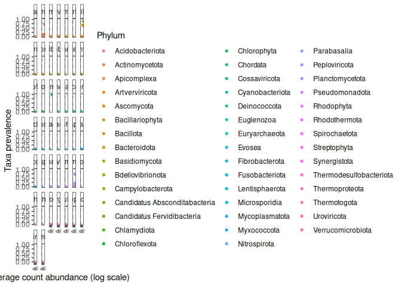<!-- -->

``` r
# Alternative plot: Create a scatter plot of the coefficient of variation (CV) of taxa in 'merged_metagenomes'
# The CV is a measure of relative variability, calculated as the standard deviation divided by the mean
p1 <- plot_taxa_cv(merged_metagenomes, plot.type = "scatter")
```

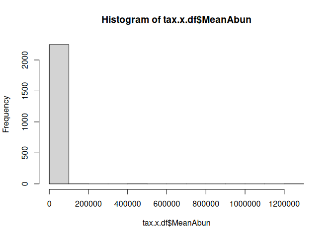<!-- -->

``` r
# Apply a log10 scale to the x-axis of the scatter plot
p1 + scale_x_log10()
```

    ## Scale for x is already present.
    ## Adding another scale for x, which will replace the existing scale.

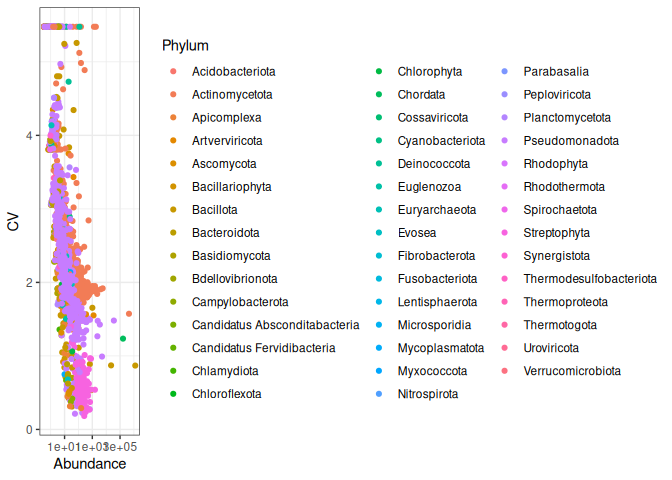<!-- -->

Each point corresponds to a different or unique taxon. The y-axis
represents the fraction of samples, these taxa are present. The low
prevalence suggests there is a low overlap across samples.

<figure>

<figcaption aria-hidden="true">prevalence</figcaption>
</figure>

**Q: Which taxa is present in all samples and with a high abundance?**

<details>
<summary>
HINT
</summary>

> Homo sapiens

</details>

#### Contaminant sequences

Samples might be contaminated with exogenous sequences. We have observed
1 contaminants Homo sapiens.

``` r
#check 
psmelt(subset_taxa(merged_metagenomes, Genus == "Trypanosoma"))
```

    ## Warning in psmelt(subset_taxa(merged_metagenomes, Genus == "Trypanosoma")): The sample variables: 
    ## Sample
    ##  have been renamed to: 
    ## sample_Sample
    ## to avoid conflicts with special phyloseq plot attribute names.

    ##     OTU   Sample Abundance sample_Sample SRA.identifier       Type Time
    ## 11 5691 T1rangAM        69      T1rangAM    SRR15276519 T._rangeli   T1
    ## 24 5691 T3rangPM        51      T3rangPM    SRR15276536 T._rangeli   T3
    ## 1  5691 T0ContAM        47      T0ContAM    SRR15276521    Control   T0
    ## 17 5691 T2rangAM        40      T2rangAM    SRR15276543 T._rangeli   T2
    ## 5  5691 T0rangAM        38      T0rangAM    SRR15276527 T._rangeli   T0
    ## 23 5691 T3rangAM        32      T3rangAM    SRR15276535 T._rangeli   T3
    ## 9  5691 T1cruzAM        29      T1cruzAM    SRR15276523   T._cruzi   T1
    ## 29 5691 T7rangAM        29      T7rangAM    SRR15276529 T._rangeli   T7
    ## 3  5691 T0cruzAM        20      T0cruzAM    SRR15276539   T._cruzi   T0
    ## 13 5691 T2ContAM        15      T2ContAM    SRR15276547    Control   T2
    ## 7  5691 T1ContAM        14      T1ContAM    SRR15276524    Control   T1
    ## 25 5691 T7ContAM        14      T7ContAM    SRR15276534    Control   T7
    ## 12 5691 T1rangPM        11      T1rangPM    SRR15276518 T._rangeli   T1
    ## 2  5691 T0ContPM         0      T0ContPM    SRR15276520    Control   T0
    ## 4  5691 T0cruzPM         0      T0cruzPM    SRR15276528   T._cruzi   T0
    ## 6  5691 T0rangPM         0      T0rangPM    SRR15276526 T._rangeli   T0
    ## 8  5691 T1ContPM         0      T1ContPM    SRR15276525    Control   T1
    ## 10 5691 T1cruzPM         0      T1cruzPM    SRR15276522   T._cruzi   T1
    ## 14 5691 T2ContPM         0      T2ContPM    SRR15276546    Control   T2
    ## 15 5691 T2cruzAM         0      T2cruzAM    SRR15276545   T._cruzi   T2
    ## 16 5691 T2cruzPM         0      T2cruzPM    SRR15276544   T._cruzi   T2
    ## 18 5691 T2rangPM         0      T2rangPM    SRR15276542 T._rangeli   T2
    ## 19 5691 T3ContAM         0      T3ContAM    SRR15276541    Control   T3
    ## 20 5691 T3ContPM         0      T3ContPM    SRR15276540    Control   T3
    ## 21 5691 T3cruzAM         0      T3cruzAM    SRR15276538   T._cruzi   T3
    ## 22 5691 T3cruzPM         0      T3cruzPM    SRR15276537   T._cruzi   T3
    ## 26 5691 T7ContPM         0      T7ContPM    SRR15276533    Control   T7
    ## 27 5691 T7cruzAM         0      T7cruzAM    SRR15276532   T._cruzi   T7
    ## 28 5691 T7cruzPM         0      T7cruzPM    SRR15276531   T._cruzi   T7
    ## 30 5691 T7rangPM         0      T7rangPM    SRR15276530 T._rangeli   T7
    ##    Number.of.days Gut     Reads   Kingdom     Phylum         Class
    ## 11              1  AM 42.786669 Eukaryota Euglenozoa Kinetoplastea
    ## 24              3  PM  8.744824 Eukaryota Euglenozoa Kinetoplastea
    ## 1               0  AM 33.104564 Eukaryota Euglenozoa Kinetoplastea
    ## 17              2  AM 25.297229 Eukaryota Euglenozoa Kinetoplastea
    ## 5               0  AM 35.555314 Eukaryota Euglenozoa Kinetoplastea
    ## 23              3  AM 21.104708 Eukaryota Euglenozoa Kinetoplastea
    ## 9               1  AM 18.341077 Eukaryota Euglenozoa Kinetoplastea
    ## 29              7  AM 12.138032 Eukaryota Euglenozoa Kinetoplastea
    ## 3               0  AM 19.604168 Eukaryota Euglenozoa Kinetoplastea
    ## 13              2  AM 15.033813 Eukaryota Euglenozoa Kinetoplastea
    ## 7               1  AM 19.498048 Eukaryota Euglenozoa Kinetoplastea
    ## 25              7  AM 18.921651 Eukaryota Euglenozoa Kinetoplastea
    ## 12              1  PM  7.701240 Eukaryota Euglenozoa Kinetoplastea
    ## 2               0  PM 12.945862 Eukaryota Euglenozoa Kinetoplastea
    ## 4               0  PM  9.351766 Eukaryota Euglenozoa Kinetoplastea
    ## 6               0  PM  8.858336 Eukaryota Euglenozoa Kinetoplastea
    ## 8               1  PM  9.575527 Eukaryota Euglenozoa Kinetoplastea
    ## 10              1  PM  9.564389 Eukaryota Euglenozoa Kinetoplastea
    ## 14              2  PM  6.211867 Eukaryota Euglenozoa Kinetoplastea
    ## 15              2  AM 15.686465 Eukaryota Euglenozoa Kinetoplastea
    ## 16              2  PM  9.968886 Eukaryota Euglenozoa Kinetoplastea
    ## 18              2  PM  6.284232 Eukaryota Euglenozoa Kinetoplastea
    ## 19              3  AM  9.339014 Eukaryota Euglenozoa Kinetoplastea
    ## 20              3  PM  6.194154 Eukaryota Euglenozoa Kinetoplastea
    ## 21              3  AM 11.656514 Eukaryota Euglenozoa Kinetoplastea
    ## 22              3  PM  9.079620 Eukaryota Euglenozoa Kinetoplastea
    ## 26              7  PM  8.173719 Eukaryota Euglenozoa Kinetoplastea
    ## 27              7  AM 13.686443 Eukaryota Euglenozoa Kinetoplastea
    ## 28              7  PM  7.324330 Eukaryota Euglenozoa Kinetoplastea
    ## 30              7  PM  6.914360 Eukaryota Euglenozoa Kinetoplastea
    ##              Order           Family       Genus Species
    ## 11 Trypanosomatida Trypanosomatidae Trypanosoma  brucei
    ## 24 Trypanosomatida Trypanosomatidae Trypanosoma  brucei
    ## 1  Trypanosomatida Trypanosomatidae Trypanosoma  brucei
    ## 17 Trypanosomatida Trypanosomatidae Trypanosoma  brucei
    ## 5  Trypanosomatida Trypanosomatidae Trypanosoma  brucei
    ## 23 Trypanosomatida Trypanosomatidae Trypanosoma  brucei
    ## 9  Trypanosomatida Trypanosomatidae Trypanosoma  brucei
    ## 29 Trypanosomatida Trypanosomatidae Trypanosoma  brucei
    ## 3  Trypanosomatida Trypanosomatidae Trypanosoma  brucei
    ## 13 Trypanosomatida Trypanosomatidae Trypanosoma  brucei
    ## 7  Trypanosomatida Trypanosomatidae Trypanosoma  brucei
    ## 25 Trypanosomatida Trypanosomatidae Trypanosoma  brucei
    ## 12 Trypanosomatida Trypanosomatidae Trypanosoma  brucei
    ## 2  Trypanosomatida Trypanosomatidae Trypanosoma  brucei
    ## 4  Trypanosomatida Trypanosomatidae Trypanosoma  brucei
    ## 6  Trypanosomatida Trypanosomatidae Trypanosoma  brucei
    ## 8  Trypanosomatida Trypanosomatidae Trypanosoma  brucei
    ## 10 Trypanosomatida Trypanosomatidae Trypanosoma  brucei
    ## 14 Trypanosomatida Trypanosomatidae Trypanosoma  brucei
    ## 15 Trypanosomatida Trypanosomatidae Trypanosoma  brucei
    ## 16 Trypanosomatida Trypanosomatidae Trypanosoma  brucei
    ## 18 Trypanosomatida Trypanosomatidae Trypanosoma  brucei
    ## 19 Trypanosomatida Trypanosomatidae Trypanosoma  brucei
    ## 20 Trypanosomatida Trypanosomatidae Trypanosoma  brucei
    ## 21 Trypanosomatida Trypanosomatidae Trypanosoma  brucei
    ## 22 Trypanosomatida Trypanosomatidae Trypanosoma  brucei
    ## 26 Trypanosomatida Trypanosomatidae Trypanosoma  brucei
    ## 27 Trypanosomatida Trypanosomatidae Trypanosoma  brucei
    ## 28 Trypanosomatida Trypanosomatidae Trypanosoma  brucei
    ## 30 Trypanosomatida Trypanosomatidae Trypanosoma  brucei

``` r
psmelt(subset_taxa(merged_metagenomes, Genus == "Homo"))
```

    ## Warning in psmelt(subset_taxa(merged_metagenomes, Genus == "Homo")): The sample variables: 
    ## Sample
    ##  have been renamed to: 
    ## sample_Sample
    ## to avoid conflicts with special phyloseq plot attribute names.

    ##     OTU   Sample Abundance sample_Sample SRA.identifier       Type Time
    ## 11 9606 T1rangAM    769548      T1rangAM    SRR15276519 T._rangeli   T1
    ## 5  9606 T0rangAM    631939      T0rangAM    SRR15276527 T._rangeli   T0
    ## 1  9606 T0ContAM    579258      T0ContAM    SRR15276521    Control   T0
    ## 17 9606 T2rangAM    440572      T2rangAM    SRR15276543 T._rangeli   T2
    ## 7  9606 T1ContAM    326725      T1ContAM    SRR15276524    Control   T1
    ## 3  9606 T0cruzAM    303760      T0cruzAM    SRR15276539   T._cruzi   T0
    ## 9  9606 T1cruzAM    275303      T1cruzAM    SRR15276523   T._cruzi   T1
    ## 13 9606 T2ContAM    223365      T2ContAM    SRR15276547    Control   T2
    ## 15 9606 T2cruzAM    210017      T2cruzAM    SRR15276545   T._cruzi   T2
    ## 23 9606 T3rangAM    194338      T3rangAM    SRR15276535 T._rangeli   T3
    ## 25 9606 T7ContAM    122128      T7ContAM    SRR15276534    Control   T7
    ## 6  9606 T0rangPM     94234      T0rangPM    SRR15276526 T._rangeli   T0
    ## 2  9606 T0ContPM     92496      T0ContPM    SRR15276520    Control   T0
    ## 19 9606 T3ContAM     88994      T3ContAM    SRR15276541    Control   T3
    ## 4  9606 T0cruzPM     72308      T0cruzPM    SRR15276528   T._cruzi   T0
    ## 12 9606 T1rangPM     53714      T1rangPM    SRR15276518 T._rangeli   T1
    ## 8  9606 T1ContPM     47604      T1ContPM    SRR15276525    Control   T1
    ## 21 9606 T3cruzAM     46753      T3cruzAM    SRR15276538   T._cruzi   T3
    ## 29 9606 T7rangAM     38913      T7rangAM    SRR15276529 T._rangeli   T7
    ## 10 9606 T1cruzPM     38585      T1cruzPM    SRR15276522   T._cruzi   T1
    ## 16 9606 T2cruzPM     34066      T2cruzPM    SRR15276544   T._cruzi   T2
    ## 26 9606 T7ContPM     33465      T7ContPM    SRR15276533    Control   T7
    ## 27 9606 T7cruzAM     27706      T7cruzAM    SRR15276532   T._cruzi   T7
    ## 14 9606 T2ContPM     25801      T2ContPM    SRR15276546    Control   T2
    ## 22 9606 T3cruzPM     25352      T3cruzPM    SRR15276537   T._cruzi   T3
    ## 18 9606 T2rangPM     24313      T2rangPM    SRR15276542 T._rangeli   T2
    ## 24 9606 T3rangPM     23743      T3rangPM    SRR15276536 T._rangeli   T3
    ## 28 9606 T7cruzPM     23088      T7cruzPM    SRR15276531   T._cruzi   T7
    ## 30 9606 T7rangPM     22440      T7rangPM    SRR15276530 T._rangeli   T7
    ## 20 9606 T3ContPM     21778      T3ContPM    SRR15276540    Control   T3
    ##    Number.of.days Gut     Reads   Kingdom   Phylum    Class    Order    Family
    ## 11              1  AM 42.786669 Eukaryota Chordata Mammalia Primates Hominidae
    ## 5               0  AM 35.555314 Eukaryota Chordata Mammalia Primates Hominidae
    ## 1               0  AM 33.104564 Eukaryota Chordata Mammalia Primates Hominidae
    ## 17              2  AM 25.297229 Eukaryota Chordata Mammalia Primates Hominidae
    ## 7               1  AM 19.498048 Eukaryota Chordata Mammalia Primates Hominidae
    ## 3               0  AM 19.604168 Eukaryota Chordata Mammalia Primates Hominidae
    ## 9               1  AM 18.341077 Eukaryota Chordata Mammalia Primates Hominidae
    ## 13              2  AM 15.033813 Eukaryota Chordata Mammalia Primates Hominidae
    ## 15              2  AM 15.686465 Eukaryota Chordata Mammalia Primates Hominidae
    ## 23              3  AM 21.104708 Eukaryota Chordata Mammalia Primates Hominidae
    ## 25              7  AM 18.921651 Eukaryota Chordata Mammalia Primates Hominidae
    ## 6               0  PM  8.858336 Eukaryota Chordata Mammalia Primates Hominidae
    ## 2               0  PM 12.945862 Eukaryota Chordata Mammalia Primates Hominidae
    ## 19              3  AM  9.339014 Eukaryota Chordata Mammalia Primates Hominidae
    ## 4               0  PM  9.351766 Eukaryota Chordata Mammalia Primates Hominidae
    ## 12              1  PM  7.701240 Eukaryota Chordata Mammalia Primates Hominidae
    ## 8               1  PM  9.575527 Eukaryota Chordata Mammalia Primates Hominidae
    ## 21              3  AM 11.656514 Eukaryota Chordata Mammalia Primates Hominidae
    ## 29              7  AM 12.138032 Eukaryota Chordata Mammalia Primates Hominidae
    ## 10              1  PM  9.564389 Eukaryota Chordata Mammalia Primates Hominidae
    ## 16              2  PM  9.968886 Eukaryota Chordata Mammalia Primates Hominidae
    ## 26              7  PM  8.173719 Eukaryota Chordata Mammalia Primates Hominidae
    ## 27              7  AM 13.686443 Eukaryota Chordata Mammalia Primates Hominidae
    ## 14              2  PM  6.211867 Eukaryota Chordata Mammalia Primates Hominidae
    ## 22              3  PM  9.079620 Eukaryota Chordata Mammalia Primates Hominidae
    ## 18              2  PM  6.284232 Eukaryota Chordata Mammalia Primates Hominidae
    ## 24              3  PM  8.744824 Eukaryota Chordata Mammalia Primates Hominidae
    ## 28              7  PM  7.324330 Eukaryota Chordata Mammalia Primates Hominidae
    ## 30              7  PM  6.914360 Eukaryota Chordata Mammalia Primates Hominidae
    ## 20              3  PM  6.194154 Eukaryota Chordata Mammalia Primates Hominidae
    ##    Genus Species
    ## 11  Homo sapiens
    ## 5   Homo sapiens
    ## 1   Homo sapiens
    ## 17  Homo sapiens
    ## 7   Homo sapiens
    ## 3   Homo sapiens
    ## 9   Homo sapiens
    ## 13  Homo sapiens
    ## 15  Homo sapiens
    ## 23  Homo sapiens
    ## 25  Homo sapiens
    ## 6   Homo sapiens
    ## 2   Homo sapiens
    ## 19  Homo sapiens
    ## 4   Homo sapiens
    ## 12  Homo sapiens
    ## 8   Homo sapiens
    ## 21  Homo sapiens
    ## 29  Homo sapiens
    ## 10  Homo sapiens
    ## 16  Homo sapiens
    ## 26  Homo sapiens
    ## 27  Homo sapiens
    ## 14  Homo sapiens
    ## 22  Homo sapiens
    ## 18  Homo sapiens
    ## 24  Homo sapiens
    ## 28  Homo sapiens
    ## 30  Homo sapiens
    ## 20  Homo sapiens

``` r
#Keep only the kingdom of interest
merged_metagenomes <- subset_taxa(merged_metagenomes, Kingdom %in% c("Archaea", "Bacteria", "Fungi", "Viruses"))
```

Now recheck that your data are clean before continuing the analysis.

**Q: Which taxa is present in all samples and with a high abundance?**

<details>
<summary>
HINT
</summary>

> head(tax_table(merged_metagenomes)) or
> plot_taxa_prevalence(merged_metagenomes, level=“Phylum”, detection =
> 10000)

</details>

### Data Normalization

Data transformations are common in (microbial) ecology (Legendre 2001)
and used to improve compatibility with assumptions related to specific
statistical methods, mitigate biases, enhance the comparability of
samples or features, or to obtain more interpretable values.

Examples include the logarithmic transformation, calculation of relative
abundances (percentages), and compositionality-aware transformations
such as the centered log-ratio transformation (clr).

Let us summarize some commonly used transformations in microbiome data
science; further details and benchmarkings available in the references:

- *relabundance* relative transformation; also known as total sum
  scaling (TSS) and compositional transformation. This converts counts
  into percentages (at the scale \[0, 1\]) that sum up to. Much of the
  currently available taxonomic abundance data from high-throughput
  assays (16S, metagenomic sequencing) is compositional by nature, even
  if the data is provided as counts (Gloor et al. 2017).

- *clr* Centered log ratio transformation (Aitchison 1986) is used to
  reduce data skewness and compositionality bias in relative abundances,
  while bringing the data to the logarithmic scale. This transformation
  is frequently applied in microbial ecology (Gloor et al. 2017).
  However, this transformation only applies to positive values. Usual
  solution is to add pseudocount, which adds another type of bias in the
  data. The robust clr transformation (‘rclr’) aims to circumvent the
  need to add a pseudocount. While the resulting values from these
  transformations are difficult interpret directly, this transformation
  may enhance comparability of relative differences between samples. It
  is part of a broader Aitchison family of transformations; the additive
  log ratio transformation (\`alr’) is also available. The robust clr
  (“rclr”) is similar to regular clr (see above) but allows data with
  zeroes and avoids the need to add pseudocount Martino et al. (2019).
  See library *compositions*.

- *pa* presence/absence transformation ignores abundances and only
  indicates whether the given feature is detected above the given
  threshold (default: 0). This simple transformation is relatively
  widely used in ecological research. It has shown good performance in
  microbiome-based classification performance (Giliberti et al. 2022,
  Karwowska2024).

- *z* Z transformation scales data to zero mean and unit variance; this
  us used to bring features (or samples) to more comparable levels in
  terms of mean and scale of the values. This can enhance visualization
  and interpretation of the data

- *log*, *log2*, *log10* Logarithmic transformations; used e.g. to
  reduce data skewness; with compositional data the clr (or rclr)
  transformation is often preferred.

- *hellinger* Hellinger transformation equals to the square root of
  relative abundances. This ecological transformation can be useful if
  we are interested in changes in relative abundances.

- *rank* Rank transformation replaces each value by its rank. Also see
  ‘rrank’ (relative rank transformation). This has use for instance in
  non-parametric statistics.

- Other available transformations include Chi square (‘chi.square’),
  Frequency transformation (‘frequency’), and Make margin sum of squares
  equal to one (‘normalize’)

The data contains read counts. We can convert these into relative
abundances and other formats. Compare abundance of a given taxonomic
group using the example data before and after the compositionality
transformation (with a cross-plot, for instance). You can also compare
the results to CLR-transformed data (see e.g. Gloor et al. 2017)

Have a look at the function *?microbiome::transform*.

``` r
microbiome::transform(merged_metagenomes, transform = "compositional")
```

    ## phyloseq-class experiment-level object
    ## otu_table()   OTU Table:         [ 2025 taxa and 30 samples ]
    ## sample_data() Sample Data:       [ 30 samples by 7 sample variables ]
    ## tax_table()   Taxonomy Table:    [ 2025 taxa by 7 taxonomic ranks ]

In order to assess the effect of the different transformations, you can
use the *clr* or the *log10* for the downstream analysis.

## 5. Microbiome composition

Microbial abundances are typically ‘compositional’ (relative) in the
current microbiome profiling data sets. This is due to technical aspects
of the data generation process (see e.g. Gloor et al., 2017).

The next example calculates relative abundances as these are usually
easier to interpret than plain counts. For some statistical models we
need to transform the data into other formats as explained in above link
(and as we will see later).

*detection*: Detection threshold for absence/presence (percentage
reads). *prevalence*: Prevalence threshold (in \[0, 1\]) (presence
accross samples).

``` r
pseq <- aggregate_rare(merged_metagenomes, level = "Genus", detection = 0.05/100, prevalence = 20/100)
pseq <- microbiome::transform(pseq, transform = "compositional")
```

**Q: what is the meaning and effect of compositional?**

<details>
<summary>
HINT
</summary>

> abundances(pseq)

</details>

#### Visualization

**Bar plot** are useful to have a broad look at the data.

``` r
# Create a plot of the taxonomic composition at the Family level
p <- plot_composition(pseq,
                      taxonomic.level = "Species", # Specify the taxonomic level for the plot
                      sample.sort = "Sample",     # Sort samples by sample identifier
                      x.label = "Sample",         # Label for the x-axis
                      group_by = "Gut") +          # Group samples by the 'Time' variable

  # Use a color palette from the Color Brewer for filling the Family groups
  scale_fill_brewer("Species", palette = "magma-viridis") +

  # Arrange the legend items in a single column
  guides(fill = guide_legend(ncol = 1)) +

  # Convert the y-axis to represent relative abundance as a percentage
  scale_y_percent() +

  # Add labels and a title to the plot
  labs(x = "Samples", y = "Relative abundance (%)",
       title = "Relative abundance data") + 

  # Apply a clean theme with a horizontal grid
  theme_ipsum(grid = "Y") +

  # Customize the theme for x-axis text and legend text
  theme(axis.text.x = element_text(angle = 90, hjust = 1), # Rotate x-axis text 90 degrees for readability
        legend.text = element_text(face = "italic"),    # Italicize the legend text
        legend.position = "none")
```

    ## Warning: Unknown palette: "magma-viridis"

``` r
# Print the plot
print(p)
```

    ## Warning in RColorBrewer::brewer.pal(n, pal): n too large, allowed maximum for palette Greens is 9
    ## Returning the palette you asked for with that many colors

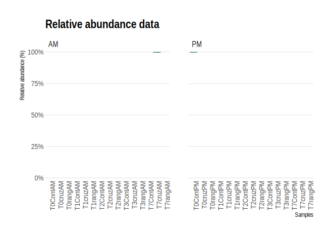<!-- -->

<figure>

<figcaption aria-hidden="true">barplot</figcaption>
</figure>

**Q: Does the profiles look similar between samples? Can you spot any
trends?**

<details>
<summary>
HINT
</summary>

> A: We see that the same one or two OTU dominates all samples but there
> is some variability between samples. We can observe some trend on the
> Entrococcus proption over time.

</details>

*If you have time you can also visualize the other taxonomic levels
(e.g. species) with the same approach. Try to come up with the code
yourself.*

``` r
# Aggregate rare taxa at the Genus level for the phyloseq object 'merged_metagenomes'
# Taxa are included if they have a detection threshold of 0.05% and a prevalence of 20%
pseq <- aggregate_rare(merged_metagenomes, level = "Phylum", detection = 0.05/100, prevalence = 20/100)

# Transform the data to compositional (relative abundance) format
pseq <- microbiome::transform(pseq, transform = "compositional")


n <- dim(tax_table(pseq))[1]
qual_col_pals = brewer.pal.info[brewer.pal.info$category == 'qual',]
col_vector = unlist(mapply(brewer.pal, qual_col_pals$maxcolors, rownames(qual_col_pals)))


# Create a plot of the taxonomic composition at the Genus level
p <- plot_composition(pseq,
                      taxonomic.level = "Phylum", # Specify the taxonomic level for the plot
                      sample.sort = "Sample",    # Sort samples by sample identifier
                      x.label = "Sample",        # Label for the x-axis
                      otu.sort = "abundance",    # Sort OTUs by their abundance
                      group_by = "Type") +       # Group samples by the 'Type' variable

  # Use a color palette from the Color Brewer for filling the Genus groups
  scale_fill_manual(values = col_vector) +

  # Arrange the legend items in a single column
  guides(fill = guide_legend(ncol = 1)) +

  # Convert the y-axis to represent relative abundance as a percentage
  scale_y_percent() +

  # Add labels and a title to the plot
  labs(x = "Samples", y = "Relative abundance (%)",
       title = "Relative abundance data") + 

  # Apply a clean theme with a horizontal grid
  theme_ipsum(grid = "Y") +

  # Customize the theme for x-axis text and legend text
  theme(axis.text.x = element_text(angle = 90, hjust = 1), # Rotate x-axis text 90 degrees for readability
        legend.text = element_text(face = "italic"))       # Italicize the legend text

# Print the plot
print(p)
```

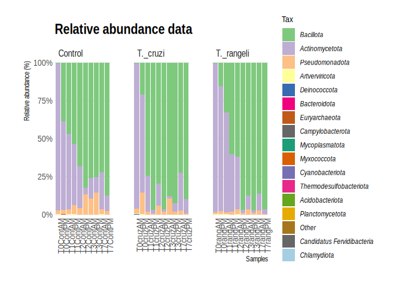<!-- -->

<figure>

<figcaption aria-hidden="true">barplot</figcaption>
</figure>

## 6 Diversity

Species diversity, in its simplest definition, is the number of species
in a particular area and their relative abundance (evenness). Once we
know the taxonomic composition of our metagenomes, we can do diversity
analyses. Here we will discuss the two most used diversity metrics, α
diversity (within one metagenome) and β (across metagenomes).

- *α* Diversity: Can be represented only as richness (, i.e., the number
  of different species in an environment), or it can be measured
  considering the abundance of the species in the environment as well
  (i.e., the number of individuals of each species inside the
  environment). To measure α-diversity, we use indexes such as
  Shannon’s, Simpson’s, Chao1, etc.


*Alpha diversity is calculated according to fish diversity in a pond.
Here, alpha diversity is represented in its simplest way: Richness.*

In the next example, we will look at the α and the β components of the
diversity of a dataset of fishes in three lakes. The most simple way to
calculate the β-diversity is to calculate the distinct species between
two lakes (sites). Let us take as an example the diversity between Lake
A and Lake B. The number of species in Lake A is 3. To this quantity, we
will subtract the number of these species that are shared with the Lake
B: 2. So the number of unique species in Lake A compared to Lake B is
(3-2) = 1. To this number, we will sum the result of the same operations
but now take Lake B as our reference site. In the end, the β diversity
between Lake A and Lake B is (3-2) + (3-2) = 2. This process can be
repeated, taking each pair of lakes as the focused sites.


*Alpha and beta diversity indexes of fishes in a pond.*

- *β* diversity mesures how different two or more communities are,
  either in their composition (richness) or in the abundance of the
  organisms that compose it (abundance).

- *Bray-Curtis dissimilarity*: The difference in richness and abundance
  across environments (samples). Weight on abundance. Measures the
  differences from 0 (equal communities) to 1 (different communities)

- *Jaccard distance*: Based on the presence/absence of species
  (diversity). It goes from 0 (same species in the community) to 1 (no
  species in common)

- *UniFrac*: Measures the phylogenetic distance; how alike the trees in
  each community are. There are two types, without weights (diversity)
  and with weights (diversity and abundance) There are different ways to
  plot and show the results of such analysis. Among others, PCA, PCoA,
  or NMDS analysis are widely used.

<figure>

<figcaption aria-hidden="true">density_plot</figcaption>
</figure>

**Q: Which of the options below is true for the alpha diversity in lakes
A, B, and beta diversity between lakes A and B, respectively?**

- 4, 3, 1
- 4, 3, 5
- 9, 7, 16

<details>
<summary>
HINT
</summary>

> 4, 3, 5 Alpha diversity in this case, is the sum of different species.
> Lake A has 4 different species and lake B has 3 different species.
> Beta diversity refers to the difference between lake A and lake B. If
> we use the formula in Figure 2 we can see that to calculate beta
> diversity, we have to detect the number of species and the number of
> shared species in both lakes. There is only one shared species, so we
> have to subtract the number of shared species to the total species and
> sum the result. In this case, in lake A, we have 4 different species
> and one shared species with lake B (4-1)=3, and in lake B we have
> three species and one shared species with lake A (3-1)=2. If we add
> 3+2, the result is 5.

</details>

### Alpha diversity

A comprehensive list of global indicators of the ecosystem state can be
obtained as follows. This includes various measures of richness,
evenness, diversity, dominance, and rarity with default parameters. See
the individual functions for more options regarding parameter tuning.

``` r
# Aggregate rare taxa at the Species level for the phyloseq object 'merged_metagenomes'
# Taxa are included if they have a detection threshold of 0.05% and a prevalence of 20%
pseq <- aggregate_rare(merged_metagenomes, level = "Species", detection = 0.05/100, prevalence = 20/100)

# Calculate the Shannon diversity index for the aggregated phyloseq object 'pseq'
# The Shannon index measures the diversity within a sample, considering both richness and evenness
tab <- microbiome::alpha(pseq, index = 'shannon')
```

    ## Observed richness

    ## Other forms of richness

    ## Diversity

    ## Evenness

    ## Dominance

    ## Rarity

``` r
# Display the first few rows of the calculated Shannon diversity index table
head(tab)
```

    ##          diversity_shannon
    ## T1rangPM         1.0597104
    ## T1rangAM         0.8341934
    ## T0ContPM         3.3703144
    ## T0ContAM         0.2441067
    ## T1cruzPM         0.3210316
    ## T1cruzAM         0.7733807

This returns observed richness with given detection threshold(s).

``` r
# Calculate the richness of the phyloseq object 'pseq' with a detection threshold of 1000
# Richness is a measure of the number of different taxa present in a sample
tab <- richness(pseq, detection = 1000)

# Display the first few rows of the calculated richness table
head(tab)
```

    ##          1000 chao1
    ## T1rangPM    4   192
    ## T1rangAM   11   248
    ## T0ContPM   93   867
    ## T0ContAM   12   167
    ## T1cruzPM    5   312
    ## T1cruzAM   10   216

``` r
p.shannon <- boxplot_alpha(pseq, 
                           index = "shannon",
                           x_var = "Type",
                          fill.colors = c(Control="cyan4", T._cruzi="deeppink4",T._rangeli="darkorange1" ))
p.shannon
```

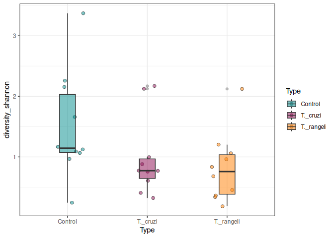<!-- -->

<figure>

<figcaption aria-hidden="true">shanon</figcaption>
</figure>

Alternative:

``` r
# get the metadata out as seprate object
hmp.meta <- meta(pseq)

# Add the rownames as a new colum for easy integration later.
hmp.meta$sam_name <- (hmp.meta$Type)

hmp.div <- microbiome::alpha(pseq)
```

    ## Observed richness

    ## Other forms of richness

    ## Diversity

    ## Evenness

    ## Dominance

    ## Rarity

``` r
# Add the rownames to diversity table
hmp.div$Sample <- rownames(hmp.div)

# merge these two data frames into one
div.df <- merge(hmp.div,hmp.meta, by = "Sample")

# check the tables
colnames(div.df)
```

    ##  [1] "Sample"                     "observed"                  
    ##  [3] "chao1"                      "diversity_inverse_simpson" 
    ##  [5] "diversity_gini_simpson"     "diversity_shannon"         
    ##  [7] "diversity_fisher"           "diversity_coverage"        
    ##  [9] "evenness_camargo"           "evenness_pielou"           
    ## [11] "evenness_simpson"           "evenness_evar"             
    ## [13] "evenness_bulla"             "dominance_dbp"             
    ## [15] "dominance_dmn"              "dominance_absolute"        
    ## [17] "dominance_relative"         "dominance_simpson"         
    ## [19] "dominance_core_abundance"   "dominance_gini"            
    ## [21] "rarity_log_modulo_skewness" "rarity_low_abundance"      
    ## [23] "rarity_rare_abundance"      "SRA.identifier"            
    ## [25] "Type"                       "Time"                      
    ## [27] "Number.of.days"             "Gut"                       
    ## [29] "Reads"                      "sam_name"

``` r
div.df2 <- div.df[, c("sam_name", "diversity_inverse_simpson", "diversity_gini_simpson", "diversity_shannon", "diversity_fisher", "chao1")]

# the names are not pretty. we can replace them

colnames(div.df2) <- c("Type", "Inverse Simpson", "Gini-Simpson", "Shannon", "Fisher", "Chao1")

# check
colnames(div.df2)
```

    ## [1] "Type"            "Inverse Simpson" "Gini-Simpson"    "Shannon"        
    ## [5] "Fisher"          "Chao1"

``` r
div_df_melt <- reshape2::melt(div.df2)
```

    ## Using Type as id variables

``` r
## Using Location as id variables

head(div_df_melt)
```

    ##         Type        variable    value
    ## 1    Control Inverse Simpson 1.070379
    ## 2    Control Inverse Simpson 5.362513
    ## 3   T._cruzi Inverse Simpson 1.281559
    ## 4   T._cruzi Inverse Simpson 2.928150
    ## 5 T._rangeli Inverse Simpson 1.047398
    ## 6 T._rangeli Inverse Simpson 2.364450

``` r
library(ggpubr)
# Now use this data frame to plot 
p <- ggboxplot(div_df_melt, x = "Type", y = "value",
               fill = "Type", 
               palette = "jco", 
               legend= "right",
               facet.by = "variable", 
               scales = "free")

p <- p + rotate_x_text() 
# we will remove the x axis lables

p <- p + rremove("x.text")
p
```

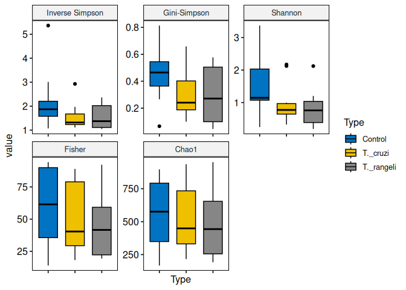<!-- -->


Each of these metrics can give an insight into the distribution of the
OTUs inside our samples. For example, the Chao1 diversity index gives
more weight to singletons and doubletons observed in our samples, while
Shannon is an entropy index remarking the impossibility of taking two
reads out of the metagenome “bag” and that these two will belong to the
same OTU.

**Q: What do you observe?**

### Investigate the top factors

Show coefficients for the top taxa separating the groups

``` r
pseq <- aggregate_rare(merged_metagenomes, level = "Genus", detection = 0.1/100, prevalence = 50/100)
pseq <- microbiome::transform(pseq, transform = "compositional")
abundances(pseq)
```

    ##                              T1rangPM     T1rangAM     T0ContPM     T0ContAM
    ## Achromobacter            0.000000e+00 2.798887e-05 1.682064e-04 0.000000e+00
    ## Actinoalloteichus        0.000000e+00 0.000000e+00 2.710435e-04 0.000000e+00
    ## Actinomadura             0.000000e+00 0.000000e+00 1.155124e-03 0.000000e+00
    ## Actinomyces              0.000000e+00 0.000000e+00 1.033154e-03 0.000000e+00
    ## Actinoplanes             0.000000e+00 0.000000e+00 7.310204e-04 0.000000e+00
    ## Actinopolyspora          0.000000e+00 0.000000e+00 1.721924e-04 0.000000e+00
    ## Aeromicrobium            0.000000e+00 0.000000e+00 1.638219e-03 0.000000e+00
    ## Agrobacterium            1.387598e-04 8.221731e-05 9.885117e-05 3.033453e-04
    ## Agrococcus               0.000000e+00 5.597774e-05 2.048770e-04 1.001874e-04
    ## Agromyces                0.000000e+00 0.000000e+00 1.160704e-03 0.000000e+00
    ## Alloactinosynnema        4.188975e-05 0.000000e+00 4.551937e-04 0.000000e+00
    ## Allokutzneria            0.000000e+00 0.000000e+00 2.160376e-04 0.000000e+00
    ## Amycolatopsis            2.225393e-04 3.113762e-05 5.915924e-03 0.000000e+00
    ## Apilactobacillus         1.099606e-04 0.000000e+00 2.072686e-05 7.885122e-06
    ## Arsenophonus             9.687005e-05 3.568581e-05 1.418993e-04 9.091082e-05
    ## Arthrobacter             8.377950e-05 6.997218e-06 1.777727e-03 0.000000e+00
    ## Asticcacaulis            0.000000e+00 0.000000e+00 1.195780e-05 0.000000e+00
    ## Atlantibacter            0.000000e+00 0.000000e+00 1.434936e-05 0.000000e+00
    ## Bacillus                 1.727952e-04 8.886466e-05 4.464247e-05 6.354481e-05
    ## Betaretrovirus           0.000000e+00 4.023400e-05 0.000000e+00 2.597452e-05
    ## Blautia                  5.236219e-05 3.078776e-05 4.065653e-05 0.000000e+00
    ## Bordetella               0.000000e+00 0.000000e+00 2.447364e-04 0.000000e+00
    ## Bosea                    0.000000e+00 1.329471e-05 2.168348e-04 1.530641e-05
    ## Brenneria                1.256693e-04 7.382065e-05 1.546543e-04 1.577024e-04
    ## Brevibacillus            0.000000e+00 5.527802e-05 7.334119e-05 6.632779e-05
    ## Brevibacterium           0.000000e+00 0.000000e+00 1.803237e-03 0.000000e+00
    ## Buchnera                 0.000000e+00 1.119555e-05 9.566243e-06 7.885122e-06
    ## Burkholderia             3.324999e-04 7.696939e-05 5.165771e-04 3.089113e-04
    ## Candidatus Fervidibacter 3.403542e-05 0.000000e+00 2.391561e-05 0.000000e+00
    ## Carnobacterium           0.000000e+00 4.548191e-06 0.000000e+00 0.000000e+00
    ## Catellatospora           0.000000e+00 0.000000e+00 3.459791e-04 0.000000e+00
    ## Cedecea                  0.000000e+00 6.647357e-06 3.507622e-05 1.855323e-05
    ## Cellulomonas             1.021063e-04 4.548191e-06 3.101057e-03 0.000000e+00
    ## Cellulosimicrobium       0.000000e+00 0.000000e+00 5.229546e-04 0.000000e+00
    ## Chimaeribacter           0.000000e+00 0.000000e+00 1.195780e-05 1.066811e-05
    ## Citrobacter              0.000000e+00 2.344068e-05 0.000000e+00 6.493630e-05
    ## Clavibacter              2.618109e-05 0.000000e+00 5.086052e-04 0.000000e+00
    ## Clostridium              1.806496e-04 5.107969e-05 6.457214e-05 7.421291e-05
    ## Corynebacterium          2.408661e-04 4.758108e-05 8.196676e-03 3.571496e-05
    ## Couchioplanes            0.000000e+00 0.000000e+00 2.519111e-04 0.000000e+00
    ## Crossiella               0.000000e+00 6.647357e-06 3.635172e-04 0.000000e+00
    ## Cupriavidus              0.000000e+00 9.446244e-06 3.340213e-04 6.493630e-06
    ## Curtobacterium           3.553115e-01 6.529555e-01 2.034150e-01 9.664915e-01
    ## Cutibacterium            7.068896e-05 2.518998e-05 3.268466e-05 7.421291e-05
    ## Dactylosporangium        0.000000e+00 0.000000e+00 2.558970e-04 0.000000e+00
    ## Dermacoccus              0.000000e+00 0.000000e+00 2.798126e-04 0.000000e+00
    ## Desulfobacter            0.000000e+00 4.548191e-06 1.339274e-04 0.000000e+00
    ## Diaminobutyricimonas     0.000000e+00 0.000000e+00 2.168348e-04 0.000000e+00
    ## Dickeya                  0.000000e+00 6.647357e-05 1.881361e-04 1.980557e-04
    ## Dietzia                  1.178149e-04 4.198331e-05 4.328725e-03 0.000000e+00
    ## Duffyella                0.000000e+00 1.889249e-05 2.710435e-05 4.684690e-05
    ## Edwardsiella             0.000000e+00 0.000000e+00 1.674092e-05 0.000000e+00
    ## Enterobacter             0.000000e+00 1.325973e-04 2.686520e-04 2.922133e-04
    ## Enterococcus             6.014033e-01 3.244263e-01 3.868796e-01 2.296426e-03
    ## Epidermidibacterium      0.000000e+00 0.000000e+00 1.753811e-04 0.000000e+00
    ## Erwinia                  3.796259e-04 2.585472e-04 7.118879e-04 5.779331e-04
    ## Escherichia              5.550392e-04 2.120157e-04 4.894727e-04 5.027925e-04
    ## Ezakiella                4.974408e-05 1.497405e-04 2.869873e-05 3.218985e-04
    ## Friedmanniella           0.000000e+00 0.000000e+00 1.666121e-04 0.000000e+00
    ## Frondihabitans           0.000000e+00 0.000000e+00 1.753811e-04 0.000000e+00
    ## Gammaretrovirus          9.111021e-04 3.593771e-03 6.226030e-04 3.663335e-03
    ## Georgenia                0.000000e+00 0.000000e+00 7.262373e-04 0.000000e+00
    ## Gibbsiella               0.000000e+00 6.297496e-06 0.000000e+00 1.530641e-05
    ## Gordonia                 1.714862e-03 2.001204e-04 2.856560e-02 4.499158e-05
    ## Hafnia                   0.000000e+00 0.000000e+00 0.000000e+00 0.000000e+00
    ## Halarcobacter            1.099606e-04 5.947635e-06 3.348185e-05 0.000000e+00
    ## Halomonas                2.356299e-04 4.264804e-04 3.451819e-04 5.250564e-04
    ## Haploplasma              4.974408e-05 0.000000e+00 1.913249e-05 4.638307e-06
    ## Helicobacter             1.282874e-04 1.854263e-05 2.630717e-05 1.066811e-05
    ## Hoyosella                3.927164e-05 0.000000e+00 5.349124e-04 0.000000e+00
    ## Isoptericola             0.000000e+00 0.000000e+00 7.413838e-04 0.000000e+00
    ## Jiangella                0.000000e+00 5.247913e-06 3.858385e-04 0.000000e+00
    ## Jonesia                  0.000000e+00 0.000000e+00 1.219696e-04 0.000000e+00
    ## Kibdelosporangium        3.141731e-05 0.000000e+00 5.875267e-04 0.000000e+00
    ## Klebsiella               2.539566e-03 4.957529e-03 1.793670e-03 7.580385e-03
    ## Kosakonia                0.000000e+00 2.239110e-05 3.029310e-05 3.293198e-05
    ## Kribbella                0.000000e+00 0.000000e+00 2.487223e-04 0.000000e+00
    ## Kutzneria                0.000000e+00 0.000000e+00 5.373040e-04 0.000000e+00
    ## Kytococcus               2.879920e-05 4.198331e-06 2.965535e-04 0.000000e+00
    ## Leclercia                0.000000e+00 1.889249e-05 0.000000e+00 1.577024e-05
    ## Leifsonia                0.000000e+00 0.000000e+00 2.391561e-04 0.000000e+00
    ## Lentzea                  7.330706e-05 0.000000e+00 6.903638e-04 0.000000e+00
    ## Leucobacter              2.618109e-05 3.498609e-06 5.572336e-04 0.000000e+00
    ## Listeria                 3.639172e-04 1.423934e-04 1.785699e-04 7.421291e-06
    ## Loigolactobacillus       0.000000e+00 6.997218e-06 0.000000e+00 0.000000e+00
    ## Luteibacter              0.000000e+00 0.000000e+00 7.892150e-05 5.102138e-06
    ## Luteimicrobium           0.000000e+00 0.000000e+00 2.431420e-04 0.000000e+00
    ## Luteipulveratus          0.000000e+00 0.000000e+00 2.503167e-04 0.000000e+00
    ## Lysobacter               0.000000e+00 0.000000e+00 2.535054e-04 0.000000e+00
    ## Marinilactibacillus      0.000000e+00 0.000000e+00 0.000000e+00 0.000000e+00
    ## Mesomycoplasma           6.807085e-05 1.504402e-04 3.826497e-05 2.156813e-04
    ## Mesorhizobium            0.000000e+00 0.000000e+00 2.279954e-04 0.000000e+00
    ## Microbacterium           0.000000e+00 7.137162e-05 5.086850e-03 0.000000e+00
    ## Microbulbifer            0.000000e+00 0.000000e+00 2.471279e-05 0.000000e+00
    ## Microlunatus             0.000000e+00 0.000000e+00 5.133884e-04 0.000000e+00
    ## Microterricola           0.000000e+00 0.000000e+00 2.064714e-04 0.000000e+00
    ## Mixta                    0.000000e+00 0.000000e+00 0.000000e+00 8.812784e-06
    ## Modestobacter            0.000000e+00 0.000000e+00 2.957563e-04 0.000000e+00
    ## Morganella               0.000000e+00 6.997218e-06 8.769056e-06 9.740445e-06
    ## Musicola                 0.000000e+00 6.647357e-06 2.072686e-05 1.855323e-05
    ## Mycobacterium            7.330706e-04 3.218720e-05 1.904639e-02 0.000000e+00
    ## Mycobacteroides          1.361417e-04 1.014597e-05 1.764972e-03 0.000000e+00
    ## Mycolicibacillus         0.000000e+00 8.746522e-06 1.004455e-03 0.000000e+00
    ## Mycolicibacter           0.000000e+00 0.000000e+00 2.279954e-03 0.000000e+00
    ## Mycolicibacterium        1.395452e-03 1.913739e-04 2.814867e-02 0.000000e+00
    ## Naasia                   0.000000e+00 0.000000e+00 1.594374e-04 0.000000e+00
    ## Nakamurella              0.000000e+00 0.000000e+00 6.927554e-04 0.000000e+00
    ## Nissabacter              0.000000e+00 0.000000e+00 0.000000e+00 0.000000e+00
    ## Nocardia                 1.777696e-03 2.011700e-04 2.497108e-02 2.875750e-05
    ## Nocardioides             0.000000e+00 1.119555e-05 4.579839e-03 0.000000e+00
    ## Nocardiopsis             0.000000e+00 0.000000e+00 4.272922e-04 0.000000e+00
    ## Ornithinimicrobium       0.000000e+00 0.000000e+00 4.225091e-04 0.000000e+00
    ## Other                    2.591928e-04 1.950125e-03 2.091898e-02 6.591034e-04
    ## Pantoea                  1.597047e-04 1.119555e-04 2.064714e-04 1.975919e-04
    ## Paraburkholderia         0.000000e+00 0.000000e+00 4.368584e-04 0.000000e+00
    ## Pectobacterium           3.246456e-04 1.675834e-04 3.922159e-04 3.543667e-04
    ## Phytohabitans            0.000000e+00 0.000000e+00 2.271983e-04 0.000000e+00
    ## Piscinibacter            0.000000e+00 0.000000e+00 2.256039e-04 0.000000e+00
    ## Pragia                   0.000000e+00 4.548191e-06 0.000000e+00 5.102138e-06
    ## Prauserella              0.000000e+00 0.000000e+00 4.097541e-04 0.000000e+00
    ## Prescottella             2.285610e-03 2.197126e-04 2.970478e-02 1.034342e-04
    ## Protaetiibacter          0.000000e+00 0.000000e+00 3.021338e-04 0.000000e+00
    ## Proteus                  0.000000e+00 7.696939e-06 0.000000e+00 2.272770e-05
    ## Providencia              0.000000e+00 1.364457e-05 0.000000e+00 2.504686e-05
    ## Pseudocitrobacter        0.000000e+00 4.198331e-06 1.275499e-05 8.812784e-06
    ## Pseudomonas              0.000000e+00 5.982621e-05 6.042677e-04 1.456428e-04
    ## Pseudonocardia           0.000000e+00 0.000000e+00 1.933178e-03 0.000000e+00
    ## Psychrobacter            6.545274e-05 0.000000e+00 2.471279e-05 0.000000e+00
    ## Rahnella                 0.000000e+00 0.000000e+00 1.833530e-05 9.740445e-06
    ## Ralstonia                0.000000e+00 1.819277e-05 2.080658e-04 1.623407e-05
    ## Rathayibacter            0.000000e+00 0.000000e+00 5.444786e-04 0.000000e+00
    ## Rhodococcus              9.647733e-03 1.060078e-03 1.382306e-01 4.216221e-04
    ## Richelia                 7.854328e-05 0.000000e+00 1.514655e-05 0.000000e+00
    ## Rouxiella                0.000000e+00 3.848470e-06 0.000000e+00 9.276614e-06
    ## Saccharomonospora        0.000000e+00 0.000000e+00 1.513061e-03 0.000000e+00
    ## Saccharopolyspora        5.498030e-05 1.014597e-05 1.566472e-03 0.000000e+00
    ## Saccharothrix            5.236219e-05 0.000000e+00 3.946075e-04 0.000000e+00
    ## Salinibacterium          0.000000e+00 3.498609e-06 4.607740e-04 0.000000e+00
    ## Salinispora              0.000000e+00 0.000000e+00 3.372101e-04 0.000000e+00
    ## Salisediminibacterium    3.141731e-05 0.000000e+00 1.674092e-05 4.638307e-06
    ## Salmonella               2.382480e-04 2.064179e-04 1.356015e-03 1.408190e-03
    ## Sanguibacter             0.000000e+00 0.000000e+00 3.962019e-04 0.000000e+00
    ## Schleiferilactobacillus  0.000000e+00 9.096383e-06 1.195780e-05 0.000000e+00
    ## Serratia                 0.000000e+00 6.927245e-05 1.594374e-04 1.419322e-04
    ## Shewanella               0.000000e+00 7.661953e-05 2.550998e-05 9.879594e-05
    ## Siccibacter              0.000000e+00 4.548191e-06 1.275499e-05 1.113194e-05
    ## Sinomonas                4.188975e-05 4.898052e-06 3.898244e-04 0.000000e+00
    ## Sodalis                  1.282874e-04 8.046800e-05 1.953108e-04 1.563110e-04
    ## Sphingobacterium         0.000000e+00 0.000000e+00 1.195780e-05 0.000000e+00
    ## Sphingomonas             1.178149e-04 1.994207e-05 3.212663e-04 3.849795e-05
    ## Staphylococcus           7.618699e-04 2.006802e-03 4.049709e-04 2.637805e-03
    ## Streptomyces             6.990352e-04 1.563878e-04 1.911415e-02 8.209804e-05
    ## Streptosporangium        3.403542e-05 0.000000e+00 3.651116e-04 0.000000e+00
    ## Symbiopectobacterium     6.773049e-03 3.594821e-03 8.887837e-03 8.064161e-03
    ## Tomitella                2.251574e-04 3.043790e-05 2.843566e-03 1.530641e-05
    ## Tsukamurella             2.513385e-04 3.323678e-05 4.704200e-03 0.000000e+00
    ## Turicibacter             0.000000e+00 0.000000e+00 2.949591e-05 0.000000e+00
    ## Umezawaea                8.901572e-05 7.696939e-06 7.063076e-04 0.000000e+00
    ## Variovorax               4.450786e-05 0.000000e+00 3.770694e-04 0.000000e+00
    ## Vibrio                   2.487204e-04 4.065383e-04 1.937164e-04 4.081710e-04
    ## Winslowiella             0.000000e+00 0.000000e+00 1.195780e-05 0.000000e+00
    ## Wolbachia                7.176238e-03 4.019901e-04 2.359673e-03 4.489881e-04
    ## Xanthomonas              0.000000e+00 5.492816e-05 3.268466e-04 1.173492e-04
    ## Xenorhabdus              0.000000e+00 0.000000e+00 0.000000e+00 6.957461e-06
    ## Yersinia                 0.000000e+00 2.204124e-05 4.703403e-05 3.339581e-05
    ## Yinghuangia              0.000000e+00 0.000000e+00 1.538571e-04 0.000000e+00
    ## Zunongwangia             0.000000e+00 0.000000e+00 1.913249e-05 0.000000e+00
    ##                              T1cruzPM     T1cruzAM     T1ContAM     T1ContPM
    ## Achromobacter            0.000000e+00 0.000000e+00 0.000000e+00 1.157209e-04
    ## Actinoalloteichus        0.000000e+00 1.292956e-05 1.213208e-05 1.207523e-04
    ## Actinomadura             0.000000e+00 0.000000e+00 5.777181e-05 4.704308e-04
    ## Actinomyces              0.000000e+00 0.000000e+00 3.986255e-05 3.521942e-04
    ## Actinoplanes             0.000000e+00 0.000000e+00 1.213208e-05 2.188635e-04
    ## Actinopolyspora          4.730660e-06 0.000000e+00 8.088053e-06 9.307989e-05
    ## Aeromicrobium            0.000000e+00 0.000000e+00 4.275114e-05 7.572175e-04
    ## Agrobacterium            3.096432e-05 3.722146e-05 8.376913e-05 1.081739e-04
    ## Agrococcus               0.000000e+00 2.154927e-05 6.585986e-05 1.132053e-04
    ## Agromyces                1.204168e-05 0.000000e+00 3.755168e-05 3.848979e-04
    ## Alloactinosynnema        7.741080e-06 0.000000e+00 1.559839e-05 1.584874e-04
    ## Allokutzneria            0.000000e+00 0.000000e+00 1.213208e-05 1.006269e-04
    ## Amycolatopsis            5.590780e-05 0.000000e+00 2.045122e-04 2.420077e-03
    ## Apilactobacillus         5.590780e-06 0.000000e+00 0.000000e+00 7.295451e-05
    ## Arsenophonus             3.827534e-05 1.038283e-04 1.958464e-04 3.999919e-04
    ## Arthrobacter             9.461320e-06 0.000000e+00 6.585986e-05 7.823742e-04
    ## Asticcacaulis            0.000000e+00 7.052487e-06 7.510335e-06 0.000000e+00
    ## Atlantibacter            5.590780e-06 9.403316e-06 1.675383e-05 0.000000e+00
    ## Bacillus                 5.031702e-05 1.998205e-05 4.506201e-05 1.433933e-04
    ## Betaretrovirus           0.000000e+00 2.154927e-05 4.506201e-05 0.000000e+00
    ## Blautia                  1.019242e-04 6.386419e-05 4.159570e-05 6.037614e-05
    ## Bordetella               0.000000e+00 0.000000e+00 0.000000e+00 8.050152e-05
    ## Bosea                    0.000000e+00 0.000000e+00 1.733154e-05 7.547018e-05
    ## Brenneria                6.579918e-05 2.346911e-04 3.645401e-04 6.012458e-04
    ## Brevibacillus            0.000000e+00 1.723941e-05 3.177450e-05 5.534480e-05
    ## Brevibacterium           5.590780e-06 0.000000e+00 5.777181e-05 6.792316e-04
    ## Buchnera                 5.590780e-06 4.701658e-06 5.777181e-06 0.000000e+00
    ## Burkholderia             3.870540e-05 2.938536e-05 9.070174e-05 2.616300e-04
    ## Candidatus Fervidibacter 1.032144e-05 5.877073e-06 0.000000e+00 5.786047e-05
    ## Carnobacterium           1.204168e-05 1.332137e-05 0.000000e+00 0.000000e+00
    ## Catellatospora           6.020840e-06 0.000000e+00 1.444295e-05 1.282993e-04
    ## Cedecea                  1.462204e-05 3.056078e-05 4.332886e-05 4.779778e-05
    ## Cellulomonas             2.924408e-05 0.000000e+00 1.317197e-04 1.270415e-03
    ## Cellulosimicrobium       0.000000e+00 0.000000e+00 1.790926e-05 2.213792e-04
    ## Chimaeribacter           0.000000e+00 7.836097e-06 2.137557e-05 3.521942e-05
    ## Citrobacter              1.763246e-05 7.953639e-05 1.432741e-04 1.308150e-04
    ## Clavibacter              1.032144e-05 0.000000e+00 1.617611e-05 2.113165e-04
    ## Clostridium              3.440480e-05 1.606400e-05 4.217342e-05 2.012538e-04
    ## Corynebacterium          6.837954e-05 1.371317e-05 2.801933e-04 3.539551e-03
    ## Couchioplanes            5.590780e-06 0.000000e+00 0.000000e+00 1.333306e-04
    ## Crossiella               6.020840e-06 0.000000e+00 1.559839e-05 1.081739e-04
    ## Cupriavidus              0.000000e+00 7.836097e-06 2.195329e-05 2.037695e-04
    ## Curtobacterium           1.914154e-02 2.363496e-01 4.791658e-01 2.436655e-01
    ## Cutibacterium            2.107294e-05 7.444292e-06 1.270980e-05 0.000000e+00
    ## Dactylosporangium        0.000000e+00 0.000000e+00 1.039893e-05 1.433933e-04
    ## Dermacoccus              5.590780e-06 0.000000e+00 1.386523e-05 1.106896e-04
    ## Desulfobacter            0.000000e+00 0.000000e+00 1.617611e-05 5.282913e-05
    ## Diaminobutyricimonas     0.000000e+00 0.000000e+00 7.510335e-06 1.056583e-04
    ## Dickeya                  7.095990e-05 2.476207e-04 4.465761e-04 7.899212e-04
    ## Dietzia                  4.214588e-05 0.000000e+00 2.085562e-04 1.906880e-03
    ## Duffyella                1.376192e-05 4.662478e-05 7.105933e-05 9.811123e-05
    ## Edwardsiella             0.000000e+00 1.332137e-05 2.599731e-05 0.000000e+00
    ## Enterobacter             1.027843e-04 3.502735e-04 6.198915e-04 8.175936e-04
    ## Enterococcus             9.671094e-01 7.418731e-01 4.671313e-01 5.331767e-01
    ## Epidermidibacterium      0.000000e+00 0.000000e+00 8.665772e-06 9.307989e-05
    ## Erwinia                  2.640568e-04 7.495227e-04 1.309687e-03 2.047758e-03
    ## Escherichia              2.730881e-04 5.022938e-04 1.093043e-03 2.955915e-03
    ## Ezakiella                4.300600e-06 3.839688e-05 7.337020e-05 0.000000e+00
    ## Friedmanniella           0.000000e+00 0.000000e+00 7.510335e-06 8.804854e-05
    ## Frondihabitans           0.000000e+00 0.000000e+00 9.243490e-06 7.547018e-05
    ## Gammaretrovirus          4.730660e-05 1.316464e-03 2.443170e-03 5.635107e-04
    ## Georgenia                7.311020e-06 0.000000e+00 1.733154e-05 2.968494e-04
    ## Gibbsiella               0.000000e+00 1.057873e-05 1.675383e-05 0.000000e+00
    ## Gordonia                 4.429618e-04 2.194107e-05 1.314886e-03 1.252302e-02
    ## Hafnia                   0.000000e+00 1.449678e-05 2.022013e-05 5.031345e-05
    ## Halarcobacter            1.591222e-05 9.011512e-06 1.097664e-05 7.295451e-05
    ## Halomonas                9.891380e-06 1.688679e-04 3.448977e-04 2.062852e-04
    ## Haploplasma              4.300600e-06 4.309853e-06 0.000000e+00 4.025076e-05
    ## Helicobacter             1.290180e-05 1.371317e-05 1.328752e-05 1.710657e-04
    ## Hoyosella                1.419198e-05 0.000000e+00 2.195329e-05 2.817553e-04
    ## Isoptericola             5.590780e-06 0.000000e+00 2.888591e-05 2.641456e-04
    ## Jiangella                6.880960e-06 0.000000e+00 2.253101e-05 7.043883e-05
    ## Jonesia                  0.000000e+00 0.000000e+00 9.243490e-06 4.276643e-05
    ## Kibdelosporangium        6.880960e-06 0.000000e+00 2.599731e-05 2.616300e-04
    ## Klebsiella               3.900644e-04 2.679162e-03 5.172310e-03 4.035139e-03
    ## Kosakonia                1.376192e-05 7.914458e-05 1.455850e-04 1.635187e-04
    ## Kribbella                5.590780e-06 0.000000e+00 0.000000e+00 1.232680e-04
    ## Kutzneria                0.000000e+00 0.000000e+00 1.502067e-05 1.534560e-04
    ## Kytococcus               5.590780e-06 0.000000e+00 8.088053e-06 8.050152e-05
    ## Leclercia                0.000000e+00 1.684761e-05 1.444295e-05 0.000000e+00
    ## Leifsonia                4.730660e-06 0.000000e+00 2.022013e-05 5.031345e-05
    ## Lentzea                  7.741080e-06 0.000000e+00 2.195329e-05 2.918180e-04
    ## Leucobacter              0.000000e+00 0.000000e+00 1.039893e-05 2.138322e-04
    ## Listeria                 5.917625e-04 3.557588e-04 2.235769e-04 2.490516e-04
    ## Loigolactobacillus       1.075150e-05 1.253776e-05 0.000000e+00 0.000000e+00
    ## Luteibacter              0.000000e+00 0.000000e+00 6.354899e-06 0.000000e+00
    ## Luteimicrobium           0.000000e+00 0.000000e+00 1.155436e-05 1.157209e-04
    ## Luteipulveratus          7.311020e-06 0.000000e+00 9.243490e-06 6.540749e-05
    ## Lysobacter               0.000000e+00 0.000000e+00 9.821208e-06 7.547018e-05
    ## Marinilactibacillus      1.118156e-05 7.444292e-06 0.000000e+00 0.000000e+00
    ## Mesomycoplasma           0.000000e+00 5.602809e-05 1.057224e-04 6.037614e-05
    ## Mesorhizobium            0.000000e+00 0.000000e+00 0.000000e+00 1.006269e-04
    ## Microbacterium           4.085570e-05 0.000000e+00 1.721600e-04 2.030148e-03
    ## Microbulbifer            1.075150e-05 0.000000e+00 0.000000e+00 4.779778e-05
    ## Microlunatus             4.730660e-06 0.000000e+00 6.932617e-06 2.088008e-04
    ## Microterricola           0.000000e+00 0.000000e+00 1.502067e-05 8.804854e-05
    ## Mixta                    0.000000e+00 1.959024e-05 2.310872e-05 0.000000e+00
    ## Modestobacter            0.000000e+00 0.000000e+00 0.000000e+00 4.528211e-05
    ## Morganella               6.450900e-06 1.449678e-05 3.639624e-05 4.276643e-05
    ## Musicola                 6.450900e-06 1.998205e-05 3.061906e-05 6.540749e-05
    ## Mycobacterium            2.133098e-04 0.000000e+00 6.256687e-04 7.290419e-03
    ## Mycobacteroides          1.247174e-05 0.000000e+00 8.030282e-05 7.018727e-04
    ## Mycolicibacillus         1.548216e-05 0.000000e+00 5.834953e-05 4.528211e-04
    ## Mycolicibacter           2.193306e-05 0.000000e+00 8.088053e-05 8.679071e-04
    ## Mycolicibacterium        3.788829e-04 3.722146e-05 1.281956e-03 1.211296e-02
    ## Naasia                   0.000000e+00 0.000000e+00 5.777181e-06 8.301720e-05
    ## Nakamurella              5.160720e-06 0.000000e+00 1.270980e-05 2.012538e-04
    ## Nissabacter              6.880960e-06 5.877073e-06 1.444295e-05 4.025076e-05
    ## Nocardia                 4.055466e-04 1.723941e-05 1.069934e-03 1.076959e-02
    ## Nocardioides             3.956552e-05 0.000000e+00 1.276757e-04 1.705626e-03
    ## Nocardiopsis             0.000000e+00 0.000000e+00 1.328752e-05 1.584874e-04
    ## Ornithinimicrobium       0.000000e+00 0.000000e+00 5.777181e-06 1.811284e-04
    ## Other                    1.423499e-04 1.285120e-04 8.977739e-04 7.071556e-03
    ## Pantoea                  1.014942e-04 2.589830e-04 4.881718e-04 8.628757e-04
    ## Paraburkholderia         6.450900e-06 4.309853e-06 1.444295e-05 2.389889e-04
    ## Pectobacterium           1.694436e-04 4.928905e-04 8.867973e-04 1.240227e-03
    ## Phytohabitans            0.000000e+00 0.000000e+00 1.097664e-05 1.282993e-04
    ## Piscinibacter            5.590780e-06 0.000000e+00 1.270980e-05 9.056422e-05
    ## Pragia                   0.000000e+00 7.444292e-06 1.097664e-05 0.000000e+00
    ## Prauserella              1.118156e-05 0.000000e+00 2.022013e-05 2.314419e-04
    ## Prescottella             4.833874e-04 8.423804e-05 1.149659e-03 1.264126e-02
    ## Protaetiibacter          0.000000e+00 0.000000e+00 1.270980e-05 1.132053e-04
    ## Proteus                  7.311020e-06 1.332137e-05 1.733154e-05 0.000000e+00
    ## Providencia              0.000000e+00 0.000000e+00 3.870711e-05 0.000000e+00
    ## Pseudocitrobacter        4.730660e-06 1.057873e-05 1.559839e-05 3.018807e-05
    ## Pseudomonas              2.494348e-05 4.936741e-05 7.914738e-05 3.597412e-04
    ## Pseudonocardia           1.333186e-05 0.000000e+00 5.719409e-05 8.502974e-04
    ## Psychrobacter            1.376192e-05 8.227902e-06 0.000000e+00 7.547018e-05
    ## Rahnella                 1.720240e-05 2.076566e-05 3.292993e-05 5.786047e-05
    ## Ralstonia                0.000000e+00 7.836097e-06 1.270980e-05 9.811123e-05
    ## Rathayibacter            0.000000e+00 0.000000e+00 1.559839e-05 2.742083e-04
    ## Rhodococcus              2.342537e-03 2.750470e-04 6.195449e-03 6.028558e-02
    ## Richelia                 6.020840e-06 0.000000e+00 0.000000e+00 7.798585e-05
    ## Rouxiella                0.000000e+00 8.227902e-06 1.328752e-05 0.000000e+00
    ## Saccharomonospora        2.623366e-05 0.000000e+00 5.026148e-05 6.440122e-04
    ## Saccharopolyspora        1.032144e-05 0.000000e+00 4.910604e-05 6.565906e-04
    ## Saccharothrix            0.000000e+00 0.000000e+00 9.243490e-06 1.735814e-04
    ## Salinibacterium          4.730660e-06 0.000000e+00 1.444295e-05 1.861598e-04
    ## Salinispora              6.450900e-06 0.000000e+00 1.675383e-05 9.307989e-05
    ## Salisediminibacterium    6.020840e-06 0.000000e+00 0.000000e+00 0.000000e+00
    ## Salmonella               2.490047e-04 7.491309e-04 1.713512e-03 2.183604e-03
    ## Sanguibacter             0.000000e+00 0.000000e+00 1.444295e-05 1.534560e-04
    ## Schleiferilactobacillus  2.494348e-05 1.606400e-05 1.270980e-05 0.000000e+00
    ## Serratia                 4.644648e-05 1.720023e-04 3.021466e-04 6.238868e-04
    ## Shewanella               0.000000e+00 3.173619e-05 5.488322e-05 5.786047e-05
    ## Siccibacter              6.450900e-06 1.253776e-05 2.599731e-05 0.000000e+00
    ## Sinomonas                7.311020e-06 0.000000e+00 1.906470e-05 1.710657e-04
    ## Sodalis                  8.128134e-05 1.955106e-04 3.541412e-04 5.936987e-04
    ## Sphingobacterium         8.601200e-06 8.227902e-06 0.000000e+00 4.779778e-05
    ## Sphingomonas             2.021282e-05 1.136234e-05 2.368644e-05 1.937068e-04
    ## Staphylococcus           5.848816e-05 5.387317e-04 1.197032e-03 3.446472e-04
    ## Streptomyces             1.552517e-04 0.000000e+00 6.366454e-04 7.250169e-03
    ## Streptosporangium        5.160720e-06 0.000000e+00 1.733154e-05 9.811123e-05
    ## Symbiopectobacterium     3.826244e-03 1.012149e-02 1.766373e-02 2.979311e-02
    ## Tomitella                3.999558e-05 0.000000e+00 1.415409e-04 1.242742e-03
    ## Tsukamurella             7.268014e-05 0.000000e+00 2.074008e-04 2.120712e-03
    ## Turicibacter             5.590780e-06 0.000000e+00 0.000000e+00 3.270374e-05
    ## Umezawaea                1.548216e-05 0.000000e+00 2.484188e-05 3.496785e-04
    ## Variovorax               9.461320e-06 0.000000e+00 1.848698e-05 2.163478e-04
    ## Vibrio                   2.580360e-05 1.034365e-04 2.784601e-04 1.811284e-04
    ## Winslowiella             0.000000e+00 5.485268e-06 1.790926e-05 3.521942e-05
    ## Wolbachia                1.378772e-03 6.880093e-04 6.175807e-04 8.580959e-03
    ## Xanthomonas              3.139438e-05 7.248390e-05 6.817074e-05 2.314419e-04
    ## Xenorhabdus              0.000000e+00 1.018693e-05 1.155436e-05 0.000000e+00
    ## Yersinia                 2.150300e-05 7.679375e-05 1.611834e-04 1.257836e-04
    ## Yinghuangia              0.000000e+00 0.000000e+00 1.270980e-05 6.037614e-05
    ## Zunongwangia             1.376192e-05 0.000000e+00 0.000000e+00 7.043883e-05
    ##                              T0rangPM     T0rangAM     T0cruzPM     T7rangAM
    ## Achromobacter            1.570227e-04 0.000000e+00 0.000000e+00 4.355612e-05
    ## Actinoalloteichus        2.013585e-04 0.000000e+00 9.644538e-05 9.282452e-05
    ## Actinomadura             5.320299e-04 6.007675e-06 2.742666e-04 3.352393e-04
    ## Actinomyces              4.692208e-04 0.000000e+00 1.085011e-04 2.524113e-04
    ## Actinoplanes             3.066561e-04 0.000000e+00 1.175428e-04 1.595868e-04
    ## Actinopolyspora          1.293128e-04 0.000000e+00 4.520877e-05 3.570174e-05
    ## Aeromicrobium            6.982892e-04 0.000000e+00 3.737259e-04 4.480568e-04
    ## Agrobacterium            1.662593e-04 9.724924e-05 3.827676e-04 7.140348e-05
    ## Agrococcus               1.256182e-04 4.505756e-05 0.000000e+00 5.426664e-05
    ## Agromyces                5.301825e-04 0.000000e+00 2.260439e-04 2.777595e-04
    ## Alloactinosynnema        1.902746e-04 8.260553e-06 6.329228e-05 1.092473e-04
    ## Allokutzneria            1.108396e-04 0.000000e+00 5.123661e-05 6.604822e-05
    ## Amycolatopsis            2.833798e-03 3.792345e-05 1.597377e-03 1.566592e-03
    ## Apilactobacillus         3.140454e-05 4.130276e-06 1.085011e-04 4.998243e-06
    ## Arsenophonus             2.955721e-05 1.990042e-05 8.529389e-04 1.692262e-04
    ## Arthrobacter             7.869608e-04 6.383154e-06 3.586563e-04 4.334191e-04
    ## Asticcacaulis            0.000000e+00 0.000000e+00 5.123661e-05 0.000000e+00
    ## Atlantibacter            0.000000e+00 0.000000e+00 7.233404e-05 1.320964e-05
    ## Bacillus                 9.421362e-05 6.157867e-05 1.078983e-03 1.535175e-05
    ## Betaretrovirus           4.064117e-05 3.904989e-05 7.534796e-05 1.999297e-05
    ## Blautia                  0.000000e+00 0.000000e+00 0.000000e+00 9.282452e-05
    ## Bordetella               1.182289e-04 0.000000e+00 3.616702e-05 6.676225e-05
    ## Bosea                    1.736486e-04 1.426823e-05 3.918094e-05 6.426313e-05
    ## Brenneria                5.172513e-05 5.406907e-05 1.799309e-03 3.295271e-04
    ## Brevibacillus            6.465641e-05 6.721086e-05 5.123661e-05 2.070701e-05
    ## Brevibacterium           8.663958e-04 6.007675e-06 5.786723e-04 4.691209e-04
    ## Buchnera                 3.509919e-05 1.088891e-05 4.219486e-05 6.783330e-06
    ## Burkholderia             4.101064e-04 1.359236e-04 6.600481e-04 1.353096e-04
    ## Candidatus Fervidibacter 2.401524e-05 4.881236e-06 7.233404e-05 0.000000e+00
    ## Carnobacterium           0.000000e+00 0.000000e+00 0.000000e+00 1.463771e-05
    ## Catellatospora           1.754960e-04 6.007675e-06 1.175428e-04 8.139997e-05
    ## Cedecea                  0.000000e+00 6.383154e-06 1.868629e-04 3.177455e-05
    ## Cellulomonas             1.372563e-03 1.727207e-05 7.203265e-04 8.579128e-04
    ## Cellulosimicrobium       2.069005e-04 6.007675e-06 8.438971e-05 1.917183e-04
    ## Chimaeribacter           0.000000e+00 0.000000e+00 8.740363e-05 1.356666e-05
    ## Citrobacter              0.000000e+00 0.000000e+00 4.852408e-04 1.460201e-04
    ## Clavibacter              3.380606e-04 6.007675e-06 1.386402e-04 1.295973e-04
    ## Clostridium              7.389304e-05 4.918784e-05 2.079604e-04 1.642280e-05
    ## Corynebacterium          4.171262e-03 6.232963e-05 2.179063e-03 2.096763e-03
    ## Couchioplanes            1.625647e-04 0.000000e+00 9.343147e-05 6.997541e-05
    ## Crossiella               1.440914e-04 0.000000e+00 1.085011e-04 9.532364e-05
    ## Cupriavidus              1.921219e-04 0.000000e+00 1.597377e-04 8.211400e-05
    ## Curtobacterium           6.329271e-01 9.770931e-01 5.436174e-01 1.726215e-02
    ## Cutibacterium            5.911443e-05 3.229125e-05 6.630620e-04 8.211400e-06
    ## Dactylosporangium        1.385494e-04 0.000000e+00 6.932012e-05 6.640523e-05
    ## Dermacoccus              1.237708e-04 0.000000e+00 7.233404e-05 8.568417e-05
    ## Desulfobacter            7.389304e-05 7.509594e-06 0.000000e+00 3.248858e-05
    ## Diaminobutyricimonas     1.071449e-04 0.000000e+00 8.740363e-05 4.284209e-05
    ## Dickeya                  7.943501e-05 3.904989e-05 1.742045e-03 3.352393e-04
    ## Dietzia                  2.183539e-03 4.956332e-05 1.211595e-03 1.133530e-03
    ## Duffyella                0.000000e+00 1.013795e-05 4.129068e-04 6.961839e-05
    ## Edwardsiella             0.000000e+00 0.000000e+00 1.537098e-04 3.177455e-05
    ## Enterobacter             0.000000e+00 6.721086e-05 2.019325e-03 5.301708e-04
    ## Enterococcus             1.540097e-01 2.724105e-03 2.055281e-01 8.598646e-01
    ## Epidermidibacterium      1.200762e-04 0.000000e+00 3.315310e-05 6.426313e-05
    ## Erwinia                  3.121981e-04 1.419313e-04 5.539582e-03 1.020356e-03
    ## Escherichia              4.082590e-04 1.584524e-04 5.964544e-03 9.057531e-04
    ## Ezakiella                9.790827e-05 1.520693e-04 9.041755e-05 0.000000e+00
    ## Friedmanniella           5.726710e-05 5.256715e-06 5.726445e-05 5.105349e-05
    ## Frondihabitans           9.790827e-05 0.000000e+00 3.918094e-05 6.462015e-05
    ## Gammaretrovirus          1.679219e-03 2.936251e-03 1.693822e-03 2.963244e-05
    ## Georgenia                3.620759e-04 0.000000e+00 1.928908e-04 2.324183e-04
    ## Gibbsiella               0.000000e+00 0.000000e+00 4.520877e-05 1.071052e-05
    ## Gordonia                 1.476568e-02 2.624603e-04 7.920577e-03 7.301720e-03
    ## Hafnia                   0.000000e+00 0.000000e+00 9.644538e-05 1.499473e-05
    ## Halarcobacter            4.248850e-05 8.636033e-06 1.356263e-04 9.996487e-06
    ## Halomonas                3.602286e-04 5.448210e-04 2.833083e-04 4.641226e-05
    ## Haploplasma              0.000000e+00 0.000000e+00 3.315310e-05 3.570174e-06
    ## Helicobacter             4.987780e-05 1.839850e-05 1.657655e-04 3.141753e-05
    ## Hoyosella                2.844882e-04 0.000000e+00 1.657655e-04 1.335245e-04
    ## Isoptericola             3.362133e-04 7.509594e-06 1.838490e-04 2.209938e-04
    ## Jiangella                1.828853e-04 4.130276e-06 4.822269e-05 1.270982e-04
    ## Jonesia                  8.682432e-05 3.754797e-06 3.918094e-05 2.749034e-05
    ## Kibdelosporangium        3.546866e-04 5.256715e-06 1.054871e-04 1.356666e-04
    ## Klebsiella               3.659553e-03 5.643460e-03 1.017197e-02 8.400619e-04
    ## Kosakonia                0.000000e+00 1.389275e-05 5.304496e-04 1.031780e-04
    ## Kribbella                1.699540e-04 4.505756e-06 5.425053e-05 7.747277e-05
    ## Kutzneria                1.791906e-04 0.000000e+00 6.630620e-05 1.410219e-04
    ## Kytococcus               1.274655e-04 0.000000e+00 6.932012e-05 8.532716e-05
    ## Leclercia                0.000000e+00 0.000000e+00 8.438971e-05 1.856490e-05
    ## Leifsonia                1.293128e-04 0.000000e+00 0.000000e+00 7.390260e-05
    ## Lentzea                  2.918775e-04 0.000000e+00 2.230300e-04 1.781517e-04
    ## Leucobacter              2.789462e-04 0.000000e+00 7.233404e-05 1.185298e-04
    ## Listeria                 7.943501e-05 0.000000e+00 7.836188e-05 4.891138e-04
    ## Loigolactobacillus       0.000000e+00 0.000000e+00 0.000000e+00 9.996487e-06
    ## Luteibacter              3.509919e-05 0.000000e+00 0.000000e+00 2.534823e-05
    ## Luteimicrobium           1.367021e-04 6.758634e-06 1.145289e-04 8.211400e-05
    ## Luteipulveratus          9.236630e-05 0.000000e+00 6.329228e-05 7.247453e-05
    ## Lysobacter               1.403968e-04 0.000000e+00 1.115150e-04 5.783682e-05
    ## Marinilactibacillus      0.000000e+00 0.000000e+00 0.000000e+00 8.568417e-06
    ## Mesomycoplasma           1.126869e-04 1.753490e-04 1.265846e-04 3.927191e-06
    ## Mesorhizobium            1.108396e-04 0.000000e+00 0.000000e+00 4.569823e-05
    ## Microbacterium           2.410760e-03 0.000000e+00 1.066927e-03 1.368448e-03
    ## Microbulbifer            1.847326e-05 6.007675e-06 6.932012e-05 3.570174e-06
    ## Microlunatus             2.069005e-04 0.000000e+00 8.438971e-05 1.403078e-04
    ## Microterricola           1.071449e-04 0.000000e+00 5.123661e-05 5.248156e-05
    ## Mixta                    0.000000e+00 0.000000e+00 5.123661e-05 1.642280e-05
    ## Modestobacter            1.219235e-04 0.000000e+00 1.054871e-04 8.497014e-05
    ## Morganella               0.000000e+00 4.881236e-06 1.085011e-04 1.785087e-05
    ## Musicola                 0.000000e+00 4.130276e-06 1.808351e-04 3.284560e-05
    ## Mycobacterium            8.811745e-03 1.085136e-04 3.990428e-03 4.777964e-03
    ## Mycobacteroides          9.144263e-04 0.000000e+00 5.726445e-04 4.005735e-04
    ## Mycolicibacillus         5.080146e-04 0.000000e+00 3.556424e-04 2.459850e-04
    ## Mycolicibacter           1.269113e-03 0.000000e+00 6.419646e-04 5.555191e-04
    ## Mycolicibacterium        1.455139e-02 2.879929e-04 8.484180e-03 7.053950e-03
    ## Naasia                   7.574036e-05 0.000000e+00 3.013918e-05 4.355612e-05
    ## Nakamurella              3.269767e-04 0.000000e+00 2.411135e-04 1.685122e-04
    ## Nissabacter              0.000000e+00 0.000000e+00 5.425053e-05 1.499473e-05
    ## Nocardia                 1.310862e-02 2.973799e-04 7.016402e-03 6.367048e-03
    ## Nocardioides             2.057921e-03 2.966289e-05 1.051857e-03 1.184941e-03
    ## Nocardiopsis             2.346104e-04 0.000000e+00 8.438971e-05 1.174587e-04
    ## Ornithinimicrobium       2.493890e-04 0.000000e+00 6.932012e-05 1.363806e-04
    ## Other                    9.068523e-03 5.388133e-04 4.641434e-03 5.339195e-03
    ## Pantoea                  8.867164e-05 4.393112e-05 2.085631e-03 4.045007e-04
    ## Paraburkholderia         2.567783e-04 0.000000e+00 9.644538e-05 1.245991e-04
    ## Pectobacterium           1.607174e-04 6.308059e-05 3.686022e-03 7.033243e-04
    ## Phytohabitans            8.682432e-05 0.000000e+00 7.836188e-05 6.854734e-05
    ## Piscinibacter            1.256182e-04 0.000000e+00 5.726445e-05 5.605173e-05
    ## Pragia                   0.000000e+00 0.000000e+00 6.027837e-05 7.854383e-06
    ## Prauserella              2.456943e-04 6.007675e-06 2.019325e-04 8.996838e-05
    ## Prescottella             1.537899e-02 3.514490e-04 9.530010e-03 7.973626e-03
    ## Protaetiibacter          1.311601e-04 4.881236e-06 4.520877e-05 8.461312e-05
    ## Proteus                  0.000000e+00 0.000000e+00 9.644538e-05 2.534823e-05
    ## Providencia              0.000000e+00 0.000000e+00 7.233404e-05 2.856139e-05
    ## Pseudocitrobacter        0.000000e+00 0.000000e+00 9.644538e-05 1.642280e-05
    ## Pseudomonas              3.417553e-04 5.669743e-05 4.219486e-04 1.445920e-04
    ## Pseudonocardia           9.994033e-04 0.000000e+00 5.455192e-04 5.326699e-04
    ## Psychrobacter            2.216791e-05 0.000000e+00 1.898769e-04 6.783330e-06
    ## Rahnella                 0.000000e+00 0.000000e+00 1.597377e-04 1.820789e-05
    ## Ralstonia                1.163815e-04 1.239083e-05 8.438971e-05 3.855788e-05
    ## Rathayibacter            2.512363e-04 0.000000e+00 1.597377e-04 1.424499e-04
    ## Rhodococcus              7.073411e-02 1.495160e-03 4.020567e-02 3.339112e-02
    ## Richelia                 2.216791e-05 7.134114e-06 6.630620e-05 8.568417e-06
    ## Rouxiella                0.000000e+00 0.000000e+00 9.343147e-05 1.071052e-05
    ## Saccharomonospora        7.056785e-04 7.509594e-06 3.526284e-04 4.059288e-04
    ## Saccharopolyspora        7.167625e-04 0.000000e+00 4.129068e-04 4.237796e-04
    ## Saccharothrix            2.069005e-04 0.000000e+00 1.265846e-04 1.042491e-04
    ## Salinibacterium          2.290684e-04 0.000000e+00 9.945930e-05 1.171017e-04
    ## Salinispora              1.921219e-04 0.000000e+00 1.175428e-04 6.926137e-05
    ## Salisediminibacterium    0.000000e+00 0.000000e+00 3.616702e-05 4.284209e-06
    ## Salmonella               6.096175e-04 3.781080e-04 7.655352e-03 1.302399e-03
    ## Sanguibacter             1.847326e-04 0.000000e+00 9.945930e-05 1.046061e-04
    ## Schleiferilactobacillus  0.000000e+00 0.000000e+00 0.000000e+00 3.177455e-05
    ## Serratia                 0.000000e+00 0.000000e+00 1.280915e-03 2.927543e-04
    ## Shewanella               8.128234e-05 8.223005e-05 1.295985e-04 1.106754e-05
    ## Siccibacter              0.000000e+00 0.000000e+00 8.438971e-05 1.178157e-05
    ## Sinomonas                1.865799e-04 0.000000e+00 1.205567e-04 1.213859e-04
    ## Sodalis                  5.357245e-05 4.543304e-05 1.522029e-03 2.663350e-04
    ## Sphingobacterium         5.357245e-05 5.632195e-06 6.630620e-05 0.000000e+00
    ## Sphingomonas             2.401524e-04 4.318016e-05 3.797537e-04 7.675874e-05
    ## Staphylococcus           1.160121e-03 2.033598e-03 1.452709e-03 4.355612e-05
    ## Streptomyces             8.518020e-03 1.509428e-04 3.860829e-03 5.122843e-03
    ## Streptosporangium        1.902746e-04 6.007675e-06 9.644538e-05 8.854031e-05
    ## Symbiopectobacterium     3.886774e-03 1.931843e-03 7.698150e-02 1.431069e-02
    ## Tomitella                1.487097e-03 3.041385e-05 7.564935e-04 7.325997e-04
    ## Tsukamurella             2.468027e-03 5.068976e-05 1.455723e-03 1.219214e-03
    ## Turicibacter             0.000000e+00 0.000000e+00 0.000000e+00 1.249561e-05
    ## Umezawaea                3.491446e-04 8.260553e-06 2.139882e-04 1.549455e-04
    ## Variovorax               1.754960e-04 1.201535e-05 9.945930e-05 8.675523e-05
    ## Vibrio                   2.807935e-04 3.277938e-04 2.923501e-04 6.390611e-05
    ## Winslowiella             0.000000e+00 0.000000e+00 4.520877e-05 9.996487e-06
    ## Wolbachia                3.868300e-03 6.094035e-04 1.012074e-02 1.019642e-03
    ## Xanthomonas              1.995112e-04 6.570894e-05 4.249625e-04 9.925083e-05
    ## Xenorhabdus              0.000000e+00 0.000000e+00 1.295985e-04 1.249561e-05
    ## Yersinia                 0.000000e+00 0.000000e+00 5.545610e-04 1.213859e-04
    ## Yinghuangia              9.421362e-05 0.000000e+00 0.000000e+00 3.998595e-05
    ## Zunongwangia             0.000000e+00 5.256715e-06 8.740363e-05 1.106754e-05
    ##                              T7rangPM     T7cruzPM     T7cruzAM     T7ContPM
    ## Achromobacter            0.000000e+00 5.231489e-05 1.123526e-04 2.382802e-05
    ## Actinoalloteichus        1.580398e-05 8.370382e-05 1.864446e-04 8.101526e-05
    ## Actinomadura             1.264319e-04 3.243523e-04 7.922376e-04 3.681429e-04
    ## Actinomyces              3.735487e-05 2.083876e-04 6.155100e-04 2.382802e-04
    ## Actinoplanes             4.453850e-05 1.665357e-04 4.782576e-04 1.620305e-04
    ## Actinopolyspora          1.364890e-05 3.923617e-05 1.178184e-04 5.599584e-05
    ## Aeromicrobium            1.487011e-04 4.621149e-04 1.156321e-03 4.860916e-04
    ## Agrobacterium            3.017124e-05 5.841829e-05 5.587264e-05 1.012691e-04
    ## Agrococcus               1.580398e-05 5.841829e-05 1.624558e-04 5.718725e-05
    ## Agromyces                7.111793e-05 4.028247e-04 8.156191e-04 3.228697e-04
    ## Alloactinosynnema        4.310178e-05 1.081174e-04 2.669133e-04 1.489251e-04
    ## Allokutzneria            2.370598e-05 7.324085e-05 1.755130e-04 9.292927e-05
    ## Amycolatopsis            4.805848e-04 1.527595e-03 3.887096e-03 1.651282e-03
    ## Apilactobacillus         7.183629e-06 2.092596e-05 4.554835e-06 1.787101e-05
    ## Arsenophonus             2.586107e-05 0.000000e+00 9.959905e-05 1.405853e-04
    ## Arthrobacter             1.235584e-04 4.263664e-04 1.115024e-03 4.277129e-04
    ## Asticcacaulis            0.000000e+00 0.000000e+00 3.643868e-06 0.000000e+00
    ## Atlantibacter            0.000000e+00 0.000000e+00 7.895047e-06 0.000000e+00
    ## Bacillus                 0.000000e+00 1.517132e-04 7.621757e-05 6.076145e-05
    ## Betaretrovirus           0.000000e+00 0.000000e+00 0.000000e+00 1.310541e-05
    ## Blautia                  1.084728e-04 9.067914e-05 8.563089e-05 7.267546e-05
    ## Bordetella               1.077544e-05 3.400468e-05 1.469693e-04 8.578087e-05
    ## Bosea                    1.149381e-05 5.144298e-05 1.372524e-04 5.123024e-05
    ## Brenneria                3.232633e-05 0.000000e+00 1.858373e-04 2.394716e-04
    ## Brevibacillus            0.000000e+00 1.569447e-05 3.917158e-05 1.548821e-05
    ## Brevibacterium           1.386440e-04 4.717059e-04 1.272317e-03 5.444702e-04
    ## Buchnera                 0.000000e+00 0.000000e+00 0.000000e+00 0.000000e+00
    ## Burkholderia             4.382014e-05 2.110034e-04 3.015301e-04 1.727531e-04
    ## Candidatus Fervidibacter 1.508562e-05 1.743830e-05 3.643868e-06 1.191401e-05
    ## Carnobacterium           2.155089e-05 1.307872e-05 1.305719e-05 0.000000e+00
    ## Catellatospora           4.238341e-05 7.934425e-05 2.268308e-04 1.334369e-04
    ## Cedecea                  0.000000e+00 9.591063e-06 4.220814e-05 2.144522e-05
    ## Cellulomonas             2.981206e-04 9.373085e-04 2.309605e-03 1.060347e-03
    ## Cellulosimicrobium       1.321788e-04 2.049000e-04 5.900029e-04 2.585340e-04
    ## Chimaeribacter           0.000000e+00 0.000000e+00 1.336085e-05 0.000000e+00
    ## Citrobacter              0.000000e+00 0.000000e+00 8.441627e-05 0.000000e+00
    ## Clavibacter              6.177921e-05 1.857179e-04 4.591273e-04 2.370888e-04
    ## Clostridium              4.094669e-05 6.364978e-05 1.518278e-05 7.863246e-05
    ## Corynebacterium          5.481109e-04 2.034177e-03 5.289985e-03 2.210049e-03
    ## Couchioplanes            2.226925e-05 7.934425e-05 1.964652e-04 9.054647e-05
    ## Crossiella               2.514270e-05 1.046298e-04 2.037529e-04 8.578087e-05
    ## Cupriavidus              2.729779e-05 1.002702e-04 1.991981e-04 9.769488e-05
    ## Curtobacterium           4.705277e-04 7.350242e-04 1.047065e-02 1.878839e-03
    ## Cutibacterium            2.226925e-05 2.790127e-05 6.073113e-06 4.765604e-05
    ## Dactylosporangium        2.226925e-05 5.667446e-05 1.834080e-04 6.552705e-05
    ## Dermacoccus              2.370598e-05 9.242297e-05 2.271344e-04 7.148406e-05
    ## Desulfobacter            1.364890e-05 2.092596e-05 9.443691e-05 3.097642e-05
    ## Diaminobutyricimonas     2.370598e-05 4.969915e-05 1.433255e-04 4.050763e-05
    ## Dickeya                  0.000000e+00 0.000000e+00 2.781486e-04 2.168350e-04
    ## Dietzia                  3.728304e-04 1.156159e-03 2.704054e-03 1.192592e-03
    ## Duffyella                0.000000e+00 0.000000e+00 5.010318e-05 3.574203e-05
    ## Edwardsiella             0.000000e+00 0.000000e+00 2.763266e-05 0.000000e+00
    ## Enterobacter             0.000000e+00 8.283191e-05 3.209640e-04 3.300181e-04
    ## Enterococcus             9.634914e-01 8.977209e-01 7.244064e-01 8.730670e-01
    ## Epidermidibacterium      3.017124e-05 7.934425e-05 1.624558e-04 5.599584e-05
    ## Erwinia                  1.343339e-04 4.185191e-05 7.931486e-04 7.636880e-04
    ## Escherichia              1.501379e-04 1.255557e-04 8.165300e-04 7.863246e-04
    ## Ezakiella                0.000000e+00 0.000000e+00 0.000000e+00 0.000000e+00
    ## Friedmanniella           1.724071e-05 6.539361e-05 1.187294e-04 4.169903e-05
    ## Frondihabitans           1.293053e-05 4.969915e-05 1.296610e-04 3.574203e-05
    ## Gammaretrovirus          0.000000e+00 0.000000e+00 1.852299e-05 0.000000e+00
    ## Georgenia                4.453850e-05 2.336732e-04 6.200648e-04 2.513856e-04
    ## Gibbsiella               0.000000e+00 0.000000e+00 6.680424e-06 0.000000e+00
    ## Gordonia                 2.301635e-03 6.962240e-03 1.790172e-02 7.315202e-03
    ## Hafnia                   0.000000e+00 0.000000e+00 1.305719e-05 0.000000e+00
    ## Halarcobacter            2.873452e-05 2.877319e-05 8.806014e-06 6.076145e-05
    ## Halomonas                0.000000e+00 2.092596e-05 1.068868e-04 5.361304e-05
    ## Haploplasma              1.508562e-05 1.395064e-05 3.947523e-06 2.263662e-05
    ## Helicobacter             1.221217e-05 2.964510e-05 6.376769e-06 3.097642e-05
    ## Hoyosella                5.028541e-05 1.107332e-04 2.884729e-04 1.393939e-04
    ## Isoptericola             6.034249e-05 2.301855e-04 6.273526e-04 2.609168e-04
    ## Jiangella                1.939580e-05 1.203242e-04 2.830071e-04 8.458947e-05
    ## Jonesia                  7.901992e-06 2.790127e-05 7.287736e-05 2.740222e-05
    ## Kibdelosporangium        4.094669e-05 1.473536e-04 3.765330e-04 1.787101e-04
    ## Klebsiella               2.090436e-04 1.822302e-04 7.603537e-04 7.910902e-04
    ## Kosakonia                1.724071e-05 0.000000e+00 8.320165e-05 4.646464e-05
    ## Kribbella                0.000000e+00 1.377625e-04 2.007164e-04 7.624966e-05
    ## Kutzneria                4.453850e-05 2.205945e-04 5.031574e-04 1.334369e-04
    ## Kytococcus               3.304470e-05 8.893531e-05 2.435318e-04 9.173787e-05
    ## Leclercia                0.000000e+00 0.000000e+00 1.457547e-05 0.000000e+00
    ## Leifsonia                2.586107e-05 8.283191e-05 1.976798e-04 8.578087e-05
    ## Lentzea                  4.238341e-05 1.839740e-04 3.968779e-04 1.965812e-04
    ## Leucobacter              3.735487e-05 1.639200e-04 3.570990e-04 1.536907e-04
    ## Listeria                 5.150662e-04 4.690902e-04 3.999145e-04 4.968142e-04
    ## Loigolactobacillus       1.508562e-05 0.000000e+00 9.716981e-06 0.000000e+00
    ## Luteibacter              7.183629e-06 1.307872e-05 4.797759e-05 1.429681e-05
    ## Luteimicrobium           2.442434e-05 8.108808e-05 1.973762e-04 8.935507e-05
    ## Luteipulveratus          2.011416e-05 7.324085e-05 1.533461e-04 6.552705e-05
    ## Lysobacter               1.724071e-05 4.185191e-05 1.715654e-04 6.195285e-05
    ## Marinilactibacillus      1.005708e-05 1.133489e-05 6.376769e-06 1.667961e-05
    ## Mesomycoplasma           0.000000e+00 0.000000e+00 0.000000e+00 0.000000e+00
    ## Mesorhizobium            0.000000e+00 4.708340e-05 1.566863e-04 3.931623e-05
    ## Microbacterium           3.570264e-04 1.341877e-03 3.642350e-03 1.464232e-03
    ## Microbulbifer            1.436726e-05 1.569447e-05 3.947523e-06 1.787101e-05
    ## Microlunatus             4.310178e-05 1.499694e-04 3.531515e-04 1.453509e-04
    ## Microterricola           2.083253e-05 6.539361e-05 1.815861e-04 7.982386e-05
    ## Mixta                    0.000000e+00 0.000000e+00 9.109669e-06 2.025382e-05
    ## Modestobacter            3.304470e-05 8.893531e-05 2.392807e-04 1.239057e-04
    ## Morganella               0.000000e+00 0.000000e+00 1.457547e-05 0.000000e+00
    ## Musicola                 0.000000e+00 0.000000e+00 2.338149e-05 1.906242e-05
    ## Mycobacterium            1.084728e-03 4.110207e-03 1.186565e-02 4.304532e-03
    ## Mycobacteroides          1.379257e-04 3.836425e-04 1.012692e-03 4.646464e-04
    ## Mycolicibacillus         8.404846e-05 2.458800e-04 5.651032e-04 2.597254e-04
    ## Mycolicibacter           1.882111e-04 5.650008e-04 1.351571e-03 6.147629e-04
    ## Mycolicibacterium        2.285113e-03 7.055535e-03 1.722517e-02 7.266354e-03
    ## Naasia                   1.580398e-05 4.359574e-05 1.159965e-04 7.267546e-05
    ## Nakamurella              5.890576e-05 1.560728e-04 4.157046e-04 1.584563e-04
    ## Nissabacter              0.000000e+00 0.000000e+00 8.198703e-06 0.000000e+00
    ## Nocardia                 2.114860e-03 6.222856e-03 1.556843e-02 6.519346e-03
    ## Nocardioides             3.045859e-04 1.227656e-03 3.214195e-03 1.252162e-03
    ## Nocardiopsis             2.945288e-05 1.177085e-04 3.173202e-04 1.215229e-04
    ## Ornithinimicrobium       2.298761e-05 9.503872e-05 3.485967e-04 1.346283e-04
    ## Other                    9.956510e-04 4.441534e-03 1.352877e-02 4.769178e-03
    ## Pantoea                  0.000000e+00 0.000000e+00 2.520342e-04 2.621082e-04
    ## Paraburkholderia         1.795907e-05 8.719148e-05 2.860436e-04 8.697227e-05
    ## Pectobacterium           7.255466e-05 2.441362e-05 5.064976e-04 4.634550e-04
    ## Phytohabitans            3.088961e-05 8.021617e-05 1.721728e-04 5.242164e-05
    ## Piscinibacter            1.795907e-05 6.016212e-05 1.244988e-04 7.267546e-05
    ## Pragia                   0.000000e+00 0.000000e+00 6.984080e-06 1.429681e-05
    ## Prauserella              1.724071e-05 1.220681e-04 2.672170e-04 1.012691e-04
    ## Prescottella             2.517862e-03 7.848105e-03 1.970027e-02 8.923593e-03
    ## Protaetiibacter          2.945288e-05 1.238119e-04 2.240979e-04 8.220667e-05
    ## Proteus                  1.508562e-05 0.000000e+00 1.487913e-05 0.000000e+00
    ## Providencia              0.000000e+00 0.000000e+00 1.670106e-05 0.000000e+00
    ## Pseudocitrobacter        0.000000e+00 0.000000e+00 1.214623e-05 0.000000e+00
    ## Pseudomonas              6.321594e-05 1.682796e-04 3.662087e-04 1.858585e-04
    ## Pseudonocardia           1.774356e-04 4.908881e-04 1.375864e-03 5.754467e-04
    ## Psychrobacter            1.436726e-05 1.307872e-05 5.162146e-06 1.429681e-05
    ## Rahnella                 0.000000e+00 0.000000e+00 2.186321e-05 0.000000e+00
    ## Ralstonia                2.155089e-05 3.487659e-05 1.275354e-04 3.931623e-05
    ## Rathayibacter            4.525687e-05 1.726391e-04 4.220814e-04 1.918156e-04
    ## Rhodococcus              1.109512e-02 3.327837e-02 8.327179e-02 3.513203e-02
    ## Richelia                 1.221217e-05 1.743830e-05 7.287736e-06 2.859362e-05
    ## Rouxiella                0.000000e+00 0.000000e+00 5.162146e-06 0.000000e+00
    ## Saccharomonospora        1.386440e-04 3.941055e-04 9.847553e-04 4.372441e-04
    ## Saccharopolyspora        1.091912e-04 3.810268e-04 1.027874e-03 4.122247e-04
    ## Saccharothrix            4.813032e-05 9.765446e-05 2.975825e-04 9.412067e-05
    ## Salinibacterium          2.801615e-05 1.255557e-04 3.531515e-04 1.155659e-04
    ## Salinispora              2.226925e-05 9.765446e-05 1.794605e-04 9.888628e-05
    ## Salisediminibacterium    1.149381e-05 1.220681e-05 0.000000e+00 2.978502e-05
    ## Salmonella               2.744146e-04 0.000000e+00 1.130510e-03 1.515462e-03
    ## Sanguibacter             3.591815e-05 1.229400e-04 2.711645e-04 1.048433e-04
    ## Schleiferilactobacillus  3.088961e-05 2.441362e-05 2.125590e-05 2.263662e-05
    ## Serratia                 0.000000e+00 0.000000e+00 2.195430e-04 2.287490e-04
    ## Shewanella               0.000000e+00 0.000000e+00 6.984080e-06 0.000000e+00
    ## Siccibacter              0.000000e+00 0.000000e+00 1.032429e-05 0.000000e+00
    ## Sinomonas                3.663651e-05 1.281715e-04 3.194457e-04 1.548821e-04
    ## Sodalis                  2.011416e-05 0.000000e+00 2.052712e-04 1.941984e-04
    ## Sphingobacterium         2.298761e-05 0.000000e+00 9.109669e-06 3.455063e-05
    ## Sphingomonas             2.083253e-05 7.847234e-05 1.639741e-04 1.131831e-04
    ## Staphylococcus           7.542811e-05 6.452170e-05 3.886792e-05 1.382025e-04
    ## Streptomyces             1.312449e-03 4.990841e-03 1.295729e-02 5.215953e-03
    ## Streptosporangium        3.663651e-05 1.150928e-04 2.827034e-04 8.816367e-05
    ## Symbiopectobacterium     1.848348e-03 7.472310e-04 1.013147e-02 1.096565e-02
    ## Tomitella                2.851901e-04 7.088668e-04 1.818290e-03 8.530431e-04
    ## Tsukamurella             4.540054e-04 1.266892e-03 3.159841e-03 1.370111e-03
    ## Turicibacter             1.077544e-05 0.000000e+00 2.550707e-05 1.191401e-05
    ## Umezawaea                6.249758e-05 1.621762e-04 4.387824e-04 2.156436e-04
    ## Variovorax               1.795907e-05 7.760042e-05 2.374587e-04 1.036519e-04
    ## Vibrio                   2.226925e-05 2.528553e-05 6.589328e-05 4.646464e-05
    ## Winslowiella             0.000000e+00 0.000000e+00 8.198703e-06 1.906242e-05
    ## Wolbachia                1.900788e-03 2.480598e-03 9.146108e-04 3.707640e-03
    ## Xanthomonas              3.232633e-05 1.020140e-04 2.137736e-04 1.477337e-04
    ## Xenorhabdus              0.000000e+00 0.000000e+00 1.244988e-05 0.000000e+00
    ## Yersinia                 0.000000e+00 0.000000e+00 7.682488e-05 7.029266e-05
    ## Yinghuangia              1.005708e-05 5.318681e-05 1.038502e-04 6.076145e-05
    ## Zunongwangia             2.011416e-05 0.000000e+00 1.032429e-05 3.216783e-05
    ##                              T7ContAM     T3rangAM     T3rangPM     T3cruzPM
    ## Achromobacter            1.063907e-04 0.000000e+00 0.000000e+00 4.353277e-05
    ## Actinoalloteichus        2.057409e-04 1.359154e-05 1.282335e-05 5.006269e-05
    ## Actinomadura             6.798054e-04 1.335720e-05 3.512483e-05 1.964416e-04
    ## Actinomyces              5.757615e-04 1.687225e-05 2.899192e-05 1.267892e-04
    ## Actinoplanes             3.770612e-04 4.452400e-06 8.641823e-06 7.890315e-05
    ## Actinopolyspora          1.181250e-04 3.046379e-06 5.575370e-06 2.339886e-05
    ## Aeromicrobium            1.052955e-03 1.757526e-05 4.237281e-05 2.231055e-04
    ## Agrobacterium            8.808526e-04 1.408365e-04 3.568237e-05 5.115101e-05
    ## Agrococcus               1.423758e-04 7.733117e-06 0.000000e+00 5.332765e-05
    ## Agromyces                7.236133e-04 1.077950e-05 2.202271e-05 1.920884e-04
    ## Alloactinosynnema        2.644122e-04 7.733117e-06 1.923503e-05 5.604844e-05
    ## Allokutzneria            1.603684e-04 4.686737e-06 0.000000e+00 3.917949e-05
    ## Amycolatopsis            3.603986e-03 7.498780e-05 1.708851e-04 8.526982e-04
    ## Apilactobacillus         1.329884e-05 2.812042e-06 4.181527e-06 1.904559e-05
    ## Arsenophonus             1.705381e-04 2.226200e-04 7.917025e-05 1.284217e-04
    ## Arthrobacter             1.045132e-03 2.718308e-05 3.958513e-05 2.372536e-04
    ## Asticcacaulis            1.016970e-05 1.757526e-05 6.690444e-06 8.162395e-06
    ## Atlantibacter            1.486341e-05 1.077950e-05 0.000000e+00 8.706554e-06
    ## Bacillus                 5.867135e-05 3.257282e-05 1.505350e-05 4.244445e-05
    ## Betaretrovirus           6.172226e-04 6.819203e-05 0.000000e+00 0.000000e+00
    ## Blautia                  8.292218e-05 1.117787e-04 1.131800e-04 9.849290e-05
    ## Bordetella               1.282947e-04 7.498780e-06 7.247981e-06 1.686895e-05
    ## Bosea                    1.189073e-04 5.155411e-06 6.132907e-06 2.992878e-05
    ## Brenneria                3.215190e-04 4.731261e-04 1.541590e-04 2.448718e-04
    ## Brevibacillus            4.146109e-05 8.670464e-06 0.000000e+00 9.250714e-06
    ## Brevibacterium           1.194549e-03 1.968430e-05 4.181527e-05 2.862280e-04
    ## Buchnera                 0.000000e+00 3.280716e-06 0.000000e+00 0.000000e+00
    ## Burkholderia             3.238659e-04 5.577217e-05 5.519616e-05 1.273334e-04
    ## Candidatus Fervidibacter 1.016970e-05 0.000000e+00 2.787685e-06 8.706554e-06
    ## Carnobacterium           7.822847e-06 1.101383e-05 1.365966e-05 1.197151e-05
    ## Catellatospora           2.041763e-04 6.561432e-06 8.363055e-06 6.965243e-05
    ## Cedecea                  4.459023e-05 4.593003e-05 2.258025e-05 2.122223e-05
    ## Cellulomonas             2.052715e-03 4.218064e-05 1.050957e-04 4.951853e-04
    ## Cellulosimicrobium       4.028766e-04 9.373475e-06 1.477473e-05 1.071994e-04
    ## Chimaeribacter           1.173427e-05 2.179333e-05 1.059320e-05 1.088319e-05
    ## Citrobacter              1.087376e-04 1.996550e-04 7.666133e-05 9.250714e-05
    ## Clavibacter              3.958361e-04 6.092758e-06 1.505350e-05 8.760970e-05
    ## Clostridium              7.979304e-05 2.437103e-05 1.951379e-05 4.135613e-05
    ## Corynebacterium          4.744557e-03 1.024052e-04 2.205059e-04 1.079613e-03
    ## Couchioplanes            1.916597e-04 5.389748e-06 9.756897e-06 5.169517e-05
    ## Crossiella               1.987003e-04 6.561432e-06 1.811995e-05 5.713676e-05
    ## Cupriavidus              1.822723e-04 2.085598e-05 1.895626e-05 4.625357e-05
    ## Curtobacterium           2.499008e-02 8.292502e-02 1.236338e-03 1.136205e-03
    ## Cutibacterium            3.598510e-05 8.436127e-06 2.397409e-05 2.884046e-05
    ## Dactylosporangium        1.204718e-04 4.452400e-06 1.031443e-05 3.428206e-05
    ## Dermacoccus              1.861838e-04 3.280716e-06 1.477473e-05 4.734189e-05
    ## Desulfobacter            8.292218e-05 3.749390e-06 6.969212e-06 2.231055e-05
    ## Diaminobutyricimonas     1.267301e-04 2.812042e-06 3.902759e-06 2.775214e-05
    ## Dickeya                  4.106995e-04 5.066363e-04 1.647522e-04 2.568434e-04
    ## Dietzia                  2.475931e-03 7.123841e-05 1.488624e-04 6.268719e-04
    ## Duffyella                6.727648e-05 9.045403e-05 3.484606e-05 5.876924e-05
    ## Edwardsiella             2.503311e-05 4.311798e-05 1.561104e-05 1.523647e-05
    ## Enterobacter             6.993625e-04 7.536274e-04 2.400197e-04 2.943904e-04
    ## Enterococcus             7.200876e-01 8.750504e-01 9.735474e-01 9.250409e-01
    ## Epidermidibacterium      1.431581e-04 3.515053e-06 8.363055e-06 3.373790e-05
    ## Erwinia                  1.145265e-03 1.499990e-03 5.954495e-04 7.683534e-04
    ## Escherichia              1.142136e-03 1.461793e-03 7.192227e-04 6.301369e-04
    ## Ezakiella                0.000000e+00 1.570057e-05 0.000000e+00 0.000000e+00
    ## Friedmanniella           8.918046e-05 4.452400e-06 9.478129e-06 3.047294e-05
    ## Frondihabitans           8.370446e-05 2.343369e-06 4.460296e-06 2.339886e-05
    ## Gammaretrovirus          2.033940e-05 3.761107e-04 0.000000e+00 0.000000e+00
    ## Georgenia                5.108319e-04 4.686737e-06 2.481040e-05 1.235242e-04
    ## Gibbsiella               0.000000e+00 1.593491e-05 6.690444e-06 0.000000e+00
    ## Gordonia                 1.650230e-02 4.794532e-04 8.466199e-04 4.111126e-03
    ## Hafnia                   2.190397e-05 2.062164e-05 6.690444e-06 9.250714e-06
    ## Halarcobacter            1.329884e-05 6.092758e-06 9.199360e-06 1.523647e-05
    ## Halomonas                1.423758e-04 5.670952e-05 0.000000e+00 2.666382e-05
    ## Haploplasma              7.822847e-06 3.515053e-06 5.017833e-06 6.529916e-06
    ## Helicobacter             3.363824e-05 1.687225e-05 4.181527e-06 2.720798e-05
    ## Hoyosella                2.792756e-04 8.201790e-06 1.477473e-05 6.856412e-05
    ## Isoptericola             4.662417e-04 1.077950e-05 2.592547e-05 1.235242e-04
    ## Jiangella                2.542425e-04 6.561432e-06 7.805518e-06 7.781483e-05
    ## Jonesia                  8.135761e-05 3.046379e-06 3.623990e-06 1.850143e-05
    ## Kibdelosporangium        3.223013e-04 1.007649e-05 2.146517e-05 9.577210e-05
    ## Klebsiella               1.315021e-03 2.092160e-03 5.129340e-04 6.698605e-04
    ## Kosakonia                9.778559e-05 1.581774e-04 5.937769e-05 5.223933e-05
    ## Kribbella                2.096523e-04 4.218064e-06 1.115074e-05 5.169517e-05
    ## Kutzneria                3.559395e-04 5.155411e-06 0.000000e+00 1.137294e-04
    ## Kytococcus               1.869660e-04 3.983727e-06 9.478129e-06 4.734189e-05
    ## Leclercia                1.799255e-05 3.351017e-05 0.000000e+00 1.142735e-05
    ## Leifsonia                1.455050e-04 2.343369e-06 4.739064e-06 3.809118e-05
    ## Lentzea                  3.966183e-04 1.148251e-05 2.118641e-05 9.849290e-05
    ## Leucobacter              3.043087e-04 5.624085e-06 6.411675e-06 6.149004e-05
    ## Listeria                 4.099172e-04 4.902327e-04 5.505678e-04 5.196725e-04
    ## Loigolactobacillus       9.387416e-06 1.054516e-05 9.478129e-06 1.360399e-05
    ## Luteibacter              4.459023e-05 4.452400e-06 0.000000e+00 5.985756e-06
    ## Luteimicrobium           2.041763e-04 2.812042e-06 9.478129e-06 4.625357e-05
    ## Luteipulveratus          1.501987e-04 5.155411e-06 7.805518e-06 3.645870e-05
    ## Lysobacter               1.509809e-04 4.921074e-06 5.296601e-06 2.448718e-05
    ## Marinilactibacillus      8.605132e-06 6.092758e-06 1.170828e-05 1.251567e-05
    ## Mesomycoplasma           0.000000e+00 2.671440e-05 0.000000e+00 0.000000e+00
    ## Mesorhizobium            1.478518e-04 6.092758e-06 9.478129e-06 2.231055e-05
    ## Microbacterium           3.090025e-03 6.748902e-05 1.338089e-04 7.357038e-04
    ## Microbulbifer            1.408112e-05 0.000000e+00 4.460296e-06 1.033903e-05
    ## Microlunatus             3.050910e-04 6.327095e-06 1.449596e-05 7.400571e-05
    ## Microterricola           1.314238e-04 3.280716e-06 5.017833e-06 3.428206e-05
    ## Mixta                    1.799255e-05 2.483971e-05 1.142951e-05 0.000000e+00
    ## Modestobacter            1.611506e-04 0.000000e+00 6.411675e-06 3.972365e-05
    ## Morganella               3.207367e-05 2.812042e-05 1.087197e-05 1.033903e-05
    ## Musicola                 1.877483e-05 4.100895e-05 9.756897e-06 1.088319e-05
    ## Mycobacterium            1.086593e-02 2.430073e-04 4.964867e-04 2.173918e-03
    ## Mycobacteroides          1.012276e-03 3.749390e-05 5.659000e-05 2.323562e-04
    ## Mycolicibacillus         5.741970e-04 1.616924e-05 3.150084e-05 1.610713e-04
    ## Mycolicibacter           1.202372e-03 3.163548e-05 5.101463e-05 3.101710e-04
    ## Mycolicibacterium        1.593123e-02 4.881237e-04 8.976345e-04 3.818912e-03
    ## Naasia                   1.345530e-04 2.577706e-06 3.902759e-06 2.829630e-05
    ## Nakamurella              3.887955e-04 8.436127e-06 2.118641e-05 9.305130e-05
    ## Nissabacter              1.251656e-05 1.851261e-05 8.363055e-06 1.033903e-05
    ## Nocardia                 1.419690e-02 4.157136e-04 7.504448e-04 3.352568e-03
    ## Nocardioides             2.845952e-03 4.780472e-05 1.221006e-04 6.546241e-04
    ## Nocardiopsis             2.824048e-04 6.795769e-06 1.700488e-05 6.910827e-05
    ## Ornithinimicrobium       2.941390e-04 7.030106e-06 7.526749e-06 9.141882e-05
    ## Other                    1.358203e-02 8.595476e-04 3.557086e-04 2.548300e-03
    ## Pantoea                  3.684561e-04 5.750627e-04 1.973681e-04 2.856838e-04
    ## Paraburkholderia         2.315563e-04 1.851261e-05 1.365966e-05 5.768092e-05
    ## Pectobacterium           7.486465e-04 9.982750e-04 3.699258e-04 5.860599e-04
    ## Phytohabitans            1.767963e-04 3.749390e-06 6.690444e-06 3.537038e-05
    ## Piscinibacter            1.290770e-04 4.686737e-06 4.460296e-06 2.611966e-05
    ## Pragia                   1.408112e-05 1.757526e-05 5.575370e-06 7.618235e-06
    ## Prauserella              2.339031e-04 6.327095e-06 1.644734e-05 4.462109e-05
    ## Prescottella             1.809033e-02 5.213995e-04 9.068339e-04 4.398442e-03
    ## Protaetiibacter          2.119992e-04 4.218064e-06 8.363055e-06 6.421084e-05
    ## Proteus                  4.928394e-05 2.765175e-05 7.805518e-06 0.000000e+00
    ## Providencia              5.788907e-05 4.124329e-05 9.478129e-06 0.000000e+00
    ## Pseudocitrobacter        1.721026e-05 2.038731e-05 4.739064e-06 1.033903e-05
    ## Pseudomonas              3.801904e-04 1.059203e-04 6.021399e-05 9.196298e-05
    ## Pseudonocardia           1.271995e-03 3.046379e-05 6.523183e-05 2.595641e-04
    ## Psychrobacter            1.877483e-05 6.327095e-06 5.854138e-06 1.142735e-05
    ## Rahnella                 1.799255e-05 5.460049e-05 1.616857e-05 0.000000e+00
    ## Ralstonia                9.387416e-05 0.000000e+00 8.363055e-06 2.829630e-05
    ## Rathayibacter            3.590687e-04 8.904801e-06 1.756241e-05 6.693164e-05
    ## Rhodococcus              7.533010e-02 2.324856e-03 4.175673e-03 1.854061e-02
    ## Richelia                 1.095199e-05 4.218064e-06 4.739064e-06 9.250714e-06
    ## Rouxiella                1.251656e-05 1.968430e-05 7.805518e-06 1.033903e-05
    ## Saccharomonospora        9.598633e-04 2.109032e-05 4.460296e-05 2.367094e-04
    ## Saccharopolyspora        9.520405e-04 1.757526e-05 5.212971e-05 2.078690e-04
    ## Saccharothrix            2.479842e-04 3.749390e-06 1.282335e-05 5.822508e-05
    ## Salinibacterium          2.824048e-04 5.858422e-06 1.839872e-05 6.638748e-05
    ## Salinispora              1.987003e-04 5.389748e-06 1.310212e-05 5.278349e-05
    ## Salisediminibacterium    8.605132e-06 2.812042e-06 5.017833e-06 8.162395e-06
    ## Salmonella               1.059996e-03 1.666369e-03 7.858484e-04 1.607448e-03
    ## Sanguibacter             2.753642e-04 2.577706e-06 5.575370e-06 8.543306e-05
    ## Schleiferilactobacillus  2.894453e-05 1.804394e-05 2.481040e-05 2.503134e-05
    ## Serratia                 3.223013e-04 4.030594e-04 1.162465e-04 2.122223e-04
    ## Shewanella               2.190397e-05 3.561920e-05 6.132907e-06 1.523647e-05
    ## Siccibacter              1.955712e-05 2.249634e-05 9.756897e-06 1.469231e-05
    ## Sinomonas                2.769288e-04 6.327095e-06 1.365966e-05 5.876924e-05
    ## Sodalis                  3.199544e-04 4.180570e-04 1.583405e-04 2.231055e-04
    ## Sphingobacterium         2.112169e-05 7.967453e-06 5.854138e-06 1.632479e-05
    ## Sphingomonas             1.595861e-04 2.343369e-05 2.313778e-05 6.366668e-05
    ## Staphylococcus           7.431705e-05 2.174646e-04 6.188660e-05 5.496012e-05
    ## Streptomyces             1.239295e-02 3.308837e-04 4.655434e-04 2.634277e-03
    ## Streptosporangium        2.354677e-04 5.155411e-06 1.310212e-05 3.754702e-05
    ## Symbiopectobacterium     1.559406e-02 2.026077e-02 7.738056e-03 1.127608e-02
    ## Tomitella                1.663920e-03 4.007160e-05 8.809084e-05 4.380485e-04
    ## Tsukamurella             2.933568e-03 8.225224e-05 1.683762e-04 6.649631e-04
    ## Turicibacter             9.387416e-06 4.686737e-06 8.920592e-06 5.441596e-06
    ## Umezawaea                3.762789e-04 1.054516e-05 2.313778e-05 7.835899e-05
    ## Variovorax               2.362500e-04 7.733117e-06 7.805518e-06 4.843021e-05
    ## Vibrio                   7.666390e-05 1.206835e-04 1.784118e-05 3.156126e-05
    ## Winslowiella             0.000000e+00 1.780960e-05 4.460296e-06 0.000000e+00
    ## Wolbachia                1.570045e-03 5.745940e-04 5.993523e-04 1.598197e-03
    ## Xanthomonas              1.916597e-04 5.108544e-05 4.850572e-05 5.060685e-05
    ## Xenorhabdus              1.486341e-05 3.233849e-05 1.059320e-05 0.000000e+00
    ## Yersinia                 7.509933e-05 2.001237e-04 5.770508e-05 7.182907e-05
    ## Yinghuangia              6.962334e-05 2.577706e-06 4.739064e-06 2.122223e-05
    ## Zunongwangia             2.033940e-05 4.921074e-06 6.969212e-06 1.251567e-05
    ##                              T3cruzAM     T0cruzAM     T3ContPM     T3ContAM
    ## Achromobacter            6.393226e-06 1.910792e-05 4.337466e-05 3.600605e-05
    ## Actinoalloteichus        2.036361e-05 0.000000e+00 8.964097e-05 2.487691e-05
    ## Actinomadura             4.025365e-06 2.030217e-05 2.428981e-04 0.000000e+00
    ## Actinomyces              5.209295e-06 2.328778e-05 1.127741e-04 0.000000e+00
    ## Actinoplanes             0.000000e+00 4.358995e-05 8.964097e-05 0.000000e+00
    ## Actinopolyspora          0.000000e+00 0.000000e+00 6.939946e-05 0.000000e+00
    ## Aeromicrobium            0.000000e+00 0.000000e+00 5.118210e-04 0.000000e+00
    ## Agrobacterium            1.328370e-04 8.915040e-04 1.330156e-04 5.695503e-05
    ## Agrococcus               2.367861e-06 7.882018e-05 4.048302e-05 1.178380e-05
    ## Agromyces                3.551792e-06 6.866910e-05 3.151892e-04 6.546555e-06
    ## Alloactinosynnema        3.551792e-06 0.000000e+00 1.040992e-04 0.000000e+00
    ## Allokutzneria            2.604648e-06 0.000000e+00 7.229111e-05 0.000000e+00
    ## Amycolatopsis            4.285829e-05 4.179858e-05 1.500763e-03 7.004814e-05
    ## Apilactobacillus         0.000000e+00 1.074821e-05 4.337466e-05 2.291294e-05
    ## Arsenophonus             7.359314e-04 1.200216e-04 9.021930e-04 6.585834e-04
    ## Arthrobacter             1.183931e-05 6.263816e-04 3.180809e-04 0.000000e+00
    ## Asticcacaulis            2.344183e-05 0.000000e+00 7.807440e-05 3.927933e-05
    ## Atlantibacter            5.304010e-05 9.553961e-06 4.915795e-05 5.171778e-05
    ## Bacillus                 8.003372e-05 5.374103e-05 1.040992e-04 3.993398e-05
    ## Betaretrovirus           1.349681e-05 2.806476e-05 0.000000e+00 0.000000e+00
    ## Blautia                  9.873982e-05 0.000000e+00 9.253262e-05 9.557970e-05
    ## Bordetella               2.131075e-05 0.000000e+00 5.494124e-05 1.243845e-05
    ## Bosea                    0.000000e+00 1.492806e-05 3.469973e-05 8.510521e-06
    ## Brenneria                1.467601e-03 2.430289e-04 1.746553e-03 1.457918e-03
    ## Brevibacillus            0.000000e+00 6.866910e-05 0.000000e+00 7.201210e-06
    ## Brevibacterium           6.156440e-06 5.732377e-05 4.221801e-04 1.833035e-05
    ## Buchnera                 0.000000e+00 9.553961e-06 3.180809e-05 1.112914e-05
    ## Burkholderia             1.536742e-04 8.473169e-04 2.515731e-04 1.106368e-04
    ## Candidatus Fervidibacter 2.604648e-06 7.762594e-06 4.048302e-05 1.243845e-05
    ## Carnobacterium           1.302324e-05 0.000000e+00 0.000000e+00 9.819832e-06
    ## Catellatospora           5.209295e-06 9.553961e-06 1.301240e-04 1.112914e-05
    ## Cedecea                  1.515431e-04 2.985613e-05 1.763903e-04 1.708651e-04
    ## Cellulomonas             9.234660e-06 2.645253e-04 6.679698e-04 3.273277e-05
    ## Cellulosimicrobium       4.262151e-06 1.791368e-05 2.544647e-04 0.000000e+00
    ## Chimaeribacter           7.600835e-05 1.552519e-05 7.229111e-05 7.594004e-05
    ## Citrobacter              7.049124e-04 7.583457e-05 6.737531e-04 7.181571e-04
    ## Clavibacter              7.103584e-06 1.098706e-04 1.561488e-04 1.636639e-05
    ## Clostridium              9.471446e-06 1.080792e-04 1.648237e-04 2.160363e-05
    ## Corynebacterium          6.038047e-05 1.558490e-04 2.102225e-03 6.808417e-05
    ## Couchioplanes            3.551792e-06 0.000000e+00 1.069908e-04 0.000000e+00
    ## Crossiella               0.000000e+00 0.000000e+00 9.542426e-05 0.000000e+00
    ## Cupriavidus              5.872296e-05 1.851080e-05 1.185574e-04 5.040847e-05
    ## Curtobacterium           1.292284e-02 8.802984e-01 7.492250e-03 1.249338e-01
    ## Cutibacterium            2.770398e-05 2.902016e-04 7.229111e-05 3.338743e-05
    ## Dactylosporangium        0.000000e+00 2.925901e-05 4.915795e-05 0.000000e+00
    ## Dermacoccus              2.841434e-06 7.762594e-06 1.069908e-04 0.000000e+00
    ## Desulfobacter            0.000000e+00 0.000000e+00 4.048302e-05 0.000000e+00
    ## Diaminobutyricimonas     0.000000e+00 7.165471e-06 4.915795e-05 7.855866e-06
    ## Dickeya                  1.621748e-03 2.209354e-04 1.966318e-03 1.507672e-03
    ## Dietzia                  5.682868e-05 3.821585e-05 1.003401e-03 8.445056e-05
    ## Duffyella                3.206084e-04 5.254679e-05 3.932636e-04 2.808472e-04
    ## Edwardsiella             1.354417e-04 1.194245e-05 1.966318e-04 1.636639e-04
    ## Enterobacter             2.515379e-03 5.051657e-04 2.414523e-03 2.472634e-03
    ## Enterococcus             8.754351e-01 1.829584e-03 7.524781e-01 7.603038e-01
    ## Epidermidibacterium      3.315006e-06 0.000000e+00 5.204960e-05 0.000000e+00
    ## Erwinia                  4.870691e-03 8.252234e-04 6.115828e-03 4.864745e-03
    ## Escherichia              3.612883e-03 1.012720e-03 6.263302e-03 4.377027e-03
    ## Ezakiella                4.262151e-06 2.400433e-04 0.000000e+00 1.112914e-05
    ## Friedmanniella           3.788578e-06 5.606981e-04 5.494124e-05 0.000000e+00
    ## Frondihabitans           0.000000e+00 1.253957e-05 5.204960e-05 0.000000e+00
    ## Gammaretrovirus          6.701048e-05 2.337138e-03 0.000000e+00 4.883730e-04
    ## Georgenia                6.630012e-06 6.150363e-05 1.850652e-04 0.000000e+00
    ## Gibbsiella               5.398724e-05 1.015108e-05 4.048302e-05 5.695503e-05
    ## Gordonia                 2.649637e-04 5.135254e-05 7.338993e-03 5.008114e-04
    ## Hafnia                   7.837622e-05 1.373382e-05 9.542426e-05 7.528538e-05
    ## Halarcobacter            3.078220e-06 1.074821e-05 6.361617e-05 1.702104e-05
    ## Halomonas                1.231288e-05 4.066405e-04 0.000000e+00 8.183194e-05
    ## Haploplasma              0.000000e+00 0.000000e+00 4.048302e-05 9.819832e-06
    ## Helicobacter             2.178433e-05 1.671943e-05 6.939946e-05 3.142346e-05
    ## Hoyosella                4.735723e-06 0.000000e+00 1.416906e-04 1.374777e-05
    ## Isoptericola             5.919654e-06 3.164750e-05 1.301240e-04 8.510521e-06
    ## Jiangella                0.000000e+00 1.492806e-05 1.214491e-04 0.000000e+00
    ## Jonesia                  0.000000e+00 0.000000e+00 3.469973e-05 6.546555e-06
    ## Kibdelosporangium        5.682868e-06 0.000000e+00 1.503655e-04 0.000000e+00
    ## Klebsiella               3.323767e-03 6.046463e-03 6.031970e-03 4.090287e-03
    ## Kosakonia                5.460289e-04 5.792089e-05 5.696539e-04 5.008114e-04
    ## Kribbella                2.367861e-06 0.000000e+00 8.964097e-05 0.000000e+00
    ## Kutzneria                5.919654e-06 1.074821e-05 0.000000e+00 0.000000e+00
    ## Kytococcus               3.788578e-06 0.000000e+00 8.096604e-05 9.165177e-06
    ## Leclercia                1.013445e-04 0.000000e+00 8.674933e-05 7.397607e-05
    ## Leifsonia                0.000000e+00 6.568348e-05 4.337466e-05 0.000000e+00
    ## Lentzea                  4.498937e-06 0.000000e+00 1.474739e-04 1.505708e-05
    ## Leucobacter              0.000000e+00 1.074821e-05 7.518275e-05 7.201210e-06
    ## Listeria                 4.851748e-04 0.000000e+00 4.366383e-04 4.202888e-04
    ## Loigolactobacillus       1.207609e-05 0.000000e+00 0.000000e+00 0.000000e+00
    ## Luteibacter              1.397038e-05 0.000000e+00 4.048302e-05 1.571173e-05
    ## Luteimicrobium           0.000000e+00 0.000000e+00 1.156658e-04 7.855866e-06
    ## Luteipulveratus          3.078220e-06 0.000000e+00 7.229111e-05 1.047449e-05
    ## Lysobacter               5.446081e-06 0.000000e+00 3.759138e-05 9.819832e-06
    ## Marinilactibacillus      1.018180e-05 0.000000e+00 0.000000e+00 7.201210e-06
    ## Mesomycoplasma           3.551792e-06 1.719713e-04 0.000000e+00 2.029432e-05
    ## Mesorhizobium            2.557290e-05 2.985613e-05 0.000000e+00 2.618622e-05
    ## Microbacterium           2.391540e-05 3.367771e-04 7.576108e-04 0.000000e+00
    ## Microbulbifer            6.393226e-06 8.956839e-06 7.807440e-05 1.178380e-05
    ## Microlunatus             0.000000e+00 4.519024e-03 5.783289e-05 0.000000e+00
    ## Microterricola           0.000000e+00 9.553961e-06 5.204960e-05 0.000000e+00
    ## Mixta                    1.127102e-04 2.328778e-05 1.561488e-04 9.688901e-05
    ## Modestobacter            0.000000e+00 1.510720e-04 5.204960e-05 0.000000e+00
    ## Morganella               9.589839e-05 2.328778e-05 8.674933e-05 8.837849e-05
    ## Musicola                 1.150781e-04 1.671943e-05 1.619321e-04 1.060542e-04
    ## Mycobacterium            1.198138e-04 3.224462e-05 3.814079e-03 2.376399e-04
    ## Mycobacteroides          1.681182e-05 0.000000e+00 4.857962e-04 3.862467e-05
    ## Mycolicibacillus         1.254967e-05 0.000000e+00 3.094059e-04 0.000000e+00
    ## Mycolicibacter           1.775896e-05 1.970505e-05 4.713380e-04 0.000000e+00
    ## Mycolicibacterium        2.725409e-04 8.120867e-05 7.550083e-03 5.171778e-04
    ## Naasia                   0.000000e+00 1.373382e-05 4.337466e-05 0.000000e+00
    ## Nakamurella              0.000000e+00 1.492806e-05 1.127741e-04 0.000000e+00
    ## Nissabacter              5.943332e-05 1.313670e-05 4.337466e-05 6.153762e-05
    ## Nocardia                 2.528876e-04 7.165471e-05 6.965971e-03 4.615321e-04
    ## Nocardioides             1.633824e-05 1.307698e-04 8.761682e-04 0.000000e+00
    ## Nocardiopsis             0.000000e+00 2.328778e-05 8.096604e-05 0.000000e+00
    ## Ornithinimicrobium       0.000000e+00 2.089929e-05 8.385768e-05 8.510521e-06
    ## Other                    2.194534e-03 7.436804e-02 3.117193e-03 1.880825e-03
    ## Pantoea                  1.866822e-03 2.484030e-04 2.113792e-03 1.770188e-03
    ## Paraburkholderia         2.841434e-05 8.956839e-06 1.156658e-04 3.535140e-05
    ## Pectobacterium           3.269543e-03 5.033743e-04 3.949986e-03 3.203884e-03
    ## Phytohabitans            2.841434e-06 0.000000e+00 0.000000e+00 0.000000e+00
    ## Piscinibacter            3.315006e-06 0.000000e+00 7.229111e-05 0.000000e+00
    ## Pragia                   4.593651e-05 7.165471e-06 7.518275e-05 6.284693e-05
    ## Prauserella              3.078220e-06 0.000000e+00 1.301240e-04 8.510521e-06
    ## Prescottella             3.395513e-04 4.956117e-05 8.472518e-03 5.649677e-04
    ## Protaetiibacter          0.000000e+00 2.328778e-05 7.518275e-05 0.000000e+00
    ## Proteus                  7.387728e-05 2.567627e-05 1.474739e-04 6.939348e-05
    ## Providencia              1.780632e-04 0.000000e+00 8.674933e-05 1.761023e-04
    ## Pseudocitrobacter        6.322190e-05 1.433094e-05 3.469973e-05 5.630037e-05
    ## Pseudomonas              3.061645e-04 2.197411e-04 2.747062e-04 2.651355e-04
    ## Pseudonocardia           1.704860e-05 4.538132e-05 4.857962e-04 1.440242e-05
    ## Psychrobacter            0.000000e+00 9.553961e-06 7.229111e-05 7.855866e-06
    ## Rahnella                 1.865875e-04 2.269066e-05 1.995235e-04 1.806849e-04
    ## Ralstonia                0.000000e+00 1.253957e-05 0.000000e+00 0.000000e+00
    ## Rathayibacter            0.000000e+00 5.374103e-05 1.937402e-04 0.000000e+00
    ## Rhodococcus              1.308243e-03 2.197411e-04 3.703040e-02 2.601601e-03
    ## Richelia                 0.000000e+00 1.134533e-05 0.000000e+00 1.571173e-05
    ## Rouxiella                7.056227e-05 1.492806e-05 6.361617e-05 7.266676e-05
    ## Saccharomonospora        9.234660e-06 0.000000e+00 4.337466e-04 2.160363e-05
    ## Saccharopolyspora        1.799575e-05 1.970505e-05 3.845887e-04 2.029432e-05
    ## Saccharothrix            0.000000e+00 4.060434e-05 1.474739e-04 0.000000e+00
    ## Salinibacterium          0.000000e+00 2.627339e-05 1.243407e-04 0.000000e+00
    ## Salinispora              0.000000e+00 0.000000e+00 1.474739e-04 0.000000e+00
    ## Salisediminibacterium    0.000000e+00 0.000000e+00 2.891644e-05 0.000000e+00
    ## Salmonella               6.680448e-03 2.807073e-03 8.238295e-03 6.648026e-03
    ## Sanguibacter             4.735723e-06 0.000000e+00 4.048302e-05 0.000000e+00
    ## Schleiferilactobacillus  2.344183e-05 0.000000e+00 3.180809e-05 2.356760e-05
    ## Serratia                 1.465233e-03 1.964533e-04 1.468955e-03 1.328951e-03
    ## Shewanella               6.393226e-05 8.658277e-05 8.096604e-05 4.648054e-05
    ## Siccibacter              6.416905e-05 1.791368e-05 1.040992e-04 7.528538e-05
    ## Sinomonas                5.919654e-06 4.956117e-05 1.301240e-04 1.440242e-05
    ## Sodalis                  1.399643e-03 2.555685e-04 1.925835e-03 1.300800e-03
    ## Sphingobacterium         4.262151e-06 1.373382e-05 4.626631e-05 1.571173e-05
    ## Sphingomonas             3.149256e-05 1.024662e-03 1.966318e-04 3.797002e-05
    ## Staphylococcus           6.322190e-05 1.523857e-03 9.542426e-05 3.103067e-04
    ## Streptomyces             1.131838e-04 4.938204e-04 3.721546e-03 1.839582e-04
    ## Streptosporangium        3.551792e-06 7.165471e-06 9.542426e-05 0.000000e+00
    ## Symbiopectobacterium     6.651489e-02 1.124740e-02 8.467602e-02 6.482202e-02
    ## Tomitella                2.462576e-05 0.000000e+00 8.038771e-04 5.891899e-05
    ## Tsukamurella             5.185617e-05 0.000000e+00 1.379314e-03 9.885298e-05
    ## Turicibacter             6.866798e-06 4.060434e-05 0.000000e+00 7.855866e-06
    ## Umezawaea                5.209295e-06 0.000000e+00 1.445822e-04 1.243845e-05
    ## Variovorax               0.000000e+00 1.134533e-05 1.590404e-04 1.178380e-05
    ## Vibrio                   2.239997e-04 2.072015e-04 1.619321e-04 2.736460e-04
    ## Winslowiella             5.540796e-05 0.000000e+00 6.072453e-05 4.451657e-05
    ## Wolbachia                5.268492e-04 9.297199e-04 7.882622e-03 1.691630e-03
    ## Xanthomonas              1.366256e-04 1.510720e-04 2.255483e-04 1.459882e-04
    ## Xenorhabdus              1.321267e-04 1.253957e-05 8.674933e-05 9.885298e-05
    ## Yersinia                 6.888109e-04 8.837414e-05 7.286944e-04 5.878806e-04
    ## Yinghuangia              2.604648e-06 0.000000e+00 0.000000e+00 1.112914e-05
    ## Zunongwangia             0.000000e+00 0.000000e+00 4.337466e-05 1.898501e-05
    ##                              T2rangPM     T2rangAM     T2cruzPM     T2cruzAM
    ## Achromobacter            0.000000e+00 1.643772e-05 0.000000e+00 5.583231e-06
    ## Actinoalloteichus        0.000000e+00 0.000000e+00 9.779169e-06 1.256227e-05
    ## Actinomadura             2.659016e-05 0.000000e+00 4.889585e-05 0.000000e+00
    ## Actinomyces              0.000000e+00 0.000000e+00 0.000000e+00 0.000000e+00
    ## Actinoplanes             2.017185e-05 0.000000e+00 0.000000e+00 0.000000e+00
    ## Actinopolyspora          1.008592e-05 0.000000e+00 8.628679e-06 0.000000e+00
    ## Aeromicrobium            3.667608e-05 0.000000e+00 6.730369e-05 0.000000e+00
    ## Agrobacterium            5.959864e-05 6.180581e-05 6.270173e-05 5.687917e-05
    ## Agrococcus               0.000000e+00 2.991664e-05 0.000000e+00 7.327991e-06
    ## Agromyces                3.392538e-05 0.000000e+00 1.495638e-05 0.000000e+00
    ## Alloactinosynnema        1.375353e-05 0.000000e+00 2.128407e-05 9.072751e-06
    ## Allokutzneria            2.292255e-05 0.000000e+00 1.035441e-05 0.000000e+00
    ## Amycolatopsis            1.861311e-04 2.136903e-05 1.604934e-04 2.372873e-05
    ## Apilactobacillus         1.742114e-05 0.000000e+00 1.150490e-05 4.885327e-06
    ## Arsenophonus             6.418315e-05 1.998826e-04 1.288549e-04 3.695401e-04
    ## Arthrobacter             0.000000e+00 0.000000e+00 1.725736e-05 0.000000e+00
    ## Asticcacaulis            0.000000e+00 1.282142e-05 1.323064e-05 2.582244e-05
    ## Atlantibacter            0.000000e+00 1.972526e-05 1.035441e-05 2.512454e-05
    ## Bacillus                 3.942679e-05 4.109429e-05 5.119683e-05 1.416745e-04
    ## Betaretrovirus           0.000000e+00 2.071152e-05 0.000000e+00 7.676943e-06
    ## Blautia                  1.182804e-04 5.753201e-05 8.513630e-05 9.421703e-05
    ## Bordetella               0.000000e+00 3.945052e-06 5.752452e-06 4.885327e-06
    ## Bosea                    0.000000e+00 1.347893e-05 0.000000e+00 0.000000e+00
    ## Brenneria                1.091113e-04 4.063404e-04 2.927998e-04 7.991000e-04
    ## Brevibacillus            0.000000e+00 2.564284e-05 0.000000e+00 6.630087e-06
    ## Brevibacterium           3.025777e-05 0.000000e+00 3.681570e-05 5.583231e-06
    ## Buchnera                 1.008592e-05 3.945052e-06 0.000000e+00 4.536375e-06
    ## Burkholderia             1.008592e-04 5.818952e-05 9.836694e-05 8.130581e-05
    ## Candidatus Fervidibacter 1.558734e-05 0.000000e+00 1.380589e-05 5.234279e-06
    ## Carnobacterium           0.000000e+00 9.862630e-06 1.035441e-05 8.025895e-06
    ## Catellatospora           0.000000e+00 0.000000e+00 2.358505e-05 0.000000e+00
    ## Cedecea                  0.000000e+00 4.635436e-05 3.739094e-05 7.467572e-05
    ## Cellulomonas             6.143244e-05 0.000000e+00 8.916301e-05 1.221332e-05
    ## Cellulosimicrobium       0.000000e+00 0.000000e+00 0.000000e+00 0.000000e+00
    ## Chimaeribacter           0.000000e+00 2.136903e-05 2.013358e-05 4.222319e-05
    ## Citrobacter              3.025777e-05 1.844312e-04 7.765811e-05 3.590716e-04
    ## Clavibacter              1.467043e-05 0.000000e+00 2.761177e-05 5.234279e-06
    ## Clostridium              5.776483e-05 3.583422e-05 4.659486e-05 2.268188e-05
    ## Corynebacterium          2.090537e-04 3.451921e-05 2.134160e-04 3.454624e-05
    ## Couchioplanes            0.000000e+00 0.000000e+00 1.035441e-05 0.000000e+00
    ## Crossiella               1.375353e-05 0.000000e+00 1.840785e-05 5.583231e-06
    ## Cupriavidus              0.000000e+00 1.315017e-05 3.393947e-05 3.000987e-05
    ## Curtobacterium           5.617859e-03 3.449465e-01 2.787638e-03 1.442327e-01
    ## Cutibacterium            2.842396e-05 5.917578e-06 3.681570e-05 5.195895e-04
    ## Dactylosporangium        0.000000e+00 0.000000e+00 1.208015e-05 0.000000e+00
    ## Dermacoccus              0.000000e+00 0.000000e+00 1.380589e-05 0.000000e+00
    ## Desulfobacter            0.000000e+00 0.000000e+00 0.000000e+00 0.000000e+00
    ## Diaminobutyricimonas     1.742114e-05 0.000000e+00 8.053433e-06 0.000000e+00
    ## Dickeya                  9.627472e-05 4.240931e-04 2.634623e-04 8.155007e-04
    ## Dietzia                  1.531226e-04 0.000000e+00 1.564667e-04 2.652035e-05
    ## Duffyella                3.392538e-05 8.744865e-05 5.579879e-05 1.612158e-04
    ## Edwardsiella             0.000000e+00 4.372433e-05 2.185932e-05 7.083725e-05
    ## Enterobacter             0.000000e+00 6.022779e-04 3.946182e-04 1.373126e-03
    ## Enterococcus             9.691389e-01 6.162641e-01 9.626349e-01 7.931765e-01
    ## Epidermidibacterium      0.000000e+00 0.000000e+00 0.000000e+00 0.000000e+00
    ## Erwinia                  4.089383e-04 1.343619e-03 8.622926e-04 2.567937e-03
    ## Escherichia              4.391961e-04 1.451450e-03 7.673772e-04 2.089175e-03
    ## Ezakiella                0.000000e+00 4.898440e-05 0.000000e+00 2.372873e-05
    ## Friedmanniella           0.000000e+00 0.000000e+00 0.000000e+00 0.000000e+00
    ## Frondihabitans           0.000000e+00 0.000000e+00 0.000000e+00 0.000000e+00
    ## Gammaretrovirus          0.000000e+00 1.763767e-03 0.000000e+00 8.420211e-04
    ## Georgenia                0.000000e+00 0.000000e+00 1.553162e-05 4.536375e-06
    ## Gibbsiella               0.000000e+00 1.578021e-05 0.000000e+00 3.210358e-05
    ## Gordonia                 1.087446e-03 1.209816e-04 1.040043e-03 2.467090e-04
    ## Hafnia                   0.000000e+00 1.709523e-05 0.000000e+00 3.524415e-05
    ## Halarcobacter            2.842396e-05 9.533876e-06 2.185932e-05 1.081751e-05
    ## Halomonas                0.000000e+00 2.429495e-04 0.000000e+00 9.037856e-05
    ## Haploplasma              9.169021e-06 3.287543e-06 8.628679e-06 0.000000e+00
    ## Helicobacter             2.659016e-05 1.413644e-05 2.531079e-05 1.291122e-05
    ## Hoyosella                1.558734e-05 0.000000e+00 1.035441e-05 4.536375e-06
    ## Isoptericola             3.942679e-05 0.000000e+00 3.163849e-05 0.000000e+00
    ## Jiangella                0.000000e+00 0.000000e+00 1.092966e-05 3.489520e-06
    ## Jonesia                  0.000000e+00 0.000000e+00 0.000000e+00 0.000000e+00
    ## Kibdelosporangium        3.942679e-05 8.876367e-06 1.955834e-05 0.000000e+00
    ## Klebsiella               5.052130e-04 4.065376e-03 9.641110e-04 3.882091e-03
    ## Kosakonia                2.017185e-05 1.413644e-04 7.478188e-05 2.938175e-04
    ## Kribbella                0.000000e+00 0.000000e+00 0.000000e+00 0.000000e+00
    ## Kutzneria                0.000000e+00 0.000000e+00 2.933751e-05 3.489520e-06
    ## Kytococcus               2.108875e-05 0.000000e+00 1.323064e-05 0.000000e+00
    ## Leclercia                0.000000e+00 2.860163e-05 1.035441e-05 5.129594e-05
    ## Leifsonia                1.100282e-05 0.000000e+00 8.053433e-06 0.000000e+00
    ## Lentzea                  2.842396e-05 0.000000e+00 2.128407e-05 0.000000e+00
    ## Leucobacter              0.000000e+00 0.000000e+00 1.553162e-05 0.000000e+00
    ## Listeria                 6.079061e-04 3.248093e-04 5.809977e-04 4.173465e-04
    ## Loigolactobacillus       1.558734e-05 6.903841e-06 1.323064e-05 8.374847e-06
    ## Luteibacter              0.000000e+00 5.588824e-06 0.000000e+00 6.630087e-06
    ## Luteimicrobium           0.000000e+00 0.000000e+00 0.000000e+00 4.187423e-06
    ## Luteipulveratus          0.000000e+00 0.000000e+00 7.478188e-06 0.000000e+00
    ## Lysobacter               0.000000e+00 5.917578e-06 0.000000e+00 3.838472e-06
    ## Marinilactibacillus      9.169021e-06 3.945052e-06 6.327698e-06 5.932183e-06
    ## Mesomycoplasma           0.000000e+00 7.298346e-05 0.000000e+00 2.861406e-05
    ## Mesorhizobium            0.000000e+00 7.232595e-06 0.000000e+00 1.081751e-05
    ## Microbacterium           9.994233e-05 1.249266e-05 9.836694e-05 0.000000e+00
    ## Microbulbifer            2.475636e-05 4.931315e-06 1.208015e-05 6.281135e-06
    ## Microlunatus             0.000000e+00 0.000000e+00 0.000000e+00 0.000000e+00
    ## Microterricola           1.283663e-05 0.000000e+00 0.000000e+00 0.000000e+00
    ## Mixta                    0.000000e+00 2.794412e-05 8.053433e-06 6.525402e-05
    ## Modestobacter            1.191973e-05 0.000000e+00 0.000000e+00 0.000000e+00
    ## Morganella               0.000000e+00 2.794412e-05 1.668211e-05 4.047843e-05
    ## Musicola                 1.008592e-05 3.879301e-05 2.761177e-05 7.293096e-05
    ## Mycobacterium            3.154143e-04 2.662910e-05 4.981624e-04 1.137583e-04
    ## Mycobacteroides          2.750706e-05 0.000000e+00 4.486913e-05 6.630087e-06
    ## Mycolicibacillus         4.034369e-05 0.000000e+00 4.256815e-05 1.814550e-05
    ## Mycolicibacter           4.767891e-05 0.000000e+00 5.579879e-05 0.000000e+00
    ## Mycolicibacterium        1.058105e-03 1.032289e-04 9.733149e-04 1.887830e-04
    ## Naasia                   0.000000e+00 0.000000e+00 0.000000e+00 0.000000e+00
    ## Nakamurella              1.191973e-05 0.000000e+00 2.818702e-05 0.000000e+00
    ## Nissabacter              0.000000e+00 1.150640e-05 1.208015e-05 2.966092e-05
    ## Nocardia                 1.010426e-03 1.088177e-04 9.405260e-04 2.453132e-04
    ## Nocardioides             6.601695e-05 0.000000e+00 6.730369e-05 1.430703e-05
    ## Nocardiopsis             0.000000e+00 0.000000e+00 1.208015e-05 0.000000e+00
    ## Ornithinimicrobium       0.000000e+00 0.000000e+00 0.000000e+00 0.000000e+00
    ## Other                    1.879649e-04 6.466598e-04 2.807197e-04 1.037085e-03
    ## Pantoea                  1.384522e-04 4.921452e-04 3.491739e-04 9.222800e-04
    ## Paraburkholderia         0.000000e+00 7.232595e-06 8.628679e-06 2.163502e-05
    ## Pectobacterium           2.466467e-04 8.738290e-04 5.585631e-04 1.617043e-03
    ## Phytohabitans            0.000000e+00 0.000000e+00 9.203924e-06 0.000000e+00
    ## Piscinibacter            0.000000e+00 0.000000e+00 8.628679e-06 0.000000e+00
    ## Pragia                   0.000000e+00 1.676647e-05 0.000000e+00 1.954131e-05
    ## Prauserella              2.200565e-05 0.000000e+00 2.070883e-05 0.000000e+00
    ## Prescottella             1.228649e-03 1.663497e-04 1.224122e-03 2.676462e-04
    ## Protaetiibacter          0.000000e+00 3.616298e-06 1.380589e-05 0.000000e+00
    ## Proteus                  0.000000e+00 1.643772e-05 0.000000e+00 4.047843e-05
    ## Providencia              0.000000e+00 4.208055e-05 0.000000e+00 8.200371e-05
    ## Pseudocitrobacter        0.000000e+00 2.268405e-05 1.323064e-05 2.931196e-05
    ## Pseudomonas              0.000000e+00 7.824353e-05 6.212649e-05 1.357423e-04
    ## Pseudonocardia           4.309440e-05 0.000000e+00 8.456105e-05 0.000000e+00
    ## Psychrobacter            2.200565e-05 5.260069e-06 1.610687e-05 6.281135e-06
    ## Rahnella                 0.000000e+00 3.945052e-05 9.779169e-06 9.421703e-05
    ## Ralstonia                0.000000e+00 7.890104e-06 0.000000e+00 7.327991e-06
    ## Rathayibacter            0.000000e+00 0.000000e+00 1.610687e-05 4.885327e-06
    ## Rhodococcus              5.569263e-03 6.588237e-04 5.118532e-03 1.208072e-03
    ## Richelia                 2.108875e-05 4.931315e-06 1.035441e-05 5.583231e-06
    ## Rouxiella                0.000000e+00 1.610896e-05 0.000000e+00 3.803576e-05
    ## Saccharomonospora        1.558734e-05 0.000000e+00 3.048800e-05 0.000000e+00
    ## Saccharopolyspora        4.676201e-05 0.000000e+00 5.809977e-05 9.072751e-06
    ## Saccharothrix            0.000000e+00 0.000000e+00 1.035441e-05 0.000000e+00
    ## Salinibacterium          1.100282e-05 0.000000e+00 6.327698e-06 0.000000e+00
    ## Salinispora              0.000000e+00 5.260069e-06 1.553162e-05 0.000000e+00
    ## Salisediminibacterium    1.558734e-05 5.917578e-06 1.208015e-05 6.281135e-06
    ## Salmonella               6.207427e-04 1.860421e-03 1.075709e-03 2.868734e-03
    ## Sanguibacter             0.000000e+00 0.000000e+00 9.203924e-06 0.000000e+00
    ## Schleiferilactobacillus  2.750706e-05 1.545145e-05 2.876226e-05 2.198397e-05
    ## Serratia                 8.343809e-05 3.925327e-04 2.053626e-04 7.324502e-04
    ## Shewanella               0.000000e+00 5.325820e-05 0.000000e+00 4.501480e-05
    ## Siccibacter              0.000000e+00 2.399907e-05 1.208015e-05 2.966092e-05
    ## Sinomonas                2.108875e-05 0.000000e+00 1.208015e-05 0.000000e+00
    ## Sodalis                  1.109452e-04 3.905601e-04 2.554089e-04 7.013934e-04
    ## Sphingobacterium         2.383945e-05 0.000000e+00 1.265540e-05 5.583231e-06
    ## Sphingomonas             3.484228e-05 1.512270e-05 4.544437e-05 1.535389e-05
    ## Staphylococcus           6.143244e-05 8.301047e-04 1.277044e-04 3.210358e-04
    ## Streptomyces             4.126059e-04 6.114831e-05 4.176280e-04 7.711838e-05
    ## Streptosporangium        1.742114e-05 0.000000e+00 8.628679e-06 6.281135e-06
    ## Symbiopectobacterium     5.908517e-03 1.841320e-02 1.195705e-02 3.396908e-02
    ## Tomitella                1.265325e-04 6.575087e-06 1.133233e-04 2.791616e-05
    ## Tsukamurella             1.430367e-04 2.498533e-05 1.909814e-04 4.222319e-05
    ## Turicibacter             0.000000e+00 6.246332e-06 0.000000e+00 5.583231e-06
    ## Umezawaea                1.742114e-05 0.000000e+00 3.393947e-05 4.536375e-06
    ## Variovorax               0.000000e+00 0.000000e+00 0.000000e+00 0.000000e+00
    ## Vibrio                   4.584510e-05 2.189504e-04 3.566520e-05 1.563305e-04
    ## Winslowiella             0.000000e+00 1.380768e-05 9.203924e-06 3.175463e-05
    ## Wolbachia                2.273000e-03 5.039804e-04 1.744719e-03 7.799076e-04
    ## Xanthomonas              3.942679e-05 8.876367e-05 7.880860e-05 1.018940e-04
    ## Xenorhabdus              0.000000e+00 2.268405e-05 0.000000e+00 5.827498e-05
    ## Yersinia                 0.000000e+00 1.706235e-04 1.075709e-04 3.021924e-04
    ## Yinghuangia              1.283663e-05 0.000000e+00 7.478188e-06 0.000000e+00
    ## Zunongwangia             1.375353e-05 0.000000e+00 1.380589e-05 0.000000e+00
    ##                              T2ContPM     T2ContAM
    ## Achromobacter            0.000000e+00 5.161829e-05
    ## Actinoalloteichus        0.000000e+00 0.000000e+00
    ## Actinomadura             0.000000e+00 0.000000e+00
    ## Actinomyces              0.000000e+00 0.000000e+00
    ## Actinoplanes             0.000000e+00 0.000000e+00
    ## Actinopolyspora          0.000000e+00 0.000000e+00
    ## Aeromicrobium            0.000000e+00 0.000000e+00
    ## Agrobacterium            1.971570e-04 1.604052e-04
    ## Agrococcus               0.000000e+00 3.274709e-05
    ## Agromyces                0.000000e+00 0.000000e+00
    ## Alloactinosynnema        4.208969e-05 0.000000e+00
    ## Allokutzneria            0.000000e+00 0.000000e+00
    ## Amycolatopsis            1.993722e-04 1.942624e-05
    ## Apilactobacillus         5.538117e-05 1.665106e-05
    ## Arsenophonus             8.152108e-04 2.619767e-04
    ## Arthrobacter             0.000000e+00 0.000000e+00
    ## Asticcacaulis            6.424215e-05 1.554099e-05
    ## Atlantibacter            5.538117e-05 2.164638e-05
    ## Bacillus                 9.968610e-05 3.024943e-04
    ## Betaretrovirus           0.000000e+00 3.552226e-05
    ## Blautia                  8.860987e-05 6.771431e-05
    ## Bordetella               2.658296e-05 0.000000e+00
    ## Bosea                    0.000000e+00 9.435601e-06
    ## Brenneria                1.976000e-03 5.494850e-04
    ## Brevibacillus            0.000000e+00 1.554099e-05
    ## Brevibacterium           4.430493e-05 0.000000e+00
    ## Buchnera                 3.544395e-05 1.110071e-05
    ## Burkholderia             2.370314e-04 1.692858e-04
    ## Candidatus Fervidibacter 3.544395e-05 0.000000e+00
    ## Carnobacterium           0.000000e+00 8.880566e-06
    ## Catellatospora           3.987444e-05 0.000000e+00
    ## Cedecea                  1.550673e-04 5.050822e-05
    ## Cellulomonas             4.208969e-05 2.109134e-05
    ## Cellulosimicrobium       0.000000e+00 0.000000e+00
    ## Chimaeribacter           1.218386e-04 2.220141e-05
    ## Citrobacter              6.712197e-04 2.170188e-04
    ## Clavibacter              3.101345e-05 6.660424e-06
    ## Clostridium              1.794350e-04 3.219205e-05
    ## Corynebacterium          2.813363e-04 1.953724e-04
    ## Couchioplanes            0.000000e+00 0.000000e+00
    ## Crossiella               0.000000e+00 0.000000e+00
    ## Cupriavidus              5.538117e-05 1.387588e-05
    ## Curtobacterium           2.580762e-02 2.749035e-01
    ## Cutibacterium            1.085471e-04 2.131336e-04
    ## Dactylosporangium        0.000000e+00 0.000000e+00
    ## Dermacoccus              0.000000e+00 0.000000e+00
    ## Desulfobacter            0.000000e+00 0.000000e+00
    ## Diaminobutyricimonas     0.000000e+00 0.000000e+00
    ## Dickeya                  2.002583e-03 5.378293e-04
    ## Dietzia                  1.041166e-04 1.776113e-05
    ## Duffyella                3.278565e-04 8.658552e-05
    ## Edwardsiella             1.816502e-04 2.109134e-05
    ## Enterobacter             2.357022e-03 6.704827e-04
    ## Enterococcus             8.215043e-01 6.781289e-01
    ## Epidermidibacterium      0.000000e+00 0.000000e+00
    ## Erwinia                  6.071991e-03 1.710619e-03
    ## Escherichia              6.009964e-03 1.480279e-03
    ## Ezakiella                0.000000e+00 6.993446e-05
    ## Friedmanniella           0.000000e+00 0.000000e+00
    ## Frondihabitans           0.000000e+00 0.000000e+00
    ## Gammaretrovirus          0.000000e+00 1.385368e-03
    ## Georgenia                0.000000e+00 0.000000e+00
    ## Gibbsiella               6.645740e-05 1.998127e-05
    ## Gordonia                 1.380099e-03 2.486558e-04
    ## Hafnia                   1.107623e-04 2.719673e-05
    ## Halarcobacter            8.639462e-05 1.221078e-05
    ## Halomonas                0.000000e+00 1.648455e-04
    ## Haploplasma              0.000000e+00 0.000000e+00
    ## Helicobacter             8.196413e-05 1.443092e-05
    ## Hoyosella                3.322870e-05 0.000000e+00
    ## Isoptericola             0.000000e+00 0.000000e+00
    ## Jiangella                0.000000e+00 0.000000e+00
    ## Jonesia                  0.000000e+00 0.000000e+00
    ## Kibdelosporangium        3.322870e-05 1.165574e-05
    ## Klebsiella               5.724197e-03 3.834184e-03
    ## Kosakonia                6.601435e-04 1.581851e-04
    ## Kribbella                0.000000e+00 0.000000e+00
    ## Kutzneria                0.000000e+00 0.000000e+00
    ## Kytococcus               2.658296e-05 0.000000e+00
    ## Leclercia                7.974888e-05 2.886184e-05
    ## Leifsonia                0.000000e+00 0.000000e+00
    ## Lentzea                  4.208969e-05 0.000000e+00
    ## Leucobacter              0.000000e+00 0.000000e+00
    ## Listeria                 4.386188e-04 3.224755e-04
    ## Loigolactobacillus       0.000000e+00 6.660424e-06
    ## Luteibacter              2.215247e-05 6.660424e-06
    ## Luteimicrobium           2.215247e-05 0.000000e+00
    ## Luteipulveratus          2.215247e-05 0.000000e+00
    ## Lysobacter               0.000000e+00 0.000000e+00
    ## Marinilactibacillus      0.000000e+00 0.000000e+00
    ## Mesomycoplasma           0.000000e+00 7.492977e-05
    ## Mesorhizobium            0.000000e+00 0.000000e+00
    ## Microbacterium           0.000000e+00 0.000000e+00
    ## Microbulbifer            3.322870e-05 7.770495e-06
    ## Microlunatus             0.000000e+00 0.000000e+00
    ## Microterricola           0.000000e+00 0.000000e+00
    ## Mixta                    1.373453e-04 4.051758e-05
    ## Modestobacter            3.101345e-05 0.000000e+00
    ## Morganella               1.262691e-04 3.774240e-05
    ## Musicola                 1.284843e-04 4.662297e-05
    ## Mycobacterium            5.515964e-04 5.550354e-05
    ## Mycobacteroides          1.041166e-04 1.665106e-05
    ## Mycolicibacillus         0.000000e+00 0.000000e+00
    ## Mycolicibacter           0.000000e+00 0.000000e+00
    ## Mycolicibacterium        1.012368e-03 2.314497e-04
    ## Naasia                   0.000000e+00 0.000000e+00
    ## Nakamurella              0.000000e+00 7.215460e-06
    ## Nissabacter              3.765919e-05 2.886184e-05
    ## Nocardia                 1.357946e-03 2.436605e-04
    ## Nocardioides             0.000000e+00 0.000000e+00
    ## Nocardiopsis             0.000000e+00 0.000000e+00
    ## Ornithinimicrobium       0.000000e+00 0.000000e+00
    ## Other                    1.375668e-03 7.065600e-04
    ## Pantoea                  2.062395e-03 5.672461e-04
    ## Paraburkholderia         2.879821e-05 6.660424e-06
    ## Pectobacterium           4.158018e-03 1.089534e-03
    ## Phytohabitans            0.000000e+00 0.000000e+00
    ## Piscinibacter            0.000000e+00 0.000000e+00
    ## Pragia                   5.538117e-05 1.609603e-05
    ## Prauserella              0.000000e+00 0.000000e+00
    ## Prescottella             1.756691e-03 2.836231e-04
    ## Protaetiibacter          0.000000e+00 0.000000e+00
    ## Proteus                  1.484215e-04 1.942624e-05
    ## Providencia              7.310314e-05 4.273772e-05
    ## Pseudocitrobacter        6.645740e-05 2.220141e-05
    ## Pseudomonas              2.946278e-04 1.243279e-04
    ## Pseudonocardia           0.000000e+00 1.276581e-05
    ## Psychrobacter            2.879821e-05 8.325530e-06
    ## Rahnella                 1.838655e-04 3.774240e-05
    ## Ralstonia                0.000000e+00 1.054567e-05
    ## Rathayibacter            0.000000e+00 0.000000e+00
    ## Rhodococcus              8.076789e-03 1.402574e-03
    ## Richelia                 4.873543e-05 1.110071e-05
    ## Rouxiella                8.860987e-05 1.887120e-05
    ## Saccharomonospora        3.101345e-05 1.165574e-05
    ## Saccharopolyspora        6.867265e-05 0.000000e+00
    ## Saccharothrix            0.000000e+00 0.000000e+00
    ## Salinibacterium          0.000000e+00 0.000000e+00
    ## Salinispora              0.000000e+00 0.000000e+00
    ## Salisediminibacterium    3.322870e-05 0.000000e+00
    ## Salmonella               6.264718e-03 1.955390e-03
    ## Sanguibacter             0.000000e+00 0.000000e+00
    ## Schleiferilactobacillus  3.765919e-05 2.053631e-05
    ## Serratia                 1.679157e-03 4.567941e-04
    ## Shewanella               7.531839e-05 3.052695e-05
    ## Siccibacter              1.041166e-04 2.497659e-05
    ## Sinomonas                4.873543e-05 0.000000e+00
    ## Sodalis                  1.639283e-03 4.451384e-04
    ## Sphingobacterium         4.652018e-05 1.276581e-05
    ## Sphingomonas             1.727892e-04 4.384779e-05
    ## Staphylococcus           3.034888e-04 7.859301e-04
    ## Streptomyces             5.383049e-04 9.435601e-05
    ## Streptosporangium        0.000000e+00 5.550354e-06
    ## Symbiopectobacterium     8.062390e-02 2.279808e-02
    ## Tomitella                1.639283e-04 1.332085e-05
    ## Tsukamurella             3.057040e-04 4.995318e-05
    ## Turicibacter             0.000000e+00 7.770495e-06
    ## Umezawaea                4.430493e-05 1.665106e-05
    ## Variovorax               0.000000e+00 0.000000e+00
    ## Vibrio                   2.348161e-04 2.475458e-04
    ## Winslowiella             8.860987e-05 7.215460e-06
    ## Wolbachia                5.604574e-03 1.073438e-03
    ## Xanthomonas              1.993722e-04 1.165574e-04
    ## Xenorhabdus              8.196413e-05 2.941687e-05
    ## Yersinia                 7.110942e-04 1.914872e-04
    ## Yinghuangia              0.000000e+00 0.000000e+00
    ## Zunongwangia             7.753363e-05 0.000000e+00

``` r
p <- plot_landscape(pseq, method = "NMDS", distance = "bray", col = "Time", size = 3)
print(p)
```

    ## Warning: The dot-dot notation (`..density..`) was deprecated in ggplot2 3.4.0.
    ## ℹ Please use `after_stat(density)` instead.
    ## ℹ The deprecated feature was likely used in the microbiome package.
    ##   Please report the issue at <https://github.com/microbiome/microbiome/issues>.
    ## This warning is displayed once every 8 hours.
    ## Call `lifecycle::last_lifecycle_warnings()` to see where this warning was
    ## generated.

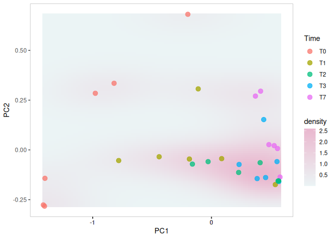<!-- -->


### Estimating associations with an external variable

Next to visualizing whether any variable is associated with differences
between samples, we can also quantify the strength of the association
between community composition (beta diversity) and external factors.

Permutational Analysis of Variance (PERMANOVA; (2001)) is a widely used
non-parametric multivariate method that aims to estimate the actual
statistical significance of differences in the observed community
composition between two groups of samples. This method takes as input
the abundance table, which measure of distance you want to base the test
on and a formula that tells the model how you think the variables are
associated with each other.

PERMANOVA tests the hypothesis that the centroids and dispersion of the
community are equivalent between the compared groups. A p-value smaller
than the significance threshold indicates that the groups have a
different community composition. This method is implemented with the
adonis2 function from the vegan package.

``` r
otu <- abundances(pseq)
meta <- meta(pseq)

permanova <- adonis(t(otu) ~ Time,
                    by = "margin",
                    data = meta, 
                    permutations = 9999, 
                    method = "euclidean")
```

    ## 'adonis' will be deprecated: use 'adonis2' instead

P-value:

``` r
print(as.data.frame(permanova$aov.tab))
```

    ##           Df SumsOfSqs    MeanSqs  F.Model        R2 Pr(>F)
    ## Time       4  4.262249 1.06556233 18.60744 0.7485662  1e-04
    ## Residuals 25  1.431635 0.05726539       NA 0.2514338     NA
    ## Total     29  5.693884         NA       NA 1.0000000     NA

The time variable is significantly associated with microbiota
composition (p-value is below 0.05).

Let us visualize the model coefficients for species that exhibit the
largest differences between the groups. This gives some insights into
how the groups tend to differ from each other in terms of community
composition.

``` r
coef <- coefficients(permanova)["Time1",]
top.coef <- coef[rev(order(abs(as.numeric(coef))))[1:20]]
par(mar = c(3, 14, 2, 1))
barplot(sort(top.coef), horiz = T, las = 1, main = "Top taxa")
```

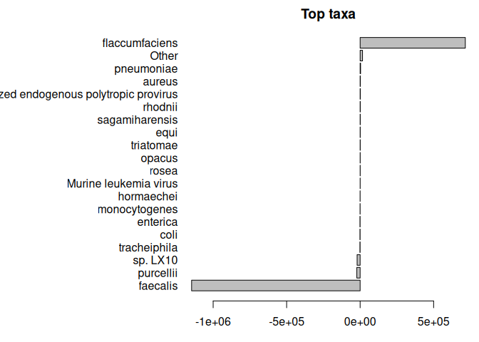<!-- -->

<figure>

<figcaption aria-hidden="true">association</figcaption>
</figure>

**Enterococcus** (Bacillota), which plays a crucial role in metabolic
adaptability against pathogenic or plant toxins and anti-herbivore
defense, was found to be one of the predominant gut microorganism of
lepidopteran insects, including B. mori, Helicoverpa zea, and Porthetria
dispar (Paniagua Voirol et al., 2018; Zhang et al., 2022).

**Symbiopectobacterium** (Enterobacteriaceae) has recently been
described for the first time as an intracellular bacterial symbiont,
responsible for to the biosynthesis of vitamins and cofactors. This
bacteria may be boosting the parsite fitness, for example, by aiding in
evading the Triatome immune response, or providing a novel function,
such as supplementing nutrition or metabolism

**Rhodococcus** (Nocardiaceae) in the triatomine gut are believed to
play an important role in the metabolism of the vector, such as by
participating in the synthesis of group B vitamins or by being digested
by the bugs directly to provide missing nutrients (Sassera et al.,
2013). Moreover, the most attractive aspect is the host-symbiont
relationship between triatomines and Rhodococcus; since Rhodococcus
bacteria can be easily cultured and genetically modified to harm the
pathogen in vector gut, they are probably suitable tools for the control
of trypanosomiasis (Sassera et al., 2013). as the blood is poor in B
vitamins compared to what is generally required for insect development.
The blood is poor in B vitamins compared to what is generally required
for insect development, Kissing bugs, Rhodnius prolixus, notably require
*Rhodococcus* bacteria for nymph development, but the addition of B
vitamins in the diet can rescue nymph development in the absence of
Rhodococcus (Serrato-Salas and Gendrin 2023).

**Wolbachia** (Ehrlichiaceae) The obligate intracellular bacteria
Wolbachia spp. are common in a wide range of insects, including sand
flies, bed bugs, fleas and mosquitoes, and can cause reproduction
alterations such as feminization, male killing and cytoplasmic
incompatibility ([Landmann
20219](https://doi.org/10.1128/microbiolspec.BAI-0018-2019.)). In
triatomines, Wolbachia has been solely reported for the genus Rhodnius,
where it occurs in the intestine, salivary glands and gonads.

**Curtobacterium** (Microbacteriaceae) *C. flaccumfaciens* is the only
species of Curtobacterium associated with plant pathogenesis (Young et
al., 1996), the presence of *C. flaccumfaciens* in the rhizosphere
induced a systematic resistance in cucumber plants to pathogens.

**Exercises**

Community-level comparisons: Use PERMANOVA to investigate whether the
community composition differs between two groups of individuals
(e.g. times, or some other grouping of your choice). You can also
include covariates such as type, gut, and see how this affects the
results?

### Beta diversity

Beta diversity quantifies the dissimilarity between communities
(multiple samples), as opposed to alpha diversity which focuses on
variation within a community (one sample). In microbiome research,
commonly used metrics of beta diversity include the Bray-Curtis index
(for compositional data), Jaccard index (for presence/absence data,
ignoring abundance information), Aitchison distance (Euclidean distance
for clr transformed abundances, aiming to avoid the compositionality
bias), and the Unifrac distance (that takes into account the
phylogenetic tree information). Notably, only some of these measures are
actual distances, as this is a mathematical concept whose definition is
not satisfied by certain ecological measure, such as the Bray-Curtis
index. Therefore, the terms dissimilarity and beta diversity are
preferred.

| Method description          | Assay type          | Beta diversity metric |
|-----------------------------|---------------------|-----------------------|
| Quantitative profiling      | Absolute counts     | Bray-Curtis           |
| Relative profiling          | Relative abundances | Bray-Curtis           |
| Aitchison distance          | Absolute counts     | Aitchison             |
| Aitchison distance          | clr                 | Euclidean             |
| Robust Aitchison distance   | rclr                | Euclidean             |
| Presence/Absence similarity | Relative abundances | Jaccard               |
| Presence/Absence similarity | Absolute counts     | Jaccard               |
| Phylogenetic distance       | Rarefied counts     | Unifrac               |

In practice, beta diversity is usually represented as a *dist* object, a
triangular matrix where the distance between each pair of samples is
encoded by a specific cell. This distance matrix can then undergo
ordination, which is an important ecological tool to reduce the
dimensionality of data for a more efficient analysis and visualization.
Ordination techniques aim to capture as much essential information from
the data as possible and turn it into a lower dimensional
representation. Dimension reduction is bound to lose information but
commonly used ordination techniques can preserve relevant information of
sample similarities in an optimal way, which is defined in different
ways by different methods.

Based on the type of algorithm, ordination methods in microbiome
research can be generally divided in two categories: unsupervised and
supervised ordination. The former includes Principal Coordinate Analysis
(PCoA), Principal Component Analysis (PCA) and Uniform Manifold
Approximation and Projection for Dimension Reduction (UMAP), whereas the
latter is mainly represented by distance-based Redundancy Analysis
(dbRDA). We will first discuss unsupervised ordination methods and then
proceed to supervised ones.

#### Unsupervised ordination

Unsupervised ordination methods variation in the data without additional
information on covariates or other supervision of the model. Among the
different approaches, Multi-Dimensional Scaling (MDS) and non-metric MDS
(NMDS) can be regarded as the standard. They are jointly referred to as
PCoA.

A typical comparison of community compositions starts with a visual
representation of the groups by a 2D ordination. Then we estimate
relative abundances and MDS ordination based on Bray-Curtis index
between the groups, and visualize the results.

``` r
# To ensure reproducibility we can fix the seed here. This will ensure you always get the same result each time you run your data.
set.seed(34521)

pseq <- aggregate_rare(merged_metagenomes, level = "Genus", detection = 0.1/100, prevalence = 50/100)
pseq <- microbiome::transform(pseq, transform = "compositional")
# abundances(pseq)
pseq  <- abundances(pseq) %>% as.data.frame() 
pseq <- pseq <- pseq[order(rowSums(pseq), decreasing = TRUE), ] %>% t()

# Calculate distance matrix
species_frac_filtered_dist <- vegdist(pseq, method = "bray")

# Perform NMDS on distance matrix
nmds_spec <- metaMDS(species_frac_filtered_dist, distance = "bray",k = 2)
```

    ## Run 0 stress 0.03362996 
    ## Run 1 stress 0.0336299 
    ## ... New best solution
    ## ... Procrustes: rmse 0.0001257671  max resid 0.0002233539 
    ## ... Similar to previous best
    ## Run 2 stress 0.0339897 
    ## ... Procrustes: rmse 0.01002435  max resid 0.04134134 
    ## Run 3 stress 0.03362999 
    ## ... Procrustes: rmse 5.825382e-05  max resid 0.0001048328 
    ## ... Similar to previous best
    ## Run 4 stress 0.06288395 
    ## Run 5 stress 0.04144533 
    ## Run 6 stress 0.04452223 
    ## Run 7 stress 0.05896259 
    ## Run 8 stress 0.03398968 
    ## ... Procrustes: rmse 0.009997987  max resid 0.04149452 
    ## Run 9 stress 0.05778166 
    ## Run 10 stress 0.05752581 
    ## Run 11 stress 0.03362988 
    ## ... New best solution
    ## ... Procrustes: rmse 3.457753e-05  max resid 6.164393e-05 
    ## ... Similar to previous best
    ## Run 12 stress 0.03398975 
    ## ... Procrustes: rmse 0.01002627  max resid 0.04135569 
    ## Run 13 stress 0.03398965 
    ## ... Procrustes: rmse 0.01000719  max resid 0.04146811 
    ## Run 14 stress 0.05573411 
    ## Run 15 stress 0.05535289 
    ## Run 16 stress 0.05817008 
    ## Run 17 stress 0.05810237 
    ## Run 18 stress 0.0336299 
    ## ... Procrustes: rmse 2.72224e-05  max resid 4.87934e-05 
    ## ... Similar to previous best
    ## Run 19 stress 0.0614943 
    ## Run 20 stress 0.06068536 
    ## *** Best solution repeated 2 times

Check the output.

``` r
# Check the output
nmds_spec
```

    ## 
    ## Call:
    ## metaMDS(comm = species_frac_filtered_dist, distance = "bray",      k = 2) 
    ## 
    ## global Multidimensional Scaling using monoMDS
    ## 
    ## Data:     species_frac_filtered_dist 
    ## Distance: bray 
    ## 
    ## Dimensions: 2 
    ## Stress:     0.03362988 
    ## Stress type 1, weak ties
    ## Best solution was repeated 2 times in 20 tries
    ## The best solution was from try 11 (random start)
    ## Scaling: centring, PC rotation, halfchange scaling 
    ## Species: scores missing

Here you see a kind of summary of the analysis. For example, you can see
that you used 2 dimensions and the stress was approx. 0.03. In general
if a stress is above 0.2 then the clustering is not reliably
representing the data and should be interpreted with caution. But here
the stress is below 0.2, so we are okay.

Now let’s look at the ordination. To plot the data with ggplot, we need
to extract the coordinaties of each point from nmds_spec\$points.

``` r
# Extract and reshape the data to plot ordination as ggplot  and add the metadata
# Convert the NMDS points to a data frame
nmds_spec_gg <- as.data.frame(nmds_spec$points)

# Add the "Sample" column based on row names
nmds_spec_gg <- nmds_spec_gg %>% rownames_to_column("Sample")

# Merge the NMDS data with the metadata by the "Sample" column
merged_data <- dplyr::left_join(meta, nmds_spec_gg, by = "Sample")
```

Then we can create the plot easily and color according to the metadata.
We are choosing timepoint and mocktreat for the coloring respectively.
But feel free to explore other parameters.

``` r
ggplot(merged_data, aes(x = MDS1, y = MDS2)) +
    geom_point(aes(color = Time), size = 3, alpha = 0.5) +
    geom_text_repel(aes(label = Type), size = 3, color = "black") +
    ggtitle("NMDS colored according to Time") +
    theme_minimal()
```

    ## Warning: ggrepel: 4 unlabeled data points (too many overlaps). Consider
    ## increasing max.overlaps

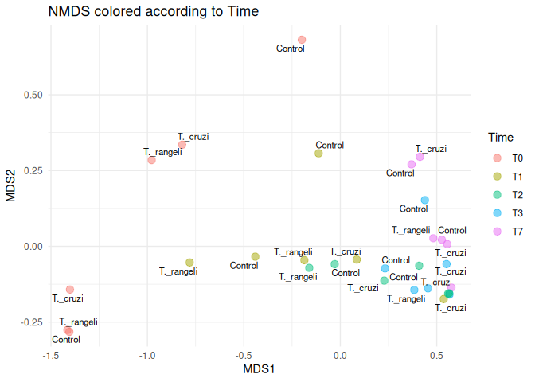<!-- -->


``` r
ggplot(merged_data, aes(x = MDS1, y = MDS2)) +
    geom_point(aes(color = Reads), size = 3, alpha = 0.5) +
    geom_text_repel(aes(label = Time), size = 3, color = "black") +
    scale_color_continuous(name = "Reads") +  # Add a continuous color scale
    ggtitle("NMDS colored according to Reads numbers") +
    theme_minimal()
```

<!-- -->

<figure>

<figcaption aria-hidden="true">nmds_type</figcaption>
</figure>

A few combinations of beta diversity metrics and assay types are
typically used. For instance, Bray-Curtis dissimilarity and Euclidean
distance are often applied to the relative abundance and the clr assays,
respectively. Besides beta diversity metric and assay type, the PCoA
algorithm is also a variable that should be considered. Below, we show
how the choice of these three factors can affect the resulting
lower-dimensional data.

``` r
# Run NMDS on relabundance assay with Bray-Curtis distances
pseq <- aggregate_rare(merged_metagenomes, level = "Genus", detection = 0.1/100, prevalence = 50/100)
pseq <- microbiome::transform(pseq, transform = "compositional")
# abundances(pseq)
pseq  <- abundances(pseq) %>% as.data.frame() 
pseq <- pseq <- pseq[order(rowSums(pseq), decreasing = TRUE), ] %>% t()
# Calculate distance matrix
species_frac_filtered_dist_bray <- vegdist(pseq, method = "bray")
# Perform NMDS on distance matrix
nmds_spec_comp_bray <- metaMDS(species_frac_filtered_dist_bray,distance = "bray",k = 2)
```

    ## Run 0 stress 0.03362996 
    ## Run 1 stress 0.03362988 
    ## ... New best solution
    ## ... Procrustes: rmse 7.736156e-05  max resid 0.0001584811 
    ## ... Similar to previous best
    ## Run 2 stress 0.03362999 
    ## ... Procrustes: rmse 8.87022e-05  max resid 0.0001621296 
    ## ... Similar to previous best
    ## Run 3 stress 0.05752551 
    ## Run 4 stress 0.04452191 
    ## Run 5 stress 0.0635128 
    ## Run 6 stress 0.0553414 
    ## Run 7 stress 0.05902468 
    ## Run 8 stress 0.0415081 
    ## Run 9 stress 0.03398981 
    ## ... Procrustes: rmse 0.009978777  max resid 0.04165838 
    ## Run 10 stress 0.04452184 
    ## Run 11 stress 0.05752572 
    ## Run 12 stress 0.05778124 
    ## Run 13 stress 0.05748911 
    ## Run 14 stress 0.03362994 
    ## ... Procrustes: rmse 6.246449e-05  max resid 0.0001151828 
    ## ... Similar to previous best
    ## Run 15 stress 0.03362998 
    ## ... Procrustes: rmse 8.637152e-05  max resid 0.0001580343 
    ## ... Similar to previous best
    ## Run 16 stress 0.03362989 
    ## ... Procrustes: rmse 2.110405e-05  max resid 4.068988e-05 
    ## ... Similar to previous best
    ## Run 17 stress 0.04461729 
    ## Run 18 stress 0.04150806 
    ## Run 19 stress 0.0341494 
    ## Run 20 stress 0.04461726 
    ## *** Best solution repeated 5 times

``` r
# Run NMDS on compositional assay with Euclidean distances
# Calculate distance matrix
species_frac_filtered_dist_euclidean <- vegdist(pseq, method = "euclidean")
# Perform NMDS on distance matrix
nmds_spec_comp_euclidean <- metaMDS(species_frac_filtered_dist_euclidean,distance = "euclidean",k = 2)
```

    ## Run 0 stress 0.007739837 
    ## Run 1 stress 0.00774002 
    ## ... Procrustes: rmse 6.391289e-05  max resid 0.0001541145 
    ## ... Similar to previous best
    ## Run 2 stress 0.007739856 
    ## ... Procrustes: rmse 0.0002591889  max resid 0.0006207877 
    ## ... Similar to previous best
    ## Run 3 stress 0.02293236 
    ## Run 4 stress 0.01336187 
    ## Run 5 stress 0.008199345 
    ## ... Procrustes: rmse 0.009697138  max resid 0.03834162 
    ## Run 6 stress 0.02454942 
    ## Run 7 stress 0.0228503 
    ## Run 8 stress 0.007740852 
    ## ... Procrustes: rmse 0.0002324046  max resid 0.000563632 
    ## ... Similar to previous best
    ## Run 9 stress 0.01354538 
    ## Run 10 stress 0.01359517 
    ## Run 11 stress 0.02454983 
    ## Run 12 stress 0.02284849 
    ## Run 13 stress 0.007740313 
    ## ... Procrustes: rmse 0.002825164  max resid 0.01292964 
    ## Run 14 stress 0.007739882 
    ## ... Procrustes: rmse 1.92731e-05  max resid 4.596547e-05 
    ## ... Similar to previous best
    ## Run 15 stress 0.02446006 
    ## Run 16 stress 0.01359499 
    ## Run 17 stress 0.007739798 
    ## ... New best solution
    ## ... Procrustes: rmse 1.68734e-05  max resid 3.948338e-05 
    ## ... Similar to previous best
    ## Run 18 stress 0.008199317 
    ## ... Procrustes: rmse 0.009698778  max resid 0.03834064 
    ## Run 19 stress 0.02538827 
    ## Run 20 stress 0.007740424 
    ## ... Procrustes: rmse 0.002850336  max resid 0.01285048 
    ## *** Best solution repeated 1 times

``` r
# Run NMDS on compositional assay with Aitchison distances
# Calculate distance matrix
species_frac_filtered_dist_aitchison <- vegdist(pseq, method = "robust.aitchison")
# Perform NMDS on distance matrix
nmds_spec_comp_aitchison <- metaMDS(species_frac_filtered_dist_aitchison,distance = "robust.aitchison",k = 2)
```

    ## Run 0 stress 0.1172405 
    ## Run 1 stress 0.1172408 
    ## ... Procrustes: rmse 0.0002501303  max resid 0.0007930993 
    ## ... Similar to previous best
    ## Run 2 stress 0.1172407 
    ## ... Procrustes: rmse 0.000202267  max resid 0.0006605762 
    ## ... Similar to previous best
    ## Run 3 stress 0.1131165 
    ## ... New best solution
    ## ... Procrustes: rmse 0.02750698  max resid 0.1211491 
    ## Run 4 stress 0.1785116 
    ## Run 5 stress 0.1172405 
    ## Run 6 stress 0.113127 
    ## ... Procrustes: rmse 0.004696376  max resid 0.01863454 
    ## Run 7 stress 0.1131165 
    ## ... Procrustes: rmse 1.238923e-05  max resid 3.40679e-05 
    ## ... Similar to previous best
    ## Run 8 stress 0.1131166 
    ## ... Procrustes: rmse 2.755792e-05  max resid 9.833294e-05 
    ## ... Similar to previous best
    ## Run 9 stress 0.1465789 
    ## Run 10 stress 0.1172407 
    ## Run 11 stress 0.1791431 
    ## Run 12 stress 0.1131166 
    ## ... Procrustes: rmse 6.464215e-05  max resid 0.0002357776 
    ## ... Similar to previous best
    ## Run 13 stress 0.1727685 
    ## Run 14 stress 0.1172406 
    ## Run 15 stress 0.1172406 
    ## Run 16 stress 0.1616845 
    ## Run 17 stress 0.1282034 
    ## Run 18 stress 0.1172406 
    ## Run 19 stress 0.1465789 
    ## Run 20 stress 0.1172406 
    ## *** Best solution repeated 3 times

``` r
# Run NMDS on clr assay with Euclidean distances
pseq <- aggregate_rare(merged_metagenomes, level = "Genus", detection = 0.1/100, prevalence = 50/100)
pseq <- microbiome::transform(pseq, transform = "clr")
pseq  <- abundances(pseq) %>% as.data.frame() 
pseq <- pseq <- pseq[order(rowSums(pseq), decreasing = TRUE), ] %>% t()
# Calculate distance matrix
species_frac_filtered_dist_euclidean <- vegdist(pseq, method = "euclidean")
# Perform NMDS on distance matrix
nmds_spec_clr_euclidean <- metaMDS(species_frac_filtered_dist_euclidean,distance = "euclidean",k = 2)
```

    ## Run 0 stress 0.09713366 
    ## Run 1 stress 0.09713364 
    ## ... New best solution
    ## ... Procrustes: rmse 3.755247e-05  max resid 0.0001333016 
    ## ... Similar to previous best
    ## Run 2 stress 0.09713362 
    ## ... New best solution
    ## ... Procrustes: rmse 8.677083e-05  max resid 0.0003215378 
    ## ... Similar to previous best
    ## Run 3 stress 0.09896957 
    ## Run 4 stress 0.1164527 
    ## Run 5 stress 0.1361142 
    ## Run 6 stress 0.102926 
    ## Run 7 stress 0.1037784 
    ## Run 8 stress 0.1199946 
    ## Run 9 stress 0.1366788 
    ## Run 10 stress 0.1167575 
    ## Run 11 stress 0.1012603 
    ## Run 12 stress 0.1386966 
    ## Run 13 stress 0.1199946 
    ## Run 14 stress 0.11786 
    ## Run 15 stress 0.1038031 
    ## Run 16 stress 0.09896957 
    ## Run 17 stress 0.1164527 
    ## Run 18 stress 0.09713362 
    ## ... Procrustes: rmse 5.573439e-06  max resid 1.373636e-05 
    ## ... Similar to previous best
    ## Run 19 stress 0.1037784 
    ## Run 20 stress 0.1022841 
    ## *** Best solution repeated 2 times

``` r
# List of NMDS objects and their corresponding titles
nmds_list <- list(
  list(data = nmds_spec_comp_bray, title = "Comp Bray"),
  list(data = nmds_spec_comp_euclidean, title = "Comp Euclidean"),
  list(data = nmds_spec_comp_aitchison, title = "Comp Aitchison"),
  list(data = nmds_spec_clr_euclidean, title = "Clr Euclidean")
)

# Initialize an empty list to store plots
plot_list <- list()

# Loop through each NMDS object and generate the corresponding plot
for (nmds_item in nmds_list) {
  nmds_spec_gg <- as.data.frame(nmds_item$data$points) %>%
    rownames_to_column("Sample") %>%
    dplyr::left_join(meta, by = "Sample")
  
  plot <- ggplot(nmds_spec_gg, aes(x = MDS1, y = MDS2)) +
    geom_point(aes(color = Time), size = 3, alpha = 0.5) +
    geom_text_repel(aes(label = Type), size = 3, color = "black") +
    ggtitle(paste("NMDS colored according to Time -", nmds_item$title)) +
    theme_minimal()
  
  # Add the plot to the plot list
  plot_list[[nmds_item$title]] <- plot
}

# Combine all plots using patchwork
combined_plot <- wrap_plots(plot_list) +
  plot_layout(guides = "collect")

# Print the combined plot
print(combined_plot)
```

    ## Warning: ggrepel: 16 unlabeled data points (too many overlaps). Consider
    ## increasing max.overlaps

    ## Warning: ggrepel: 15 unlabeled data points (too many overlaps). Consider
    ## increasing max.overlaps

    ## Warning: ggrepel: 5 unlabeled data points (too many overlaps). Consider
    ## increasing max.overlaps

    ## Warning: ggrepel: 2 unlabeled data points (too many overlaps). Consider
    ## increasing max.overlaps

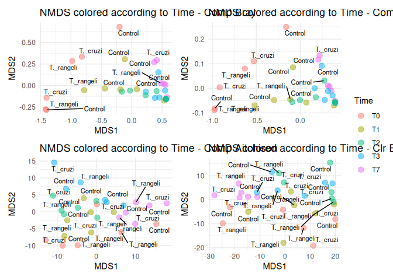<!-- -->

<figure>

<figcaption aria-hidden="true">nmds_type</figcaption>
</figure>

#### Unsupervised ordination

dbRDA is a supervised counterpart of PCoA. It maximize the variance with
respect to the covariates provided by the user. This can be used to
quantify associations between each covariate and community composition
(beta diversity). The table below summarizes the relations between the
supervised and unsupervised ordination methods.

| Supervised ordination  | Unsupervised ordination |
|------------------------|-------------------------|
| Euclidean distance     | RDA                     |
| Non-Euclidean distance | dbRDA                   |

In summary, the dbRDA is the more general method that allows a wider
variety dissimilarity, or beta diversity, indices.

Let’s use the package mia for this analysis, fist we transform our
phyloseq object into a mia compatible object. The colData lists the
covariates such as Gut and Type…

``` r
pseq <-  mia::makeTreeSummarizedExperimentFromPhyloseq(merged_metagenomes)

# Apply relative transform
pseq <- mia::transformAssay(pseq,
                       method = "relabundance")
```

dbRDA can be perfomed with the runRDA function. In addition to the
arguments previously defined for unsupervised ordination, this function
takes a formula to control for variables and an action to treat missing
values. Along with metadata, which is the main outcome,we can treat
observations missing values (not the case here).

``` r
pseq <- mia::runRDA(pseq,
               assay.type = "relabundance",
               formula = assay ~ Gut + Time + Type + Reads,
               distance = "bray",
               na.action = na.exclude)
```

The importance of each variable on the similarity between samples can be
assessed from the results of PERMANOVA, automatically provided by the
runRDA function. We see that Time explain more than 42% of the variance
and it is also significant.

``` r
# Store results of PERMANOVA test
rda_info <- attr(reducedDim(pseq, "RDA"), "significance")
rda_info$permanova
```

    ##          Df   SumOfSqs          F Pr(>F) Total variance Explained variance
    ## Model     8 2.98947546 13.0670703  0.001       3.590021         0.83271806
    ## Gut       1 0.03886857  1.3591639  0.230       3.590021         0.01082684
    ## Time      4 1.51258308 13.2230752  0.001       3.590021         0.42132985
    ## Type      2 0.05388041  0.9420504  0.409       3.590021         0.01500838
    ## Reads     1 0.05231320  1.8292984  0.156       3.590021         0.01457184
    ## Residual 21 0.60054571         NA     NA       3.590021         0.16728194

|          | Df  | SumOfSqs | F         | Pr(\>F) | Total variance | Explained variance |
|----------|-----|----------|-----------|---------|----------------|--------------------|
| Model    | 8   | 2.989475 | 13.067070 | 0.001   | 3.590021       | 0.832718           |
| Gut      | 1   | 0.038869 | 1.359164  | 0.237   | 3.590021       | 0.010827           |
| Time     | 4   | 1.512583 | 13.223075 | 0.001   | 3.590021       | 0.421330           |
| Type     | 2   | 0.053880 | 0.942050  | 0.405   | 3.590021       | 0.015008           |
| Reads    | 1   | 0.052313 | 1.829298  | 0.163   | 3.590021       | 0.014572           |
| Residual | 21  | 0.600546 | NA        | NA      | 3.590021       | 0.167282           |

Next, we proceed to visualize the weight and significance of each
variable on the similarity between samples with an RDA plot, which can
be generated with the plotRDA function from the miaViz package.

``` r
# Load packages for plotting function
library(miaViz)

# Generate RDA plot coloured by clinical status
plotRDA(pseq, "RDA", colour_by = "Time")
```

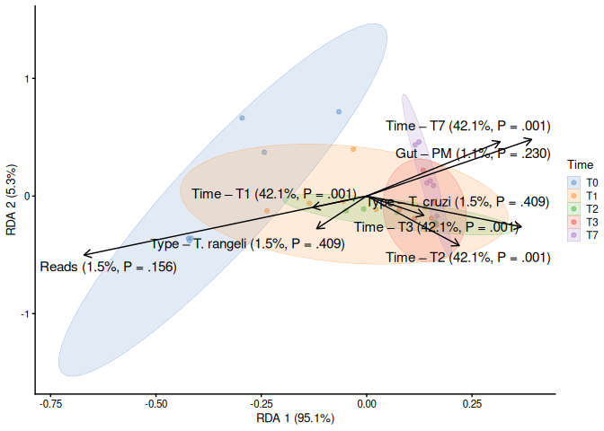<!-- -->

<figure>

<figcaption aria-hidden="true">nmds_type</figcaption>
</figure>

### Confounding effects

Confounders can be defined as variables that are related to and affect
the apparent dynamics between the response and the main independent
variable. They are common in experimental studies. Generally, they can
be classified into 3 groups:

- Biological confounders, such as age and sex

- Technical confounders produced during sample collection, processing
  and analysis

- Confounders resulting from experimental models, such as batch effects
  and sample history

Controlling for confounders is an important practice to reach an
unbiased conclusion. To perform causal inference, it is crucial that the
method is able to include confounders in the model. This is not possible
with statistical tests of general use, such as the Wilcoxon test.
