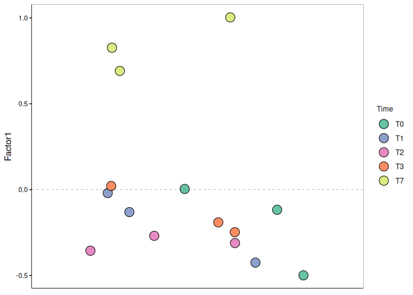

Mofa2
================
Vincent Manzanilla, INTERTRYP

# Mofa - on Trypanosoma data

Separate the data in 3 groups, control, *T. cruzi* and *T. rangeli*.

``` r
library(microbiome)
```

    ## Loading required package: phyloseq

    ## Loading required package: ggplot2

    ## 
    ## microbiome R package (microbiome.github.com)
    ##     
    ## 
    ## 
    ##  Copyright (C) 2011-2022 Leo Lahti, 
    ##     Sudarshan Shetty et al. <microbiome.github.io>

    ## 
    ## Attaching package: 'microbiome'

    ## The following object is masked from 'package:ggplot2':
    ## 
    ##     alpha

    ## The following object is masked from 'package:base':
    ## 
    ##     transform

``` r
library(dplyr)
```

    ## 
    ## Attaching package: 'dplyr'

    ## The following objects are masked from 'package:stats':
    ## 
    ##     filter, lag

    ## The following objects are masked from 'package:base':
    ## 
    ##     intersect, setdiff, setequal, union

``` r
library(ggpubr)
library(MOFA2)
```

    ## 
    ## Attaching package: 'MOFA2'

    ## The following object is masked from 'package:phyloseq':
    ## 
    ##     subset_samples

    ## The following object is masked from 'package:stats':
    ## 
    ##     predict

``` r
library(cowplot)
```

    ## 
    ## Attaching package: 'cowplot'

    ## The following object is masked from 'package:ggpubr':
    ## 
    ##     get_legend

``` r
library(pheatmap)
library(grid)
library(gridExtra)
```

    ## 
    ## Attaching package: 'gridExtra'

    ## The following object is masked from 'package:dplyr':
    ## 
    ##     combine

Load, formating and exclude contaminants from the data.

``` r
# Import the merged metagenomes data from a BIOM file
merged_metagenomes <- import_biom("../DATA/merge_species.biom")

# Read the metadata from a CSV file
meta <- read.csv(file = "../DATA/tryp_metadata.csv", sep = ",")

# Sort the metadata data frame by the SRA.identifier column
meta <- meta %>% arrange(row_number(SRA.identifier))

# Associate the sorted metadata to the phyloseq object as sample data
merged_metagenomes@sam_data <- sample_data(meta)

# Extract the sample names from the metadata
column_name <- meta %>% pull(Sample)

# Assign the extracted sample names to the phyloseq object
sample_names(merged_metagenomes) <- column_name

# Remove the unnecessary 'k_' prefix in the taxonomy data
merged_metagenomes@tax_table@.Data <- substring(merged_metagenomes@tax_table@.Data, 4)

# Rename the columns of the taxonomy table to represent taxonomic ranks
colnames(merged_metagenomes@tax_table@.Data) <- c("Kingdom", "Phylum", "Class", "Order", "Family", "Genus", "Species")

# Keep the kingdom of interest
merged_metagenomes <- subset_taxa(merged_metagenomes, Kingdom %in% c("Archaea", "Bacteria", "Fungi", "Viruses"))
```

# Mofa Integrative by kingdom

``` r
# Subset the merged metagenomes to only include morning samples (AM)
AM_metagenomes <- phyloseq::subset_samples(merged_metagenomes, Gut == "AM")
#AM_metagenomes <- merged_metagenomes
# Further subset the morning metagenomes by sample type
block_bacteria <- phyloseq::subset_taxa(AM_metagenomes, Kingdom == "Bacteria")
#block_fungi <- phyloseq::subset_taxa(AM_metagenomes, Kingdom == "Fungi")
block_virus <- phyloseq::subset_taxa(AM_metagenomes, Kingdom == "Viruses")

# Aggregate rare taxa at the genus level for each subset, using specific detection and prevalence thresholds
block_bacteria <- aggregate_rare(block_bacteria, level = "Genus", detection = 0.1 / 100, prevalence = 50 / 100)
#block_fungi <- aggregate_rare(block_fungi, level = "Genus", detection = 0.1 / 100, prevalence = 50 / 100)
block_virus <- aggregate_rare(block_virus, level = "Genus", detection = 0.1 / 100, prevalence = 50 / 100)

# Transform the aggregated data using centered log-ratio (clr) transformation
block_bacteria <- microbiome::transform(block_bacteria, transform = "clr")
block_virus <- microbiome::transform(block_virus, transform = "clr")

# Melt the transformed data into long format and select relevant columns
block_bacteria_df <- psmelt(block_bacteria) %>% select(Sample, OTU, Abundance) %>%  mutate(view = "Bacteria")
```

    ## Warning in psmelt(block_bacteria): The sample variables: 
    ## Sample
    ##  have been renamed to: 
    ## sample_Sample
    ## to avoid conflicts with special phyloseq plot attribute names.

``` r
block_virus_df <- psmelt(block_virus) %>% select(Sample, OTU, Abundance) %>% mutate(view = "Virus")
```

    ## Warning in psmelt(block_virus): The sample variables: 
    ## Sample
    ##  have been renamed to: 
    ## sample_Sample
    ## to avoid conflicts with special phyloseq plot attribute names.

``` r
# Rename the columns for consistency
colnames(block_bacteria_df) <- c("sample", "feature", "value", "view")
colnames(block_virus_df) <- c("sample", "feature", "value", "view")

#head(block_bacteria_df)
#head(block_virus_df)

merged_df <- bind_rows(block_bacteria_df, block_virus_df)
```

# Density plot abundance

``` r
ggdensity(rbind(block_bacteria_df, block_virus_df), x="value", fill="gray70") +
  facet_wrap(~view, nrow=1, scales="free")
```

<!-- -->

``` r
# Create a MOFA (Multi-Omics Factor Analysis) object from the list of matrices
mofa <- create_mofa(data = merged_df)
```

    ## Creating MOFA object from a data.frame...

    ## Warning in .rename_duplicated_features(object): There are duplicated features names across different views. We will add the suffix *_view* only for those features 
    ##             Example: if you have both TP53 in mRNA and mutation data it will be renamed to TP53_mRNA, TP53_mutation

## Prepare MOFA object

``` r
# Get the default model options for the MOFA object
model_opts <- get_default_model_options(mofa)

# Set the number of factors to be inferred in the model to 5
model_opts$num_factors <- 10

# Prepare the MOFA object with the specified model options
mofa <- prepare_mofa(mofa, model_options = model_opts)
```

    ## Warning in prepare_mofa(mofa, model_options = model_opts): Some view(s) have
    ## less than 15 features, MOFA will have little power to to learn meaningful
    ## factors for these view(s)....

    ## Checking data options...

    ## No data options specified, using default...

    ## No training options specified, using default...

    ## Checking model options...

    ## Warning in prepare_mofa(mofa, model_options = model_opts): The total number of samples is very small for learning 10 factors.  
    ##     Try to reduce the number of factors to obtain meaningful results. It should not exceed ~3.

``` r
# Run the MOFA model using the Basilisk environment (for reproducibility and isolation of dependencies)
mofa <- run_mofa(mofa, use_basilisk = TRUE)
```

    ## Warning in run_mofa(mofa, use_basilisk = TRUE): No output filename provided. Using /tmp/RtmpbU49bX/mofa_20240607-082546.hdf5 to store the trained model.

    ## Connecting to the mofapy2 package using basilisk. 
    ##     Set 'use_basilisk' to FALSE if you prefer to manually set the python binary using 'reticulate'.

    ## 
    ##         #########################################################
    ##         ###           __  __  ____  ______                    ### 
    ##         ###          |  \/  |/ __ \|  ____/\    _             ### 
    ##         ###          | \  / | |  | | |__ /  \ _| |_           ### 
    ##         ###          | |\/| | |  | |  __/ /\ \_   _|          ###
    ##         ###          | |  | | |__| | | / ____ \|_|            ###
    ##         ###          |_|  |_|\____/|_|/_/    \_\              ###
    ##         ###                                                   ### 
    ##         ######################################################### 
    ##        
    ##  
    ##         
    ## use_float32 set to True: replacing float64 arrays by float32 arrays to speed up computations...
    ## 
    ## Successfully loaded view='Bacteria' group='single_group' with N=15 samples and D=153 features...
    ## Successfully loaded view='Virus' group='single_group' with N=15 samples and D=3 features...
    ## 
    ## 
    ## Model options:
    ## - Automatic Relevance Determination prior on the factors: False
    ## - Automatic Relevance Determination prior on the weights: True
    ## - Spike-and-slab prior on the factors: False
    ## - Spike-and-slab prior on the weights: False
    ## Likelihoods:
    ## - View 0 (Bacteria): gaussian
    ## - View 1 (Virus): gaussian
    ## 
    ## 
    ## 
    ## Warning: some view(s) have less than 15 features, MOFA won't be able to learn meaningful factors for these view(s)...
    ## 
    ## 
    ## 
    ## ######################################
    ## ## Training the model with seed 42 ##
    ## ######################################
    ## 
    ## 
    ## ELBO before training: -22473.68 
    ## 
    ## Iteration 1: time=0.00, ELBO=-5262.00, deltaELBO=17211.686 (76.58595953%), Factors=10
    ## Iteration 2: time=0.00, Factors=10
    ## Iteration 3: time=0.00, Factors=10
    ## Iteration 4: time=0.00, Factors=10
    ## Iteration 5: time=0.00, Factors=10
    ## Iteration 6: time=0.00, ELBO=-4612.74, deltaELBO=649.260 (2.88897730%), Factors=10
    ## Iteration 7: time=0.00, Factors=10
    ## Iteration 8: time=0.00, Factors=10
    ## Iteration 9: time=0.00, Factors=10
    ## Iteration 10: time=0.00, Factors=10
    ## Iteration 11: time=0.00, ELBO=-4566.11, deltaELBO=46.623 (0.20745717%), Factors=10
    ## Iteration 12: time=0.00, Factors=10
    ## Iteration 13: time=0.00, Factors=10
    ## Iteration 14: time=0.00, Factors=10
    ## Iteration 15: time=0.00, Factors=10
    ## Iteration 16: time=0.00, ELBO=-4536.87, deltaELBO=29.240 (0.13010727%), Factors=10
    ## Iteration 17: time=0.00, Factors=10
    ## Iteration 18: time=0.00, Factors=10
    ## Iteration 19: time=0.00, Factors=10
    ## Iteration 20: time=0.00, Factors=10
    ## Iteration 21: time=0.00, ELBO=-4515.00, deltaELBO=21.876 (0.09734077%), Factors=10
    ## Iteration 22: time=0.00, Factors=10
    ## Iteration 23: time=0.00, Factors=10
    ## Iteration 24: time=0.00, Factors=10
    ## Iteration 25: time=0.00, Factors=10
    ## Iteration 26: time=0.00, ELBO=-4496.67, deltaELBO=18.329 (0.08155603%), Factors=10
    ## Iteration 27: time=0.00, Factors=10
    ## Iteration 28: time=0.00, Factors=10
    ## Iteration 29: time=0.00, Factors=10
    ## Iteration 30: time=0.00, Factors=10
    ## Iteration 31: time=0.00, ELBO=-4484.79, deltaELBO=11.885 (0.05288185%), Factors=10
    ## Iteration 32: time=0.00, Factors=10
    ## Iteration 33: time=0.00, Factors=10
    ## Iteration 34: time=0.00, Factors=10
    ## Iteration 35: time=0.00, Factors=10
    ## Iteration 36: time=0.00, ELBO=-4475.46, deltaELBO=9.321 (0.04147680%), Factors=10
    ## Iteration 37: time=0.00, Factors=10
    ## Iteration 38: time=0.00, Factors=10
    ## Iteration 39: time=0.00, Factors=10
    ## Iteration 40: time=0.00, Factors=10
    ## Iteration 41: time=0.00, ELBO=-4467.59, deltaELBO=7.870 (0.03501786%), Factors=10
    ## Iteration 42: time=0.00, Factors=10
    ## Iteration 43: time=0.00, Factors=10
    ## Iteration 44: time=0.00, Factors=10
    ## Iteration 45: time=0.00, Factors=10
    ## Iteration 46: time=0.00, ELBO=-4460.90, deltaELBO=6.697 (0.02980109%), Factors=10
    ## Iteration 47: time=0.00, Factors=10
    ## Iteration 48: time=0.00, Factors=10
    ## Iteration 49: time=0.00, Factors=10
    ## Iteration 50: time=0.00, Factors=10
    ## Iteration 51: time=0.00, ELBO=-4455.24, deltaELBO=5.653 (0.02515238%), Factors=10
    ## Iteration 52: time=0.00, Factors=10
    ## Iteration 53: time=0.00, Factors=10
    ## Iteration 54: time=0.00, Factors=10
    ## Iteration 55: time=0.00, Factors=10
    ## Iteration 56: time=0.00, ELBO=-4450.52, deltaELBO=4.725 (0.02102399%), Factors=10
    ## Iteration 57: time=0.00, Factors=10
    ## Iteration 58: time=0.00, Factors=10
    ## Iteration 59: time=0.00, Factors=10
    ## Iteration 60: time=0.00, Factors=10
    ## Iteration 61: time=0.00, ELBO=-4446.60, deltaELBO=3.924 (0.01745993%), Factors=10
    ## Iteration 62: time=0.00, Factors=10
    ## Iteration 63: time=0.00, Factors=10
    ## Iteration 64: time=0.00, Factors=10
    ## Iteration 65: time=0.00, Factors=10
    ## Iteration 66: time=0.00, ELBO=-4443.34, deltaELBO=3.250 (0.01446296%), Factors=10
    ## Iteration 67: time=0.00, Factors=10
    ## Iteration 68: time=0.00, Factors=10
    ## Iteration 69: time=0.00, Factors=10
    ## Iteration 70: time=0.00, Factors=10
    ## Iteration 71: time=0.00, ELBO=-4440.65, deltaELBO=2.700 (0.01201275%), Factors=10
    ## Iteration 72: time=0.00, Factors=10
    ## Iteration 73: time=0.00, Factors=10
    ## Iteration 74: time=0.00, Factors=10
    ## Iteration 75: time=0.00, Factors=10
    ## Iteration 76: time=0.00, ELBO=-4438.40, deltaELBO=2.248 (0.01000096%), Factors=10
    ## Iteration 77: time=0.00, Factors=10
    ## Iteration 78: time=0.00, Factors=10
    ## Iteration 79: time=0.00, Factors=10
    ## Iteration 80: time=0.00, Factors=10
    ## Iteration 81: time=0.00, ELBO=-4436.51, deltaELBO=1.889 (0.00840597%), Factors=10
    ## Iteration 82: time=0.00, Factors=10
    ## Iteration 83: time=0.00, Factors=10
    ## Iteration 84: time=0.00, Factors=10
    ## Iteration 85: time=0.00, Factors=10
    ## Iteration 86: time=0.00, ELBO=-4434.91, deltaELBO=1.598 (0.00711066%), Factors=10
    ## Iteration 87: time=0.00, Factors=10
    ## Iteration 88: time=0.00, Factors=10
    ## Iteration 89: time=0.00, Factors=10
    ## Iteration 90: time=0.00, Factors=10
    ## Iteration 91: time=0.00, ELBO=-4433.54, deltaELBO=1.367 (0.00608128%), Factors=10
    ## Iteration 92: time=0.00, Factors=10
    ## Iteration 93: time=0.00, Factors=10
    ## Iteration 94: time=0.00, Factors=10
    ## Iteration 95: time=0.00, Factors=10
    ## Iteration 96: time=0.00, ELBO=-4432.37, deltaELBO=1.178 (0.00524092%), Factors=10
    ## Iteration 97: time=0.00, Factors=10
    ## Iteration 98: time=0.00, Factors=10
    ## Iteration 99: time=0.00, Factors=10
    ## Iteration 100: time=0.00, Factors=10
    ## Iteration 101: time=0.00, ELBO=-4431.34, deltaELBO=1.027 (0.00457028%), Factors=10
    ## Iteration 102: time=0.00, Factors=10
    ## Iteration 103: time=0.00, Factors=10
    ## Iteration 104: time=0.00, Factors=10
    ## Iteration 105: time=0.00, Factors=10
    ## Iteration 106: time=0.00, ELBO=-4430.44, deltaELBO=0.902 (0.00401511%), Factors=10
    ## Iteration 107: time=0.00, Factors=10
    ## Iteration 108: time=0.00, Factors=10
    ## Iteration 109: time=0.00, Factors=10
    ## Iteration 110: time=0.00, Factors=10
    ## Iteration 111: time=0.00, ELBO=-4429.64, deltaELBO=0.801 (0.00356482%), Factors=10
    ## Iteration 112: time=0.00, Factors=10
    ## Iteration 113: time=0.00, Factors=10
    ## Iteration 114: time=0.00, Factors=10
    ## Iteration 115: time=0.00, Factors=10
    ## Iteration 116: time=0.00, ELBO=-4428.92, deltaELBO=0.716 (0.00318466%), Factors=10
    ## Iteration 117: time=0.00, Factors=10
    ## Iteration 118: time=0.00, Factors=10
    ## Iteration 119: time=0.00, Factors=10
    ## Iteration 120: time=0.00, Factors=10
    ## Iteration 121: time=0.00, ELBO=-4428.27, deltaELBO=0.646 (0.00287589%), Factors=10
    ## Iteration 122: time=0.00, Factors=10
    ## Iteration 123: time=0.00, Factors=10
    ## Iteration 124: time=0.00, Factors=10
    ## Iteration 125: time=0.00, Factors=10
    ## Iteration 126: time=0.00, ELBO=-4427.69, deltaELBO=0.587 (0.00261202%), Factors=10
    ## Iteration 127: time=0.00, Factors=10
    ## Iteration 128: time=0.00, Factors=10
    ## Iteration 129: time=0.00, Factors=10
    ## Iteration 130: time=0.00, Factors=10
    ## Iteration 131: time=0.00, ELBO=-4427.15, deltaELBO=0.538 (0.00239251%), Factors=10
    ## Iteration 132: time=0.00, Factors=10
    ## Iteration 133: time=0.00, Factors=10
    ## Iteration 134: time=0.00, Factors=10
    ## Iteration 135: time=0.00, Factors=10
    ## Iteration 136: time=0.00, ELBO=-4426.65, deltaELBO=0.499 (0.00222254%), Factors=10
    ## Iteration 137: time=0.00, Factors=10
    ## Iteration 138: time=0.00, Factors=10
    ## Iteration 139: time=0.00, Factors=10
    ## Iteration 140: time=0.00, Factors=10
    ## Iteration 141: time=0.00, ELBO=-4426.19, deltaELBO=0.461 (0.00205105%), Factors=10
    ## Iteration 142: time=0.00, Factors=10
    ## Iteration 143: time=0.00, Factors=10
    ## Iteration 144: time=0.00, Factors=10
    ## Iteration 145: time=0.00, Factors=10
    ## Iteration 146: time=0.00, ELBO=-4425.76, deltaELBO=0.432 (0.00192313%), Factors=10
    ## Iteration 147: time=0.00, Factors=10
    ## Iteration 148: time=0.00, Factors=10
    ## Iteration 149: time=0.00, Factors=10
    ## Iteration 150: time=0.00, Factors=10
    ## Iteration 151: time=0.00, ELBO=-4425.35, deltaELBO=0.407 (0.00181004%), Factors=10
    ## Iteration 152: time=0.00, Factors=10
    ## Iteration 153: time=0.00, Factors=10
    ## Iteration 154: time=0.00, Factors=10
    ## Iteration 155: time=0.00, Factors=10
    ## Iteration 156: time=0.00, ELBO=-4424.96, deltaELBO=0.387 (0.00172035%), Factors=10
    ## Iteration 157: time=0.00, Factors=10
    ## Iteration 158: time=0.00, Factors=10
    ## Iteration 159: time=0.00, Factors=10
    ## Iteration 160: time=0.00, Factors=10
    ## Iteration 161: time=0.00, ELBO=-4424.60, deltaELBO=0.367 (0.00163375%), Factors=10
    ## Iteration 162: time=0.00, Factors=10
    ## Iteration 163: time=0.00, Factors=10
    ## Iteration 164: time=0.00, Factors=10
    ## Iteration 165: time=0.00, Factors=10
    ## Iteration 166: time=0.00, ELBO=-4424.24, deltaELBO=0.355 (0.00158071%), Factors=10
    ## Iteration 167: time=0.00, Factors=10
    ## Iteration 168: time=0.00, Factors=10
    ## Iteration 169: time=0.00, Factors=10
    ## Iteration 170: time=0.00, Factors=10
    ## Iteration 171: time=0.00, ELBO=-4423.90, deltaELBO=0.341 (0.00151941%), Factors=10
    ## Iteration 172: time=0.00, Factors=10
    ## Iteration 173: time=0.00, Factors=10
    ## Iteration 174: time=0.00, Factors=10
    ## Iteration 175: time=0.00, Factors=10
    ## Iteration 176: time=0.00, ELBO=-4423.56, deltaELBO=0.337 (0.00149839%), Factors=10
    ## Iteration 177: time=0.00, Factors=10
    ## Iteration 178: time=0.00, Factors=10
    ## Iteration 179: time=0.00, Factors=10
    ## Iteration 180: time=0.00, Factors=10
    ## Iteration 181: time=0.00, ELBO=-4423.23, deltaELBO=0.331 (0.00147323%), Factors=10
    ## Iteration 182: time=0.00, Factors=10
    ## Iteration 183: time=0.00, Factors=10
    ## Iteration 184: time=0.00, Factors=10
    ## Iteration 185: time=0.00, Factors=10
    ## Iteration 186: time=0.00, ELBO=-4422.90, deltaELBO=0.333 (0.00148108%), Factors=10
    ## Iteration 187: time=0.00, Factors=10
    ## Iteration 188: time=0.00, Factors=10
    ## Iteration 189: time=0.00, Factors=10
    ## Iteration 190: time=0.00, Factors=10
    ## Iteration 191: time=0.00, ELBO=-4422.56, deltaELBO=0.338 (0.00150574%), Factors=10
    ## Iteration 192: time=0.00, Factors=10
    ## Iteration 193: time=0.00, Factors=10
    ## Iteration 194: time=0.00, Factors=10
    ## Iteration 195: time=0.00, Factors=10
    ## Iteration 196: time=0.00, ELBO=-4422.21, deltaELBO=0.354 (0.00157403%), Factors=10
    ## Iteration 197: time=0.00, Factors=10
    ## Iteration 198: time=0.00, Factors=10
    ## Iteration 199: time=0.00, Factors=10
    ## Iteration 200: time=0.00, Factors=10
    ## Iteration 201: time=0.00, ELBO=-4421.82, deltaELBO=0.384 (0.00170816%), Factors=10
    ## Iteration 202: time=0.00, Factors=10
    ## Iteration 203: time=0.00, Factors=10
    ## Iteration 204: time=0.00, Factors=10
    ## Iteration 205: time=0.00, Factors=10
    ## Iteration 206: time=0.00, ELBO=-4421.40, deltaELBO=0.426 (0.00189741%), Factors=10
    ## Iteration 207: time=0.00, Factors=10
    ## Iteration 208: time=0.00, Factors=10
    ## Iteration 209: time=0.00, Factors=10
    ## Iteration 210: time=0.00, Factors=10
    ## Iteration 211: time=0.00, ELBO=-4420.89, deltaELBO=0.501 (0.00222976%), Factors=10
    ## Iteration 212: time=0.00, Factors=10
    ## Iteration 213: time=0.00, Factors=10
    ## Iteration 214: time=0.00, Factors=10
    ## Iteration 215: time=0.00, Factors=10
    ## Iteration 216: time=0.00, ELBO=-4420.28, deltaELBO=0.612 (0.00272145%), Factors=10
    ## Iteration 217: time=0.00, Factors=10
    ## Iteration 218: time=0.00, Factors=10
    ## Iteration 219: time=0.00, Factors=10
    ## Iteration 220: time=0.00, Factors=10
    ## Iteration 221: time=0.00, ELBO=-4419.51, deltaELBO=0.775 (0.00344919%), Factors=10
    ## Iteration 222: time=0.00, Factors=10
    ## Iteration 223: time=0.00, Factors=10
    ## Iteration 224: time=0.00, Factors=10
    ## Iteration 225: time=0.00, Factors=10
    ## Iteration 226: time=0.00, ELBO=-4418.51, deltaELBO=0.993 (0.00442001%), Factors=10
    ## Iteration 227: time=0.00, Factors=10
    ## Iteration 228: time=0.00, Factors=10
    ## Iteration 229: time=0.00, Factors=10
    ## Iteration 230: time=0.00, Factors=10
    ## Iteration 231: time=0.00, ELBO=-4417.24, deltaELBO=1.274 (0.00566780%), Factors=10
    ## Iteration 232: time=0.00, Factors=10
    ## Iteration 233: time=0.00, Factors=10
    ## Iteration 234: time=0.00, Factors=10
    ## Iteration 235: time=0.00, Factors=10
    ## Iteration 236: time=0.00, ELBO=-4415.68, deltaELBO=1.561 (0.00694581%), Factors=10
    ## Iteration 237: time=0.00, Factors=10
    ## Iteration 238: time=0.00, Factors=10
    ## Iteration 239: time=0.00, Factors=10
    ## Iteration 240: time=0.00, Factors=10
    ## Iteration 241: time=0.00, ELBO=-4414.07, deltaELBO=1.614 (0.00718317%), Factors=10
    ## Iteration 242: time=0.00, Factors=10
    ## Iteration 243: time=0.00, Factors=10
    ## Iteration 244: time=0.00, Factors=10
    ## Iteration 245: time=0.00, Factors=10
    ## Iteration 246: time=0.00, ELBO=-4412.69, deltaELBO=1.377 (0.00612890%), Factors=10
    ## Iteration 247: time=0.00, Factors=10
    ## Iteration 248: time=0.00, Factors=10
    ## Iteration 249: time=0.00, Factors=10
    ## Iteration 250: time=0.00, Factors=10
    ## Iteration 251: time=0.00, ELBO=-4411.51, deltaELBO=1.178 (0.00523951%), Factors=10
    ## Iteration 252: time=0.00, Factors=10
    ## Iteration 253: time=0.00, Factors=10
    ## Iteration 254: time=0.00, Factors=10
    ## Iteration 255: time=0.00, Factors=10
    ## Iteration 256: time=0.00, ELBO=-4410.47, deltaELBO=1.039 (0.00462114%), Factors=10
    ## Iteration 257: time=0.00, Factors=10
    ## Iteration 258: time=0.00, Factors=10
    ## Iteration 259: time=0.00, Factors=10
    ## Iteration 260: time=0.00, Factors=10
    ## Iteration 261: time=0.00, ELBO=-4409.55, deltaELBO=0.924 (0.00410955%), Factors=10
    ## Iteration 262: time=0.00, Factors=10
    ## Iteration 263: time=0.00, Factors=10
    ## Iteration 264: time=0.00, Factors=10
    ## Iteration 265: time=0.00, Factors=10
    ## Iteration 266: time=0.00, ELBO=-4408.73, deltaELBO=0.819 (0.00364427%), Factors=10
    ## Iteration 267: time=0.00, Factors=10
    ## Iteration 268: time=0.00, Factors=10
    ## Iteration 269: time=0.00, Factors=10
    ## Iteration 270: time=0.00, Factors=10
    ## Iteration 271: time=0.00, ELBO=-4408.00, deltaELBO=0.734 (0.00326681%), Factors=10
    ## Iteration 272: time=0.00, Factors=10
    ## Iteration 273: time=0.00, Factors=10
    ## Iteration 274: time=0.00, Factors=10
    ## Iteration 275: time=0.00, Factors=10
    ## Iteration 276: time=0.00, ELBO=-4407.33, deltaELBO=0.660 (0.00293789%), Factors=10
    ## Iteration 277: time=0.00, Factors=10
    ## Iteration 278: time=0.00, Factors=10
    ## Iteration 279: time=0.00, Factors=10
    ## Iteration 280: time=0.00, Factors=10
    ## Iteration 281: time=0.00, ELBO=-4406.74, deltaELBO=0.598 (0.00266230%), Factors=10
    ## Iteration 282: time=0.00, Factors=10
    ## Iteration 283: time=0.00, Factors=10
    ## Iteration 284: time=0.00, Factors=10
    ## Iteration 285: time=0.00, Factors=10
    ## Iteration 286: time=0.00, ELBO=-4406.19, deltaELBO=0.549 (0.00244187%), Factors=10
    ## Iteration 287: time=0.00, Factors=10
    ## Iteration 288: time=0.00, Factors=10
    ## Iteration 289: time=0.00, Factors=10
    ## Iteration 290: time=0.00, Factors=10
    ## Iteration 291: time=0.00, ELBO=-4405.68, deltaELBO=0.505 (0.00224690%), Factors=10
    ## Iteration 292: time=0.00, Factors=10
    ## Iteration 293: time=0.00, Factors=10
    ## Iteration 294: time=0.00, Factors=10
    ## Iteration 295: time=0.00, Factors=10
    ## Iteration 296: time=0.00, ELBO=-4405.21, deltaELBO=0.468 (0.00208460%), Factors=10
    ## Iteration 297: time=0.00, Factors=10
    ## Iteration 298: time=0.00, Factors=10
    ## Iteration 299: time=0.00, Factors=10
    ## Iteration 300: time=0.00, Factors=10
    ## Iteration 301: time=0.00, ELBO=-4404.77, deltaELBO=0.442 (0.00196470%), Factors=10
    ## Iteration 302: time=0.00, Factors=10
    ## Iteration 303: time=0.00, Factors=10
    ## Iteration 304: time=0.00, Factors=10
    ## Iteration 305: time=0.00, Factors=10
    ## Iteration 306: time=0.00, ELBO=-4404.36, deltaELBO=0.417 (0.00185670%), Factors=10
    ## Iteration 307: time=0.00, Factors=10
    ## Iteration 308: time=0.00, Factors=10
    ## Iteration 309: time=0.00, Factors=10
    ## Iteration 310: time=0.00, Factors=10
    ## Iteration 311: time=0.00, ELBO=-4403.96, deltaELBO=0.398 (0.00177144%), Factors=10
    ## Iteration 312: time=0.00, Factors=10
    ## Iteration 313: time=0.00, Factors=10
    ## Iteration 314: time=0.00, Factors=10
    ## Iteration 315: time=0.00, Factors=10
    ## Iteration 316: time=0.00, ELBO=-4403.58, deltaELBO=0.381 (0.00169355%), Factors=10
    ## Iteration 317: time=0.00, Factors=10
    ## Iteration 318: time=0.00, Factors=10
    ## Iteration 319: time=0.00, Factors=10
    ## Iteration 320: time=0.00, Factors=10
    ## Iteration 321: time=0.00, ELBO=-4403.21, deltaELBO=0.365 (0.00162391%), Factors=10
    ## Iteration 322: time=0.00, Factors=10
    ## Iteration 323: time=0.00, Factors=10
    ## Iteration 324: time=0.00, Factors=10
    ## Iteration 325: time=0.00, Factors=10
    ## Iteration 326: time=0.00, ELBO=-4402.86, deltaELBO=0.352 (0.00156601%), Factors=10
    ## Iteration 327: time=0.00, Factors=10
    ## Iteration 328: time=0.00, Factors=10
    ## Iteration 329: time=0.00, Factors=10
    ## Iteration 330: time=0.00, Factors=10
    ## Iteration 331: time=0.00, ELBO=-4402.52, deltaELBO=0.340 (0.00151306%), Factors=10
    ## Iteration 332: time=0.00, Factors=10
    ## Iteration 333: time=0.00, Factors=10
    ## Iteration 334: time=0.00, Factors=10
    ## Iteration 335: time=0.00, Factors=10
    ## Iteration 336: time=0.00, ELBO=-4402.19, deltaELBO=0.327 (0.00145421%), Factors=10
    ## Iteration 337: time=0.00, Factors=10
    ## Iteration 338: time=0.00, Factors=10
    ## Iteration 339: time=0.00, Factors=10
    ## Iteration 340: time=0.00, Factors=10
    ## Iteration 341: time=0.00, ELBO=-4401.88, deltaELBO=0.315 (0.00140327%), Factors=10
    ## Iteration 342: time=0.00, Factors=10
    ## Iteration 343: time=0.00, Factors=10
    ## Iteration 344: time=0.00, Factors=10
    ## Iteration 345: time=0.00, Factors=10
    ## Iteration 346: time=0.00, ELBO=-4401.57, deltaELBO=0.306 (0.00136213%), Factors=10
    ## Iteration 347: time=0.00, Factors=10
    ## Iteration 348: time=0.00, Factors=10
    ## Iteration 349: time=0.00, Factors=10
    ## Iteration 350: time=0.00, Factors=10
    ## Iteration 351: time=0.00, ELBO=-4401.28, deltaELBO=0.296 (0.00131775%), Factors=10
    ## Iteration 352: time=0.00, Factors=10
    ## Iteration 353: time=0.00, Factors=10
    ## Iteration 354: time=0.00, Factors=10
    ## Iteration 355: time=0.00, Factors=10
    ## Iteration 356: time=0.00, ELBO=-4400.99, deltaELBO=0.286 (0.00127277%), Factors=10
    ## Iteration 357: time=0.00, Factors=10
    ## Iteration 358: time=0.00, Factors=10
    ## Iteration 359: time=0.00, Factors=10
    ## Iteration 360: time=0.00, Factors=10
    ## Iteration 361: time=0.00, ELBO=-4400.71, deltaELBO=0.282 (0.00125329%), Factors=10
    ## Iteration 362: time=0.00, Factors=10
    ## Iteration 363: time=0.00, Factors=10
    ## Iteration 364: time=0.00, Factors=10
    ## Iteration 365: time=0.00, Factors=10
    ## Iteration 366: time=0.00, ELBO=-4400.43, deltaELBO=0.277 (0.00123189%), Factors=10
    ## Iteration 367: time=0.00, Factors=10
    ## Iteration 368: time=0.00, Factors=10
    ## Iteration 369: time=0.00, Factors=10
    ## Iteration 370: time=0.00, Factors=10
    ## Iteration 371: time=0.00, ELBO=-4400.16, deltaELBO=0.273 (0.00121661%), Factors=10
    ## Iteration 372: time=0.00, Factors=10
    ## Iteration 373: time=0.00, Factors=10
    ## Iteration 374: time=0.00, Factors=10
    ## Iteration 375: time=0.00, Factors=10
    ## Iteration 376: time=0.00, ELBO=-4399.88, deltaELBO=0.276 (0.00122763%), Factors=10
    ## Iteration 377: time=0.00, Factors=10
    ## Iteration 378: time=0.00, Factors=10
    ## Iteration 379: time=0.00, Factors=10
    ## Iteration 380: time=0.00, Factors=10
    ## Iteration 381: time=0.00, ELBO=-4399.60, deltaELBO=0.284 (0.00126489%), Factors=10
    ## Iteration 382: time=0.00, Factors=10
    ## Iteration 383: time=0.00, Factors=10
    ## Iteration 384: time=0.00, Factors=10
    ## Iteration 385: time=0.00, Factors=10
    ## Iteration 386: time=0.00, ELBO=-4399.28, deltaELBO=0.315 (0.00140094%), Factors=10
    ## Iteration 387: time=0.00, Factors=10
    ## Iteration 388: time=0.00, Factors=10
    ## Iteration 389: time=0.00, Factors=10
    ## Iteration 390: time=0.00, Factors=10
    ## Iteration 391: time=0.00, ELBO=-4398.82, deltaELBO=0.462 (0.00205711%), Factors=10
    ## Iteration 392: time=0.00, Factors=10
    ## Iteration 393: time=0.00, Factors=10
    ## Iteration 394: time=0.00, Factors=10
    ## Iteration 395: time=0.00, Factors=10
    ## Iteration 396: time=0.00, ELBO=-4397.90, deltaELBO=0.918 (0.00408550%), Factors=10
    ## Iteration 397: time=0.00, Factors=10
    ## Iteration 398: time=0.00, Factors=10
    ## Iteration 399: time=0.00, Factors=10
    ## Iteration 400: time=0.00, Factors=10
    ## Iteration 401: time=0.00, ELBO=-4397.29, deltaELBO=0.613 (0.00272766%), Factors=10
    ## Iteration 402: time=0.00, Factors=10
    ## Iteration 403: time=0.00, Factors=10
    ## Iteration 404: time=0.00, Factors=10
    ## Iteration 405: time=0.00, Factors=10
    ## Iteration 406: time=0.00, ELBO=-4396.94, deltaELBO=0.346 (0.00154094%), Factors=10
    ## Iteration 407: time=0.00, Factors=10
    ## Iteration 408: time=0.00, Factors=10
    ## Iteration 409: time=0.00, Factors=10
    ## Iteration 410: time=0.00, Factors=10
    ## Iteration 411: time=0.00, ELBO=-4396.66, deltaELBO=0.280 (0.00124594%), Factors=10
    ## Iteration 412: time=0.00, Factors=10
    ## Iteration 413: time=0.00, Factors=10
    ## Iteration 414: time=0.00, Factors=10
    ## Iteration 415: time=0.00, Factors=10
    ## Iteration 416: time=0.00, ELBO=-4396.42, deltaELBO=0.241 (0.00107255%), Factors=10
    ## Iteration 417: time=0.00, Factors=10
    ## Iteration 418: time=0.00, Factors=10
    ## Iteration 419: time=0.00, Factors=10
    ## Iteration 420: time=0.00, Factors=10
    ## Iteration 421: time=0.00, ELBO=-4396.21, deltaELBO=0.213 (0.00094969%), Factors=10
    ## Iteration 422: time=0.00, Factors=10
    ## Iteration 423: time=0.00, Factors=10
    ## Iteration 424: time=0.00, Factors=10
    ## Iteration 425: time=0.00, Factors=10
    ## Iteration 426: time=0.00, ELBO=-4396.02, deltaELBO=0.193 (0.00085798%), Factors=10
    ## Iteration 427: time=0.00, Factors=10
    ## Iteration 428: time=0.00, Factors=10
    ## Iteration 429: time=0.00, Factors=10
    ## Iteration 430: time=0.00, Factors=10
    ## Iteration 431: time=0.00, ELBO=-4395.84, deltaELBO=0.176 (0.00078503%), Factors=10
    ## Iteration 432: time=0.00, Factors=10
    ## Iteration 433: time=0.00, Factors=10
    ## Iteration 434: time=0.00, Factors=10
    ## Iteration 435: time=0.00, Factors=10
    ## Iteration 436: time=0.00, ELBO=-4395.68, deltaELBO=0.162 (0.00071956%), Factors=10
    ## Iteration 437: time=0.00, Factors=10
    ## Iteration 438: time=0.00, Factors=10
    ## Iteration 439: time=0.00, Factors=10
    ## Iteration 440: time=0.00, Factors=10
    ## Iteration 441: time=0.00, ELBO=-4395.53, deltaELBO=0.150 (0.00066770%), Factors=10
    ## Iteration 442: time=0.00, Factors=10
    ## Iteration 443: time=0.00, Factors=10
    ## Iteration 444: time=0.00, Factors=10
    ## Iteration 445: time=0.00, Factors=10
    ## Iteration 446: time=0.00, ELBO=-4395.39, deltaELBO=0.141 (0.00062614%), Factors=10
    ## Iteration 447: time=0.00, Factors=10
    ## Iteration 448: time=0.00, Factors=10
    ## Iteration 449: time=0.00, Factors=10
    ## Iteration 450: time=0.00, Factors=10
    ## Iteration 451: time=0.00, ELBO=-4395.26, deltaELBO=0.128 (0.00057156%), Factors=10
    ## Iteration 452: time=0.00, Factors=10
    ## Iteration 453: time=0.00, Factors=10
    ## Iteration 454: time=0.00, Factors=10
    ## Iteration 455: time=0.00, Factors=10
    ## Iteration 456: time=0.00, ELBO=-4395.14, deltaELBO=0.122 (0.00054193%), Factors=10
    ## Iteration 457: time=0.00, Factors=10
    ## Iteration 458: time=0.00, Factors=10
    ## Iteration 459: time=0.00, Factors=10
    ## Iteration 460: time=0.00, Factors=10
    ## Iteration 461: time=0.00, ELBO=-4395.02, deltaELBO=0.115 (0.00051260%), Factors=10
    ## Iteration 462: time=0.00, Factors=10
    ## Iteration 463: time=0.00, Factors=10
    ## Iteration 464: time=0.00, Factors=10
    ## Iteration 465: time=0.00, Factors=10
    ## Iteration 466: time=0.00, ELBO=-4394.91, deltaELBO=0.108 (0.00048011%), Factors=10
    ## Iteration 467: time=0.00, Factors=10
    ## Iteration 468: time=0.00, Factors=10
    ## Iteration 469: time=0.00, Factors=10
    ## Iteration 470: time=0.00, Factors=10
    ## Iteration 471: time=0.00, ELBO=-4394.81, deltaELBO=0.103 (0.00045724%), Factors=10
    ## 
    ## Converged!
    ## 
    ## 
    ## 
    ## #######################
    ## ## Training finished ##
    ## #######################
    ## 
    ## 
    ## Saving model in /tmp/RtmpbU49bX/mofa_20240607-082546.hdf5...

    ## 5 factors were found to explain no variance and they were removed for downstream analysis. You can disable this option by setting load_model(..., remove_inactive_factors = FALSE)

# Add sample metadata to the model

``` r
colnames(meta) <- c("sample", "SRA.identifier", "Type", "Time", "Number.of.days", "Gut", "Reads")
samples_metadata(mofa) <- meta[meta$Gut == "AM", ] 
```

Mofa will complain about the sample size. We have only 5 samples, we
should have at list 20.

# Downstream analysis

``` r
plot_variance_explained(mofa, plot_total = T)[[2]]
```

<!-- -->

``` r
plot_variance_explained(mofa, max_r2=15)
```

<!-- -->

``` r
gut.colors <- c(
  "AM" = "#66C2A5", 
  "PM" = "#8DA0CB"
  )
time.colors <- c(
  "T0" = "#66C2A5", 
  "T1" = "#8DA0CB",
  "T2" = "#E78AC3",
  "T3" = "#FC8D62",
  "T7" = "#D8EC82"
  )
type.colors <- c(
  "Control" = "#66C2A5",
  "T._rangeli" = "#FC8D62",
  "T._cruzi" = "#D8EC82"
  )
```

``` r
plot_data_heatmap(mofa, 
                  factor = 1, 
                  view = "Bacteria", 
                  features = 5,
                  denoise = TRUE,
                  cluster_rows = T, cluster_cols = F,
                  show_colnames =T, show_rownames = T,
                  annotation_samples = c("Gut", "Time", "Type"),  
                  annotation_colors = list("Time"=time.colors), 
                  annotation_legend = TRUE,
                  scale = "row"
)
```

<!-- -->

``` r
p <- plot_factors(mofa, 
                  factors = c(1,2), 
                  color_by = "Time", 
                  dot_size = 4
) + scale_fill_manual(values=time.colors)
p +
  # geom_density_2d(aes_string(color="color_by")) +
  stat_ellipse(aes(color=color_by), geom = "polygon", alpha=0.25) +
  scale_color_manual(values=time.colors)
```

    ## Too few points to calculate an ellipse
    ## Too few points to calculate an ellipse
    ## Too few points to calculate an ellipse
    ## Too few points to calculate an ellipse
    ## Too few points to calculate an ellipse

<!-- -->

## Plot Weights

Helper function.

``` r
plot_weights_fn <- function(mofa, factor=1, view=1, nfeatures=10) {
  p1 <- plot_weights(mofa, 
                     factors = factor, 
                     view = view,
                     nfeatures = nfeatures,
                     text_size = 4
  )
  
  p2 <- plot_top_weights(mofa, 
                         factors = factor, 
                         view = view,
                         nfeatures = nfeatures
  )
  
  p <- cowplot::plot_grid(plotlist=list(p1,p2), nrow=1)
  return(p)
}
```

``` r
# Generate the plots
plot_bacteria <- plot_weights_fn(mofa, factor = 1, view = "Bacteria", nfeatures = 8)
plot_virus <- plot_weights_fn(mofa, factor = 1, view = "Virus", nfeatures = 8)

# Combine the plots in a single line
combined_plot <- plot_grid(plot_bacteria, plot_virus, nrow = 3)

# Print the combined plot
print(combined_plot)
```

<!-- -->

``` r
plot_factor(mofa,
            factor = 1,
            color_by = "Time", 
            dot_size = 5,
            scale = TRUE, 
            legend = TRUE, 
            dodge = FALSE,
) +
  scale_color_manual(values=time.colors) + 
  scale_fill_manual(values=time.colors)
```

    ## Warning: No shared levels found between `names(values)` of the manual scale and the
    ## data's colour values.

<!-- -->

<figure>

<figcaption aria-hidden="true">factor)</figcaption>
</figure>

``` r
plot_data_scatter(mofa, 
                  factor = 1, 
                  view = "Bacteria", 
                  features = 6,
                  dot_size = 3,
                  color_by = "Time",
                  legend = T
)
```

<!-- -->

<figure>

<figcaption aria-hidden="true">factor)</figcaption>
</figure>

``` r
plot_data_scatter(mofa, 
                  factor = 1, 
                  view = "Bacteria", 
                  features = 6,
                  dot_size = 3,
                  color_by = "Time",
                  legend = T,
                  sign = "positive"
)
```

<!-- -->

<figure>

<figcaption aria-hidden="true">factor)</figcaption>
</figure>

# Mofa Integrative by Time

We concider that we have 3 differents block of data, viruses, fungi and
bacteria. We need to separate the data.

``` r
# Subset the merged metagenomes to only include morning samples (AM)
AM_metagenomes <- phyloseq::subset_samples(merged_metagenomes, Gut == "AM")

# Further subset the morning metagenomes by sample type
block_control <- phyloseq::subset_samples(AM_metagenomes, Type == "Control")
block_cruzi <- phyloseq::subset_samples(AM_metagenomes, Type == "T._cruzi")
block_rangeli <- phyloseq::subset_samples(AM_metagenomes, Type == "T._rangeli")

# Aggregate rare taxa at the genus level for each subset, using specific detection and prevalence thresholds
block_control_aggre <- aggregate_rare(block_control, level = "Genus", detection = 0.1 / 100, prevalence = 50 / 100)
block_cruzi_aggre <- aggregate_rare(block_cruzi, level = "Genus", detection = 0.1 / 100, prevalence = 50 / 100)
block_rangeli_aggre <- aggregate_rare(block_rangeli, level = "Genus", detection = 0.1 / 100, prevalence = 50 / 100)
```

## Normalization

You can use different normalisation and plot the density of the data to
check the distribution of the data.

``` r
# Transform the aggregated data using centered log-ratio (clr) transformation
block_control_aggre <- microbiome::transform(block_control_aggre, transform = "clr") 
block_cruzi_aggre <- microbiome::transform(block_cruzi_aggre, transform = "clr")
block_rangeli_aggre <- microbiome::transform(block_rangeli_aggre, transform = "clr")
```

``` r
# Melt the transformed data into long format and select relevant columns
block_control_aggre_df <- psmelt(block_control_aggre) %>% select(Time, OTU, Abundance) %>%  mutate(view = "Control")
block_cruzi_aggre_df <- psmelt(block_cruzi_aggre)  %>% select(Time, OTU, Abundance) %>%  mutate(view = "T. cruzi")
block_rangeli_aggre_df <- psmelt(block_rangeli_aggre) %>% select(Time, OTU, Abundance) %>%  mutate(view = "T. rangeli")

# Rename the columns for consistency
colnames(block_control_aggre_df) <-  c("sample", "feature", "value", "view")
colnames(block_cruzi_aggre_df) <- c("sample", "feature", "value", "view")
colnames(block_rangeli_aggre_df) <- c("sample", "feature", "value", "view")

head(block_control_aggre_df)
head(block_cruzi_aggre_df)
head(block_rangeli_aggre_df)


merged_df <- bind_rows(block_cruzi_aggre_df, block_rangeli_aggre_df, block_control_aggre_df)
head(merged_df)
```

The data display real-valued distributions that are appropiately
modelled using the gaussian likelihood. The normalization is well done.

``` r
ggdensity(rbind(block_control_aggre_df, block_cruzi_aggre_df,block_rangeli_aggre_df), x="value", fill="gray70") +
  facet_wrap(~view, nrow=1, scales="free")
```

CLR nomalization


Z nomalization


# Integration in Mofa

## Create MOFA object

``` r
# Create a MOFA (Multi-Omics Factor Analysis) object from the list of matrices
mofa <- create_mofa(data = matrix_list)
```

Visualise data structure, sanity check.

``` r
# Plot an overview of the data in the MOFA object
plot_data_overview(mofa)
```

<figure>

<figcaption aria-hidden="true">data_overview_mofa)</figcaption>
</figure>

In that case we do not have missing data, if it was the case, you will
have grey line on the graph. It helps to see if the data are correctly
aligned.

## Prepare MOFA object

``` r
# Get the default model options for the MOFA object
model_opts <- get_default_model_options(mofa)

# Set the number of factors to be inferred in the model to 5
model_opts$num_factors <- 5

# Prepare the MOFA object with the specified model options
mofa <- prepare_mofa(mofa, model_options = model_opts)

# Run the MOFA model using the Basilisk environment (for reproducibility and isolation of dependencies)
mofa <- run_mofa(mofa, use_basilisk = TRUE)
```

Mofa will complain about the sample size. We have only 5 samples, we
should have at list 20.

# Downstream analysis

## Variance decomposition

``` r
plot_variance_explained(mofa, plot_total = T)[[2]]
```

<figure>

<figcaption aria-hidden="true">variance_explained1)</figcaption>
</figure>

Tha variance is well represented accross the data blocks.

``` r
plot_variance_explained(mofa, max_r2=5)
```

<figure>

<figcaption aria-hidden="true">variance_explained2)</figcaption>
</figure>

We have only 2 factors but they capture coordinated variability across
all data blocks.

# Visualise the MOFA Factors

``` r
time.colors <- c(
  "T0" = "#66C2A5", 
  "T1" = "#8DA0CB",
  "T2" = "#E78AC3",
  "T3" = "#FC8D62",
  "T7" = "#D8EC82"
)
plot_factors(mofa, 
             factors = c(1,2), 
             color_by = c("T0", "T1", "T2", "T3", "T7"), 
             #shape_by="samples",
             dot_size = 4
) + scale_fill_manual(values=time.colors)
```

<figure>

<figcaption aria-hidden="true">factors)</figcaption>
</figure>

We can see that Factor 1 is well explaining the variation through time.

## Plot Weights

Helper function.

``` r
plot_weights_fn <- function(mofa, factor=1, view=1, nfeatures=10) {
  p1 <- plot_weights(mofa, 
                     factors = factor, 
                     view = view,
                     nfeatures = nfeatures,
                     text_size = 4
  )
  
  p2 <- plot_top_weights(mofa, 
                         factors = factor, 
                         view = view,
                         nfeatures = nfeatures
  )
  
  p <- cowplot::plot_grid(plotlist=list(p1,p2), nrow=1)
  return(p)
}
```

``` r
# Generate the plots
plot_control <- plot_weights_fn(mofa, factor = 1, view = "Control", nfeatures = 8)
plot_cruzi <- plot_weights_fn(mofa, factor = 1, view = "T.cruzi", nfeatures = 8)
plot_rangeli <- plot_weights_fn(mofa, factor = 1, view = "T.rangeli", nfeatures = 8)

# Combine the plots in a single line
combined_plot <- plot_grid(plot_control, plot_cruzi, plot_rangeli, nrow = 3)

# Print the combined plot
print(combined_plot)
```

<figure>

<figcaption aria-hidden="true">Weights)</figcaption>
</figure>

## Plot feature values

Heatmaps of bacterial concentration, no denoising:

``` r
# Generate the heatmap plots
plot_control <- plot_data_heatmap(mofa, factor = 1, view = "Control", features = 20, denoise = TRUE, cluster_rows = TRUE, cluster_cols = FALSE, show_colnames = TRUE, show_rownames = TRUE, scale = "row")
plot_cruzi <- plot_data_heatmap(mofa, factor = 1, view = "T.cruzi", features = 20, denoise = TRUE, cluster_rows = TRUE, cluster_cols = FALSE, show_colnames = TRUE, show_rownames = TRUE, scale = "row")
plot_rangeli <- plot_data_heatmap(mofa, factor = 1, view = "T.rangeli", features = 20, denoise = TRUE, cluster_rows = TRUE, cluster_cols = FALSE, show_colnames = TRUE, show_rownames = TRUE, scale = "row")

# Arrange the heatmaps in a single column
grid.arrange(plot_control[[4]], plot_cruzi[[4]], plot_rangeli[[4]], ncol = 1)
```

<figure>

<figcaption aria-hidden="true">heatmap)</figcaption>
</figure>

**Enterococcus** (Bacillota), which plays a crucial role in metabolic
adaptability against pathogenic or plant toxins and anti-herbivore
defense, was found to be one of the predominant gut microorganism of
lepidopteran insects, including B. mori, Helicoverpa zea, and Porthetria
dispar (Paniagua Voirol et al., 2018; Zhang et al., 2022).

**Symbiopectobacterium** (Enterobacteriaceae) has recently been
described for the first time as an intracellular bacterial symbiont,
responsible for to the biosynthesis of vitamins and cofactors. This
bacteria may be boosting the parsite fitness, for example, by aiding in
evading the Triatome immune response, or providing a novel function,
such as supplementing nutrition or metabolism

**Rhodococcus** (Nocardiaceae) in the triatomine gut are believed to
play an important role in the metabolism of the vector, such as by
participating in the synthesis of group B vitamins or by being digested
by the bugs directly to provide missing nutrients (Sassera et al.,
2013). Moreover, the most attractive aspect is the host-symbiont
relationship between triatomines and Rhodococcus; since Rhodococcus
bacteria can be easily cultured and genetically modified to harm the
pathogen in vector gut, they are probably suitable tools for the control
of trypanosomiasis (Sassera et al., 2013). as the blood is poor in B
vitamins compared to what is generally required for insect development.
The blood is poor in B vitamins compared to what is generally required
for insect development, Kissing bugs, Rhodnius prolixus, notably require
*Rhodococcus* bacteria for nymph development, but the addition of B
vitamins in the diet can rescue nymph development in the absence of
Rhodococcus (Serrato-Salas and Gendrin 2023).

**Wolbachia** (Ehrlichiaceae) The obligate intracellular bacteria
Wolbachia spp. are common in a wide range of insects, including sand
flies, bed bugs, fleas and mosquitoes, and can cause reproduction
alterations such as feminization, male killing and cytoplasmic
incompatibility ([Landmann
20219](https://doi.org/10.1128/microbiolspec.BAI-0018-2019.)). In
triatomines, Wolbachia has been solely reported for the genus Rhodnius,
where it occurs in the intestine, salivary glands and gonads.

**Curtobacterium** (Microbacteriaceae) *C. flaccumfaciens* is the only
species of Curtobacterium associated with plant pathogenesis (Young et
al., 1996), the presence of *C. flaccumfaciens* in the rhizosphere
induced a systematic resistance in cucumber plants to pathogens.
