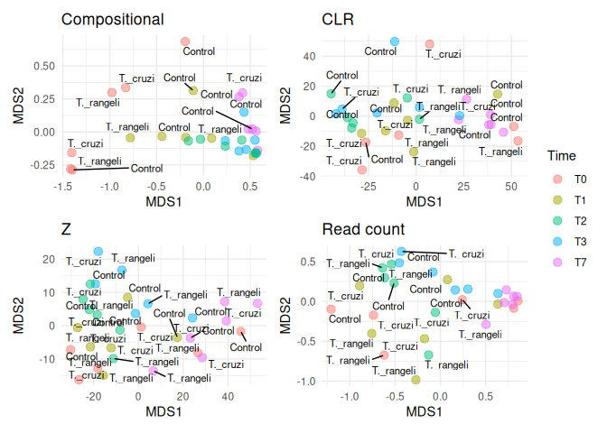
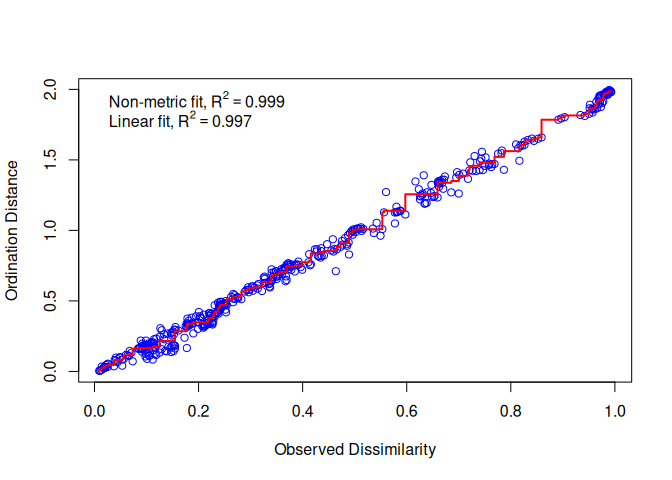

Diversity indices
================
Vincent Manzanilla, INTERTRYP

``` r
library(dplyr)
```

    ## 
    ## Attaching package: 'dplyr'

    ## The following objects are masked from 'package:stats':
    ## 
    ##     filter, lag

    ## The following objects are masked from 'package:base':
    ## 
    ##     intersect, setdiff, setequal, union

``` r
library(tibble)
library(microbiome)
```

    ## Loading required package: phyloseq

    ## Loading required package: ggplot2

    ## 
    ## microbiome R package (microbiome.github.com)
    ##     
    ## 
    ## 
    ##  Copyright (C) 2011-2022 Leo Lahti, 
    ##     Sudarshan Shetty et al. <microbiome.github.io>

    ## 
    ## Attaching package: 'microbiome'

    ## The following object is masked from 'package:ggplot2':
    ## 
    ##     alpha

    ## The following object is masked from 'package:base':
    ## 
    ##     transform

``` r
library(vegan)
```

    ## Loading required package: permute

    ## Loading required package: lattice

    ## This is vegan 2.6-7

    ## 
    ## Attaching package: 'vegan'

    ## The following object is masked from 'package:microbiome':
    ## 
    ##     diversity

``` r
library(FSA)
```

    ## ## FSA v0.9.5. See citation('FSA') if used in publication.
    ## ## Run fishR() for related website and fishR('IFAR') for related book.

``` r
library(SingleCellExperiment)
```

    ## Loading required package: SummarizedExperiment

    ## Loading required package: MatrixGenerics

    ## Loading required package: matrixStats

    ## 
    ## Attaching package: 'matrixStats'

    ## The following object is masked from 'package:dplyr':
    ## 
    ##     count

    ## 
    ## Attaching package: 'MatrixGenerics'

    ## The following objects are masked from 'package:matrixStats':
    ## 
    ##     colAlls, colAnyNAs, colAnys, colAvgsPerRowSet, colCollapse,
    ##     colCounts, colCummaxs, colCummins, colCumprods, colCumsums,
    ##     colDiffs, colIQRDiffs, colIQRs, colLogSumExps, colMadDiffs,
    ##     colMads, colMaxs, colMeans2, colMedians, colMins, colOrderStats,
    ##     colProds, colQuantiles, colRanges, colRanks, colSdDiffs, colSds,
    ##     colSums2, colTabulates, colVarDiffs, colVars, colWeightedMads,
    ##     colWeightedMeans, colWeightedMedians, colWeightedSds,
    ##     colWeightedVars, rowAlls, rowAnyNAs, rowAnys, rowAvgsPerColSet,
    ##     rowCollapse, rowCounts, rowCummaxs, rowCummins, rowCumprods,
    ##     rowCumsums, rowDiffs, rowIQRDiffs, rowIQRs, rowLogSumExps,
    ##     rowMadDiffs, rowMads, rowMaxs, rowMeans2, rowMedians, rowMins,
    ##     rowOrderStats, rowProds, rowQuantiles, rowRanges, rowRanks,
    ##     rowSdDiffs, rowSds, rowSums2, rowTabulates, rowVarDiffs, rowVars,
    ##     rowWeightedMads, rowWeightedMeans, rowWeightedMedians,
    ##     rowWeightedSds, rowWeightedVars

    ## Loading required package: GenomicRanges

    ## Loading required package: stats4

    ## Loading required package: BiocGenerics

    ## 
    ## Attaching package: 'BiocGenerics'

    ## The following objects are masked from 'package:dplyr':
    ## 
    ##     combine, intersect, setdiff, union

    ## The following objects are masked from 'package:stats':
    ## 
    ##     IQR, mad, sd, var, xtabs

    ## The following objects are masked from 'package:base':
    ## 
    ##     anyDuplicated, aperm, append, as.data.frame, basename, cbind,
    ##     colnames, dirname, do.call, duplicated, eval, evalq, Filter, Find,
    ##     get, grep, grepl, intersect, is.unsorted, lapply, Map, mapply,
    ##     match, mget, order, paste, pmax, pmax.int, pmin, pmin.int,
    ##     Position, rank, rbind, Reduce, rownames, sapply, setdiff, table,
    ##     tapply, union, unique, unsplit, which.max, which.min

    ## Loading required package: S4Vectors

    ## 
    ## Attaching package: 'S4Vectors'

    ## The following objects are masked from 'package:dplyr':
    ## 
    ##     first, rename

    ## The following object is masked from 'package:utils':
    ## 
    ##     findMatches

    ## The following objects are masked from 'package:base':
    ## 
    ##     expand.grid, I, unname

    ## Loading required package: IRanges

    ## 
    ## Attaching package: 'IRanges'

    ## The following object is masked from 'package:microbiome':
    ## 
    ##     coverage

    ## The following object is masked from 'package:phyloseq':
    ## 
    ##     distance

    ## The following objects are masked from 'package:dplyr':
    ## 
    ##     collapse, desc, slice

    ## Loading required package: GenomeInfoDb

    ## Loading required package: Biobase

    ## Welcome to Bioconductor
    ## 
    ##     Vignettes contain introductory material; view with
    ##     'browseVignettes()'. To cite Bioconductor, see
    ##     'citation("Biobase")', and for packages 'citation("pkgname")'.

    ## 
    ## Attaching package: 'Biobase'

    ## The following object is masked from 'package:MatrixGenerics':
    ## 
    ##     rowMedians

    ## The following objects are masked from 'package:matrixStats':
    ## 
    ##     anyMissing, rowMedians

    ## The following object is masked from 'package:phyloseq':
    ## 
    ##     sampleNames

``` r
library(ggrepel)
library(patchwork)
```

``` r
setwd("~/Metagenomics_2024/Day_2/")
merged_metagenomes <- phyloseq::import_biom("../DATA//merge_species.biom") 
meta <- read.csv(file = "../DATA/tryp_metadata.csv", sep = ",")

# Sort the 'meta' data frame by the 'SRA.identifier' column
meta <- meta %>% arrange(row_number(SRA.identifier))

# Associate the sorted metadata to the phyloseq object as sample data
merged_metagenomes@sam_data <- sample_data(meta)

# Extract the sample names from the 'meta' data frame
column_name <- meta %>% pull(Sample)

# Associate the extracted sample names to the phyloseq object
sample_names(merged_metagenomes) <- column_name

# Remove the unnecessary 'k_' prefix in the taxonomy data
merged_metagenomes@tax_table@.Data <- substring(merged_metagenomes@tax_table@.Data, 4)

# Rename the columns of the taxonomy table to represent taxonomic ranks
colnames(merged_metagenomes@tax_table@.Data) <- c("Kingdom", "Phylum", "Class", "Order", "Family", "Genus", "Species")

#Keep only the kingdom of interest
merged_metagenomes <- subset_taxa(merged_metagenomes, Kingdom %in% c("Archaea", "Bacteria", "Fungi", "Viruses"))
head(sample_data(merged_metagenomes))
```

    ##            Sample SRA.identifier       Type Time Number.of.days Gut     Reads
    ## T1rangPM T1rangPM    SRR15276518 T._rangeli   T1              1  PM  7.701240
    ## T1rangAM T1rangAM    SRR15276519 T._rangeli   T1              1  AM 42.786669
    ## T0ContPM T0ContPM    SRR15276520    Control   T0              0  PM 12.945862
    ## T0ContAM T0ContAM    SRR15276521    Control   T0              0  AM 33.104564
    ## T1cruzPM T1cruzPM    SRR15276522   T._cruzi   T1              1  PM  9.564389
    ## T1cruzAM T1cruzAM    SRR15276523   T._cruzi   T1              1  AM 18.341077

``` r
head(tax_table(merged_metagenomes))
```

    ## Taxonomy Table:     [6 taxa by 7 taxonomic ranks]:
    ##         Kingdom    Phylum      Class     Order             Family           
    ## 1351    "Bacteria" "Bacillota" "Bacilli" "Lactobacillales" "Enterococcaceae"
    ## 2920934 "Bacteria" "Bacillota" "Bacilli" "Lactobacillales" "Enterococcaceae"
    ## 1352    "Bacteria" "Bacillota" "Bacilli" "Lactobacillales" "Enterococcaceae"
    ## 417368  "Bacteria" "Bacillota" "Bacilli" "Lactobacillales" "Enterococcaceae"
    ## 118060  "Bacteria" "Bacillota" "Bacilli" "Lactobacillales" "Enterococcaceae"
    ## 167972  "Bacteria" "Bacillota" "Bacilli" "Lactobacillales" "Enterococcaceae"
    ##         Genus          Species                      
    ## 1351    "Enterococcus" "faecalis"                   
    ## 2920934 "Enterococcus" "sp. LX10"                   
    ## 1352    "Enterococcus" "faecium"                    
    ## 417368  "Enterococcus" "thailandicus"               
    ## 118060  "Enterococcus" "rotai"                      
    ## 167972  "Enterococcus" "uncultured Enterococcus sp."

# How to make subset?

``` r
block_control <- phyloseq::subset_samples(merged_metagenomes, Type == "Control")
block_cruzi <- phyloseq::subset_samples(merged_metagenomes, Type == "T._cruzi")
block_rangeli <- phyloseq::subset_samples(merged_metagenomes, Type == "T._rangeli")

block_bacteria <- phyloseq::subset_taxa(merged_metagenomes, Kingdom == "Bacteria")
block_fungi <- phyloseq::subset_taxa(merged_metagenomes, Kingdom == "Fungi")
block_virus <- phyloseq::subset_taxa(merged_metagenomes, Kingdom == "Viruses")

# then aggregate...
#aggregate_rare(block_virus, level = "Genus", detection = 0.1 / 100, prevalence = 50 / 100)

# Then Explore.... 
#unique(merged_metagenomes@tax_table@.Data[,"Phylum"])
```

### Data Normalization

Data transformations are common in (microbial) ecology (Legendre 2001)
and used to improve compatibility with assumptions related to specific
statistical methods, mitigate biases, enhance the comparability of
samples or features, or to obtain more interpretable values.

Examples include the logarithmic transformation, calculation of relative
abundances (percentages), and compositionality-aware transformations
such as the centered log-ratio transformation (clr).

Let us summarize some commonly used transformations in microbiome data
science; further details and benchmarkings available in the references:

- *relabundance* relative transformation; also known as total sum
  scaling (TSS) and compositional transformation. This converts counts
  into percentages (at the scale \[0, 1\]) that sum up to. Much of the
  currently available taxonomic abundance data from high-throughput
  assays (16S, metagenomic sequencing) is compositional by nature, even
  if the data is provided as counts (Gloor et al. 2017).

- *clr* Centered log ratio transformation (Aitchison 1986) is used to
  reduce data skewness and compositionality bias in relative abundances,
  while bringing the data to the logarithmic scale. This transformation
  is frequently applied in microbial ecology (Gloor et al. 2017).
  However, this transformation only applies to positive values. Usual
  solution is to add pseudocount, which adds another type of bias in the
  data. The robust clr transformation (‘rclr’) aims to circumvent the
  need to add a pseudocount. While the resulting values from these
  transformations are difficult interpret directly, this transformation
  may enhance comparability of relative differences between samples. It
  is part of a broader Aitchison family of transformations; the additive
  log ratio transformation (\`alr’) is also available. The robust clr
  (“rclr”) is similar to regular clr (see above) but allows data with
  zeroes and avoids the need to add pseudocount Martino et al. (2019).
  See library *compositions*.

- *pa* presence/absence transformation ignores abundances and only
  indicates whether the given feature is detected above the given
  threshold (default: 0). This simple transformation is relatively
  widely used in ecological research. It has shown good performance in
  microbiome-based classification performance (Giliberti et al. 2022,
  Karwowska2024).

- *z* Z transformation scales data to zero mean and unit variance; this
  us used to bring features (or samples) to more comparable levels in
  terms of mean and scale of the values. This can enhance visualization
  and interpretation of the data

- *log*, *log2*, *log10* Logarithmic transformations; used e.g. to
  reduce data skewness; with compositional data the clr (or rclr)
  transformation is often preferred.

- *hellinger* Hellinger transformation equals to the square root of
  relative abundances. This ecological transformation can be useful if
  we are interested in changes in relative abundances.

- *rank* Rank transformation replaces each value by its rank. Also see
  ‘rrank’ (relative rank transformation). This has use for instance in
  non-parametric statistics.

- Other available transformations include Chi square (‘chi.square’),
  Frequency transformation (‘frequency’), and Make margin sum of squares
  equal to one (‘normalize’)

The data contains read counts. We can convert these into relative
abundances and other formats. Compare abundance of a given taxonomic
group using the example data before and after the compositionality
transformation (with a cross-plot, for instance). You can also compare
the results to CLR-transformed data (see e.g. Gloor et al. 2017)

Have a look at the function *?microbiome::transform*.

``` r
pseq <- microbiome::aggregate_rare(merged_metagenomes, level = "Species", detection = 0.05/100, prevalence = 20/100)


set.seed(34521)

# Read count
pseq_read  <- abundances(pseq) %>% as.data.frame()  
pseq_read <- pseq_read[order(rowSums(pseq_read), decreasing = TRUE), ] %>% t()
# Calculate distance matrix
pseq_comp <- vegdist(pseq_read, method = "bray")
# Perform NMDS on distance matrix
nmds_spec <- metaMDS(pseq_read, distance = "bray",k = 2)
```

    ## Square root transformation
    ## Wisconsin double standardization
    ## Run 0 stress 0.09928841 
    ## Run 1 stress 0.1424204 
    ## Run 2 stress 0.1400219 
    ## Run 3 stress 0.1413228 
    ## Run 4 stress 0.1508338 
    ## Run 5 stress 0.1324294 
    ## Run 6 stress 0.130698 
    ## Run 7 stress 0.09928841 
    ## ... Procrustes: rmse 1.17411e-06  max resid 4.229712e-06 
    ## ... Similar to previous best
    ## Run 8 stress 0.09928841 
    ## ... Procrustes: rmse 5.106201e-06  max resid 1.733133e-05 
    ## ... Similar to previous best
    ## Run 9 stress 0.1037235 
    ## Run 10 stress 0.130698 
    ## Run 11 stress 0.09928841 
    ## ... Procrustes: rmse 3.760348e-06  max resid 1.373615e-05 
    ## ... Similar to previous best
    ## Run 12 stress 0.1469236 
    ## Run 13 stress 0.09928841 
    ## ... Procrustes: rmse 2.86878e-06  max resid 1.076915e-05 
    ## ... Similar to previous best
    ## Run 14 stress 0.1354931 
    ## Run 15 stress 0.1037235 
    ## Run 16 stress 0.1324294 
    ## Run 17 stress 0.145779 
    ## Run 18 stress 0.1037235 
    ## Run 19 stress 0.1508978 
    ## Run 20 stress 0.1037235 
    ## *** Best solution repeated 4 times

``` r
# Extract and reshape the data to plot ordination as ggplot  and add the metadata
# Convert the NMDS points to a data frame
nmds_spec_gg <- as.data.frame(nmds_spec$points)
# Add the "Sample" column based on row names
nmds_spec_gg <- nmds_spec_gg %>% rownames_to_column("Sample")
# Merge the NMDS data with the metadata by the "Sample" column
merged_data <- dplyr::left_join(meta, nmds_spec_gg, by = "Sample")
plt_read <- ggplot(merged_data, aes(x = MDS1, y = MDS2)) +
  geom_point(aes(color = Time), size = 3, alpha = 0.5) +
  geom_text_repel(aes(label = Type), size = 3, color = "black") +
  ggtitle("Read count") +
  theme_minimal()
#plt_read


# abundances
pseq_comp <- microbiome::transform(pseq, transform = "compositional")
pseq_comp  <- abundances(pseq_comp) %>% as.data.frame()  
pseq_comp <- pseq_comp[order(rowSums(pseq_comp), decreasing = TRUE), ] %>% t()
# Calculate distance matrix
pseq_comp <- vegdist(pseq_comp, method = "bray")
# Perform NMDS on distance matrix
nmds_spec <- metaMDS(pseq_comp, distance = "bray",k = 2)
```

    ## Run 0 stress 0.03465921 
    ## Run 1 stress 0.03465927 
    ## ... Procrustes: rmse 4.684945e-05  max resid 8.061315e-05 
    ## ... Similar to previous best
    ## Run 2 stress 0.03468829 
    ## ... Procrustes: rmse 0.009695058  max resid 0.04237667 
    ## Run 3 stress 0.04162701 
    ## Run 4 stress 0.04162719 
    ## Run 5 stress 0.06000625 
    ## Run 6 stress 0.0416271 
    ## Run 7 stress 0.04485463 
    ## Run 8 stress 0.04171441 
    ## Run 9 stress 0.03465923 
    ## ... Procrustes: rmse 1.865997e-05  max resid 3.466382e-05 
    ## ... Similar to previous best
    ## Run 10 stress 0.05784643 
    ## Run 11 stress 0.0346592 
    ## ... New best solution
    ## ... Procrustes: rmse 3.995399e-05  max resid 6.61956e-05 
    ## ... Similar to previous best
    ## Run 12 stress 0.05776629 
    ## Run 13 stress 0.04162699 
    ## Run 14 stress 0.05566586 
    ## Run 15 stress 0.0351777 
    ## Run 16 stress 0.05874369 
    ## Run 17 stress 0.0448546 
    ## Run 18 stress 0.0587439 
    ## Run 19 stress 0.04162701 
    ## Run 20 stress 0.0575914 
    ## *** Best solution repeated 1 times

``` r
# Extract and reshape the data to plot ordination as ggplot  and add the metadata
# Convert the NMDS points to a data frame
nmds_spec_gg <- as.data.frame(nmds_spec$points)
# Add the "Sample" column based on row names
nmds_spec_gg <- nmds_spec_gg %>% rownames_to_column("Sample")
# Merge the NMDS data with the metadata by the "Sample" column
merged_data <- dplyr::left_join(meta, nmds_spec_gg, by = "Sample")
plt_comp <- ggplot(merged_data, aes(x = MDS1, y = MDS2)) +
  geom_point(aes(color = Time), size = 3, alpha = 0.5) +
  geom_text_repel(aes(label = Type), size = 3, color = "black") +
  ggtitle("Compositional") +
  theme_minimal()
#plt_comp

# clr
pseq_clr <- microbiome::transform(pseq, transform = "clr")
pseq_clr  <- abundances(pseq_clr) %>% as.data.frame()  
pseq_clr <- pseq_clr[order(rowSums(pseq_clr), decreasing = TRUE), ] %>% t()
# Calculate distance matrix
pseq_clr <- vegdist(pseq_clr, method = "euclidian")
# Perform NMDS on distance matrix
nmds_spec <- metaMDS(pseq_clr, distance = "bray",k = 2)
```

    ## Run 0 stress 0.09378501 
    ## Run 1 stress 0.132766 
    ## Run 2 stress 0.09814935 
    ## Run 3 stress 0.1165748 
    ## Run 4 stress 0.1085365 
    ## Run 5 stress 0.106394 
    ## Run 6 stress 0.1176979 
    ## Run 7 stress 0.1101868 
    ## Run 8 stress 0.1145532 
    ## Run 9 stress 0.1250582 
    ## Run 10 stress 0.1233759 
    ## Run 11 stress 0.1189043 
    ## Run 12 stress 0.1078436 
    ## Run 13 stress 0.1271603 
    ## Run 14 stress 0.1098323 
    ## Run 15 stress 0.1105668 
    ## Run 16 stress 0.09887251 
    ## Run 17 stress 0.1112674 
    ## Run 18 stress 0.1015379 
    ## Run 19 stress 0.1239763 
    ## Run 20 stress 0.1163436 
    ## *** Best solution was not repeated -- monoMDS stopping criteria:
    ##     19: stress ratio > sratmax
    ##      1: scale factor of the gradient < sfgrmin

``` r
# Extract and reshape the data to plot ordination as ggplot  and add the metadata
# Convert the NMDS points to a data frame
nmds_spec_gg <- as.data.frame(nmds_spec$points)
# Add the "Sample" column based on row names
nmds_spec_gg <- nmds_spec_gg %>% rownames_to_column("Sample")
# Merge the NMDS data with the metadata by the "Sample" column
merged_data <- dplyr::left_join(meta, nmds_spec_gg, by = "Sample")
plt_clr <- ggplot(merged_data, aes(x = MDS1, y = MDS2)) +
  geom_point(aes(color = Time), size = 3, alpha = 0.5) +
  geom_text_repel(aes(label = Type), size = 3, color = "black") +
  ggtitle("CLR") +
  theme_minimal()
#plt_clr


# Z
pseq_z <- microbiome::transform(pseq, transform = "Z")
```

    ## Warning in transform(x, "log10"): OTU table contains zeroes. Using log10(1 + x)
    ## transform.

``` r
pseq_z  <- abundances(pseq_z) %>% as.data.frame()  
pseq_z <- pseq_z[order(rowSums(pseq_z), decreasing = TRUE), ] %>% t()
# Calculate distance matrix
pseq_clr <- vegdist(pseq_z, method = "euclidian")
# Perform NMDS on distance matrix
nmds_spec <- metaMDS(pseq_clr, distance = "bray",k = 2)
```

    ## Run 0 stress 0.06135538 
    ## Run 1 stress 0.06135538 
    ## ... New best solution
    ## ... Procrustes: rmse 1.047956e-05  max resid 2.818738e-05 
    ## ... Similar to previous best
    ## Run 2 stress 0.08835082 
    ## Run 3 stress 0.06135538 
    ## ... Procrustes: rmse 1.06213e-05  max resid 2.350237e-05 
    ## ... Similar to previous best
    ## Run 4 stress 0.06135538 
    ## ... Procrustes: rmse 1.022641e-05  max resid 3.227241e-05 
    ## ... Similar to previous best
    ## Run 5 stress 0.06135539 
    ## ... Procrustes: rmse 3.090389e-05  max resid 8.507074e-05 
    ## ... Similar to previous best
    ## Run 6 stress 0.06135547 
    ## ... Procrustes: rmse 9.311071e-05  max resid 0.0003794802 
    ## ... Similar to previous best
    ## Run 7 stress 0.06135539 
    ## ... Procrustes: rmse 2.026281e-05  max resid 6.747661e-05 
    ## ... Similar to previous best
    ## Run 8 stress 0.06135539 
    ## ... Procrustes: rmse 2.579547e-05  max resid 8.487258e-05 
    ## ... Similar to previous best
    ## Run 9 stress 0.06135546 
    ## ... Procrustes: rmse 8.734517e-05  max resid 0.0003554468 
    ## ... Similar to previous best
    ## Run 10 stress 0.0613554 
    ## ... Procrustes: rmse 4.090775e-05  max resid 0.000166799 
    ## ... Similar to previous best
    ## Run 11 stress 0.06135539 
    ## ... Procrustes: rmse 2.233234e-05  max resid 7.199179e-05 
    ## ... Similar to previous best
    ## Run 12 stress 0.06135547 
    ## ... Procrustes: rmse 8.783176e-05  max resid 0.0003560416 
    ## ... Similar to previous best
    ## Run 13 stress 0.06135539 
    ## ... Procrustes: rmse 2.827592e-05  max resid 8.774141e-05 
    ## ... Similar to previous best
    ## Run 14 stress 0.06135541 
    ## ... Procrustes: rmse 4.584634e-05  max resid 0.0001874827 
    ## ... Similar to previous best
    ## Run 15 stress 0.06135539 
    ## ... Procrustes: rmse 2.005869e-05  max resid 5.284576e-05 
    ## ... Similar to previous best
    ## Run 16 stress 0.06135539 
    ## ... Procrustes: rmse 3.067574e-05  max resid 0.0001265981 
    ## ... Similar to previous best
    ## Run 17 stress 0.06135539 
    ## ... Procrustes: rmse 1.340424e-05  max resid 3.133451e-05 
    ## ... Similar to previous best
    ## Run 18 stress 0.06135552 
    ## ... Procrustes: rmse 9.896479e-05  max resid 0.000398966 
    ## ... Similar to previous best
    ## Run 19 stress 0.06135539 
    ## ... Procrustes: rmse 1.075937e-05  max resid 3.79943e-05 
    ## ... Similar to previous best
    ## Run 20 stress 0.06135542 
    ## ... Procrustes: rmse 6.30542e-05  max resid 0.0002578524 
    ## ... Similar to previous best
    ## *** Best solution repeated 19 times

``` r
# Extract and reshape the data to plot ordination as ggplot  and add the metadata
# Convert the NMDS points to a data frame
nmds_spec_gg <- as.data.frame(nmds_spec$points)
# Add the "Sample" column based on row names
nmds_spec_gg <- nmds_spec_gg %>% rownames_to_column("Sample")
# Merge the NMDS data with the metadata by the "Sample" column
merged_data <- dplyr::left_join(meta, nmds_spec_gg, by = "Sample")
plt_z <- ggplot(merged_data, aes(x = MDS1, y = MDS2)) +
  geom_point(aes(color = Time), size = 3, alpha = 0.5) +
  geom_text_repel(aes(label = Type), size = 3, color = "black") +
  ggtitle("Z") +
  theme_minimal()
#plt_z
```

``` r
list_plot <- list(plt_comp, plt_clr, plt_z, plt_read)
# Combine all plots using patchwork
combined_plot <- wrap_plots(list_plot) +
  plot_layout(guides = "collect")
print(combined_plot)
```

    ## Warning: ggrepel: 16 unlabeled data points (too many overlaps). Consider
    ## increasing max.overlaps

    ## Warning: ggrepel: 8 unlabeled data points (too many overlaps). Consider
    ## increasing max.overlaps

    ## Warning: ggrepel: 10 unlabeled data points (too many overlaps). Consider
    ## increasing max.overlaps

<!-- -->

**Q: Which normalization is the best?**

## 2 Beta diversity

Beta diversity quantifies the dissimilarity between communities
(multiple samples), as opposed to alpha diversity which focuses on
variation within a community (one sample). In microbiome research,
commonly used metrics of beta diversity include the Bray-Curtis index
(for compositional data), Jaccard index (for presence/absence data,
ignoring abundance information), Aitchison distance (Euclidean distance
for clr transformed abundances, aiming to avoid the compositionality
bias), and the Unifrac distance (that takes into account the
phylogenetic tree information). Notably, only some of these measures are
actual distances, as this is a mathematical concept whose definition is
not satisfied by certain ecological measure, such as the Bray-Curtis
index. Therefore, the terms dissimilarity and beta diversity are
preferred.

| Method description          | Assay type          | Beta diversity metric |
|-----------------------------|---------------------|-----------------------|
| Quantitative profiling      | Absolute counts     | Bray-Curtis           |
| Relative profiling          | Relative abundances | Bray-Curtis           |
| Aitchison distance          | Absolute counts     | **Aitchison**         |
| Aitchison distance          | clr                 | Euclidean             |
| Robust Aitchison distance   | rclr                | Euclidean             |
| Presence/Absence similarity | Relative abundances | **Jaccard**           |
| Presence/Absence similarity | Absolute counts     | **Jaccard**           |
| Phylogenetic distance       | Rarefied counts     | Unifrac               |

In practice, beta diversity is usually represented as a *dist* object, a
triangular matrix where the distance between each pair of samples is
encoded by a specific cell. This distance matrix can then undergo
ordination, which is an important ecological tool to reduce the
dimensionality of data for a more efficient analysis and visualization.
Ordination techniques aim to capture as much essential information from
the data as possible and turn it into a lower dimensional
representation. Dimension reduction is bound to lose information but
commonly used ordination techniques can preserve relevant information of
sample similarities in an optimal way, which is defined in different
ways by different methods.

Based on the type of algorithm, ordination methods in microbiome
research can be generally divided in two categories: unsupervised and
supervised ordination. The former includes Principal Coordinate Analysis
(PCoA), Principal Component Analysis (PCA) and Uniform Manifold
Approximation and Projection for Dimension Reduction (UMAP), whereas the
latter is mainly represented by distance-based Redundancy Analysis
(dbRDA). We will first discuss unsupervised ordination methods and then
proceed to supervised ones.

### 2.1 Unsupervised ordination

Unsupervised ordination methods variation in the data without additional
information on covariates or other supervision of the model. Among the
different approaches, Multi-Dimensional Scaling (MDS) and non-metric MDS
(NMDS) can be regarded as the standard. They are jointly referred to as
PCoA.

A typical comparison of community compositions starts with a visual
representation of the groups by a 2D ordination. Then we estimate
relative abundances and MDS ordination based on Bray-Curtis index
between the groups, and visualize the results.

``` r
# To ensure reproducibility we can fix the seed here. This will ensure you always get the same result each time you run your data.
set.seed(34521)

pseq <- aggregate_rare(merged_metagenomes, level = "Genus", detection = 0.1/100, prevalence = 50/100)
pseq <- microbiome::transform(pseq, transform = "compositional")
# abundances(pseq)
pseq  <- abundances(pseq) %>% as.data.frame() 
pseq <- pseq <- pseq[order(rowSums(pseq), decreasing = TRUE), ] %>% t()

# Calculate distance matrix
species_frac_filtered_dist <- vegdist(pseq, method = "bray")

# Perform NMDS on distance matrix
nmds_spec <- metaMDS(species_frac_filtered_dist, distance = "bray",k = 2)
```

    ## Run 0 stress 0.03362996 
    ## Run 1 stress 0.0336299 
    ## ... New best solution
    ## ... Procrustes: rmse 0.0001257671  max resid 0.0002233539 
    ## ... Similar to previous best
    ## Run 2 stress 0.0339897 
    ## ... Procrustes: rmse 0.01002435  max resid 0.04134134 
    ## Run 3 stress 0.03362999 
    ## ... Procrustes: rmse 5.825382e-05  max resid 0.0001048328 
    ## ... Similar to previous best
    ## Run 4 stress 0.06288395 
    ## Run 5 stress 0.04144533 
    ## Run 6 stress 0.04452223 
    ## Run 7 stress 0.05896259 
    ## Run 8 stress 0.03398968 
    ## ... Procrustes: rmse 0.009997987  max resid 0.04149452 
    ## Run 9 stress 0.05778166 
    ## Run 10 stress 0.05752581 
    ## Run 11 stress 0.03362988 
    ## ... New best solution
    ## ... Procrustes: rmse 3.457753e-05  max resid 6.164393e-05 
    ## ... Similar to previous best
    ## Run 12 stress 0.03398975 
    ## ... Procrustes: rmse 0.01002627  max resid 0.04135569 
    ## Run 13 stress 0.03398965 
    ## ... Procrustes: rmse 0.01000719  max resid 0.04146811 
    ## Run 14 stress 0.05573411 
    ## Run 15 stress 0.05535289 
    ## Run 16 stress 0.05817008 
    ## Run 17 stress 0.05810237 
    ## Run 18 stress 0.0336299 
    ## ... Procrustes: rmse 2.72224e-05  max resid 4.87934e-05 
    ## ... Similar to previous best
    ## Run 19 stress 0.0614943 
    ## Run 20 stress 0.06068536 
    ## *** Best solution repeated 2 times

Check the output.

``` r
# Check the output
nmds_spec
```

    ## 
    ## Call:
    ## metaMDS(comm = species_frac_filtered_dist, distance = "bray",      k = 2) 
    ## 
    ## global Multidimensional Scaling using monoMDS
    ## 
    ## Data:     species_frac_filtered_dist 
    ## Distance: bray 
    ## 
    ## Dimensions: 2 
    ## Stress:     0.03362988 
    ## Stress type 1, weak ties
    ## Best solution was repeated 2 times in 20 tries
    ## The best solution was from try 11 (random start)
    ## Scaling: centring, PC rotation, halfchange scaling 
    ## Species: scores missing

Here you see a kind of summary of the analysis. For example, you can see
that you used 2 dimensions and the stress was approx. 0.03. In general
if a stress is above 0.2 then the clustering is not reliably
representing the data and should be interpreted with caution. But here
the stress is below 0.2, so we are okay.

Now let’s look at the ordination. To plot the data with ggplot, we need
to extract the coordinaties of each point from nmds_spec\$points.

``` r
# Extract and reshape the data to plot ordination as ggplot  and add the metadata
# Convert the NMDS points to a data frame
nmds_spec_gg <- as.data.frame(nmds_spec$points)

# Add the "Sample" column based on row names
nmds_spec_gg <- nmds_spec_gg %>% rownames_to_column("Sample")

# Merge the NMDS data with the metadata by the "Sample" column
merged_data <- dplyr::left_join(meta, nmds_spec_gg, by = "Sample")
```

Then we can create the plot easily and color according to the metadata.
We are choosing timepoint and mocktreat for the coloring respectively.
But feel free to explore other parameters.

``` r
ggplot(merged_data, aes(x = MDS1, y = MDS2)) +
    geom_point(aes(color = Time), size = 3, alpha = 0.5) +
    geom_text_repel(aes(label = Type), size = 3, color = "black") +
    ggtitle("NMDS colored according to Time") +
    theme_minimal()
```


``` r
ggplot(merged_data, aes(x = MDS1, y = MDS2)) +
    geom_point(aes(color = Reads), size = 3, alpha = 0.5) +
    geom_text_repel(aes(label = Time), size = 3, color = "black") +
    scale_color_continuous(name = "Reads") +  # Add a continuous color scale
    ggtitle("NMDS colored according to Reads numbers") +
    theme_minimal()
```


A few combinations of beta diversity metrics and assay types are
typically used. For instance, Bray-Curtis dissimilarity and Euclidean
distance are often applied to the relative abundance and the clr assays,
respectively. Besides beta diversity metric and assay type, the PCoA
algorithm is also a variable that should be considered. Below, we show
how the choice of these three factors can affect the resulting
lower-dimensional data.

``` r
# Run NMDS on relabundance assay with Bray-Curtis distances
pseq <- aggregate_rare(merged_metagenomes, level = "Genus", detection = 0.1/100, prevalence = 50/100)
pseq <- microbiome::transform(pseq, transform = "compositional")
# abundances(pseq)
pseq  <- abundances(pseq) %>% as.data.frame() 
pseq <- pseq <- pseq[order(rowSums(pseq), decreasing = TRUE), ] %>% t()
# Calculate distance matrix
species_frac_filtered_dist_bray <- vegdist(pseq, method = "bray")
# Perform NMDS on distance matrix
nmds_spec_comp_bray <- metaMDS(species_frac_filtered_dist_bray,distance = "bray",k = 2)
```

    ## Run 0 stress 0.03362996 
    ## Run 1 stress 0.03362994 
    ## ... New best solution
    ## ... Procrustes: rmse 2.517756e-05  max resid 7.99797e-05 
    ## ... Similar to previous best
    ## Run 2 stress 0.03398969 
    ## ... Procrustes: rmse 0.009980697  max resid 0.04169512 
    ## Run 3 stress 0.04150819 
    ## Run 4 stress 0.04150804 
    ## Run 5 stress 0.05924 
    ## Run 6 stress 0.04144544 
    ## Run 7 stress 0.0446174 
    ## Run 8 stress 0.04144544 
    ## Run 9 stress 0.03362999 
    ## ... Procrustes: rmse 2.613272e-05  max resid 4.637768e-05 
    ## ... Similar to previous best
    ## Run 10 stress 0.05831549 
    ## Run 11 stress 0.03362988 
    ## ... New best solution
    ## ... Procrustes: rmse 8.202762e-05  max resid 0.0001496796 
    ## ... Similar to previous best
    ## Run 12 stress 0.05817021 
    ## Run 13 stress 0.04144542 
    ## Run 14 stress 0.05748917 
    ## Run 15 stress 0.03398972 
    ## ... Procrustes: rmse 0.0100232  max resid 0.04137259 
    ## Run 16 stress 0.05810249 
    ## Run 17 stress 0.04144545 
    ## Run 18 stress 0.05778144 
    ## Run 19 stress 0.04144542 
    ## Run 20 stress 0.05817676 
    ## *** Best solution repeated 1 times

``` r
# Run NMDS on compositional assay with Euclidean distances
# Calculate distance matrix
species_frac_filtered_dist_euclidean <- vegdist(pseq, method = "euclidean")
# Perform NMDS on distance matrix
nmds_spec_comp_euclidean <- metaMDS(species_frac_filtered_dist_euclidean,distance = "euclidean",k = 2)
```

    ## Run 0 stress 0.007739837 
    ## Run 1 stress 0.02284928 
    ## Run 2 stress 0.02292606 
    ## Run 3 stress 0.007740427 
    ## ... Procrustes: rmse 0.002822558  max resid 0.01294398 
    ## Run 4 stress 0.01336195 
    ## Run 5 stress 0.007740287 
    ## ... Procrustes: rmse 0.002826063  max resid 0.01292524 
    ## Run 6 stress 0.00819932 
    ## ... Procrustes: rmse 0.009693796  max resid 0.03835989 
    ## Run 7 stress 0.008282441 
    ## Run 8 stress 0.007740289 
    ## ... Procrustes: rmse 0.002826031  max resid 0.01292548 
    ## Run 9 stress 0.007740324 
    ## ... Procrustes: rmse 0.002824945  max resid 0.01293063 
    ## Run 10 stress 0.02293236 
    ## Run 11 stress 0.008199333 
    ## ... Procrustes: rmse 0.009694176  max resid 0.03834877 
    ## Run 12 stress 0.008273883 
    ## Run 13 stress 0.022853 
    ## Run 14 stress 0.01336205 
    ## Run 15 stress 0.02101797 
    ## Run 16 stress 0.01336186 
    ## Run 17 stress 0.01327813 
    ## Run 18 stress 0.008273854 
    ## Run 19 stress 0.00774005 
    ## ... Procrustes: rmse 7.269943e-05  max resid 0.0001752729 
    ## ... Similar to previous best
    ## Run 20 stress 0.01336166 
    ## *** Best solution repeated 1 times

``` r
# Run NMDS on compositional assay with Aitchison distances
# Calculate distance matrix
species_frac_filtered_dist_aitchison <- vegdist(pseq, method = "robust.aitchison")
# Perform NMDS on distance matrix
nmds_spec_comp_aitchison <- metaMDS(species_frac_filtered_dist_aitchison,distance = "robust.aitchison",k = 2)
```

    ## Run 0 stress 0.1172405 
    ## Run 1 stress 0.1465789 
    ## Run 2 stress 0.1513655 
    ## Run 3 stress 0.1172406 
    ## ... Procrustes: rmse 0.0001538783  max resid 0.000660751 
    ## ... Similar to previous best
    ## Run 4 stress 0.1131166 
    ## ... New best solution
    ## ... Procrustes: rmse 0.02751694  max resid 0.1211573 
    ## Run 5 stress 0.1172406 
    ## Run 6 stress 0.1131165 
    ## ... New best solution
    ## ... Procrustes: rmse 3.099105e-05  max resid 0.0001323215 
    ## ... Similar to previous best
    ## Run 7 stress 0.1644752 
    ## Run 8 stress 0.1131167 
    ## ... Procrustes: rmse 4.010913e-05  max resid 0.0001276984 
    ## ... Similar to previous best
    ## Run 9 stress 0.1172405 
    ## Run 10 stress 0.1923506 
    ## Run 11 stress 0.1550482 
    ## Run 12 stress 0.113127 
    ## ... Procrustes: rmse 0.004699189  max resid 0.01863022 
    ## Run 13 stress 0.1172407 
    ## Run 14 stress 0.1131166 
    ## ... Procrustes: rmse 1.209206e-05  max resid 3.604119e-05 
    ## ... Similar to previous best
    ## Run 15 stress 0.1131166 
    ## ... Procrustes: rmse 7.759492e-05  max resid 0.0002872779 
    ## ... Similar to previous best
    ## Run 16 stress 0.1552812 
    ## Run 17 stress 0.1131165 
    ## ... Procrustes: rmse 1.068509e-05  max resid 4.409835e-05 
    ## ... Similar to previous best
    ## Run 18 stress 0.1898461 
    ## Run 19 stress 0.1131166 
    ## ... Procrustes: rmse 3.188427e-05  max resid 8.271452e-05 
    ## ... Similar to previous best
    ## Run 20 stress 0.1172406 
    ## *** Best solution repeated 6 times

``` r
# Run NMDS on clr assay with Euclidean distances
pseq <- aggregate_rare(merged_metagenomes, level = "Genus", detection = 0.1/100, prevalence = 50/100)
pseq <- microbiome::transform(pseq, transform = "clr")
pseq  <- abundances(pseq) %>% as.data.frame() 
pseq <- pseq <- pseq[order(rowSums(pseq), decreasing = TRUE), ] %>% t()
# Calculate distance matrix
species_frac_filtered_dist_euclidean <- vegdist(pseq, method = "euclidean")
# Perform NMDS on distance matrix
nmds_spec_clr_euclidean <- metaMDS(species_frac_filtered_dist_euclidean,distance = "euclidean",k = 2)
```

    ## Run 0 stress 0.09713366 
    ## Run 1 stress 0.1160723 
    ## Run 2 stress 0.1097908 
    ## Run 3 stress 0.1352095 
    ## Run 4 stress 0.1038031 
    ## Run 5 stress 0.09713361 
    ## ... New best solution
    ## ... Procrustes: rmse 8.804707e-05  max resid 0.0003260719 
    ## ... Similar to previous best
    ## Run 6 stress 0.09713361 
    ## ... New best solution
    ## ... Procrustes: rmse 7.101807e-06  max resid 2.043321e-05 
    ## ... Similar to previous best
    ## Run 7 stress 0.1012603 
    ## Run 8 stress 0.09713362 
    ## ... Procrustes: rmse 3.842243e-05  max resid 0.0001411418 
    ## ... Similar to previous best
    ## Run 9 stress 0.1012603 
    ## Run 10 stress 0.1012603 
    ## Run 11 stress 0.09896957 
    ## Run 12 stress 0.09896957 
    ## Run 13 stress 0.1366336 
    ## Run 14 stress 0.09896957 
    ## Run 15 stress 0.09896957 
    ## Run 16 stress 0.1198454 
    ## Run 17 stress 0.1029259 
    ## Run 18 stress 0.09896957 
    ## Run 19 stress 0.1306306 
    ## Run 20 stress 0.09896957 
    ## *** Best solution repeated 2 times

``` r
# List of NMDS objects and their corresponding titles
nmds_list <- list(
  list(data = nmds_spec_comp_bray, title = "Comp Bray"),
  list(data = nmds_spec_comp_euclidean, title = "Comp Euclidean"),
  list(data = nmds_spec_comp_aitchison, title = "Comp Aitchison"),
  list(data = nmds_spec_clr_euclidean, title = "Clr Euclidean")
)

# Initialize an empty list to store plots
plot_list <- list()

# Loop through each NMDS object and generate the corresponding plot
for (nmds_item in nmds_list) {
  nmds_spec_gg <- as.data.frame(nmds_item$data$points) %>%
    rownames_to_column("Sample") %>%
    dplyr::left_join(meta, by = "Sample")
  
  plot <- ggplot(nmds_spec_gg, aes(x = MDS1, y = MDS2)) +
    geom_point(aes(color = Time), size = 3, alpha = 0.5) +
    geom_text_repel(aes(label = Type), size = 3, color = "black") +
    ggtitle(paste("NMDS colored according to Time -", nmds_item$title)) +
    theme_minimal()
  
  # Add the plot to the plot list
  plot_list[[nmds_item$title]] <- plot
}

# Combine all plots using patchwork
combined_plot <- wrap_plots(plot_list) +
  plot_layout(guides = "collect")

# Print the combined plot
#print(combined_plot)
```


In the Shepard plot, a narrow scatter around a 1:1 line indicates a good
fit of the distances to the dissimilarities, while a large scatter or a
nonlinear pattern indicates a lack of fit.

``` r
stressplot(nmds_spec)
```

<!-- -->

### 2.2 Supervised ordination

dbRDA is a supervised counterpart of PCoA. It maximize the variance with
respect to the covariates provided by the user. This can be used to
quantify associations between each covariate and community composition
(beta diversity). The table below summarizes the relations between the
supervised and unsupervised ordination methods.

| Supervised ordination  | Unsupervised ordination |
|------------------------|-------------------------|
| Euclidean distance     | RDA                     |
| Non-Euclidean distance | dbRDA                   |

In summary, the dbRDA is the more general method that allows a wider
variety dissimilarity, or beta diversity, indices.

We are using the package mia for this analysis, fist we transform our
phyloseq object into a mia compatible object. The colData lists the
covariates such as Gut and Type…

``` r
pseq <-  mia::makeTreeSummarizedExperimentFromPhyloseq(merged_metagenomes)

# Apply relative transform
pseq <- mia::transformAssay(pseq,
                       method = "relabundance")
```

dbRDA can be perfomed with the runRDA function. In addition to the
arguments previously defined for unsupervised ordination, this function
takes a formula to control for variables and an action to treat missing
values. Along with metadata, which is the main outcome,we can treat
observations missing values (not the case here).

``` r
pseq <- mia::runRDA(pseq,
               assay.type = "relabundance",
               formula = assay ~ Gut + Time + Type + Reads,
               distance = "bray",
               na.action = na.exclude)
```

The importance of each variable on the similarity between samples can be
assessed from the results of PERMANOVA, automatically provided by the
runRDA function. We see that Time explain more than 42% of the variance
and it is also significant.

``` r
# Store results of PERMANOVA test
rda_info <- attr(reducedDim(pseq, "RDA"), "significance")
rda_info$permanova
```

    ##          Df   SumOfSqs          F Pr(>F) Total variance Explained variance
    ## Model     8 2.98947546 13.0670703  0.001       3.590021         0.83271806
    ## Gut       1 0.03886857  1.3591639  0.230       3.590021         0.01082684
    ## Time      4 1.51258308 13.2230752  0.001       3.590021         0.42132985
    ## Type      2 0.05388041  0.9420504  0.410       3.590021         0.01500838
    ## Reads     1 0.05231320  1.8292984  0.156       3.590021         0.01457184
    ## Residual 21 0.60054571         NA     NA       3.590021         0.16728194

|          | Df  | SumOfSqs | F         | Pr(\>F) | Total variance | Explained variance |
|----------|-----|----------|-----------|---------|----------------|--------------------|
| Model    | 8   | 2.989475 | 13.067070 | 0.001   | 3.590021       | 0.832718           |
| Gut      | 1   | 0.038869 | 1.359164  | 0.237   | 3.590021       | 0.010827           |
| Time     | 4   | 1.512583 | 13.223075 | 0.001   | 3.590021       | 0.421330           |
| Type     | 2   | 0.053880 | 0.942050  | 0.405   | 3.590021       | 0.015008           |
| Reads    | 1   | 0.052313 | 1.829298  | 0.163   | 3.590021       | 0.014572           |
| Residual | 21  | 0.600546 | NA        | NA      | 3.590021       | 0.167282           |

Next, we proceed to visualize the weight and significance of each
variable on the similarity between samples with an RDA plot, which can
be generated with the plotRDA function from the miaViz package.

``` r
# Load packages for plotting function
library(miaViz)

# Generate RDA plot coloured by clinical status
plotRDA(pseq, "RDA", colour_by = "Time")
```


Arrow length is proportional to the degree of correlation between the
environmental variable and the ordination

### 3 Hypothese testing analyses

Show coefficients for the top taxa separating the groups

``` r
pseq <- aggregate_rare(merged_metagenomes, level = "Genus", detection = 0.1/100, prevalence = 50/100)
pseq <- microbiome::transform(pseq, transform = "compositional")
head(abundances(pseq))

p <- plot_landscape(pseq, method = "NMDS", distance = "bray", col = "Time", size = 3)
```


### Estimating associations with an external variable

Next to visualizing whether any variable is associated with differences
between samples, we can also quantify the strength of the association
between community composition (beta diversity) and external factors.

Permutational Analysis of Variance (PERMANOVA; (2001)) is a widely used
non-parametric multivariate method that aims to estimate the actual
statistical significance of differences in the observed community
composition between two groups of samples. This method takes as input
the abundance table, which measure of distance you want to base the test
on and a formula that tells the model how you think the variables are
associated with each other.

PERMANOVA tests the hypothesis that the centroids and dispersion of the
community are equivalent between the compared groups. A p-value smaller
than the significance threshold indicates that the groups have a
different community composition. This method is implemented with the
adonis2 function from the vegan package.

``` r
otu <- abundances(pseq)
meta <- meta(pseq)

#head(otu)
#head(meta)

permanova <- adonis2(t(otu) ~ Time,
                    by = "margin",
                    data = meta, 
                    permutations = 9999, 
                    method = "bray")
```

P-value:

``` r
permanova
```

The time variable is significantly associated with microbiota
composition (p-value is below 0.05).

Let us visualize the model coefficients for species that exhibit the
largest differences between the groups. This gives some insights into
how the groups tend to differ from each other in terms of community
composition.

``` r
# Perform dbRDA
dbrda <- dbrda(t(otu) ~ Time, 
               data = meta)
sppscores(dbrda) <-t(otu)
coef <- as.data.frame(dbrda$CCA$v) %>% select(dbRDA1)

# Sort by the values of the coefficients
sorted_coef <- coef[order((coef$dbRDA1), decreasing = TRUE), , drop = FALSE]

# Select the top 10 highest and 10 lowest absolute values
top_10_coef <- head(sorted_coef, 10)
bottom_10_coef <- tail(sorted_coef, 10)

# Combine them into one data frame
top_and_bottom_coef <- rbind(top_10_coef, bottom_10_coef)

# Display the result
#print(top_and_bottom_coef)


top_names <- names(top.coef)[order((top.coef), decreasing = TRUE)]

top_names <- rownames(top_and_bottom_coef)


top.coef <- top_and_bottom_coef$dbRDA1

df <- data.frame(x = top.coef,
                 y = factor((top_names), unique((top_names))))

p <- ggplot(df, aes(x = x, y = y)) +
  geom_bar(stat = "identity") +
  labs(x = "", y= "", title = "Top Taxa") +
  theme_bw()
```


**Enterococcus** (Bacillota), which plays a crucial role in metabolic
adaptability against pathogenic or plant toxins and anti-herbivore
defense, was found to be one of the predominant gut microorganism of
lepidopteran insects, including B. mori, Helicoverpa zea, and Porthetria
dispar (Paniagua Voirol et al., 2018; Zhang et al., 2022).

**Symbiopectobacterium** (Enterobacteriaceae) has recently been
described for the first time as an intracellular bacterial symbiont,
responsible for to the biosynthesis of vitamins and cofactors. This
bacteria may be boosting the parsite fitness, for example, by aiding in
evading the Triatome immune response, or providing a novel function,
such as supplementing nutrition or metabolism

**Rhodococcus** (Nocardiaceae) in the triatomine gut are believed to
play an important role in the metabolism of the vector, such as by
participating in the synthesis of group B vitamins or by being digested
by the bugs directly to provide missing nutrients (Sassera et al.,
2013). Moreover, the most attractive aspect is the host-symbiont
relationship between triatomines and Rhodococcus; since Rhodococcus
bacteria can be easily cultured and genetically modified to harm the
pathogen in vector gut, they are probably suitable tools for the control
of trypanosomiasis (Sassera et al., 2013). as the blood is poor in B
vitamins compared to what is generally required for insect development.
The blood is poor in B vitamins compared to what is generally required
for insect development, Kissing bugs, Rhodnius prolixus, notably require
*Rhodococcus* bacteria for nymph development, but the addition of B
vitamins in the diet can rescue nymph development in the absence of
Rhodococcus (Serrato-Salas and Gendrin 2023).

**Wolbachia** (Ehrlichiaceae) The obligate intracellular bacteria
Wolbachia spp. are common in a wide range of insects, including sand
flies, bed bugs, fleas and mosquitoes, and can cause reproduction
alterations such as feminization, male killing and cytoplasmic
incompatibility ([Landmann
20219](https://doi.org/10.1128/microbiolspec.BAI-0018-2019.)). In
triatomines, Wolbachia has been solely reported for the genus Rhodnius,
where it occurs in the intestine, salivary glands and gonads.

**Curtobacterium** (Microbacteriaceae) *C. flaccumfaciens* is the only
species of Curtobacterium associated with plant pathogenesis (Young et
al., 1996), the presence of *C. flaccumfaciens* in the rhizosphere
induced a systematic resistance in cucumber plants to pathogens.

**Exercises**

Community-level comparisons: Use PERMANOVA to investigate whether the
community composition differs between two groups of individuals
(e.g. times, or some other grouping of your choice). You can also
include covariates such as type, gut, and see how this affects the
results?

### Confounding effects

Confounders can be defined as variables that are related to and affect
the apparent dynamics between the response and the main independent
variable. They are common in experimental studies. Generally, they can
be classified into 3 groups:

- Biological confounders, such as age and sex

- Technical confounders produced during sample collection, processing
  and analysis

- Confounders resulting from experimental models, such as batch effects
  and sample history

Controlling for confounders is an important practice to reach an
unbiased conclusion. To perform causal inference, it is crucial that the
method is able to include confounders in the model. This is not possible
with statistical tests of general use, such as the Wilcoxon test.

**Exercises** Try to see if the number of reads have an effect on the
results?

### Network

``` r
ig <- make_network(pseq, dist.fun = "bray", max.dist = 0.3)

p <- plot_network(ig, pseq, 
             color = "Time", 
             shape = "Gut",
             line_weight = 0.4
)
```


